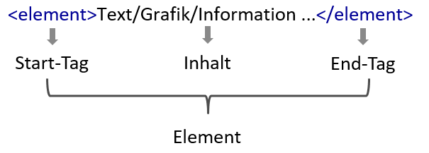
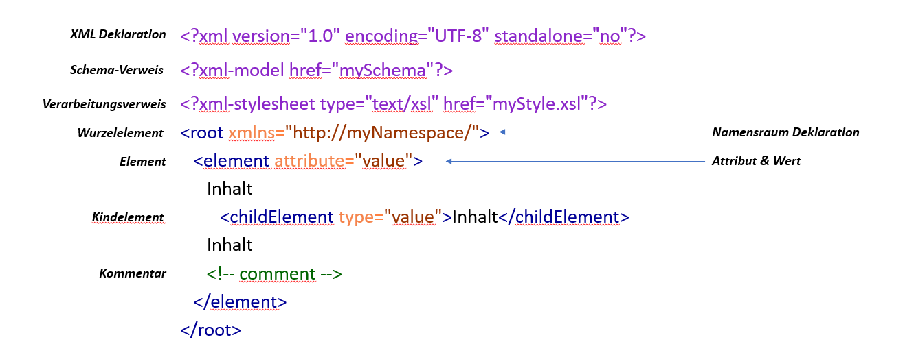
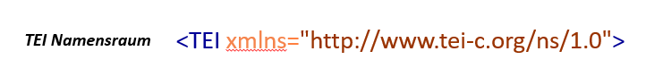
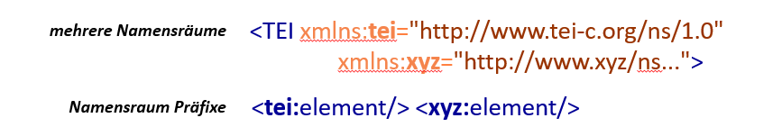
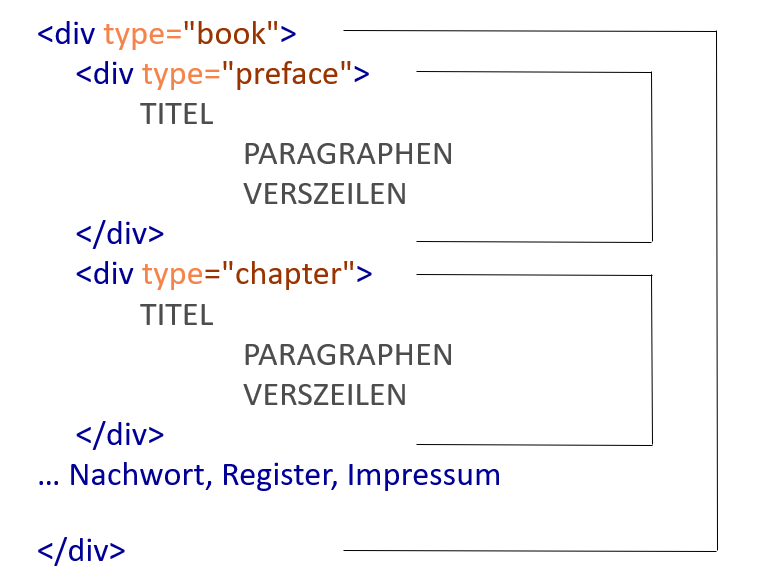

## Lernziele

- Überblick über den Digitalisierungsprozess vom physischen Originaldokument zu digitaler Annotation
- Kennenlernen von XML-Elementen, -Syntax, -Dokumentmodell, und -Hierarchie
- Definition der Begriffe Wohlgeformtheit und Validität
- Definition von Schema und Namensraum
- Einordnung von TEI als fachspezifische Auszeichnungssprache für Textwissenschaften

## Wie kommt ein Text in ein digitales Format?

Sofern es sich nicht um ein born digital-Dokument handelt - also ein Dokument das mit einem Computer erstellt wurde und deswegen bereits in digital verarbeitbarer Form vorliegt -, beginnt die
Erstellung einer digitalen Text-Ressource mit dem **[Einscannen einer Vorlage](https://dhmuseum.uni-trier.de/node/5)**. Dieser Scan resultiert in einem Pixelbild  - z.B. im TIF, JPG oder PNG-Format - oder einem PDF. Das Aussehen der Print-Quelle ist in den Bilddaten ersichtlich, aber der textuelle Inhalt ist noch nicht digital weiter verarbeitbar. 

Deswegen erfolgt daran anschließend in einem zweiten Schritt die **Texterkennung mittels ["optical character recognition" (OCR)](https://de.wikipedia.org/wiki/Texterkennung)**. Das Ergebnis ist ein elektronischer Text - z.B. in Form eines Word-Dokuments - oder einer Text-Datei, den man zwar mit verschiedenen Programmen strukturieren und formatieren kann, wobei die Möglichkeiten sowohl im Hinblick auf das Layout als auch die inhaltliche Beschreibung meistens sehr begrenzt sind. Außerdem ist die Konvertierung in andere Formate oft nicht verlustfrei möglich, wenn die Formatierungs- oder Strukturinformationen in programmspezifischen Formaten abgespeichert sind. ([\> mehr Informationen zu Volltextdigitalisierung](https://dhmuseum.uni-trier.de/node/49))

Um elektronische Daten systematisch, am besten mehrfach und interdisziplinär für sprachwissenschaftliche, literaturwissenschaftliche oder kulturwissenschaftliche Forschung nutzen zu können, benötigen sie **dauerhafte** strukturelle und semantische und linguistische **Annotationen**. An diesem Punkt kommen sogenannte Auszeichnungs- oder Markupsprachen zum Einsatz. 

## Markup-Sprachen

Auszeichnungssprachen dienen der Beschreibung von unterschiedlichsten Daten z.B. von Texten, Bildern, Filmen usw. Gleichzeitig dienen sie auch der Beschreibung des Verfahrens, das zu ihrer Weiterverarbeitung bzw. den Datenaustausch notwendig ist. Eine **Markup-Sprache** ist also im Wesentlichen eine Strukturierungssprache, die es erlaubt, maschinenlesbar die Gliederung und Formatierung von u.a. Texten auszuzeichnen. 

Eine der bekanntesten "Markup Languages" (ML) ist die "[Hypertext Markup Language" (HTML)](https://www.w3.org/html/), die eine der technologischen Grundlagen des World Wide Webs bildet. Sie gliedert die multimodalen Inhalte einer Webseite so, dass ein Webbrowser aber auch Suchmaschinen und Algorithmen diese interpretieren und darstellen können. Hierfür kommt ein beschränktes Vokabular an vordefinierten "Tags" zum Einsatz, das in Web-Standards und Richtlinien des[ World Wide Web Consortiums (W3C)](https://www.w3.org/) festgelegt wurde und von standardkonformen Webbrowsern unterstützt wird. Im modernen Web-Publikationen werden Inhaltsstruktur bzw. strukturelle Semantik (z.B. Überschriftenebenen, Absätze, Listen, Hyperlinks, Zitate, und andere Medienelemente oder interaktive Elemente) und deren Darstellung getrennt. HTML übernimmt dabei die logische Strukturierung der Inhalte, während andere Technologien wie [Cascading Stylesheets (CSS)](https://www.w3.org/Style/CSS/Overview.en.html) oder [JavaScript](https://www.ecma-international.org/publications-and-standards/standards/ecma-262/) für die Darstellung und die Interaktion mit den Inhalten zum Einsatz kommen.

Für die wissenschaftlichen Nutzung der Daten in den Sprachwissenschaften bietet HTML mit seinem beschränkten und auf Grundbausteine für Web-Publikationen fokussierten Vokabular allerdings zu wenig Flexibilität in der Auszeichnung und damit Weiterverarbeitungsmöglichkeit. Dies würde letztlich auch die Forschungsfragen einschränken, die nach der Annotation an die Daten gestellt und durch die Daten beantwortet werden könnten. Im Gegensatz zu HTML, einer Auszeichnungssprache, die überwiegend für die Darstellung von Inhalten im World Wide Web Verwendung findet, ist die  ["Extensible Markup Language" (XML)](https://www.w3.org/XML/) oder zu Deutsch erweiterbare Auszeichnungssprache eher ein abstraktes Werkzeug zur Modellierung und Strukturierung von Informationen einerseits und zur Datenhaltung andererseits.

XML stellt die Grundlage für zahlreiche **fachspezifische Auszeichnungssprachen** dar — bereits etablierte Beispiele dafür sind z.B. **GML,** die geografische Auszeichnungssprache für raumbezogene Informationen; **MathML**, die mathematische Auszeichnungssprache zur Beschreibung komplexer mathematischer Ausdrücke und Formeln; oder **MusicXML** für die westliche Notenschrift.

Auch in den Textwissenschaften ist XML heute die wichtigste Markupsprache, da es das ideale Werkzeug ist um Texte zu strukturieren, zu vermitteln und zu nutzen. Federführend in diesem Fachbereich ist die **Text Encoding Initiative**, kurz **TEI**. Doch bevor wir uns der TEI zuwenden, ist es wichtig, einige grundlegende Aspekte von XML zu erklären.

### Übung

<Quiz>
  <Quiz.Card>
    <Quiz.MultipleChoice>
      <Quiz.Question>
        **Welche der folgenden Aussagen sind richtig?** (mehrere Antworten möglich)
      </Quiz.Question>

      <Quiz.MultipleChoice.Option isCorrect>
        TEI ist eine spezialisierte Auszeichnungssprache für Text
      </Quiz.MultipleChoice.Option>

      <Quiz.MultipleChoice.Option isCorrect>
        TEI basiert auf XML.
      </Quiz.MultipleChoice.Option>

      <Quiz.MultipleChoice.Option>
        XML stellt ein festes Vokabular für die Strukturierung von Dokumenten zur Verfügung.
      </Quiz.MultipleChoice.Option>

      <Quiz.MultipleChoice.Option isCorrect>
        HTML ist eine Auszeichnungssprache, die vor allem auf die Strukturierung von Inhalten für die Veröffentlichung im World Wide Web entwickelt wurde.
      </Quiz.MultipleChoice.Option>

      <Quiz.Message type="correct">
        **Richtig!**

        TEI ist eine fachspezifische Markup-Sprache, die auf XML basiert und dafür ausgelegt ist, Dokumente für textwissenschaftliche Forschung zu annotieren.

        Andere Markup-Sprachen sind HTML und XML. Während HTML allerdings ein festes Vokabular anbietet, das für die Strukturierung von Inhalten für Webpublikationen ausgelegt ist, stellt XML als ein abstraktes Werzeug zur Modellierung und Strukturierung von Informationen lediglich Regeln bereit, wie Elemente zu definieren und anzuwenden sind. Man kann aber beliebig viele konkrete Auszeichnungssprachen mithilfe von XML definieren.
      </Quiz.Message>

      <Quiz.Message type="incorrect">
        **Leider nicht ganz richtig!**

        TEI ist eine fachspezifische Markup-Sprache, die auf XML basiert und dafür ausgelegt ist, Dokumente für textwissenschaftliche Forschung zu annotieren.

        Andere Markup-Sprachen sind HTML und XML. Während HTML allerdings ein festes Vokabular anbietet, das für die Strukturierung von Inhalten für Webpublikationen ausgelegt ist, stellt XML als ein abstraktes Werzeug zur Modellierung und Strukturierung von Informationen lediglich Regeln bereit, wie Elemente zu definieren und anzuwenden sind. Man kann aber beliebig viele konkrete Auszeichnungssprachen mithilfe von XML definieren.
      </Quiz.Message>
    </Quiz.MultipleChoice>
  </Quiz.Card>
</Quiz>


## Grundlagen von XML

Wie schon erwähnt, dient XML dazu, beliebige Informationen und Inhalte in strukturierter Form zu beschreiben um diese Daten weiterzuverarbeiten, zu verwalten, oder sie im Internet auszutauschen. Eine – wenn nicht die wesentlichste – Eigenschaft von XML ist dabei die Unabhängigkeit von einzelner Hard- und Software. Möglich ist das, weil XML komplexe Inhalte beschreibt, ohne festzulegen, in welcher Form und mit welchen Computerprogrammen die Daten weiterverarbeitet werden sollen. Das bedeutet, es handelt sich um eine sogenannte Deskriptive und keine Processing Markup Language. XML ist so konzipiert, dass es von vielen unterschiedlichen Programmen gelesen werden kann, was eine enorme Freiheit gegenüber herstellergebundenen Formaten wie Microsoft Word, das ohne die entsprechende Software lange Zeit nicht verarbeitet werden konnte. Diese Eigenschaft war zugleich die wichtigste Voraussetzung für einen problemlosen und weltweiten Datenaustausch.

Die Bezeichnung von XML als Markup Language ist leider nicht sehr präzise gewählt, wenn nicht sogar irreführend. Denn XML  definiert keine Elemente. Es stellt vielmehr ein Regelwerk für den Entwurf von konkreten Auszeichnungssprachen und ihren Anwendungen dar und wird deshalb auch als Metasprache bezeichnet, die unbegrenzt erweiterbar ist. Das bedeutet, dass sich mit XML beliebig viele unterschiedliche Markup-Sprachen definieren lassen, die jeweils ganz unterschiedliche Zwecke verfolgen können. XML selbst ist leicht verständlich, da es nicht aus abstrakten Codes, sondern aus Text besteht, was den Vorteil hat, dass sie von Mensch und Maschine gelesen werden kann. Dies ist neben der Plattformunabhängigkeit und der Erweiterbarkeit mit ein Grund für die weite Verbreitung und den Erfolg von XML.

Verantwortlich für die Entwicklung von XML ist das 1994 gegründete [World Wide Web Consortium](https://www.w3.org/) unter der Leitung von Tim Berners-Lee, dem Erfinder der Hypertext Markup Language und des World Wide Web. Dieses internationale Gremium bemüht sich darum, Web-Standards zu entwickeln und Richtlinien zu den einzelnen Spezifikationen herauszugeben mit dem Ziel, das Potential und die Reichweite des Web zu vergrößern, es langfristig zu sichern und von einzelnen Herstellern unabhängig zu erhalten.

### XML Syntax

Auszeichnungselemente sind die wichtigste Struktureinheit von XML und bestehen aus mehreren Teilen. Um einen Inhalt zu beschreiben, bedient man sich sogenannter Tags – das sind Etiketten, die eigentlich nur aus spitzen Klammern und Text bestehen. Man unterscheidet öffnende und schließende Tags, wobei die schließenden einen Schrägstrich vor dem Text besitzen. Diese Tags umgeben den Inhalt, den sie beschreiben sollen. Der Text ist im Normalfall ein sinnvoller Elementname wie z.B. `<placeName>` für eine Ortsbezeichnung oder `<date>` für ein Datum. Zunächst sollen einige abstrakte Beispiele die Grundprinzipien erläutern.

Ein vollständiges XML-Element besteht aus einem **Start-Tag**, einem **End-Tag** und dem **Inhalt dazwischen**, wobei es unerheblich ist, ob es sich dabei um Text, Zahlen, eine Grafik, eine Partitur oder irgendeine andere Information handelt. 



Ein konkretes Beispiel ist wie erwähnt z.B. ein Datum:

```xml
<date>01.12.2018</date>
```

Neben den Elementen mit Inhalt, gibt es auch **leere Elemente** – sie werden verwendet um z.B. die Position von etwas anzugeben, z.B. ein Zeilenumbruch. Da die Tags in diesem Fall nichts umschließen, kann man statt der paarigen Schreibweise auch eine einteilige Kurzform verwenden, man erkennt sie am Schrägstich hinter dem Elementnamen.

```xml
a) <element></element>
b) <element/>
```

Zur **Beschreibung komplexer Inhalte**, reicht ein Elementname alleine meist nicht aus, weshalb mehrere verschiedene Elemente für denselben Inhalt vergeben werden können. Zusatzinformationen lassen sich aber auch unterbringen, indem man im Start-Tag eines Elements sogenannte Attribute einfügt, die umgeben von Anführungszeichen bestimmte Werte enthalten. Ein Element darf selbstverständlich mehrere unterschiedliche Attribute besitzen. Grundsätzlich können Element-, Attribut- und Wertebezeichnungen aus jeder beliebigen Sprache gewählt werden, im Sinne der Austauschbarkeit haben sich jedoch englische Bezeichnungen durchgesetzt.

Es gibt also **Tags**, die zusammen mit den Inhalten Elemente bilden, die **mit Hilfe von Attributen und Attributwerten genauer spezifiziert** werden können. Die Syntax dafür ist wie folgt:

```xml
<element attribut="wert">Inhalt</element>
<element attribut="wert" attribut2="wert"/>
```

### Wohlgeformtheit

Jede XML-Annotation bedient sich dieser einfachen Bausteine. In der konkreten Anwendung sind jedoch, wie könnte es auch anders sein, besondere Regeln einzuhalten. U.a. syntaktische Vorschriften.

Die wichtigste davon ist die Einhaltung der **Wohlgeformtheit** oder **well-formedness**. Sie bedeutet, dass **jedes geöffnete Element auch wieder geschlossen** werden muss, wie im untenstehenden Beispiel die Elemente a und b. **Andernfalls** kann es sich nur um ein **Empty-Element** handeln, wie z.B. das im Beispiel angeführte leere c-Element. 

```xml
<a>Inhalt</a> Inhalt <b>Inhalt</b> Inhalt ... <c/>
```

Sollten **Elemente verschachtelt** sein, so müssen sie **in der richtigen Reihenfolge geöffnet und geschlossen werden**. Dies gilt auch für den Fall, dass mehrere Phänomene einander überlappen. 

*Falsch:*

```xml
<a>Inhalt <b>Inhalt</a> Inhalt</b>
```

*Richtig:*

```xml
<a>Inhalt <b>Inhalt</b></a> <b>Inhalt</b>
```

<SideNote type="note" title="Merke">
Die Regel der "well-formedness" ist zwingend, d.h. **alle XML-Dokumente müssen wohlgeformt sein!**

* Geöffnete Element müssen wieder geschlossen werden, oder leere Elemente sein. 
* Bei Verschachtelung muss die richtige Reihenfolge beim öffnen und schließen von Elementen eingehalten werden.
</SideNote>

### Validität

Zusätzlich dazu kann ein XML-Dokument auch valide oder gültig sein. Was bedeutet das? 

Wie schon erwähnt, kann im Grunde jeder mit XML seine eigene Markup-Sprache für bestimmte Zwecke definieren. Gleichzeitig geht es aber auch immer darum, die erzeugten Dokumente austauschen und mehrfach nutzen zu können. **Wenn man also eine Sprache "erfindet", muss man nicht nur das Vokabular, sprich die Elemente, Attribute und Werte festlegen, sondern sollte auch eine Grammatik schreiben**, in der definiert ist, was die Elemente bedeuten, in welcher Beziehung sie zueinander stehen, wo und wie sie verwendet werden dürfen. 

Obwohl diese Regel optional ist, empfiehlt es sich, sie einzuhalten – aus mehreren Gründen: 

- Eine Grammatik ist zum einen nützlich, damit man selbst überprüfen kann, ob man mehrere Dokumente desselben Typs einheitlich annotiert hat. 
- Zum anderen dokumentiert sie die vorhandene Struktur und macht sie für Dritte nachvollziehbar, die u.U. gleichartige Dokumente auf dieselbe Weise annotieren möchten, oder z.B. fremde Daten mit nutzen wollen.

Es gibt mehrere Möglichkeiten, eine Grammatik zu schreiben. Am Beginn der Entwicklung standen sogenannte **[Document Type Definitions](https://www.w3schools.com/xml/xml_dtd.asp)**. Sie wurden vom Vorgängerstandard SGML übernommen und sind allerdings in einer Sprache geschrieben, die selbst kein XML ist. Dies bedeutet einen Zusatzaufwand, da man diese Sprache erst erlernen muss. 

Dieser Mangel konnte mit **[XML Schema Definition (XSD)](https://www.w3.org/TR/xmlschema11-1/)** behoben werden – das ist ebenfalls eine W3C-Empfehlung und mittlerweile sehr weit verbreitet. 

Daneben gibt es noch weitere Sprachen um XML-Strukturen zu definieren wie z. B. die **[Regular Description for XML New Generation (Relax NG)](https://relaxng.org/)** und andere mehr. Da diese Grammatiken selbst in XML geschrieben sind, sind auch sie praktischerweise für Menschen und Maschinen lesbar.

<SideNote type="note" title="Merke">
**Validität** bezieht sich auf die Einhaltung einer vordefinierten **Grammatik**. 

Dies ermöglicht eine Überprüfung einer **einheitlichen Annotation** über Dokumente hinweg und **dokumentiert** die Struktur für kollaboratives Arbeiten oder der **Nachnutzung** von Quellen Dritter.
</SideNote>

#### Übung

<Quiz>
  <Quiz.Card>
    <Quiz.MultipleChoice>
      <Quiz.Question>
        **Welche der folgenden Aussagen ist richtig?**
      </Quiz.Question>

      <Quiz.MultipleChoice.Option>
        Ein XML Dokument muss valide sein. Idealerweise ist es auch wohlgeformt.
      </Quiz.MultipleChoice.Option>

      <Quiz.MultipleChoice.Option isCorrect>
        Ein XML Dokument muss wohlgeformt sein. Es wird empfohlen durch die Nutzung und Überprüfung einer Grammatik auch die Validität des Dokuments zu gewährleisten.
      </Quiz.MultipleChoice.Option>

      <Quiz.MultipleChoice.Option>
        XML besitzt keinerlei Regelwerk. Wohlgeformtheit und Validität sind lediglich Empfehlungen.
      </Quiz.MultipleChoice.Option>

      <Quiz.Message type="correct">
        **Richtig!**

        Die Wohlgeformtheit eines Dokuments ist zwingend notwendig. Es wird aber empfohlen ein Dokument ebenso valide zu gestalten.
      </Quiz.Message>

      <Quiz.Message type="incorrect">
        **Leider falsch.**

        Die Wohlgeformtheit eines Dokuments ist zwingend notwendig. Es wird aber empfohlen ein Dokument ebenso valide zu gestalten.
      </Quiz.Message>
    </Quiz.MultipleChoice>
  </Quiz.Card>
</Quiz>


### Aufbau von XML Dokumenten



Kommen wir nun zum Aufbau von XML-Dokumenten. Jedes Dokument beginnt mit einem **Prolog**, der zumindest die **XML-Deklaration** enthält, die angibt, um welche XML-Version es sich handelt. Die Tags des Prologs zeichnen sich durch eine besondere Schreibweise aus: sie sind einteilig und an den Fragezeichen vorne und hinten zu erkennen. 

Die XML-Deklaration kann optional zwei Attribute enthalten, eines, das die Art der Zeichenkodierung angibt und ein weiteres, das festhält, ob sich das verwendete Schema in derselben Datei oder extern befindet – standalone no bedeutet, dass es ein externes Schema gibt.

Daran anschließend kann optional ein **Verweis auf dieses externe Schema** folgen und ebenso optional ein weiterer Verweis, der **processing instruction** (Verarbeitungsverweis) genannt wird und den Pfad zu einem sogenannten Stylesheet angibt, in dem die Verarbeitungsanweisungen definiert sind.

Nach dem Prolog folgen die eigentlichen Elemente. Wesentlich ist hier, dass es **nur ein einziges Wurzel- oder Root-Element** geben darf, das **alle anderen Elemente (Kinder und Kindeskinder) umschließt**. 

Im Wurzelelement befindet sich ein Attribut mit der Bezeichnung **namespace**, das als Wert einen Unified Ressource Identifier (URI) enthält, der angibt, woher die verwendeten Elemente und Attribute stammen. 

Handelt es sich z.B. um ein **Dokument, das nach den Richtlinien der TEI** erstellt wurde, ist der **Name des Root-Elements TEI**. Der Attributwert der namespace declaration verweist darauf, dass ausschließlich von der TEI definierte Elemente und Attribute verwendet wurden. 



Möchte man Komponenten aus verschiedenen Namensräumen mischen, müssen zwei Namenraum-Deklarationen angegeben werden, die jeweils unterschiedliche Präfixe definieren, z.B. ein Attribut xmlns:tei und ein Attribut xmlns:xyz. 

Im Dokument selbst müssen diese Präfixe, gefolgt von einem Doppelpunkt, den betreffenden Elementnamen vorangestellt werden um deren Schema-Zugehörigkeit anzuzeigen.



Zum Schluss sei an dieser Stelle nur noch erwähnt, dass Kommentare außerhalb von einführenden oder schließenden Tags überall erlaubt sind. Sie werden eingeleitet von einer Spitzklammer, einem Rufzeichen, sowie zwei Minuszeichen. Dann folgt der Kommentartext und danach zwei Minuszeichen und eine schließende Spitzklammer.

```xml
<!-- Kommentar -->
```

Auf diese Weise eingefügte Inhalte werden von der Software nicht wahrgenommen und sind von jeglicher Verarbeitung ausgenommen.

<Quiz>
  <Quiz.Card>
    <Quiz.MultipleChoice>
      <Quiz.Question>
        **Welche der folgenden Angaben sind Teil des Prologs eines XML-Dokuments sein?** (mehrere Antworten möglich)
      </Quiz.Question>

      <Quiz.MultipleChoice.Option isCorrect>
        **XML-Deklaration**: gibt an um welche Version von XML es sich handelt
      </Quiz.MultipleChoice.Option>

      <Quiz.MultipleChoice.Option isCorrect>
        **Schema-Verweis**: verweist auf ein externes Schema mit Definitionen für die Validierung des Dokuments, wenn das XML-Schema nicht in derselben Datei definiert wird.
      </Quiz.MultipleChoice.Option>

      <Quiz.MultipleChoice.Option>
        **Namensraum-Deklaration**: URI die angibt, woher die Elemente und Attribute stammen.
      </Quiz.MultipleChoice.Option>

      <Quiz.MultipleChoice.Option isCorrect>
        **Verarbeitungsverweis**: enthält den Pfad zum Stylesheet mit Verarbeitungshinweisen.
      </Quiz.MultipleChoice.Option>

      <Quiz.Message type="correct">
        **Richtig!**

        Die XML-Deklaration, der Schema-Verweis und der Verarbeitungsverweis können Teil des Prologs einer XML-Datei sein.

        Die Namensraum-Deklaration ist Teil des Wurzelelements, das auf den Prolog folgt.
      </Quiz.Message>

      <Quiz.Message type="incorrect">
        **Leider nicht ganz richtig.**

        Die XML-Deklaration, der Schema-Verweis und der Verarbeitungsverweis können Teil des Prologs einer XML-Datei sein.

        Die Namensraum-Deklaration ist Teil des Wurzelelements, das auf den Prolog folgt.
      </Quiz.Message>
    </Quiz.MultipleChoice>
  </Quiz.Card>
</Quiz>


### Elementhierarchie in XML

Ein XML-Dokument ist eine hierarchische Strukturierung und Anordnung von Inhalten. Diese ist jedoch nicht beliebig, sondern wird im Dokument-Schema festgelegt. Und da Dokumente gültig sein sollen, kann man sich die Strukturierung nicht willkürlich aussuchen.

**Das Schema schreibt vor, welche Elemente es gibt, wo sie anzutreffen sein dürfen und wo nicht.** So kann beispielsweise im Schema definiert werden, dass ein Element nur ein bestimmtes Elternelement haben kann.

- ein Vorname darf nur das Kind eines Personennamens sein.
- ein Personenname kann nur *innerhalb* einer Überschrift, eines Paragraphen oder einer Verszeile vorkommen, aber niemals außerhalb

Neben den Beziehungen regelt ein Schema auch, **wie oft ein Element oder Attributwert vorkommen darf**. 

- Eindeutige ID-Nummern dürfen sinnvollerweise nur einmal vergeben werden. 
- Ebenso sollte in einem Geburtsregister jede Person nur ein Geburtsdatum haben.

Ein Buch, könnte in XML etwa wie folgt abgebildet werden: 



Innerhalb des Wurzelelements befindet sich ein Element mit dem Namen Buch, das die Kindelemente Vorwort und mehrere Kapitel enthält, vielleicht gefolgt von einem Nachwort, eventuell einem Register und einem Impressum. Diese Kindelemente verhalten sich zueinander alle wie Geschwister und sind aber selbst auch Eltern der Titel-, Paragraphen- und Verszeilen-Elemente, die ebenfalls Geschwister sind und selbstverständlich auch wieder Kinder haben können. Somit ergibt sich eine hierarchische Anordnung und Struktur der Inhalte, die den Aufbau des Buches widerspiegelt.

## Von XML zu TEI

Ein spezialisiertes Schema für die Kodierung von Texten und sprachlichen Informationen ist das Schema der 1987 gegründeten Text Encoding Initiative (TEI)-Markup.  Basierend auf XML ist TEI mittlerweile der de-facto-Standard für die Kodierung von Texten und sprachlichen Informationen und ist innerhalb der Geisteswissenschaften federführend.  Die derzeit empfohlene Version P5 wurde 2007 veröffentlicht und seitdem regelmäßig verbessert und aktualisiert. Das Regelwerk enthält mehr als 500 Elemente und ebenso zahlreiche Attribute, die in sachbezogenen Modulen organisiert sind. Sie berücksichtigen Lyrik und Dramentexte ebenso wie Handschriften, Kritische Apparate oder Wörterbücher. Darüber hinaus bietet die TEI Komponenten sowohl für die Schemagenerierung als auch die Schema-Anpassung an und stellt integrierte Stylesheets zur Verfügung.

Der Begriff ‘Markup’ stammt ursprünglich aus der Druckersprache und bedeutet ‘Textauszeichung’. Ein Beispiel dafür wären ‘Fahnenkorrekturen’. Sie enthalten z.B. Fehlerberichtigungen und Anweisungen, was mit den angestrichenen Stellen zu tun ist - Buchstabenverdreher umstellen, Doppelungen löschen, Absätze aufteilen usw. Dabei werden Prozeduren vorgegeben, die früher der Setzer, heute der Grafiker mit dem Text zu vollziehen hat. Das könnte man als **‘Prozedurales Markup’** bezeichnen.

In vielen Fällen ist das Ziel von solchen ‘Prozeduren’ die Darstellung eines Dokuments in einer digitalen Druckvorlage. Wenn die Auszeichnung darauf abzielt, solche Darstellungsregeln zu definieren, spricht man von **‘Präsentationalem Markup’**.

Je nachdem mit welchem Verständnis man an die Sache herangeht, sind die Grenzen natürlich fließend – letztendlich muss eine Software das Markup interpretieren und in eine Seitenbeschreibungssprache wie z.B. PDF übersetzen, die das Aussehen der Seite in absoluten Koordinaten beschreibt. Prinzipiell gibt XML nur die Regeln der Syntax an, in der Dokumente kodiert werden – nicht aber die Bedeutung der Auszeichnung. 

Bei der TEI geht es dezidiert darum, **Texte kodierend zu beschreiben**, daher ist sie klar vorwiegend **deskriptiv**.

Mit der TEI können unterschiedlichste **Aspekte eines Textes kodiert** werden. Einige relevanten Fragen sind hier z.B.:

- Wie ist der Text formal und logisch aufgebaut? Aus welchen Einheiten und Untereinheiten, Abschnitten, Gliederungsebenen etc. besteht er? Gibt es Überschriften, Zitate, Fußnoten, Anmerkungen usw.? Dies erfasst das **strukturelle Markup**.
- Über welche ‘Dinge’ spricht der Text? Das können reale und fiktionale Entitäten sein (Personen, Orte, etc.), aber auch Konzepte, Ideen, andere Texte usw. Diese Aspekte werden im **semantischen Markup** annotiert.
- Wie spricht der Text? Mit welchen linguistischen, rhetorischen oder narratologischen Mitteln arbeitet er – Aspekte, die nicht an der Textoberfläche manifest sind, sondern erst durch einen Analyseschritt erfassbar werden, werden im **analytischen Markup** beschrieben.
- Und schließlich: Wie sieht der Text aus? Dies erfasst das **repräsentationale Markup**.

Die folgenden Kapitel werden einen kurzen Überblick über die Struktur von TEI-Dokumenten geben und dabei einige sehr häufig verwendete Elemente hervorheben.

<Quiz>
  <Quiz.Card>
    <Quiz.MultipleChoice>
      <Quiz.Question>
        **Zu welcher Form von Markup zählt TEI?**
      </Quiz.Question>

      <Quiz.MultipleChoice.Option isCorrect>
        **Prozedurales Markup** - TEI beschreibt Prozeduren, die ein Grafiker oder Setzer mit dem Text durchführen soll.
      </Quiz.MultipleChoice.Option>

      <Quiz.MultipleChoice.Option isCorrect>
        **Deskriptives Markup** - TEI beschreibt unterschiedliche Aspekte der Texte selber, von Struktur, Semantik, über linguistische Aspekte bis hin zur Repräsentation des Textes.
      </Quiz.MultipleChoice.Option>

      <Quiz.MultipleChoice.Option>
        **Präsentationales Markup** - TEI definiert Darstellungsregeln für eine digitale Druckvorlage.
      </Quiz.MultipleChoice.Option>

      <Quiz.Message type="correct">
        **Richtig!**

        TEI ist vorwiegend deskriptiv.
      </Quiz.Message>

      <Quiz.Message type="incorrect">
        **Leider falsch.**

        TEI gehört zum deskriptiven Markup. Vom logischen und formalen Aufbau eines Textes, seiner Semantik bis hin zur Repräsentation können unterschiedlichste Aspekte des Textmaterials kodiert werden.
      </Quiz.Message>
    </Quiz.MultipleChoice>
  </Quiz.Card>
</Quiz>