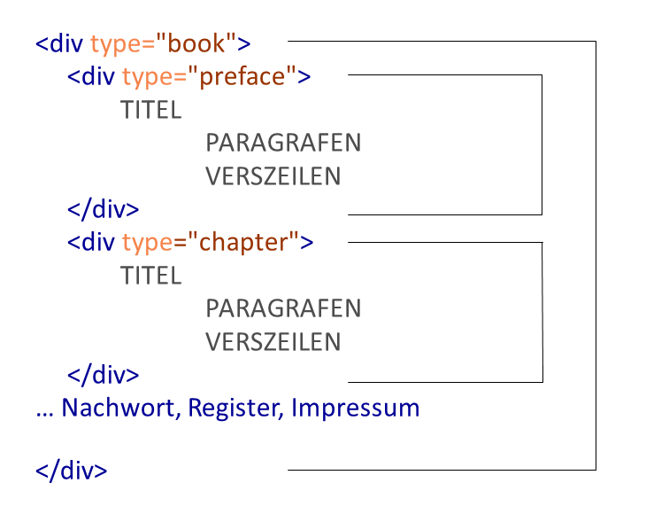
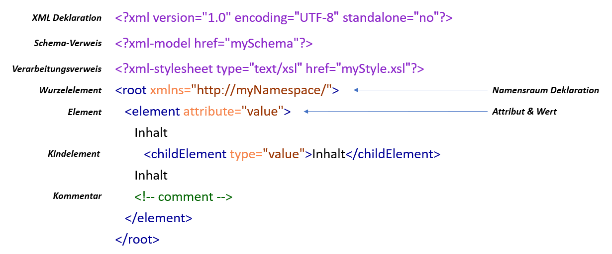
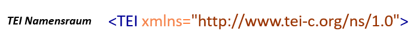
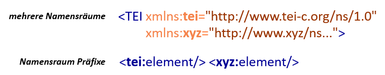

## Lerninhalte

- Überblick über den Digitalisierungsprozess: Vom physischen Original zum digitalen Dokument
- XML-Grundlagen: Elemente, Syntax, Dokumentenmodell und Hierarchie
- Wohlgeformtheit und Validität
- Schema und Namensraum
- TEI – Markup-Sprache und Dokumentenformat für die Textwissenschaften

## Vom analogen zum digitalen Text

Sofern es sich nicht um ein 'born digital'-Dokument handelt, also ein Dokument, das mit einem Computer erstellt wurde und daher bereits in digitaler Form vorliegt, beginnt die
Erstellung einer digitalen Text-Ressource mit dem **[Einscannen einer Vorlage](https://dhmuseum.uni-trier.de/node/5)**. Der Scan, der in unterschiedlichen Formaten gespeichert werden kann (z.B. in Bildformaten wie TIF, JPG oder PNG, oder auch als PDF), stellt eine digitale Reproduktion der gedruckten Quelle dar, die zwar das Aussehen der Vorlage wiedergibt, jedoch noch keinen elektronischen Text für die Weiterverarbeitung bereit stellt.

In einem zweiten Schritt erfolgt daher die **Texterkennung** oder **['Optical Character Recognition' (OCR)](https://de.wikipedia.org/wiki/Texterkennung)**. Das Ergebnis ist ein elektronischer Text, z.B. in Form einer Text-Datei oder eines Word-Dokuments, den man zwar mehr oder weniger strukturieren und formatieren kann, wobei die Möglichkeiten sowohl im Hinblick auf das Layout als auch die inhaltliche Beschreibung häufig sehr begrenzt sind. Außerdem ist die Konvertierung in andere Formate oft nicht verlustfrei möglich, wenn die Formatierungs- oder Strukturinformationen in programmspezifischen Formaten abgespeichert sind. ([\> mehr Informationen zur Volltextdigitalisierung](https://dhmuseum.uni-trier.de/node/49))

Um elektronische Daten systematisch, am besten mehrfach und interdisziplinär für die sprach-, literatur- oder kulturwissenschaftliche Forschung nutzen zu können, benötigen sie **dauerhafte**, strukturelle, semantische und linguistische **Annotationen**. An diesem Punkt kommen sogenannte Auszeichnungs- oder Markup-Sprachen zum Einsatz. 

## Markup-Sprachen

Auszeichnungssprachen dienen der Beschreibung von unterschiedlichsten Daten z.B. von Texten, Bildern, Filmen usw. Gleichzeitig dienen sie auch der Beschreibung des Verfahrens, das zu ihrer Weiterverarbeitung bzw. den Datenaustausch notwendig ist. **Markup-Sprachen** sind Beschreibungssprachen, die es erlauben, die Gliederung und Formatierung, aber auch inhaltliche Aspekte einer Vorlage wie z.B. Texte in maschinenlesbarer Form zu annotieren. 

Die bekannteste Markup-Sprache ist die ['Hypertext Markup Language' (HTML)](https://www.w3.org/html/), die von Tim Berners-Lee entwickelt und vom [World Wide Web Consortium (W3C)](https://www.w3.org/) als Web-Standard veröffentlicht wurde. Sie stellt eine der technologischen Grundlagen des World Wide Web dar und gliedert die multimedialen Inhalte einer Webseite so, dass sie von Webbrowsern interpretiert und dargestellt und von Suchmaschinen gefunden werden können. Für die Gliederung von z.B. Überschriften, Absätzen, Zitaten, Listen, Tabellen, Hyperlinks etc. steht ein beschränktes Vokabular an vordefinierten Auszeichnungselementen, auch 'Tags' genannt, zur Verfügung. HTML übernimmt dabei die Strukturierung der Inhalte, während andere Technologien wie [Cascading Stylesheets (CSS)](https://www.w3.org/Style/CSS/Overview.en.html) für die visuelle Darstellung oder [JavaScript](https://www.ecma-international.org/publications-and-standards/standards/ecma-262/) für die Integration von dynamischen, interaktiven Elementen zum Einsatz kommen.

Für die wissenschaftliche Nutzung von Daten bietet HTML mit seinem beschränkten und auf die Darstellung von Web-Inhalten fokussierten Vokabular geringe Flexibilität in der Auszeichnung und schränkt damit sowohl die Datenverarbeitung als auch die -auswertung ein. Im Gegensatz dazu, ist die ['Extensible Markup Language' (XML)](https://www.w3.org/XML/) oder "erweiterbare Auszeichnungssprache" eher ein abstraktes Werkzeug zur Modellierung und Strukturierung von Informationen und zur Haltung von Daten mit potentiell unbegrenzten Möglichkeiten.

XML stellt die Grundlage für zahlreiche **fachspezifische Auszeichnungssprachen** dar — bereits etablierte Beispiele dafür sind z.B. **GML**, die geografische Auszeichnungssprache für raumbezogene Informationen, **MathML**, die mathematische Auszeichnungssprache zur Beschreibung komplexer mathematischer Ausdrücke und Formeln, oder **MusicXML** für die westliche Notenschrift.

Auch in den Textwissenschaften ist XML heute die wichtigste Markup-Sprache, da es das ideale Werkzeug ist um Texte zu strukturieren, zu vermitteln und zu nutzen. Federführend in diesem Fachbereich ist die **Text Encoding Initiative**, kurz **TEI**. Doch bevor wir uns der TEI zuwenden, ist es notwendig, einige grundlegende Aspekte von XML näher zu betrachten.

### Quiz

<Quiz>
  <Quiz.Card>
    <Quiz.MultipleChoice>
      <Quiz.Question>
        **Welche der folgenden Aussagen sind richtig?** (mehrere Antworten möglich)
      </Quiz.Question>

      <Quiz.MultipleChoice.Option isCorrect>
        Durch die Verwendung von Markup-Sprachen werden die Strukturen von Texten für Maschinen lesbar.
      </Quiz.MultipleChoice.Option>

      <Quiz.MultipleChoice.Option>
        HTML bildet die Grundlage für spezifische Markup-Sprachen wie TEI und MusicXML.
      </Quiz.MultipleChoice.Option>

      <Quiz.MultipleChoice.Option>
        OCR sorgt dafür, dass die Textstruktur von Maschinen erkannt wird.
      </Quiz.MultipleChoice.Option>

      <Quiz.MultipleChoice.Option isCorrect>
        Cascading Style Sheets (CSS) und Java Script sind für die korrekte Darstellung von Inhalten notwendig.
      </Quiz.MultipleChoice.Option>

      <Quiz.Message type="correct">
        **Richtig!**

        TEI ist eine fachspezifische Markup-Sprache, die auf XML basiert und dazu dient, Dokumente für die textwissenschaftliche Forschung zu annotieren.

        Während HTML ein fixes Vokabular anbietet, das für die Strukturierung von Inhalten in Web-Publikationen ausgelegt ist, stellt XML keine konkreten Auszeichnungselemente, sondern lediglich die Regeln bereit, wie Elemente zu bezeichnen, definieren und anzuwenden sind. Damit lassen sich mit XML beliebig viele Auszeichnungssprachen für die unterschiedlichsten Zwecke in den verschiedensten Disziplinen entwerfen. Deshalb wird XML auch als Metasprache bezeichnet.
      </Quiz.Message>

      <Quiz.Message type="incorrect">
        **Leider nicht ganz richtig!**

        TEI ist eine fachspezifische Markup-Sprache, die auf XML basiert und dazu dient, Dokumente für die textwissenschaftliche Forschung zu annotieren.

        Während HTML ein fixes Vokabular anbietet, das für die Strukturierung von Inhalten von Web-Publikationen ausgelegt ist, stellt XML keine konkreten Auszeichnungselemente, sondern lediglich die Regeln bereit, wie Elemente zu bezeichnen, definieren und anzuwenden sind. Damit lassen sich mit XML beliebig viele Auszeichnungssprachen für die unterschiedlichsten Zwecke in den verschiedensten Disziplinen entwerfen. Deshalb wird XML auch als Metasprache bezeichnet.
      </Quiz.Message>
    </Quiz.MultipleChoice>
  </Quiz.Card>
</Quiz>


## Grundlagen von XML

Wie schon erwähnt, dient XML dazu, beliebige Informationen und Inhalte in strukturierter Form zu beschreiben um diese Daten weiterzuverarbeiten, zu verwalten, oder sie im Internet auszutauschen. Eine – wenn nicht die wesentlichste – Eigenschaft von XML ist dabei die Unabhängigkeit von einzelner Hard- und Software. Möglich ist das, weil XML komplexe Inhalte beschreibt, ohne festzulegen, in welcher Form und mit welchen Computerprogrammen die Daten weiterverarbeitet werden sollen. Das bedeutet, es handelt sich um eine sogenannte 'Descriptive' und keine 'Processing Markup Language'. XML ist so konzipiert, dass es von vielen unterschiedlichen Programmen gelesen werden kann, was eine enorme Freiheit gegenüber herstellergebundenen Formaten wie z.B. Microsoft Word-Dokumenten bedeutet, die sich nur mit der entsprechenden Software verlust- und fehlerfrei verarbeiten lassen. Diese Eigenschaft war zugleich die wichtigste Voraussetzung für einen problemlosen und weltweiten Datenaustausch.

Die Bezeichnung von XML als "Markup Language" ist leider nicht sehr präzise gewählt, wenn nicht sogar irreführend. Denn XML definiert keine Elemente. Es stellt vielmehr ein Regelwerk für den Entwurf von konkreten Auszeichnungssprachen und ihren Anwendungen dar und wird deshalb auch als Metasprache bezeichnet, die unbegrenzt erweiterbar ist. Das bedeutet, dass sich mit XML beliebig viele unterschiedliche Markup-Sprachen definieren lassen, die jeweils ganz unterschiedliche Zwecke verfolgen können. XML selbst ist leicht verständlich, da es nicht aus abstrakten Codes, sondern aus Text besteht, was den Vorteil hat, dass diese Sprache von Mensch und Maschine gelesen werden kann. Dies ist neben der Plattformunabhängigkeit und der Erweiterbarkeit mit ein Grund für die weite Verbreitung und den Erfolg von XML.

Verantwortlich für die Entwicklung von XML ist das 1994 gegründete [World Wide Web Consortium](https://www.w3.org/) unter der Leitung von Tim Berners-Lee, dem Erfinder der Hypertext Markup Language und des World Wide Web. Dieses internationale Gremium bemüht sich darum, Web-Standards zu entwickeln und Richtlinien zu den einzelnen Spezifikationen herauszugeben mit dem Ziel, das Potential und die Reichweite des Web zu vergrößern, es langfristig zu sichern und von einzelnen Herstellern unabhängig zu erhalten.

Das Konsortium besteht aus einem fixen Team mit mehr als 60 Personen. Die vier Gastgeberorganisationen sind das MIT Computer Science and Artificial Intelligence Laboratory (MIT/CSAIL) in den USA, das European Research Consortium for Informatics and Mathematics (ERCIM) in Frankreich, die KEIO University in Japan und die Beihang University in China. Dazu kommen über 400 Mitgliederorganisationen aus mehr als 30 Ländern. Ergänzt wird die Arbeit dieser beiden Gruppen durch Beiträge aus der interessierten Web-Community, die an den Entwicklungs- und Diskussionsprozessen maßgeblich beteiligt ist. Ihre Mitarbeit ist ein Garant dafür, dass die Empfehlungen nicht nur sehr praxisorientiert und erprobt sind, sondern den Nutzer*innen z.B. Übersetzungen der Empfehlungen in über 40 Sprachen und einzelne Implementierungen als Open Source zur Verfügung stehen.

Erstmals als Empfehlung veröffentlicht wurde XML 1998, die derzeit aktuelle [5. Ausgabe](https://www.w3.org/TR/xml/) stammt vom November 2008.

### Quiz

<Quiz>
  <Quiz.Card>
    <Quiz.MultipleChoice>
      <Quiz.Question>
        **Welche der folgenden Aussagen sind richtig?** (mehrere Antworten möglich)
      </Quiz.Question>

      <Quiz.MultipleChoice.Option isCorrect>
        TEI ist eine Auszeichnungssprache speziell für Texte.
      </Quiz.MultipleChoice.Option>

      <Quiz.MultipleChoice.Option isCorrect>
        TEI basiert auf XML.
      </Quiz.MultipleChoice.Option>

      <Quiz.MultipleChoice.Option>
        XML stellt ein begrenztes Vokabular für die Strukturierung von Dokumenten zur Verfügung.
      </Quiz.MultipleChoice.Option>

      <Quiz.MultipleChoice.Option isCorrect>
        HTML ist eine Auszeichnungssprache, die vor allem auf die Strukturierung von Inhalten für die Veröffentlichung im World Wide Web entwickelt wurde.
      </Quiz.MultipleChoice.Option>

      <Quiz.Message type="correct">
        **Richtig!**

        TEI ist eine fachspezifische Markup-Sprache, die auf XML basiert und dazu dient, Dokumente für die textwissenschaftliche Forschung zu annotieren.

        Andere Markup-Sprachen sind HTML und XML. Während HTML allerdings ein fixes Vokabular anbietet, das für die Strukturierung von Inhalten für Web-Publikationen ausgelegt ist, stellt XML als ein abstraktes Werkzeug zur Modellierung und Strukturierung von Informationen lediglich Regeln bereit, wie Elemente zu definieren und anzuwenden sind. Mit XML lassen sich beliebig viele konkrete Auszeichnungssprachen entwerfen.
      </Quiz.Message>

      <Quiz.Message type="incorrect">
        **Leider nicht ganz richtig!**

        TEI ist eine fachspezifische Markup-Sprache, die auf XML basiert und dazu dient, Dokumente für die textwissenschaftliche Forschung zu annotieren.

        Andere Markup-Sprachen sind HTML und XML. Während HTML allerdings ein fixes Vokabular anbietet, das für die Strukturierung von Inhalten für Web-Publikationen ausgelegt ist, stellt XML als ein abstraktes Werkzeug zur Modellierung und Strukturierung von Informationen lediglich Regeln bereit, wie Elemente zu definieren und anzuwenden sind. Mit XML lassen sich beliebig viele konkrete Auszeichnungssprachen entwerfen.
      </Quiz.Message>
    </Quiz.MultipleChoice>
  </Quiz.Card>
</Quiz>


### XML-Elemente, -Attribute und -Werte

Auszeichnungselemente sind die wichtigste Struktureinheit von XML und bestehen aus mehreren Teilen. Um einen Inhalt zu beschreiben, bedient man sich sogenannter 'Tags' – das sind Etiketten, die eigentlich nur aus spitzen Klammern und Text bestehen. Man unterscheidet öffnende und schließende Tags, wobei die schließenden einen Schrägstrich vor dem Text besitzen. Diese Tags umgeben den Inhalt, den sie beschreiben sollen. Der Text ist im Normalfall ein sinnvoller Elementname wie z.B. `<placeName>` für eine Ortsbezeichnung oder `<date>` für ein Datum. Zunächst sollen einige abstrakte Beispiele die Grundprinzipien erläutern.

Ein vollständiges XML-Element besteht aus einem **Start-Tag**, einem **End-Tag** und dem **Inhalt** dazwischen, wobei es unerheblich ist, ob es sich dabei um Text, Zahlen, eine Grafik, eine Partitur oder irgendeine andere Information handelt. 


Ein konkretes Beispiel ist wie erwähnt z.B. ein Datum:

```xml
<date>01.12.2018</date>
```

Neben den Elementen mit Inhalt, gibt es auch **leere Elemente** – sie werden verwendet um z.B. die Position von etwas anzugeben, wie etwa einem Zeilenumbruch. Da die Tags in diesem Fall nichts umschließen, kann man statt der paarigen Schreibweise auch eine einteilige Kurzform verwenden, man erkennt sie am Schrägstich hinter dem Elementnamen:

```xml
a) <element></element>
b) <element/>
```

Zur **Beschreibung komplexer Inhalte** reicht ein Elementname alleine meist nicht aus, weshalb mehrere verschiedene Elemente für denselben Inhalt vergeben werden können. Zusatzinformationen lassen sich jedoch auch unterbringen, indem man im Start-Tag eines Elements sogenannte **Attribute** einfügt, die umgeben von Anführungszeichen bestimmte **Werte** enthalten. Ein Element darf selbstverständlich mehrere unterschiedliche Attribute besitzen. Grundsätzlich können Element-, Attribut- und Wertebezeichnungen aus jeder beliebigen Sprache gewählt werden, im Sinne der Austauschbarkeit haben sich jedoch englische Bezeichnungen durchgesetzt.

Es gibt also a) **Tags**, die zusammen mit den Inhalten **Elemente** bilden und b) **leere Elemente**, die mit Hilfe von **Attributen** und **Attributwerten** genauer spezifiziert werden können:

```xml
a) <element attribut="wert">Inhalt</element>
b) <element attribut="wert" attribut2="wert"/>
```

## XML-Syntax

Jede XML-Annotation bedient sich dieser einfachen Bausteine. In der konkreten Anwendung sind jedoch besondere Regeln einzuhalten. U.a. syntaktische Vorschriften.

### Wohlgeformtheit

Die wichtigste Syntaxregel ist die Einhaltung der **Wohlgeformtheit** oder **well-formedness**. Sie bedeutet, dass **jedes geöffnete Element auch wieder geschlossen** werden muss, wie die hier angegebenen Elemente a und b. **Andernfalls** kann es sich nur um ein **leeres Element** handeln, wie das angeführte c-Element: 

```xml
<a>Inhalt</a> Inhalt <b>Inhalt</b> Inhalt ... <c/>
```

Sollten Elemente **verschachtelt** sein, so müssen sie in der **richtigen Reihenfolge geöffnet und geschlossen** werden. Dies gilt auch für den Fall, dass sich mehrere Elemente überlappen: 

_Falsch:_

```xml
<a>Inhalt <b>Inhalt</a> Inhalt</b>
```

_Richtig:_

```xml
<a>Inhalt <b>Inhalt</b></a> <b>Inhalt</b>
```

<SideNote type="note" title="Merke">
Die Regel der 'well-formedness' ist zwingend, d.h. **alle XML-Dokumente müssen wohlgeformt sein!**

- Geöffnete Elemente müssen wieder geschlossen werden oder leere Elemente sein. 
- Bei verschachtelten bzw. sich überlappenden Elementen ist die richtige Reihenfolge beim Öffnen und Schließen von Elementen zu berücksichtigen.
</SideNote>

### Validität

Darüber hinaus kann ein XML-Dokument auch valide oder gültig sein. Was bedeutet das? 

Wie schon erwähnt, kann im Grunde jede\*r mit XML seine eigene Markup-Sprache für bestimmte Zwecke definieren. Gleichzeitig ist es mit Blick auf kollaborative Arbeitsweisen und Open Science unerlässlich, die erzeugten Dokumente weitergeben und mehrfach nachnutzen zu können. **Wer also eine Sprache "erfindet", sollte nicht nur das Vokabular, sprich die Elemente, Attribute und Werte festlegen, sondern auch eine "Grammatik" – Schema genannt – schreiben**, in der definiert ist, was die Elemente bedeuten, in welcher Beziehung sie zueinander stehen, wo und wie sie verwendet werden dürfen. 

Obwohl diese Regel optional ist, empfiehlt es sich, sie einzuhalten – aus mehreren Gründen: 

- Ein Schema ist zum einen nützlich, damit man selbst überprüfen kann, ob man mehrere Dokumente desselben Typs einheitlich annotiert hat. 
- Zum anderen dokumentiert es die vorhandene Struktur und macht sie für Dritte nachvollziehbar, die u.U. gleichartige Dokumente auf dieselbe Weise annotieren möchten, oder Daten von anderen Wissenschaftler*innen nachnutzen und weiterverarbeiten wollen.

Es gibt mehrere Möglichkeiten, ein Schema zu schreiben. Am Beginn der Entwicklung stand **['Document Type Definition'](https://www.w3schools.com/xml/xml_dtd.asp) (DTD)**. DTD wurden vom XML-Vorgängerstandard [Standard Generalized Markup Language (SGML)](https://www.w3.org/History/19921103-hypertext/hypertext/WWW/MarkUp/SGML.html) übernommen, ist allerdings in einer Sprache geschrieben, die selbst kein XML ist. Dies bedeutet einen Zusatzaufwand, da man diese Sprache erst erlernen muss. 

Dieser Mangel konnte mit **[XML Schema Definition (XSD)](https://www.w3.org/TR/xmlschema11-1/)** im Jahr 2001 behoben werden – das ist ebenfalls eine W3C-Empfehlung und mittlerweile sehr weit verbreitet. 

Daneben gibt es noch weitere Spezifikationen um XML-Strukturen zu definieren wie z.B. **[Regular Description for XML New Generation (Relax NG)](https://relaxng.org/)** und andere mehr. Da die zuletzt genannten in XML geschrieben sind, sind auch sie praktischerweise für Menschen und Maschinen lesbar.

<SideNote type="note" title="Merke">
**Validität** bezieht sich auf die Einhaltung einer vordefinierten **Grammatik**. 

Sie ermöglicht die Überprüfung der **Einheitlichkeit von Annotationen** über Dokumente hinweg und **dokumentiert** die Annotationsstrategie und -struktur, eine Voraussetzung für kollaboratives Arbeiten und die **Nutzung** von Dokumenten Dritter.
</SideNote>

#### Quiz

<Quiz>
  <Quiz.Card>
    <Quiz.MultipleChoice>
      <Quiz.Question>
        **Welche der folgenden Aussagen ist richtig?**
      </Quiz.Question>

      <Quiz.MultipleChoice.Option>
        Ein XML-Dokument muss valide sein. Idealerweise ist es auch wohlgeformt.
      </Quiz.MultipleChoice.Option>

      <Quiz.MultipleChoice.Option isCorrect>
        Ein XML-Dokument muss wohlgeformt sein. Es wird empfohlen, durch die Nutzung einer Grammatik bzw. eines Schemas auch die Validität von XML-Dokumenten zu überprüfen und zu gewährleisten.
      </Quiz.MultipleChoice.Option>

      <Quiz.MultipleChoice.Option>
        XML besitzt keinerlei Regelwerk. Wohlgeformtheit und Validität sind lediglich Empfehlungen.
      </Quiz.MultipleChoice.Option>

      <Quiz.Message type="correct">
        **Richtig!**

        Die Wohlgeformtheit eines XML-Dokuments ist zwingend notwendig. Darüber hinaus wird empfohlen, stets auch valide Dokumente zu produzieren und weiterzugeben.
      </Quiz.Message>

      <Quiz.Message type="incorrect">
        **Leider falsch.**

        Die Wohlgeformtheit eines XML-Dokuments ist zwingend notwendig. Darüber hinaus wird empfohlen, stets auch valide Dokumente zu produzieren und weiterzugeben.
      </Quiz.Message>
    </Quiz.MultipleChoice>
  </Quiz.Card>
</Quiz>


### Elementhierarchie in XML

Ein XML-Dokument ist eine hierarchische Anordnung von Inhalten. Diese ist jedoch nicht beliebig, sondern wird im XML-Schema festgelegt. Und da Dokumente gültig sein sollen, kann man sich die Strukturierung nicht willkürlich aussuchen.

**Das Schema schreibt vor, welche Elemente es gibt, wo sie anzutreffen sein dürfen und wo nicht.** Es legt beispielsweise fest, dass ein Element nur ein bestimmtes Elternelement haben kann:

- So darf etwa ein Vorname nur das Kind eines Personennamens sein.
- Oder es darf ein Personenname nur _innerhalb_ einer Überschrift, eines Paragrafen oder einer Verszeile vorkommen, jedoch niemals außerhalb.

Neben den Beziehungen regelt ein Schema auch, **wie oft ein Element oder Attributwert vorkommen darf**. 

- Eindeutige ID-Nummern dürfen sinnvollerweise nur einmal vergeben werden. 
- Ebenso sollte in einem Geburtsregister jede Person nur ein Geburtsdatum haben.

Die Struktur eines Buches könnte in XML etwa wie folgt abgebildet werden: 



Innerhalb des Wurzelelements befindet sich ein div-Element ("div" steht für 'division', d.h. Textabschnitt) mit dem Attribut `@type=book` für das Buch, das die Kindelemente Vorwort und mehrere Kapitel enthält, vielleicht gefolgt von einem Nachwort, eventuell einem Register und einem Impressum. Diese Kindelemente verhalten sich zueinander alle wie Geschwister und sind selbst Eltern der Titel-, Paragrafen- und Verszeilen-Elemente, die ebenfalls Geschwister sind und selbstverständlich auch wieder Kinder haben können. Die so strukturierten Inhalte spiegeln den Aufbau des Buches wider.

### Aufbau von XML-Dokumenten



Die obenstehende Grafik zeigt den Aufbau eines XML-Dokuments. Jedes XML-Dokument beginnt mit einem **Prolog**, der zumindest die **XML-Deklaration** ('XML declaration') enthält, die angibt, um welche XML-Version es sich handelt. Die Tags des Prologs zeichnen sich durch eine besondere Schreibweise aus: sie sind einteilig und an den Fragezeichen vorne und hinten zu erkennen. 

Die XML-Deklaration kann optional zwei Attribute enthalten, eines, das die Art der Zeichenkodierung angibt und ein weiteres, das festhält, ob sich das verwendete Schema in derselben Datei oder extern befindet – `@standalone=no` bedeutet, dass es ein externes Schema gibt.

Daran anschließend kann optional ein **Verweis auf dieses externe Schema** ('schema reference') folgen und ebenso optional ein weiterer, der **Verarbeitungsverweis** ('processing instruction') genannt wird und den Pfad zu einem sogenannten 'Stylesheet' angibt, in dem die Verarbeitungsanweisungen definiert sind. Die in diesem Dokument enthaltenen Anweisungen dienen dazu, festzulegen, wie ein XML-Dokument z.B. visuell dargestellt werden soll bzw. welche Elemente wie weiterverarbeitet werden sollen. Ein Beispiel für die Weiterverarbeitung, die über die Darstellung hinaus geht, wäre die Extraktion von bestimmten Elementen wie etwa Personen- oder Ortsbezeichnungen für die Erstellung von Registern. 

Nach dem Prolog folgen die eigentlichen Elemente. Wesentlich ist hier, dass es **nur ein einziges Wurzelelement** ('root element') geben darf, das **alle anderen Elemente umschließt**. 

Im Wurzelelement befindet sich ein Attribut mit der Bezeichnung **Namensraum** ('namespace') `@xmlns`, das als Wert einen 'Unified Ressource Identifier' (URI) enthält, der angibt, woher die verwendeten Elemente und Attribute stammen. 

Handelt es sich z.B. um ein **Dokument**, das **nach den Richtlinien der TEI** erstellt wurde, ist der **Name des Wurzelelements TEI**. Der Attributwert von `@xmlns` verweist darauf, dass ausschließlich von der TEI definierte Elemente und Attribute verwendet wurden. 



Möchte man Komponenten aus verschiedenen Namensräumen mischen, müssen zwei Namensraum-Deklarationen angegeben werden, die jeweils unterschiedliche Präfixe definieren, z.B. ein Attribut `@xmlns:tei` und ein Attribut `@xmlns:xyz`. 

Im Dokument selbst müssen diese Präfixe, gefolgt von einem Doppelpunkt, den betreffenden Elementnamen vorangestellt werden um deren Schema-Zugehörigkeit anzuzeigen:



<SideNote type="note" title="Hinweis">
Kommentare sind außerhalb von einführenden oder schließenden Tags überall erlaubt. Sie werden eingeleitet von einer Spitzklammer, einem Rufzeichen, sowie zwei Minuszeichen. Dann folgt der Kommentartext, danach zwei Minuszeichen und eine schließende Spitzklammer:

```xml
<!-- Kommentar -->
```

Auf diese Weise eingefügte Inhalte werden von der Software nicht wahrgenommen und sind von jeglicher Verarbeitung ausgenommen. Dies ermöglicht es, Annotationen und Inhalte in natürlicher Sprache zu kommentieren um etwa Hinweise für Projektbeteiligte bzw. potentielle Nutzer\*innen zu hinterlassen.
</SideNote>

#### Quiz

<Quiz>
  <Quiz.Card>
    <Quiz.MultipleChoice>
      <Quiz.Question>
        **Welche der folgenden Angaben sind Teil des Prologs eines XML-Dokuments?** Bitte wählen Sie alle richtigen Antworten aus.
      </Quiz.Question>

      <Quiz.MultipleChoice.Option isCorrect>
        **XML-Deklaration**: gibt an um welche Version von XML es sich handelt.
      </Quiz.MultipleChoice.Option>

      <Quiz.MultipleChoice.Option isCorrect>
        **Schema-Verweis**: verweist auf ein externes Schema, das die Regeln für die Validierung eines XML-Dokuments enthält, sofern es sich nicht in derselben Datei befindet.
      </Quiz.MultipleChoice.Option>

      <Quiz.MultipleChoice.Option>
        **Namensraum-Deklaration**: URI die angibt, woher die verwendeten Elemente und Attribute stammen.
      </Quiz.MultipleChoice.Option>

      <Quiz.MultipleChoice.Option isCorrect>
        **Verarbeitungsverweis**: enthält den Pfad zum Stylesheet mit den Verarbeitungsanweisungen.
      </Quiz.MultipleChoice.Option>

      <Quiz.Message type="correct">
        **Richtig!**

        Die XML-Deklaration, der Schema-Verweis und der Verarbeitungsverweis können Teil des Prologs einer XML-Datei sein.

        Die Namensraum-Deklaration wird im Wurzelelement angegeben, das unmittelbar auf den Prolog folgt.
      </Quiz.Message>

      <Quiz.Message type="incorrect">
        **Leider nicht ganz richtig.**

        Die XML-Deklaration, der Schema-Verweis und der Verarbeitungsverweis können Teil des Prologs einer XML-Datei sein.

        Die Namensraum-Deklaration wird im Wurzelelement angegeben, das unmittelbar auf den Prolog folgt.
      </Quiz.Message>
    </Quiz.MultipleChoice>
  </Quiz.Card>
</Quiz>


## Von XML zu TEI

Das TEI-Dokumentenformat, herausgegeben von der 1987 gegründeten **[Text Encoding Initiative](https://tei-c.org/)**, basiert auf XML und ist mittlerweile der de-facto-Standard für die Kodierung von Texten und sprachlichen Informationen. Die derzeit empfohlene Version P5 wurde 2007 veröffentlicht und seitdem regelmäßig verbessert und aktualisiert. Das Regelwerk enthält mehr als 500 Elemente und ebenso zahlreiche Attribute, die in sachbezogenen [Modulen](https://tei-c.org/release/doc/tei-p5-doc/en/html/index.html) organisiert sind. Sie berücksichtigen Lyrik und Dramentexte ebenso wie Handschriften, kritische Apparate oder Wörterbücher. Darüber hinaus bietet die TEI Komponenten sowohl für die Schema-Generierung als auch -Anpassung an und stellt integrierte Stylesheets zur Verfügung.

Der Begriff "Markup" stammt ursprünglich aus der Druckersprache und bedeutet "Textauszeichung". Ein Beispiel dafür wären "Fahnenkorrekturen". Sie enthalten z.B. Fehlerberichtigungen und Anweisungen, was mit den angestrichenen Stellen zu tun ist – Buchstabenverdreher umstellen, Doppelungen löschen, Absätze aufteilen usw. Dabei werden Prozeduren vorgegeben, die früher der Setzer, heute der Grafiker mit dem Text zu vollziehen hat. Das könnte man als **"Prozedurales Markup"** bezeichnen.

In vielen Fällen ist das Ziel von solchen "Prozeduren" die Darstellung eines Dokuments in einer digitalen Druckvorlage. Wenn die Auszeichnung darauf abzielt, solche Darstellungsregeln zu definieren, spricht man vom **"Präsentationalen Markup"**.

Je nachdem mit welchem Verständnis man an die Sache herangeht, sind die Grenzen natürlich fließend – letztendlich muss eine Software das Markup interpretieren und in eine Seitenbeschreibungssprache wie z.B. PDF übersetzen, die das Aussehen der Seite in absoluten Koordinaten beschreibt. XML gibt prinzipiell nur die Regeln der Syntax an, in der Dokumente kodiert werden – nicht aber die Bedeutung der Auszeichnungselemente. 

Im Gegensatz dazu, geht es im TEI-Dokumentenformat dezidiert darum, **Texte kodierend zu beschreiben**. Da es vorwiegend deskriptiv ist, kann man TEI auch als **Deskriptives Markup** bezeichnen.

Mit TEI lassen sich unterschiedlichste **Aspekte von Texten kodieren**. Relevante Fragen in diesem Zusammenhang wären z.B.:

- Wie ist der Text formal und logisch aufgebaut? Aus welchen Einheiten und Untereinheiten, Abschnitten, Gliederungsebenen etc. besteht er? Gibt es Überschriften, Zitate, Fußnoten, Anmerkungen usw.? **> Strukturelles Markup**
- Über welche "Dinge" spricht der Text? Das können reale und fiktionale Entitäten sein (Personen, Orte etc.), aber auch Konzepte, Ideen, andere Texte usw. > **Semantisches Markup**
- Wie spricht der Text? Mit welchen linguistischen, rhetorischen oder narratologischen Mitteln arbeitet er – Aspekte, die nicht an der Textoberfläche manifest sind, sondern erst durch Analyseschritte erfassbar werden. > **Analytisches Markup**
- Und schließlich: Wie sieht der Text aus? > **Repräsentationales Markup**

<SideNote type="note" title="Merke">
**Repräsentationales Markup** oder 'renditional markup' ist nicht dasselbe wie **Präsentationales Markup** 'presentational markup'! 

Zwar werden TEI-Elemente auch für die quellennahe Textrepräsentation genutzt, die konkreten Darstellungsregeln sind in TEI jedoch nicht festgelegt, sondern müssen in eigenen Verarbeitungsanweisungen, den schon erwähnten Stylesheets, definiert werden.
</SideNote>

Die folgenden Kapitel werden einen kurzen Überblick über die Struktur von TEI-Dokumenten geben und dabei einige sehr häufig verwendete Elemente hervorheben.

### Quiz

<Quiz>
  <Quiz.Card>
    <Quiz.MultipleChoice>
      <Quiz.Question>
        **Zu welcher Art von Markup zählt TEI?**
      </Quiz.Question>

      <Quiz.MultipleChoice.Option>
        **Prozedurales Markup** – TEI beschreibt Prozeduren, die ein Setzer oder Grafiker mit dem Text durchführen soll.
      </Quiz.MultipleChoice.Option>

      <Quiz.MultipleChoice.Option isCorrect>
        **Deskriptives Markup** – TEI beschreibt unterschiedliche Aspekte von Texten: neben der Struktur, auch semantische und linguistische Aspekte, oder die Textrepräsentation.
      </Quiz.MultipleChoice.Option>

      <Quiz.MultipleChoice.Option>
        **Präsentationales Markup** – TEI definiert Darstellungsregeln für eine digitale Druckvorlage.
      </Quiz.MultipleChoice.Option>

      <Quiz.Message type="correct">
        **Richtig!**

        TEI ist vorwiegend deskriptiv.
      </Quiz.Message>

      <Quiz.Message type="incorrect">
        **Leider falsch.**

        TEI zählt zum deskriptiven Markup. Vom logischen und formalen Aufbau eines Textes, seiner Semantik bis hin zu seiner Repräsentation können unterschiedlichste Aspekte kodiert werden.
      </Quiz.Message>
    </Quiz.MultipleChoice>
  </Quiz.Card>
</Quiz>