## Introduction

This tutorial is supposed to teach interested novices how to quickly create a dictionary in accordance with the Guidelines of the Text Encoding Initiative (TEI), ideally in the Lex-0 flavour. It makes use of a tool that was created in the framework of the VICAV project at the Austrian Centre for Digital Humanities and Cultural Heritage (ACDH-CH). The intention was to work with examples conformant to TEI Lex-0. However, this tutorial is not meant as an instruction to the encoding but to the usage of the described tool. Furthermore, it is not a complete documentation of the software but will concentrate on the key features needed to understand the basic functionalities in writing a digital dictionary.

### Institutional framework

The Viennese Corpus of Arabic Varieties (VICAV) is a project cluster collecting and creating digital language resources for Arabic dialectology. It is an initiative of the ACDH-CH of the Austrian Academy of Sciences (OeAW) and the Institute for Near Eastern Studies of the University of Vienna. Contrary to its name, the endeavour has over time developed a focus on lexical resources.

### The _˂TEI˃Enricher_ tool

The tool that has been used for many years to create lexical resources in the VICAV projects is the Viennese Lexicographical Editor (VLE), an XML editor providing specialised functionalities to compile digital dictionaries and to streamline the lexicographic editing process. It is a standalone Windows application that allows lexicographers to work collaboratively on the Internet. It is built on XML and cognate technologies such as XPath, XQuery, XSLT and XML Schema. While, in principle, it can process any XML-based format, it has a number of features that are geared towards the use of lexical data which are encoded according to the Guidelines of the Text Encoding Initiative.

VLE incorporates several specialised modules which have emerged from particular needs in various projects. One of these is the integrated ‘book reader’, allowing to efficiently work with books in the form of scanned images and thus to easily navigate    sources used during the dictionary compilation. This is also quite useful in retro-digitising historical dictionaries. Another built-in tool that is used to access external data, is the integrated Internet browser which allows to directly work with corpora, other dictionaries etc. available through web applications. This module has also been used in integrating example sentences in the various dictionaries. VLE visualises all lexicographic data making use of freely configurable XSLT styles. It can check the integrity of the XML data (well-formedness) and also verify the validity of the input against XML schemas. It performs versioning on the entry level, storing a time-stamped copy on the server every time a record is saved. VLE works as part of a client-server architecture which in recent versions was built with the free and easy-to-use XML database BaseX as backend. It has been freely available and can be downloaded from the [ACDH-CH website](https://www.oeaw.ac.at/acdh/projects/vicav). 

In recent months, we have started to integrate important parts of VLE's functionality into another XML editor which by contrast to VLE has been programmed making use of    the freely available compiler LAZARUS. This was meant as a step to make the development more sustainable. The XML editor has so far been called _˂TEI˃Enricher_.

_˂TEI˃Enricher_ is a so-far experimental XML editor geared towards the easy production of TEI documents. It has not only been used to create but also enrich TEI documents.    It helps to work on standoff annotations, provides functions to chunk and tokenise texts and has built-in functions to work with geo locations. It was first developed    in a project creating linguistic teaching resources written in TEI.

A focus of the work on this tool has also been the teaching of XML and TEI. It has been designed to make particular steps of text production as transparent as possible. By contrast to other tools, XSLT is pre-configured so that students can easily start to transform what they code right from the beginning. It can be used to train a wide range of text-technological skills such as XML, XSLT, HTML, CSS, etc.

In the TEI world, lexical resources are viewed as special types of text. Enhancing the tool with functionalities from the dedicated dictionary writing application can therefore be seen as a natural next step in the development of the _˂TEI˃Enricher_.

A final word of caution: bear in mind that both the program and its documentation are work in progress and as such are incomplete and prone to change. To keep things simple, we only deal with the single-user version of _˂TEI˃Enricher_. While setting-up the XML database BaseX and configuring it is also pretty straightforward, it still adds some complexity to the issue which is not needed when only wanting to look at the basic workings of digital dictionary writing.

## Creating a Lex-0 dictionary

The following paragraphs will walk you through the process of creating a bilingual dictionary with _˂TEI˃Enricher_. We will focus on the procedure rather than the involved encoding as there already exists excellent material (https://dariah-eric.github.io/lexicalresources/pages/TEILex0/TEILex0.html). As an example we furnish a few sample entries that might be seen as the start of a Latin-English dictionary.

### STEP 1: Obtaining and setting-up the program

Like VLE, _˂TEI˃Enricher_ is a standalone Windows application. You can download it from the [VICAV project website](https://www.oeaw.ac.at/acdh/projects/vicav) of the ACDH-CH. There is no need to install anything, just unpack the zip file in a folder where you have reading and writing rights.

### STEP 2: Starting the program

Having unpacked the programme to a directory of your choice, you can start it by double-clicking on the executable (file with exe extension): _tei_enricher.exe_. You might consider putting a link on the desktop if you intend to make use of it regularly.

### STEP 3: Creating a dictionary set-up

To create a dictionary, go to the _New dictionary_ tabsheet by pushing the _Create new dictionary_ button. This will take you to a tabsheet where you have to fill in some basic information about the dictionary you intend to create. The form helps you to fill in the information the program uses for the set-up of a working environment. Most of the data you are expected to enter is self-explanatory. The following image (Fig. 1) shows the example we will work with in the following chapters.

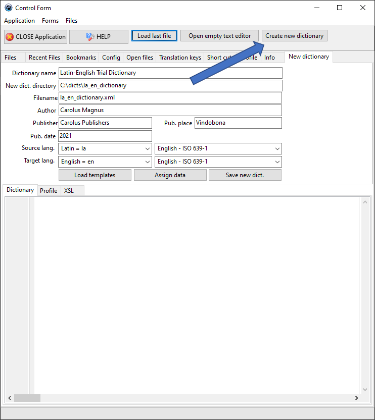

In the TEI world, languages are identified with language ‘tags’ that follow the [IETF BCP 47 specification](https://tools.ietf.org/rfc/bcp/bcp47.txt). To ease finding the right one, the program provides several lists containing the ISO-639 language codes. To switch between the lists, simply choose a list from the combobox on the right side of source and target language.

Then, push the  three buttons on the bottom of the form from left to right (see figure 2). Unless there is a need to change the templates, you don't need to do anything. The program has just set up the environment for you, copying the dictionary template, the transformation styles (xsl), the schema files (xsd) and an XML file ending in __xprofile.xml_ into the target directory.

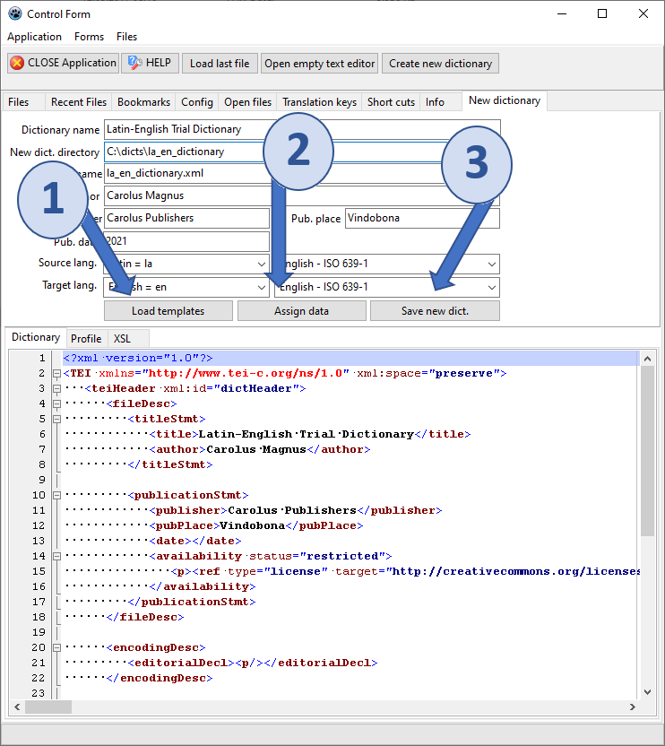

## Creating dictionary entries

### STEP 1: Open the new dictionary

Having created the document into which the dictionary data is going to be stored, we can proceed to create entries for the dictionary. Once you have pushed the _Save new dict._ button, the program takes you to the file explorer. You will see a directory with two XML files in it (Fig. 3): the dictionary and the dictionary profile. 

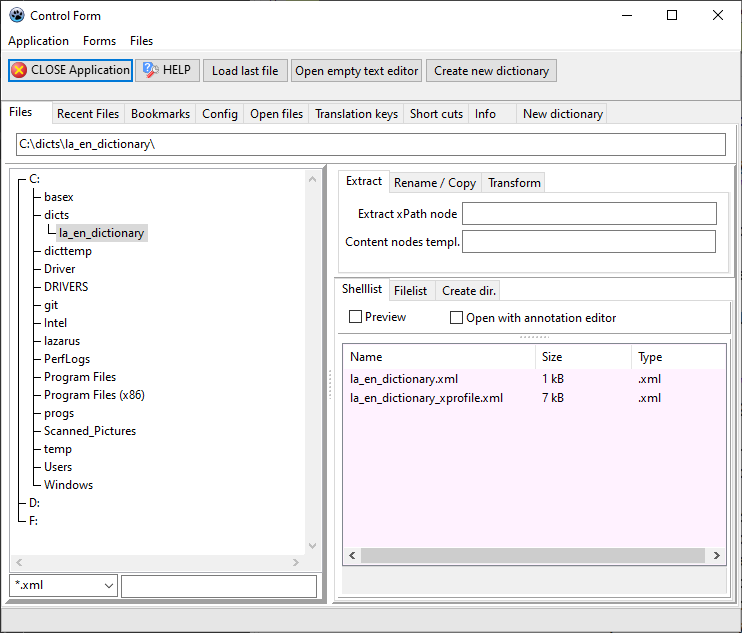

To open the dictionary, click the file ending in __xprofile_. This is the file that gives the program all the information it needs, enabling you to work on the dictionary. The profile is also a TEI encoded document containing configuration data needed by the editor. You could also open the dictionary file as a text, which, however, would make working on it much more cumbersome.

### STEP 2: Find the entry templates ...

When the profile is loaded, the editor appears displaying a three-way structure (Fig. 4): the left side (1) is the XML editor, the central part (2) is used to navigate the dictionary data and the right side (3) is used for editing any meta-data and visualising the entries.

When opening the editor for the first time, you might not see all the components. You may have to enlarge the window and there    are splitters inside the window to adjust the width of the three    areas. The program will remember the size of the window when you    open it in following sessions.

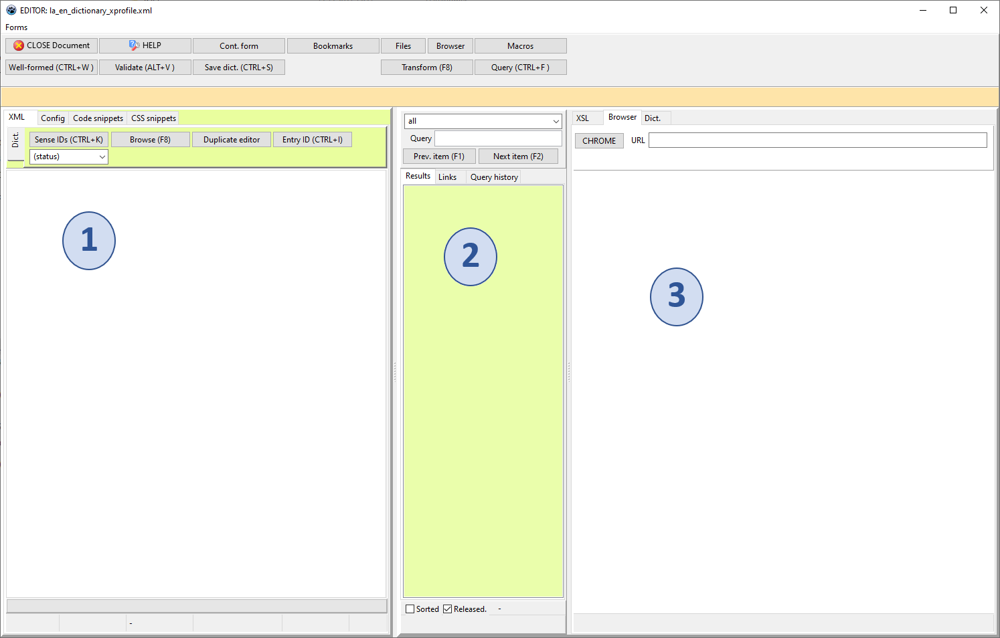

Now, we are going to create our first dictionary entry. Everything in the program is based on templates. Of course, you can    also type in whatever you need manually. However, simply copying predefined code snippets is a much easier and safer approach. The entry templates are to be found in the right-side section (3). Click on the tabsheet _Dict._ and then on _Entry templates_.

What you see here, is a list of TEI code snippets representing prototypical entries from with which dictionary entries can be created. These templates are stored in the profile. The list will have to be adapted to the particularities of your needs. Each template has a name attribute displayed in the listbox on the left side, which is used to insert a template into the dictionary (Fig. 5).

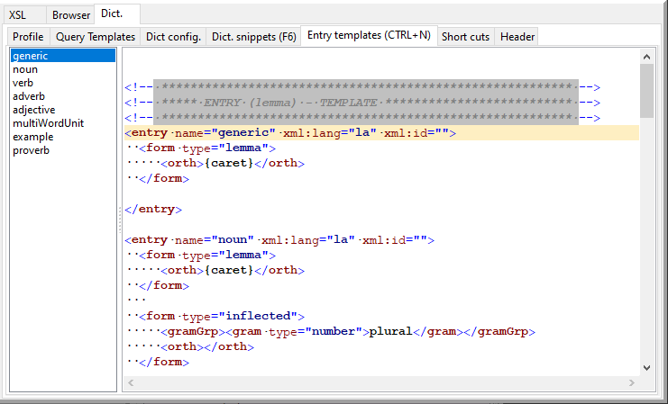

### STEP 3: ... and insert the first entry

Let us now create a new entry. For the sake of practice, let's take the simplest template with the name generic, which has almost no content. Double-click on the line in the listbox on the left side. The next image (Fig. 6) displays what you should see now.

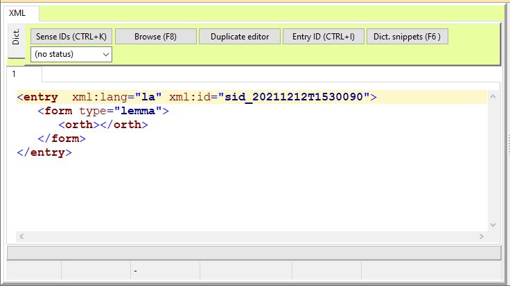

Now you can start to work on the lexical data. Insert the lemma inside of the ˂orth˃ element (Fig. 7).

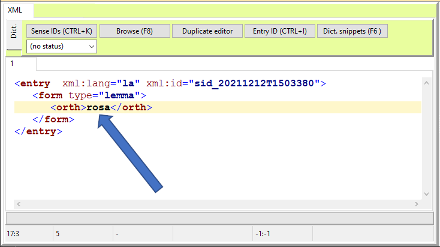

After this, you might want to create a more meaningful ID for the entry. Push the button _Entry ID_ (Fig 8.) to create a new ID

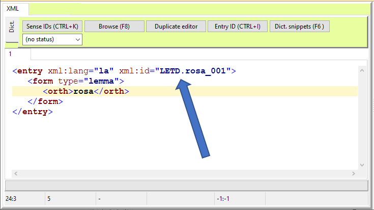

This ID is made up of an identifier of the dictionary (LETD=Latin English Trial Dictionary), which is based on the template defined in the configuration tabsheet of the profile: right editor side, _Dict._ tabsheet, _Dict. Config._ (Fig. 9).

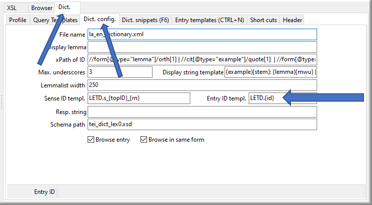

### STEP 4: Populating an entry

Next, we need to add more information to the entry: we avoid typing but insert predefined code snippets instead, as we did before when creating the entry. _˂TEI˃Enricher_ allows to quickly insert such snippets either by choosing from a list of snippets (F6 key) and inserting them into the text (F5 key) or by typing hash delimited codes identifying particular predefined snippets.

#### Dealing with grammatical information

In TEI Lex-0, word class is encoded in gramGrp/gram\[@type="pos"]. The word _rosa_ is a noun and  it is feminine. To find an appropriate snippet, let’s look at the list of code snippets which can be found on the _Dict. snippets_ tabsheet (Fig. 10). To get there, simply click on the _Dict. snippets_ button or trigger the _goToDictSnippets_ function (per       default F6 key).

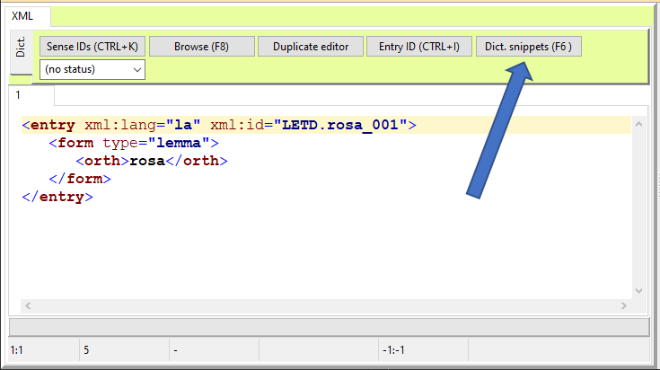

The snippets have two attributes that are relevant for the functioning of the program (Fig. 11). The n attribute (arrow 1) contains an abbreviation that can be used with hashes on  the left and right side to avoid navigating to go       the _Dict. snippets_ tabsheet. When typing the string  (n=noun) in the XML editor, the program attempts to substitute this string with the template carrying the attribute n="n". Consequently, typing v with  hashes around would insert the snippet for the word class verb. Alternatively, you can also double-click in the listbox on the left side of the snippets list (arrow 2) or click on the button that pops up when you navigate in the templates (arrow 3).

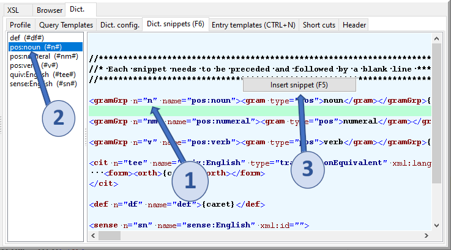

Consequently, we receive the following result (Fig. 12).

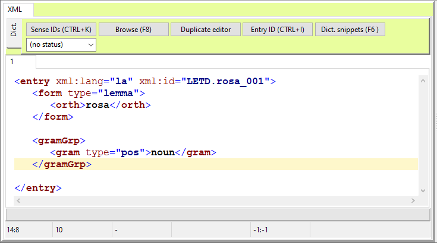

Mind the string in the templates which indicates where the program will put the cursor after the insertion.       _˂TEI˃Enricher_ is performing some rudimentary formatting. Mind that this often is far from perfect and might differ from what you would like to see.

Inserting the genus of the noun works along the same lines: Simply put the cursor in the line after the word class information and type gf encircled by hashes (Fig. 13).

")

This will result in the substitution the result of which is displayed in the next illustration (Fig. 14).

")

#### Inserting a plural form

We do not attempt to discuss the TEI Lex-0 system as there is very good documentation available already (https://dariah-eric.github.io/lexicalresources/pages/TEILex0/TEILex0.html). However, to proceed with complete entries, we give examples of the most important constituents of dictionary entries in TEI Lex-0. 

Plural forms are indicated in ˂form˃ elements (Fig. 15). 

Figure 15: Adding plural forms

#### Inserting senses

An indispensable part of bilingual lexicography are translation equivalents. These are put in ˂sense˃ elements (Fig. 16). Mind the Sense IDs button on top of the editor. Senses must have unique IDs.

Figure 16: Adding senses

#### Inserting an etymology

Let us finish with the etymology snippet. To demonstrate this, a second entry is created (Fig. 17).

Figure 17: Etymology

#### Viewing the data

One of the important features of ˂TEI˃Enricher is that it allows to instantly visualise the XML (Fig. 18). This is achieved by means of XSLT styles that convert the TEI encoded text into HTML and display it in the browser of the editor. To trigger this transformation the function browseDictEntry is used (per default F8 key).

Figure 18: Visualising

The XSLT can easily be adjusted to various purposes. The tabsheet on the left side of the Browser tabsheet contains the data which can be edited. Any changes are applied immediately to the data. How to edit the XSLT language is however beyond the scope of this tutorial.

### STEP 5: Inserting examples

In the dictionaries of the VICAV family, examples constitute a case in its own right. They are usually not inserted directly into the ˂entry˃ elements but referenced via pointer elements that contain IDs to address them. To make this clear, a short notice on the macro structure of the VICAV dictionaries: they are made up of two divisions inside the body element of the dictionary, the first division div\[type="entries"] contains all entries irrespective of being single or multiword entries and the second division div\[type="examples"] contains all the examples. The rationale behind keeping example sentences apart from the entries is to allow the reuse of the examples in different parts of the dictionary, thus creating a more flexible structure. The macro structure of the dictionaries looks like this (Fig. 19).

Figure 19: Macro structure

We first create an example (Fig. 20).

Figure 20: Example sentences

To copy this reference into the respective entry, we use the function createExamplePointer (F11 key) to get the data into the clipboard. Then we go to the entry loquor ‘to speak’, find the right position to insert and paste it there using CTRL+V. In the VICAV dictionaries, these references are usually inserted at the end of a ˂sense˃ element (Fig. 21).

Figure 21: Linking example sentences

˂TEI˃Enricher automatically    inserts the example in the output stream when browsing the entry loquor (Fig. 22).

Figure 22: Viewing example sentences

### STEP 6: Saving the data

You can save the dictionary with the function saveDocument which is called per default pressing the shortcut keys CTRL+S. Whenever the file is saved, the program creates a backup that is located in a subdirectory backup of the current directory. 

### STEP 7: Accessing existing data

The functionality to work on local data instead of in the client-server architecture has actually been one of the latest enhancements of the tool. Except for ease of use and therefore being well-suited for teaching purposes, it is also a    useful scenario when there is a need to speed-up processes.    The capability to work on a local XML file, and not on data    in a remote database, comes in very handy when one wants to    edit larger amounts of data. Accessing the data directly in    the DOM tree on your machine is much faster than any data    transfer via HTTP or other such mechanisms.

The navigation within the dictionary is accomplished via the middle section of the editor (Fig. 23). There are two controls: a selector for the scope (arrow 1) and a query control for text (arrow 2). To get all entries, simply put the cursor in the query control and push the Enter key. For our small example dictionary the result looks like this.

Figure 23: Querying

Where to look for particular strings in the dictionary is defined in the list of query templates. These are simple xPath expressions into which the string from the query control is inserted. The templates are selected via the label.

Figure 24: Query templates

## Some details on the editor

### Working with the text

The tool does not come with much sophisticated XML editing functionality. It is therefore important to avoid much typing which is per    se very error prone. Define what you need in the templates    section and insert elements from there.    Having inserted a start tag, the shortcut keys CTRL+F5 add    the end tag. To select an element simply press the F9 key    in the element (Fig. 25).

Figure 25: Selecting an element

CTRL+F9 will select only the contents of the element (Fig. 26).

Figure 26: Selecting the contents of an element

### Checking well-formedness (CTRL+W)

When working on any XML document, it is very important to ensure that the document complies with the underlying specifications.    The most fundamental degree of compliance within the    basic rules of XML is called well-formedness. A well-formed    document fulfils three conditions:           

- It has a single root.
       
- Every start tag is followed by an end tag.
       
- All the elements in the document are properly nested.
     

‘Properly nested’ means that elements must not overlap, a start- and end-tag must be inside the ‘parent’ element. As with many functions in ˂TEI˃Enricher, you can either use the button in the top bar of the editor, use a keyboard shortcut (per default CTRL+W) or right click in the editor to select the respective item in the pop-up menu to start the check on the structural integrity of the document you are working on.

To try this functionality, simply remove a single tag from your try-out text and press CTRL+W. You will receive an error message and a position in the text; the latter information is not always helpful, as this is the position where the error shows, not necessarily where the problem started.

### Validation (ALT + V)

When discussing which formats to use in data processing, validation has often been named as one of the strong arguments in favour of XML solutions. While the well-formedness test    only checks the three basic XML rules (one root, every start tag has to be followed by an end tag and elements must be properly nested), validation also checks the vocabulary used. It makes sure that only permissible elements are used in the document and that they are in the right place. The validation check is performed against a so-called schema, a document that contains the specifications which define a particular type of document.

˂TEI˃Enricher can curently only deal with XML Schema files, it does not support Relax NG. This has got to do with the availability of tools and time constraints in programming the tool. The XML Schema file against which the validation is performed has to be indicated in the Config. tabsheet of the main form. There are two options: either you have a local schema on your computer or you get it from the Internet, ideally via https://tei-c.org. When making use of this functionality, it is recommended to use    slimmed-down schemas that only contain the elements necessary for the particular task. TEI-all.xsd will make the process slow and cumbersome.

### Other checks

There are two more checks that can be applied to ensure the integrity of the dictionary data: the function Check for duplicate IDs makes sure    that every ID is used only once in the dictionary. Check integrity of example ref’s looks for references of examples that cannot be resolved. Both functions can be called by right-clicking in the editor and selecting the respective menu item.