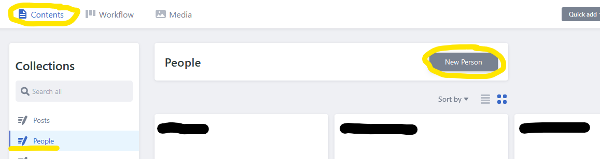
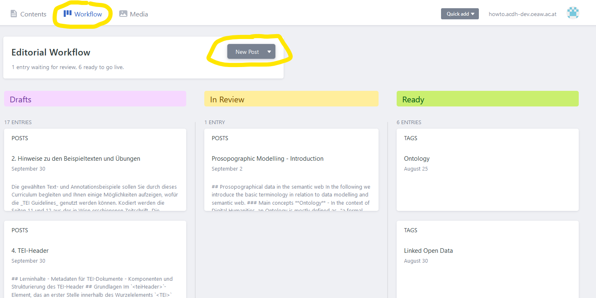
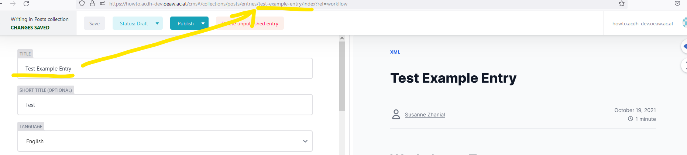
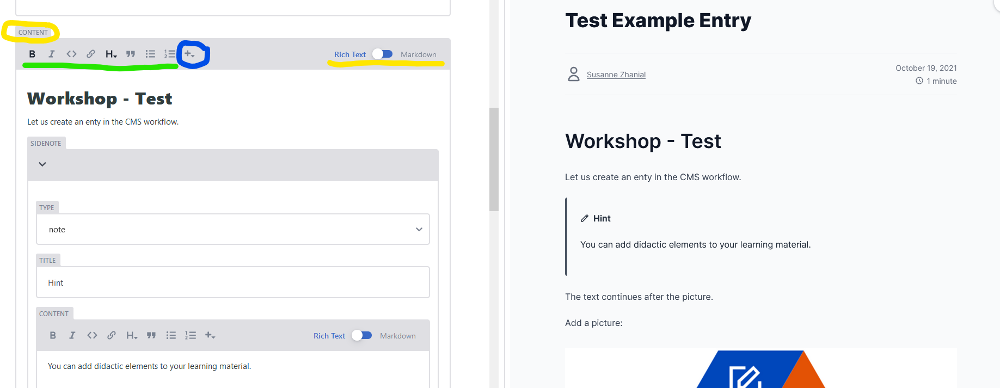

## Lernziele:

- Einen Beitrag für die Lernplattform selbst planen und erstellen können
- Die wichtigsten Rahmenbedingungen für eine (didaktische) Aufbereitung von Lerninhalten kennen
- Wissen, wie man Inhalte im Content Management System der Plattform einpflegt und veröffentlicht

## Was ist die Learning Resources Plattform (HowTo-Plattform)?

Die How-To Plattform des [Austrian Centre for Digital Humanities and Cultural Heritage](https://www.oeaw.ac.at/acdh/) ist eine Austausch-, Wissens- und Trainingsplattform für den Bereich der Digital Humanities. Sie wurde im Rahmen des [DiTAH-Projekts](https://www.ditah.at/about/) (Digital Transformation of Austrian Humanities) entwickelt und stellt Einführungen in verschiedenste Themen- und Arbeitsbereiche der Digital Humanities, Anleitungen für Programme und Tools, sowie praktisches Trainings- und Übungsmaterial bereit.

Die Plattform ermöglicht es Studierenden und Forschenden, sich Inhalte und Techniken aus den Digital Humanities im Selbststudium anzueignen und das Erlernte mit interaktiven und praktischen Übungen und kurzen Wissensfragen direkt auf der Plattform zu überprüfen. Alle Kapitel und Aufgaben sind dabei so aufgebaut, dass sie selbstständig durchgearbeitet werden können. Thematisch zusammenhängende Kapitel sind in größere Curricula zusammengefasst, können aber abhängig vom eigenen Wissensstand und den zur Verfügung stehenden Zeitressourcen auch einzeln durchgearbeitet werden. Zusätzlich bieten die bereitgestellten Literaturtipps und Links in den Kapiteln die Möglichkeit, sich über das How-To hinaus vertiefend mit den Inhalten auseinanderzusetzen. Da alle Materialien als Open Educational Resources mit der Lizenz CC-BY konzipiert und versehen sind, haben Lehrende aus den Bereich der Digital Humanities die Möglichkeit, einzelne Kapitel oder ganze Curricula für Ihren Unterricht zu nutzen.

## Wer kann mitmachen und Trainingsmaterialien erstellen?

Forschenden und Mitarbeiter\*innen am ACDH-CH können mithilfe der Plattform ihr Wissen im Bereich der Digital Humanities ganz einfach mit Studierende, (neue) Kolleg\*innen und anderen Forschenden teilen. Damit leisten alle Autor*innen einen wichtigen Beitrag zum Wissensaustausch und zur Weiterentwicklung von Methoden und Tools im Bereich der Digital Humanities.

**Trifft einer der folgenden Punkte auf Sie zu?**

- Sie kennen sich mit einem bestimmten methodischen Ansatz aus dem Bereich der Digital Humanities besonders gut aus.
- Sie unterrichten ein bestimmtes Forschungsgebiet der Digital Humanities in einer Lehrveranstaltung und/oder haben schon Lehrmaterial griffbereit.
- Sie arbeiten bei Ihrer Forschung mit einem bestimmten Tool oder Programm, mit dem Sie sich besonders gut auskennen.
- Sie sind Experte/Expertin in einem Programm/einer Programmiersprache und wollen Kolleg*innen und Studierenden helfen, dieses Programm nutzen und besser bedienen zu können.
- Sie haben selbst ein Tool oder eine Methode entwickelt und haben dazu eine Dokumentation oder Anleitung für Kolleg*innen und andere Forschende geschrieben.
- Sie möchten jungen Forscher\*innen und/oder neuen Kolleg\*innen am Institut den Einstieg in den Bereich Digital Humanities erleichtern.

Dann sind Sie hier genau richtig! Mithilfe der Learning Resources Plattform und der folgenden Schritt-für-Schritt Anleitung können Sie Ihr Wissen ganz einfach mit anderen teilen. 

<SideNote type="info" title="Hinweis:">
Die folgenden Abschnitte zeigen die Erstellung von Inhalten ausgehend von einer Idee. Falls bereits ein Textentwurf, ein ausgearbeiteter Text oder Übungsmaterialien vorliegen, kann man direkt zum Abschnitt „Wie kann ich einen Beitrag veröffentlichen?" springen.
</SideNote>

## Wie kann ich einen Beitrag gestalten?

Sie möchten Ihr Wissen zu einem bestimmten Thema oder Tool der Digital Humanities auf der Learning Resources Plattform teilen.  Wie gehen Sie dabei vor? 

Als ersten Schritt empfiehlt es sich, die Rahmenbedingungen festzulegen und sich so einen Überblick zu verschaffen. Zu den Rahmenbedingungen gehören die **Zielgruppe**, die **Lernziele bzw. die Lerninhalte**, der **Umfang** des Kapitels, und dessen **Struktur bzw. Aufbau** und eine Auflistung bereits vorhandener bzw. noch zu erstellender **Unterlagen und Übungen**.

**a) Die Zielgruppe kennen:** Wie oben beschrieben, richtet sich die How-To Plattform primär an Studierende, (junge) Forscher\*innen und neue Kolleg\*innen am ACDH-CH und ihnen Grundlagen und Grundbegriffe erklären und Einleitungen anbieten. Es kann auch Material für Fortgeschrittene zur Verfügung gestellt werden. In diesem Fall ist es wichtig, dass Sie zu Beginn ihres Eintrags (am besten im Titel oder in der Einleitung) festhalten, was die Voraussetzungen für das Studium des Materials sind. Benötige ich, zum Beispiel, Grundkenntnisse in einer bestimmten Programmiersprache oder sollte ich bereits mit einer bestimmten Methode vertraut sein, um den Ausführungen folgen zu können? Je genauer Sie die Vorkenntnisse festhalten, desto besser können sich Leser*innen orientieren. Sie können auch gerne auf einen bereits auf der Plattform vorhandenen Kurs aufbauen und eine Erweiterung bzw. Vertiefung verfassen. In diesem Fall orientieren Sie sich an den Lernzielen des bereits vorhandenen Kurses und starten Ihre Erklärung von diesem Punkt aus.

**b) Die Lernziele (und Lerninhalte) beschreiben:** die Begriffe Lerninhalt und Lernziel scheinen zunächst sehr ähnlich, sind aber doch im Inhalt und in der Formulierung unterschiedlich. **Lerninhalte** – wie der Name sagt – geben eine **Beschreibung des Inhalts**, wie etwa: Definition von Grundbegriffen, Einführung in die Textannotation usw. **Lernziele** helfen sowohl Ihnen beim Erstellen des Textes als auch später den Nutzer*innen, indem sie eine **Beschreibung der Fähigkeiten und Kenntnisse** geben, die man nach dem Durcharbeiten der Materialien erworben haben sollte. Lernziele sollten daher aktive Verben enthalten, wie: verstehen, erkennen, anwenden können, etc. Es ist besser, mit Lernzielen zu arbeiten, da hier der\*die Nutzer\*in sofort sieht, was das Ziel des Kapitels ist, während Lerninhalte eher abstrakt bleiben.

**c) Den Umfang festlegen:** Überlegen Sie sich vorab, welche Bereiche Sie mit Ihrem Trainingsmaterial abdecken wollen und welche Aspekte Sie nicht inkludieren können. Definieren Sie klare Grenzen, da Themen und Beschreibungen sonst leicht ausufern. Wenn Sie eine Einleitung zu einem bestimmten Programm verfassen, dann müssen Sie nicht jede Funktion des Progamms erklären – bieten Sie stattdessen einen Überblick über die am häufigsten benötigten Funktionen an. Die weiteren Funktionen können dann in einem weiteren Kapitel für Fortgeschrittene behandelt werden.

**d) Eine (Grob-)Struktur festlegen:** Bevor Sie mit dem Ausformulieren des Textes beginnen, ist es hilfreich, sich eine (grobe) Struktur der einzelnen Schritte/Unterkapitel des Textes zu überlegen. Hierbei helfen Ihnen Ihre Notizen zum Umfang und den Lernzielen. Bei der Festlegung einer Struktur sollten Sie vor allem bedenken, dass die Texte sich zum Selbststudium eignen sollen und daher einen logischen Aufbau haben sollen. Starten Sie mit einer kurzen Einführung zur präsentierten Methode oder dem Tool, und bauen Sie die weiteren Unterkapitel logisch aufeinander auf.

**e) Vorhandene Unterlagen und Materialien prüfen und Ideen für Übungen sammeln:** Haben Sie bereits Notizen zum Thema, Textbausteine oder Rohtextfassungen zu Ihrem Thema? Oft gibt es schon kurze Textbausteine, die zu einem anderen Zeitpunkt für Kolleg*innen (oder für sich selbst) formuliert wurden und auf denen man gut aufbauen kann. Sammeln Sie alle Materialien und strukturieren sie diese in Abschnitte. Genauso gehen Sie mit Ideen für Übungen oder Übungsbespielen vor – prüfen Sie, was schon vorhanden ist und wo es gut eingegliedert werden kann und/oder überlegen Sie kurz, wo eine (weitere) Übung, Testfragen oder ein kurzes Quiz gut passen würden.  Sie können sich auch gerne Input bei anderen Beiträgen holen oder Kontakt mit dem Redaktionsteam aufnehmen – wir helfen Ihnen bei der Umsetzung.

Durch die Ausformulierung der Rahmenbedingungen haben Sie nun einen Leitfaden und die Struktur für Ihr Trainingsmaterial fertig und können mit dem Ausformulieren des Textes beginnen bzw. die bereits vorhandenen Materialien ergänzen.

### Weiterführende Literatur:

- Stangl, Werner. „Lernziele“. \[Werner.Stangl]s Arbeitsblätter. Was Sie schon immer über Psychologie wissen wollten. (o.J). http://www.stangl-taller.at/ARBEITSBLAETTER/LERNZIELE/. (8.3.2022).
- Junker, Ruth Meyer. “Lernziele formulieren leicht gemacht.“ wb-web. Deutsches Institut für Erwachsenenbildung. Leibniz-Zentrum für Lebenslanges Lernen e.V. CC-BY-NC-SA 4.0.https://wb-web.de/material/methoden/lernziele-formulieren-leicht-gemacht.html. (8.3.2022).
- Junker, Ruth Meyer. “Lernziele definieren.“ wb-web. Deutsches Institut für Erwachsenenbildung. Leibniz-Zentrum für Lebenslanges Lernen e.V. CC-BY-NC-SA 4.0. https://wb-web.de/material/methoden/lernziele-definieren.html. (8.3.2022).

## Wie kann ich einen Beitrag veröffentlichen?

Wenn der Text und ggf. die Fragen und Übungen fertig ausformuliert sind, dann kann er in unser Content Management System (CMS) integriert werden. Dies können Sie entweder selbst machen oder den Text an das Redaktionsteam senden, das den Beitragstext für Sie eingepflegt. Bevor der Beitrag online geht, erhalten Sie einen Link zum Draft und können diesen noch einmal prüfen.

Um einen Text selbst einzupflegen, benötigen Sie einen GitHub-Account, der für das ACDH-CH Team freigeschaltet ist. Erstellen Sie einfach selbst den GitHub-Account und schreiben Sie uns dann eine kurze Nachricht, damit Sie hinzugefügt werden. Sobald dies geschehen ist, loggen Sie sich mit Ihrem GitHub-Account auf der Plattform ein und können schon loslegen. 

Der erste wichtige Schritt ist, dass Sie sich als Autor\*in anlegen. Gehen Sie dafür links oben auf „Contents“ und dann unter Collections auf „People“. Durch Klicken auf den Button „New Person“ können Sie sich als Autor\*in anlegen. Bitte speichern Sie die Eingaben und veröffentlichen Sie dann den Eintrag.

Nun können Sie entweder links über „Post“ und „New Post“ einen neuen Beitrag starten oder dies über den Tab „Workflow“ tun. Im Bereich „Workflow“ finden Sie auch jederzeit alle Beiträge, die derzeit in Bearbeitung sind oder auf ihre Prüfung und Veröffentlichung warten. Wenn Sie also ihre Arbeit unterbrechen, gehen Sie beim nächsten Mal einfach zum Workflow, wo Sie unter Draft Ihren Beitrag finden, öffnen und daran weiterarbeiten können. Sobald eine Änderung vorgenommen wurde, erinnert Sie die Plattform auch immer automatisch daran, diese vor dem Verlassen des Beitrags zu speichern (oder ggf. zu verwerfen).

<SideNote type="info" title="Hinweis:">
Beiträge werden immer zuerst als Draft-Version gespeichert. Wenn Sie fertig sind, können Sie den Entwurf auf „In Review“ umstellen, damit ihn das Redaktionsteam überprüfen kann. Wenn dies erfolgt ist, wird der Beitrag auf „Ready“ gestellt und danach publiziert. Erst dann ist er auf der öffentlichen Instanz einsehbar.
</SideNote>

### Die wichtigsten Editierfunktionen

Die Plattform stellt verschiedene Funktionen für die Bearbeitung bereit. Wenn Sie einen neuen Beitrag starten (oder einen vorhandenen Beitrag durch Anklicken wieder öffnen), so teilt sich der Bildschirm in zwei Hälften. Links ist der Bearbeitungsbereich, rechts können Sie direkt sehen und überprüfen, wie Ihr Beitrag später auf der How-To Plattform aussehen wird. Jeder Beitrag startet mit einigen formalen Angaben, wie Titel (möglichst aussagekräftig und nicht zu lange), Sprache, Datum, Autor\*innen, Editor\*innen, Tags und ein kurzer Abstract. Bei einigen Feldern können nur Angaben aus dem Dropdown-Menü ausgewählt werden. Sollte der gewünschte Eintrag nicht vorhanden sein, so muss dieser zuvor angelegt werden (siehe Erklärung zum Anlegen von Autor\*innen oben). Autor\*innen können Sie selbst hinzufügen, für Tags wenden Sie sich bitte an das Redaktionsteam.

<SideNote type="tip" title="Tipp:">
Die erste (gespeicherte) Eingabe im Feld Titel wird auch für die URL verwendet. Wollen Sie eine möglichst einfache URL haben, so raten wir Ihnen, beim ersten Speichern im Titelfeld die gewünschten Wörter zu benutzen. In unserem Beispiel (siehe Abbildung) haben wir zuerst im Titel „Test-Example-Entry“ eingegeben und gespeichert.

</SideNote>

Auf die formalen Angaben wie Titel, Sprache und Abstract folgt dann das Feld „Content“. Hier wird der Inhalt des Beitrags erfasst. Dies kann entweder im Rich-Text Format oder im Markdown geschehen und Sie können durch den Schieberegler (im Screenshot unten gelb markiert) jederzeit zwischen den Formaten wechseln. 

Im Rich-Text stehen Ihnen verschiedene Formatierungsoptionen, wie Fett, Kursiv, Überschriften, Aufzählungen, etc. offen (grün markiert). Außerdem können Sie mithilfe des „Plus“-Symbols (blaue Markierung) verschiedene vorprogrammierte Elemente, wie Bilder, Videos, Codeblocks, Tipp-Boxen, oder ein Quiz einfach einfügen.

Wenn Sie mit der Maus kurz über das Formatierungssymbol fahren, wird eine kurze Erklärung angezeigt. Folgende Optionen (von links nach rechts) stehen zur Verfügung:

- **B** (Bold) – **Schrift fett** hervorheben
- _I_ (Italics) - _Schrift kursiv_ hervorheben
- Code: hiermit können Sie Inline-Code hinzufügen
- Link: damit kann eine Verlinkung auf eine externe Ressource erfolgen
- Doppelte Anführungszeichen: fügen Sie ein Zitat ein. Dieses wird auch als Zitat formatiert und vom restlichen Text abgehoben.
- Aufzählungen
- Nummerierungen
- Plus (+): hinter dem Plus verbergen sich einige nützliche Funktionen, um den Beitrag mit multimedialen Inhalten zu befüllen und interaktiv zu gestalten. Das beinhaltet:

  - Bilder hinzufügen durch Upload der Datei
  - einen längeren Codeblock einfügen
  - Material zum Download einfügen
  - SideNote: hiermit kann ein Hinweis oder ein Tipp eingefügt werden. Es gibt unterschiedliche Optionen, die farblich unterschiedlich markiert und im Text hervorgehoben werden. Das Dropdown-Menü unter „Type“ zeigt die zur Verfügung stehenden Optionen an.
  - ein Video einbinden, dass auf Youtube, Vimeo oder Nakala gehostet ist. Optional können Sie eingeben, ab welcher Stelle das Video abgespielt werden soll und ob die Abspielfunktion automatisch starten soll.
  - Quiz: dies gibt Ihnen die Möglichkeit, eine oder mehrere Fragen zu gestalten. Die Anzahl der angezeigten Antwortoptionen legen Sie mit „Options“ fest. Für jede Antwortmöglichkeit muss auch festgelegt werden, ob die Antwort richtig oder falsch ist. Unter „Messages“ können Sie zusätzlich Rückmeldungen an den Lernenden einfüllen, damit er*sie auch weiß, warum die Antwort richtig oder falsch ist. Mit Hilfe des Feldes „Control“ können Sie den Button, der vom Lernenden zur Überprüfung gedrückt werden muss, benennen. Systemseitig ist hier „Überprüfen“ bzw. „Validate“ eingestellt. Wenn der Vorschau-Modus aktiviert ist (Auge-Symbol), sehen Sie auf der rechten Browser-Seite immer gleich, wie Ihre Multiple-Choice-Frage aussieht und können die Antwortmöglichkeiten auch testen. Richtige Antworten werden grün angezeigt, falsche Antworten in rot. Beachten Sie, dass Antworten immer eindeutig richtig oder falsch sein müssen.

Somit kennen Sie nun die wichtigsten Funktionen unseres CMS-Systems und können gleich einen neuen Beitrag starten. 

Sollten Sie vorab noch Fragen haben oder bei der didaktischen Aufbereitung und/oder Eintragung auf die Plattform Hilfe benötigen, so schreiben Sie uns eine Email.