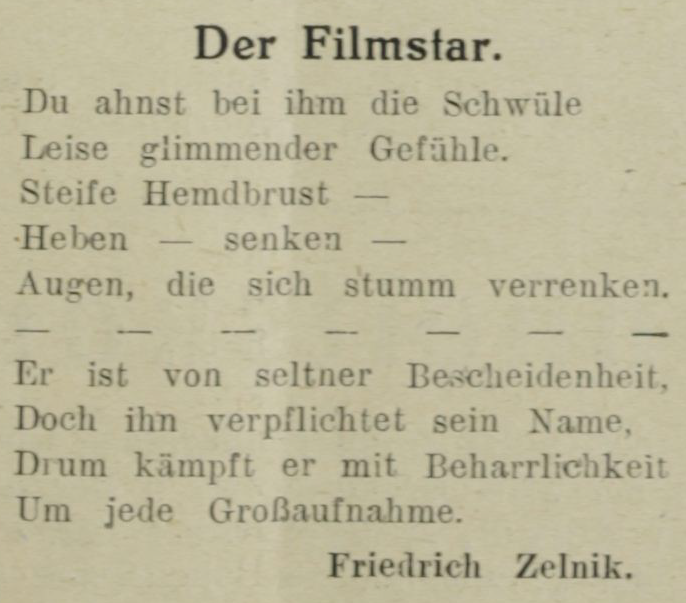

## Lernziele

- Anwendung von globalen Attributen
-

## Grundlegendes zu Globalen Attributen

Globale Attribute sind jene Attribute, die sich fast allen TEI-Tag-Elementen  zuordnen lassen. Wie bei spezifischen Attributen findet man ein globales Attribut als `attribute="value"` im Öffnungstag des Elements nach der Elementsbezeichnung, `<element attribute="value">`. Da die globalen Attribute so flexibel sind, findet man sie in den unterschiedlichsten Annotierungen. Hier einige Beispiele, die zu den globalen Attributen gehören:

- **Identität**, `@xml:id`: Mit diesem Attribut weisen Sie einem Element eine ganz eindeutige Identifikation zu. Sie muss einzigartig im Dokument sein, muss mit einem Buchstaben oder Unterstrich beginnen und darf keine Sonderzeichen wie zum Beispiel Doppelpunkte enthalten.
- **Typisierung**, `@type`und `@subtype`
- **Quellenangabe**, `@source`: Dieses Attribut verweist auf einen bibliographischen Verweis innerhalb eines Elements.
- **Name bzw. Nummerierung**, `@n`: Mit diesem Attribut werden häufig Aufzählungen gekennzeichnet. Dieses Element kann mehrfach mit der selben Bezeichnung in einem Dokument vorkommen und jedes Zeichen ist zulässig.
- **Sprache**, `@xml:lang(ISO Code)`: Mit diesem Attribut können Sie die Sprache auszeichnen. Wenn Sie ein Elternelement auszeichnen, gilt die Angabe auch für alle umschlossenen Kindelemente. Daher können Sie auch besonders solche Element auszeichnen, deren Sprache abweicht.
- **Referenz**, `@xml:base`: Mit diesem Attribut können Sie auf URIs referenzieren. Jene sind entweder absolut gesetzt (zum Beispiel eine URL einer Website), oder relativ (zum Beispiel Bezug auf einen lokal abgelegten Ordner).
- **Aussehen**, `@rend`, `@rendition` und `@style`: Alle drei Attribute beschreiben das Aussehen eines Elements näher. Während `@rend`innerhalb des Elements Kursiv- oder Fettschreibung kennzeichnen kann, so beschreibt `@style` eine Darstellungssprache wie [CSS](https://www.uni-giessen.de/fbz/svc/hrz/org/mitarb/abt/3/zms/schulung/webtechniken/stylesheets). `@rendition`wird im Header verwendet. Dieses Attribut beschreibt eine bestimmte Textdarstellung, die auf alle Elemente, für die sie definiert wurde, angewendet wird.
- **Besondere Abstände**, `xml:space`: Mit diesem eher seltenen Attribut können Sie bestimmen, wie bei der späteren Umsetzung Ihres TEI-Dokuments mit Abständen, sogenannten "white spaces", umgegangen wird. Es gibt zwei Möglichkeiten, entweder `default`oder `preserve`: ersteres normalisiert Abstände, die zweite Variante behält besondere Abstände bei. Das könnte interessant sein, wenn Sie zum Beispiel mit Manuskripten arbeiten, bei denen Sie explizit auf Ungewöhnlichkeiten hinweisen möchten.

### Praktische Anwendung

Sehen Sie sich bitte das folgende Beispiel an. Es handelt sich um Friedrich Zelniks Gedicht *Der Filmstar*, aus der Filmwelt 1923. Sie sehen einige globale Attribute, die im Folgenden näher erklärt werden.



```xml
<div xml:id="Zelnik1" type="poem">
 <head xml:lang="de"> Der Filmstar </head>
  <lg n="1">
   <l>Du ahnst bei ihm die Schwüle</l>
   <l>Leise glimmender Gefühle</l>
   <l>Steife Hemdbrust -</l>
   <l>Heben - senken -</l>
   <l>Augen, die sich stumm verrenken.</l>
  </lg>
  <lg n="2">
   <l>Er ist von seltner Bescheidenheit,</l>
   <l>Doch ihn verpflichtet sein Name,</l>
   <l>Drum kämpft er mit Beharrlichkeit</l>
   <l>Um jede Großaufnahme.</l>
  </lg>
</div>
```

Hier wurden Tags mit den globalen Attributen zu Identifikation, Typisierung und Sprache (`@type`, `@n`, `xml:id`und `xml:lang`) ausgezeichnet.

- `xml:id="Zelnik1"` beschreibt eine zusätzliche Identifikationsangabe, die diesen Text auszeichnet. Welche Bezeichnung verwendet wird kann frei entschieden werden, es sollte aber auf eine einheitliche Auszeichnungsweise geachtet werden. Eine leicht verständliche und nachvollziehbare Bezeichnung ist in jedem Fall sinnvoll.
- `div type="poem"` sagt aus, dass es sich bei diesem Textabschnitt `div` um ein Gedicht `type="poem"` handelt.
- `head xml:lang="de"` gibt an, dass die Überschrift `head` in deutscher Sprache `xml:lang="de"` geschrieben wurde.
- `lg n="1"` bezeichnet die erste `n="1"` Strophe des Gedichts.
- `lg n="2"` bezeichnet dann die zweite `n="2"` Strophe des Gedichts.

Da die Auszeichnungen global sind, sind sie nicht zwingend an die oben genannten Stellen gebunden:

```xml
<lg n="1" xml:lang="de">
  <l>Du ahnst bei ihm die Schwüle</l>
  <l>Leise glimmender Gefühle</l>
</lg>
```

Man könnte die Sprache `xml:lang="de"` ebenso beim Vers auszeichnen; das wäre beispielsweise sinnvoll, wenn die Sprache, in der die einzelnen Verse verfasst sind, wechselt.

#### Übung 1a: Globale Attribute erkennen

<Quiz>
  <Quiz.Card>
    <Quiz.MultipleChoice>
      <Quiz.Question>
        Welches der folgenden Attribute ist _kein_ globales Attribut?
      </Quiz.Question>

      <Quiz.MultipleChoice.Option>
        a) die Auszeichnung einer Sprache, zum Beispiel Französisch `@xml:lang=fr`
      </Quiz.MultipleChoice.Option>

      <Quiz.MultipleChoice.Option>
        b) die Auszeichnung eines Texttyps, zum Beispiel Glosse oder Artikel `type="gloss"`, `type="article"`
      </Quiz.MultipleChoice.Option>

      <Quiz.MultipleChoice.Option isCorrect>
        c) die Auszeichnung einer Kopfzeile `head`
      </Quiz.MultipleChoice.Option>

      <Quiz.MultipleChoice.Option>
        d) die Auszeichnung einer Formattierung, zB für kleinen Schriftgröße `renditon xml:id="r-small" scheme="css"`
      </Quiz.MultipleChoice.Option>
    </Quiz.MultipleChoice>
  </Quiz.Card>
</Quiz>


#### Übung 1b: Globale Attribute auszeichnen

<Quiz>
  <Quiz.Card>
    <Quiz.XmlCodeEditor
      code={"<TEI>\n    <text>\n      <body>\nNacht.\n\nIn einem hochgewölbten, engen, gothischen Zimmer Faust unruhig auf einem Sessel am Pulte.\n\n`<sp who=\"#FAU\">`\n\n`<speaker>`Faust.`</speaker>`\n\n`<p>`Habe nun, ach! Philosophie, Juristerey und Medicin, Und leider auch Theologie! ...`</p>`\n\n`</sp>`\n      </body>\n  </text>\n</TEI>"}
      solution={"<TEI>\n  <text>\n    <body>\n      <div type=\"act\">\n        <div type=\"scene\">\n          <head>Nacht.</head>\n          <stage> In einem hochgewölbten, engen, gothischen Zimmer Faust unruhig auf einem Sessel am Pulte.</stage>\n          <sp who=\"#FAU\">\n            <speaker>Faust.</speaker>\n            <p> Habe nun, ach! Philosophie, Juristerey und Medicin, Und leider auch Theologie! ...</p>\n          </sp>\n        </div>\n      </div>\n    </body>\n  </text>\n</TEI>"}
      validate="input"
    >
      <Quiz.Question>
        Im Folgenden sehen Sie den Beginn von Goethes _Faust_. Da es sich um einen dramatischen Text handelt, werden Tags aus diesem Bereich genutzt. Zeichnen Sie bitte mit Hilfe der globalen Attribute aus:

        1. Benutzen Sie `<div type="act">` um die gesamte Passage als Teil eines Aktes zu kennzeichnen. Der Rest des Aktes liegt hier nicht vor, könnte aber auch Teil dieses Elements sein. Schließen Sie dieses Element als letztes.
        2. Innerhalb des Elements `<div type="act">` gibt es eine Szene, die wir hier sehen. Umschließen Sie den gesamten Text mit einem weiteren Abschnittselement und dem Attribut `type="scene"`, um die Szene auszuzeichnen. Vergessen Sie bitte nicht das Element vor dem Schließelement von `<div type="act"`zu schließen.
        3. Zeichnen Sie dann die Titelzeile "Nacht" mit dem Element `<head>`aus. Vergessen Sie bitte nicht, das Element am Ende der Überschrift zu schließen, bevor Sie weiter arbeiten.
        4. In der nächsten Zeile folgt eine Bühnenanweisung `<stage>`. Umschließen Sie die gesamte Bühnenanweisung mit diesem Element.
        5. Der Bereich der Rede `<sp>`(speech) ist bereits für Sie vorbereitet. Hier wurde der Sprecher, Faust, ausgezeichnet, und der erste Absatz `<p>`des Eröffnungsmonologs.
        6. Stellen Sie sicher, dass Sie die TEI-Elemente alle in der richtigen Reihenfolge geschlossen haben, vom Innersten zum Äußersten.

        Bitte beachten Sie, dass hier kein vollständiges TEI-Dokument vorliegt, da Sie lediglich einen Ausschnitt aus dem `<text>` sehen. Ihre Bearbeitung wird wohlgeformt, aber nicht valide sein.
      </Quiz.Question>
    </Quiz.XmlCodeEditor>
  </Quiz.Card>
</Quiz>

#### Übung 2a: Globale Attribute verwenden

<Quiz>
  <Quiz.Card>
    <Quiz.MultipleChoice>
      <Quiz.Question>
        Angenommen in unserem Fließtext finden sich zwei verschiedene Textsorten. Innerhalb einer Szene in einem Stück spricht die Figur ein Gedicht. Welches globale Attribut kann man voranstellen um zu kennzeichnen, dass es sich um eine Szene `act`, aber auch um Verse `stanza` handelt?
      </Quiz.Question>

      <Quiz.MultipleChoice.Option>
        a) `rend`
      </Quiz.MultipleChoice.Option>

      <Quiz.MultipleChoice.Option>
        b) `n`
      </Quiz.MultipleChoice.Option>

      <Quiz.MultipleChoice.Option>
        c) `source`
      </Quiz.MultipleChoice.Option>

      <Quiz.MultipleChoice.Option isCorrect>
        d) `type`
      </Quiz.MultipleChoice.Option>
    </Quiz.MultipleChoice>
  </Quiz.Card>
</Quiz>


### Glossar

`<sp>` (speech) beinhaltet einzelne Reden innerhalb eines performativen Textes oder eines Abschnittes innerhalb eines Prosa- oder Verstextes, der als Rede dargestellt wird.

### Weiterführende Information

Hier finden Sie genauere Erklärungen zu den globalen Attributen: [TEI by example](https://teibyexample.org/tutorials/TBED01v00.htm?target=globalattributes)

Hier finden Sie weitere Beispiele für die Verwendung globaler Attribute am Beispiel des `<Head>`-Elements: [TEI head element examples](https://www.tei-c.org/release/doc/tei-p5-doc/en/html/examples-head.html)

Hier finden Sie eine Liste der ISO-Codes für Sprache: [ISO-Code Sprache](https://de.wikipedia.org/wiki/Liste_der_ISO-639-1-Codes)

Hier finden Sie Beispiel für das Rendition-Element `rend`, das das Textaussehen beschreibt: [Rendition](https://tei-c.org/release/doc/tei-p5-doc/en/html/ref-rendition.html)

Hier finden Sie eine weitere Annotation eines dramatischen Textes. Auch hier werden globale Attribute verwendet: [TEI by example, Module 5] (https://teibyexample.org/tutorials/TBED05v00.htm)