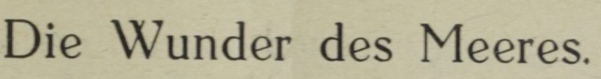
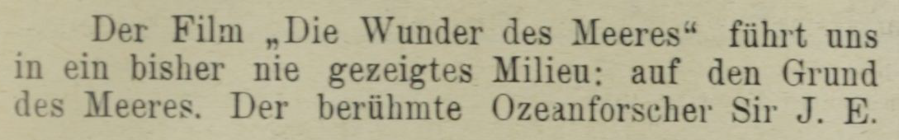
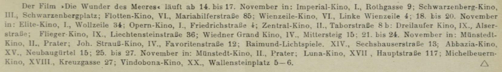

## TEI Body

### Grundlegende Strukturierung von Fließtext in TEI; der Body

Jedes TEI Dokument folgt einer bestimmten Struktur, die vor und während der Dokumenterstellung festgelegt wird. Diese ist wichtig, um eine Ordnung im Textdokument festzulegen. So können später Elemente im annotierten Text gefunden werden und die entstehenden Hierarchien sind für die Maschine lesbar. Im sogenannten Body[^1] legt man eine Struktur des Fließtextes fest, die zeigt, wie das Textdokument aufgebaut ist. Der Body ist vom element `<body>` umschlossen. Innerhalb des Body werden die einzelnen Abschnitte als Elemente, zum Beispiel `<div>`-Elemente[^2], gekenntzeichnet. Innerhalb dieser `<div>`-Elemente können beispielsweise weitere Überschriften (`<head>`) und Absätzen (`<p>`) bzw. Strophen (`<lg>` mit `<l>`) ausgezeichnet werden. Im Header[^3] wird Metainformation zum Text festgehalten, zum Beispiel Autor, Textart, Dokumentart, usw. Dies ist nicht Teil des Fließtextes. Es ist wichtig, dass jedem Textabschnitt eine Auszeichnung zugewiesen wurde, damit das Dokument wohlgeformt[^4] ist. Elemente mit fehlenden Auszeichnungen sind nicht valide[^5].

*Die wichtigsten Auszeichnung sind:*

* **Abschnitt**, größere Textteile`<div>`
* **Überschriften**, `<head>`
* **Verfasserzeilen**, `<byline>`
* **Absätze**, `<p>`
* **Verse und Verszeilen**, `<lg>`, `<l>`
* **Allgemeiner Block**, `<ab>`
* **Zitate**, `<cit>`
* **Listen und Listeneinträge**, `<list>` mit `<item>`
* **Tabellen und Tabelleneinträge**, `<table>` mit `<row>`(Zeile), `<cell>`(Zelle)
* **Abbildungen und Abbildungsbeschreibungen**, `<figure>` mit `<figDesc>` oder `<graphic>`
* **Titelseiten mit Titel**, `<title>` mit `<docTitle>` und `<titlePart>`
* **Autorenangaben**, `<docAuthor>`
* **Impressum**, `<imprint>`
* **Publikationsdatum**, `<docDate>`
* **Imprimatur**, `<imprimatur>`
* **Eröffnungs- und Schlussformeln**, `<opener>` und `<closer>`
* **Anreden**, `<salute>`
* **Postscriptum**, `<postscript>`
* **Unterschrift**, `<signed>`

### Praktische Anwendung

Sehen Sie sich bitte die folgenden Beispiele an. Es handelt sich um (gekürzte) Abschnitte aus einer Filmkritik. Wir betrachten einen Artikel, einen Spielplan, und ein ebendort veröffentlichtes Gedicht mit dem Titel "Der Filmstar" näher. Um den Text und viele ähnliche Texte automatisiert bearbeiten zu können, muss entsprechend ausgezeichnet werden. Sie sehen auch eine Blanko-Vorlage, au der der Text entnommen wurde. Das erste Beispiel zeigt eine Inhaltsangabe, das zweite den Spielplan, das dritte das Gedicht.

```xml
<div>
 <head>Die Wunder des Meeres.</head>
 <p>Der Film „Die Wunder des Meeres“ führt uns in ein bisher nie gezeigtes
   Milieu: auf den Grund des Meeres. Der berühmte Ozeanforscher Sir J. E.
   Williamson hat ...</p>
</div>
```

```xml
<div>
 <head>Titel</head>
 <p>Erster Absatz</p>
</div>
```

```xml
<list>
 <item>Imperial-Kino, I., Rothgasse 9;</item>
 <item>Schwarzenberg-Kino, III., Schwarzenbergplatz;</item>
 <item>...</item>
</list>
```

```xml
<list>
 <item>Erstes Listenelement</item>
 <item>Zweites Listenelement</item>
 <item>...</item>
</list>
```

```xml
<lg>
 <head>Der Filmstar.</head>
 <l>Du ahnst bei ihm die Schwüle</l>
 <l>Leise glimmender Gefühle.</l>
 <l>...</l>
 <l>Drum kämpft er mit Beharrlichkeit</l>
 <l>Um jede Großaufnahme.</l>
 <byline>Friedrich Zelnik.</byline>
</lg>
```

```xml
<lg>
 <head>Titel</head>
 <l>Erste Verszeile</l>
 <l>Zweite Verszeile</l>
 <l>Dritte Verszeile</l>
 <byline>Verfasserzeile</byline>
</lg>
```

Die Auszeichnung verändert nicht die Anordnung der einzelnen Textteile, aber durch Einrückungen wird gezeigt, wie die Textteile zueinander strukturiert sind. `<div>` bildet die oberste Hierarchieebene, darin folgen dann `<head>`, `<p>`, etc als weitere Ebenen. Sie können gleichwertig sein, oder weiter ineinander verschachtelt. Bei Aufzählungen wird die oberste Hierarchieebene mit `<list>` gekennzeichnet, innerhalb der `<list>` findet man einen oder mehrere `<item>`.

Beachten Sie, dass der Fließtext in einem Element von einem kleineren `<head>`-, `<p>`- bzw. `<item>` oder `<l>`-Element umgeben sein muss.

Zusätzlich zur Identifizierung einzelner Abschnitte im Fließtext (Überschrift, Absatz, Strophe, Liste,...), zeichnet man im Body auch mit Attributen und Werten [^6] aus, worum es sich bei dem Element konkret handelt (z.B. Gedicht, Spielplan, Artikel,...).

* `<div>` + type article / movieSchedule / poem / editorialStatement / reviews / review
* `<div>` type review + n 1 / 2
* `<head>` + type columnTitle [^5]

```xml
<div type="article">
 <head>Die Wunder des Meeres.</head>
 <p>Der Film „Die Wunder des Meeres“ führt ...</p>
</div>
```

```xml
<div type="poem">
 <lg>
  <head>Der Filmstar.</head>
  <l>Du ahnst bei ihm die Schwüle</l>
  <l>...</l>
  <l>Um jede Großaufnahme.</l>
  <byline>Friedrich Zelnik.</byline>
 </lg>
</div>
```

Durch ein zusätzliches Attribut können Textteile noch genauer bestimmt werden, hier zum Beispiel durch `<div type="article">` der Artikel, oder durch `<div type="poem">` das Gedicht.

#### Übung 1a: Fließtextabschnitte auszeichnen

In einer späteren Analyse sollen alle Überschriften getrennt von Artikeln aus mehreren Zeitschriftenausgaben gefunden werden können, um ein Verzeichnis aller Titel zu erstellen. Wir beginnen mit einem Beispieltext. Welche Fließtextabschnitte können Sie erkennen? Fügen Sie `<div>` (Abschnitt), `<head>` (Überschrift) und `<p>` (Absatz) an den richtigen Stellen ein. Vergessen Sie nicht, die Auszeichnungen zu schließen, sodass jedes Textelement umschlossen ist. Bitte beachten Sie, dass Überschrift und Absatz gemeinsam einen Abschnitt bilden sollen. Die umschließenden `<xml>`-Tags und der Fließtext sind bereits vorgegeben.





<Quiz>
  <Quiz.Card validateButtonLabel="Überprüfen">
    <Quiz.XmlCodeEditor
      code="<xml>Die Wunder des Meeres.

      Der Film „Die Wunder des Meeres“ führt uns in ein bisher nie gezeigtes Milieu: auf den Grund des Meeres. Der berühmte Ozeanforscher Sir J. E. Williamson hat ...</xml>"
      solution="<xml>
        <div>
          <head>Die Wunder des Meeres.</head>
            <p>Der Film „Die Wunder des Meeres“ führt uns in ein bisher nie gezeigtes
          Milieu: auf den Grund des Meeres. Der berühmte Ozeanforscher Sir J. E.
          Williamson hat ...</p>
        </div>
      </xml>"
      validate="input"
    >
      <Quiz.Question>
        Die Wunder des Meeres.

        Der Film „Die Wunder des Meeres“ führt uns in ein bisher nie gezeigtes Milieu: auf den Grund des Meeres. Der berühmte Ozeanforscher Sir J. E. Williamson hat ...
      </Quiz.Question>
    </Quiz.XmlCodeEditor>
  </Quiz.Card>
</Quiz>


#### Übung 1b: Fließtextabschnitte auszeichnen

In einer späteren Analyse soll ein Verzeichnis aller Kinos erstellt werden, die zwischen 1921 und 1935 geöffnet waren. In diesem Beispiel sehen Sie eine Liste `<list>.` Zeichnen Sie bitte die ersten vier Einträge als `<item>` richtig aus und schließen Sie dann die Liste. Die umschließenden `<xml>` Tags sind bereits vorgegeben.



<Quiz>
  <Quiz.Card validateButtonLabel="Überprüfen">
    <Quiz.XmlCodeEditor
      code="<xml>
      <div>
      </xml>"
      solution="<xml>
      <list>
      <item>Imperial-Kino, I., Rothgasse 9;</item>
      <item>Schwarzenberg-Kino, III., Schwarzenbergplatz;</item>
      <item>Flotten-Kino, VI., Mariahilferstraße 85;</item>
      <item>Wienzeile-Kino, VI., Linke Wienzeile 4;</item>
      </list>
      </xml>"
      validate="input"
    >
      <Quiz.Question>
        Imperial-Kino, I., Rothgasse 9; Schwarzenberg-Kino, III., Schwarzenbergplatz; Flotten-Kino, VI., Mariahilferstraße 85; Wienzeile-Kino, VI., Linke Wienzeile 4;
      </Quiz.Question>
    </Quiz.XmlCodeEditor>
  </Quiz.Card>
</Quiz>


<Quiz>
  <Quiz.Card validateButtonLabel="Überprüfen">
    <Quiz.MultipleChoice>
      <Quiz.Question>
        Welche drei Aussagen sind richtig?
      </Quiz.Question>

      <Quiz.MultipleChoice.Option isCorrect>
        a) alle Einträge `<item>` sind gleichwertig und deshalb auf derselben Hierarchieebene
      </Quiz.MultipleChoice.Option>

      <Quiz.MultipleChoice.Option>
        b) die Einträge `<item>` sind nicht gleichwertig, sondern untereinander abgestuft und bilden eine Hierarchie
      </Quiz.MultipleChoice.Option>

      <Quiz.MultipleChoice.Option>
        c) die Aufzählung `<list>` und die Einträge `<item>` müssen sich auf derselben Hierarchieebene befinden, da sie gleichwertig sind.
      </Quiz.MultipleChoice.Option>

      <Quiz.MultipleChoice.Option isCorrect>
        d) die Aufzählung `<list>` und die Einträge `<item>` sind nicht gleichwertig. Die Einträge `<item>` sind Teil der Aufzählung `<list>`. `<list>` muss also alle `<item>` umgeben.
      </Quiz.MultipleChoice.Option>

      <Quiz.MultipleChoice.Option isCorrect>
        e) `<list>`und `<item>` sind wohlgeformt, da sie in sich geschlossen sind und die Hierarchie eingehalten wird.
      </Quiz.MultipleChoice.Option>
    </Quiz.MultipleChoice>
  </Quiz.Card>
</Quiz>


#### Übung 1c: Fließtextabschnitte auszeichnen

Die Forschungsgruppe interessiert sich dafür, welche Texte außer Kritiken und Spielplänen gefunden werden können. Diese Texte sollen gefunden werden können, und zu einem späteren Zeitpunkt möchte man diese genauer beforschen; unter anderem soll ein Autorenverzeichnis angelegt werden. Benutzen Sie die Auszeichnungen Strophe `<lg>` (Linegroup), Überschrift `<head>`, Zeile `<l>` und Verfasserzeile `<byline>`, um dieses Gedicht auszuzeichnen. Zeichnen Sie auch den Abschnitt `<div>`mit der genaueren Bezeichnung `type="poem"` Achten Sie auf die verschiedenen Hierarchieebenen! Vergessen Sie nicht, die Auszeichnungen zu schließen. Die umschließenden `<xml>`-Tags und der Fließtext sind bereits vorgegeben.


<Quiz>
  <Quiz.Card validateButtonLabel="Überprüfen">
    <Quiz.XmlCodeEditor
      code="<xml>Der Filmstar. Du ahnst bei ihm die Schwüle Leise glimmender Gefühle. Friedrich Zelnik.</xml>"
      solution="<xml>
        <div type=&#x22;poem&#x22;>
          <lg>
            <head>Der Filmstar.</head>
            <l>Du ahnst bei ihm die Schwüle</l>
            <l>Leise glimmender Gefühle.</l>
            <byline>Friedrich Zelnik.</byline>
          </lg>
        </div>
      </xml>"
      validate="input"
    >
      <Quiz.Question>
        Der Filmstar. Du ahnst bei ihm die Schwüle Leise glimmender Gefühle. Friedrich Zelnik.
      </Quiz.Question>
    </Quiz.XmlCodeEditor>
  </Quiz.Card>
</Quiz>


<Quiz>
  <Quiz.Card validateButtonLabel="Überprüfen">
    <Quiz.MultipleChoice>
      <Quiz.Question>
        Welche Funktion hat `<div type="poem">`? Wählen Sie alle richtigen Antworten aus.
      </Quiz.Question>

      <Quiz.MultipleChoice.Option isCorrect>
        a) `<div type="poem">` nutzt ein Attribut, um explizit Gedichte auszuzeichnen.
      </Quiz.MultipleChoice.Option>

      <Quiz.MultipleChoice.Option>
        b) `<div type="poem">` für jede Art von Abschnitt benutzt werden.
      </Quiz.MultipleChoice.Option>

      <Quiz.MultipleChoice.Option isCorrect>
        c) `<div type="poem">` gibt Auskunft darüber, welche Textsorte man in diesem Teil des Fließtextes findet
      </Quiz.MultipleChoice.Option>

      <Quiz.MultipleChoice.Option>
        d) `<div type="poem">` bezeichnet den Autor eines Gedichts.
      </Quiz.MultipleChoice.Option>
    </Quiz.MultipleChoice>
  </Quiz.Card>
</Quiz>


#### Übung 2a: Attribute festlegen

<Quiz>
  <Quiz.Card>
    <Quiz.XmlCodeEditor
      code="<xml>
        <div type=&#x22;article&#x22;>
          <head>Die Wunder des Meeres.</head>
          <p>Der Film „Die Wunder des Meeres“ führt ...</p>
        </div>
        <div type=&#x22;movieSchedule&#x22;>
          <p>Der Film »Die Wunder des Meeres« läuft ab ...</p>
        </div>
        <div type=&#x22;poem&#x22;>
          <lg>
            <head>Der Filmstar.</head>
            <l>Du ahnst bei ihm die Schwüle</l>
            <l>...</l>
            <l>Um jede Großaufnahme.</l>
            <byline>Friedrich Zelnik.</byline>
          </lg>
        </div>
      </xml>"
      solution="<xml>
        <div type=&#x22;article&#x22;>
          <head>Die Wunder des Meeres.</head>
          <p>Der Film „Die Wunder des Meeres“ führt ...</p>
        </div>
        <div type=&#x22;movieSchedule&#x22;>
          <p>Der Film »Die Wunder des Meeres« läuft ab ...</p>
        </div>
        <div type=&#x22;poem&#x22;>
          <lg>
            <head>Der Filmstar.</head>
            <l>Du ahnst bei ihm die Schwüle</l>
            <l>...</l>
            <l>Um jede Großaufnahme.</l>
            <byline>Friedrich Zelnik.</byline>
          </lg>
        </div>
      </xml>"
      validate="input"
    >
      <Quiz.Question>
        Die Forschungsgruppe interessiert sich dafür, welche Texte in den Zeitschriften gefunden werden können, da sie später von verschiedenen Personen beforscht werden sollen. Zeichnen Sie bitte die Textteile mit einem passenden Attribut aus. Wählen Sie das richtige Attribut für den entsprechende Fließtext aus:

        - article / movieSchedule / poem / editorialStatement / reviews (es muss zwischen "..." eingesetzt werden; wählen Sie nur die drei richtigen aus)
      </Quiz.Question>
    </Quiz.XmlCodeEditor>
  </Quiz.Card>
</Quiz>


Die Forschungsgruppe interessiert sich dafür, welche Texte in den Zeitschriften gefunden werden können, da sie später von verschiedenen Personen beforscht werden sollen. Zeichnen Sie bitte die Textteile mit einem passenden Attribut aus. Wählen Sie das richtige Attribut für den entsprechende Fließtext aus:

* article / movieSchedule / poem / editorialStatement / reviews (es muss zwischen "..." eingesetzt werden; wählen Sie nur die drei richtigen aus)

```xml
<div type="article">
  <head>Die Wunder des Meeres.</head>
  <p>Der Film „Die Wunder des Meeres“ führt ...</p>
</div>
```

````xml
<div type="movieSchedule">
  <p>Der Film »Die Wunder des Meeres« läuft ab ...</p>
</div>

```xml
<div type="poem">
  <lg>
    <head>Der Filmstar.</head>
    <l>Du ahnst bei ihm die Schwüle</l>
    <l>...</l>
    <l>Um jede Großaufnahme.</l>
    <byline>Friedrich Zelnik.</byline>
  </lg>
</div>
````

*\#==== Lösung - in finaler Version entfernen*

```xml
<div type="article">
  <head>Die Wunder des Meeres.</head>
  <p>Der Film „Die Wunder des Meeres“ führt ...</p>
</div>
```

*\====#*

*\#==== Lösung - in finaler Version entfernen*

```xml
<div type="movieSchedule">
  <p>Der Film »Die Wunder des Meeres« läuft ab ...</p>
</div>
```

*\====#*

*\#==== Lösung - in finaler Version entfernen*

```xml
<div type="poem">
  <lg>
    <head>Der Filmstar.</head>
    <l>Du ahnst bei ihm die Schwüle</l>
    <l>...</l>
    <l>Um jede Großaufnahme.</l>
    <byline>Friedrich Zelnik.</byline>
  </lg>
</div>
```

*\====#*

#### Übung 2b: Attribute festlegen

Eine Forschungsgruppe interessier tsich besonders für die Filmkritiken. Sie möchten, nachdem mehrere Beispiele ausgezeichnet wurden, wissen, ob sich die Title der Kolumnen verändern und wie viele Filme im Durchschnitt rezensiert werden. In diesem Beispiel sehen Sie viele Hierarchieebenen. Es handelt sich um den Beginn des Film-Kritiken-Abschnitts. Sie sehen den Beginn der ersten Kritik. Zeichnen Sie bitte sowohl die Überkategorie Rezensionen "reviews", die Art der Überschrift "columnTitle" für den Textabschnitt, und die erste Rezension "review" klar aus. Vergessen Sie nicht, alle Elemente, auch mehrere `<div>`-Elemente, zu schließen. Achten Sie auch hier auf die Ebenen.

FILM-KRITIKEN „Die Schlacht.“ Nach dem Roman ...

*\#==== Lösung - in finaler Version entfernen*

```xml
<div type="reviews">
  <head type="columnTitle">FILM-KRITIKEN</head>
  <div type="review" n="1">
    <p>„Die Schlacht.“ Nach dem Roman ...</p>
  </div>
  ...
</div>
```

*\====#*

Welche Aussage stimmt? a) Alle `<div>`-Elemente sind auf derselben hierarchischen Ebene. b) In der Überkategorie Rezensionen "reviews" findet man mehrere einzelne Rezensionen "review" eingebettet, die nummeriert werden. c) Attribute kann man nicht nur für `<div>`-Elemente festlegen.

### Glossar

[^1]: Body bezeichnet den Fließtext. Gemeinsam mit dem Header bildet er das TEI-Dokument.
[^2]: `<div>`-Element steht für division, eine obere Strukturebene, die einen Abschnitt, der von anderen Textabschnitten abgesetzt ist, bezeichnet. Innerhalb eines `<div>`-Elements können mehrere Elemente sitzen, zum Beispiel eine Überschrift `<head>` und ein Absatz `<p>`.
[^3]: Header bezeichnet die Metadaten über den Text, die nicht Teil des Fließtextes sind. Gemeinsam mit dem Body bildet er das TEI-Dokument.
[^4]: wohlgeformte Elemente wurden geöffnet und wieder geschlossen, zum Beispiel `<head>` Trainspotting `</head>`. Wohlgeformte Elemente werden immer auf kleinster Ebene geschlossen, bevor sie in eine größere Struktur eingebettet sind.
[^5]: valide Elemente sind nicht nur wohlgeformt, sondern auch konform zum festgelegten XML Schema.

### Weiterführende Quellen:

nicht notwendig [^5]: Die vollständige Annotation dieses Schrittes finden Sie in Datei `3_Struktur_II_FW_11_12.xml`

[Defaut text structure, 4.1 Divisions of the body](https://tei-c.org/release/doc/tei-p5-doc/en/html/DS.html#DSDIV)

[Mehr Info zum Tag Division](https://tei-c.org/release/doc/tei-p5-doc/en/html/ref-div.html)

[TEI Übungseinheit Martina Scholger, ZIM, Graz 2016](https://www.i-d-e.de/wp-content/uploads/2016/09/Scholger_4_TEI%C3%9Cbung.pdf)