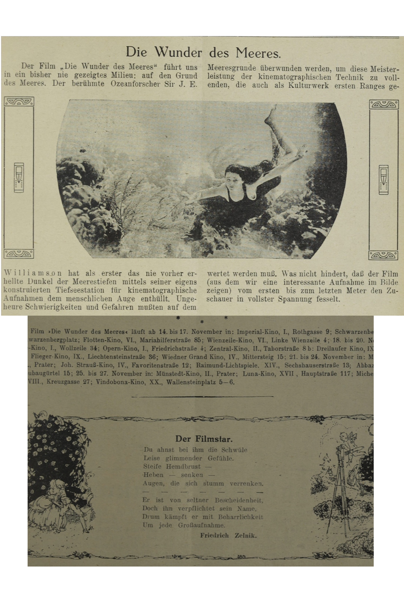

## TEI Body

### Lernziele

- Unterscheidung der TEI-Dokumentteile header und text
- Auszeichnung strukturelle Element des Fließtextes
- Nutzung von Attributen und Werten zur genaueren Auszeichnung im Fließtext

### Grundlegende Strukturierung von Fließtext in TEI: der Body

Ein TEI Dokument, in dem Sie ein Textdokument - sei es aus einer physischen Vorlage oder born digital - auszeichnen, besteht aus verschiedenen Abschnitten. Nach dem `<header>`, in dem die Metadaten ausgezeichnet werden, folgt die Auszeichnung Ihres Textes im Abschnitt `<text>`. 
Innerhalb des `<text>` kann weiter unterteilt werden. Häufig gibt zu Beginn den sogenannten Vorspann oder "front matter" `<front>`, das eine oder mehrere Titelseiten oder z.B. ein automatisch generiertes Inhaltsverzeichnis enthalten kann;
 dann folgt der Haupt- oder `<body>`-Text, zumeist der Fließtext; 
und schließlich folgt nach dem `<body>` der Nachspann, das sogenannte "back matter" `<back>`. Hier könnte sich z.B. das Register eines gedruckten Werkes befinden.
Zu beachten ist, dass es häufig mehrere Möglichkeiten gibt, einzelne Aspekte zu kodieren. Wie ein Dokument im Verhältnis zur Vorlage strukturiert werden soll, gibt nicht die TEI vor, sondern ist Ihre Entscheidung.
Im Folgenden geht es vor allem um die *strukturelle Auszeichnung des Fließtextes*. Im  `<body>`-Element zu einem Roman werden Sie z.B. die Kapitel als aufeinander folgende Abschnitte auszeichnen. Erst durch Ihre Auszeichnung kann der Computer die Abschnitte, und genauso Überschriften, Strophen, Absätze, usw., als solche erkennen. Später können annotierte Elemente gefunden werden und aus Ihrer Struktur ergibt sich eine Hierarchie der Textteile, die für die Maschine lesbar ist. 

Der gesamte Fließtext ist vom Element `<body>` umschlossen, das die höchste Ebene Ihrer Hierarchie bildet. Um die Struktur des Fließtexts zu erfassen, werden innerhalb des `<body>` zunächst die einzelnen Abschnitte als `<div>`-Elemente ausgezeichnet. Diese `<div>`-Elemente, für *division*, sind sehr allgemeine Auszeichnungen für irgendeine Art von Abschnitt, der (noch) nicht näher bestimmt ist. Sie können beliebig ineinander verschachtelt werden. In den Beispielen werden Sie sehen, dass die neutralen `<div>`-Elemente näher bestimmt werden und innerhalb dieser Elemente bestimmte Fließtextteile mit Überschriften `<head>` und Absätzen `<p>` bzw. Strophen `<lg>` und Verse mit `<l>` ausgezeichnet werden.

Im Folgenden werden Sie erste Schritte kennenlernen, was und wie Sie einen Fließtext auszeichnen können.

*Die wichtigsten Auszeichnungen sind:*

- **Abschnitte**, größere Textteile`<div>`
- **Überschriften**, `<head>`
- **Verfasserzeilen**, `<byline>`
- **Absätze**, `<p>`
- **Verse und Verszeilen**, `<lg>`, `<l>`
- **Allgemeiner Block**, `<ab>`
- **Zitate**, `<cit>`
- **Listen und Listeneinträge**, `<list>` mit `<item>`
- **Tabellen und Tabelleneinträge**, `<table>` mit `<row>`(Zeile), `<cell>`(Zelle)
- **Abbildungen und Abbildungsbeschreibungen**, `<figure>` mit `<figDesc>` oder `<graphic>`
- **Titelseiten mit Titel**, `<title>` mit `<docTitle>` und `<titlePart>`
- **Autorenangaben**, `<docAuthor>`
- **Impressum**, `<imprint>`
- **Publikationsdatum**, `<docDate>`
- **Imprimatur**, `<imprimatur>`
- **Eröffnungs- und Schlussformeln**, `<opener>` und `<closer>`
- **Anreden**, `<salute>`
- **Postscriptum**, `<postscript>`
- **Unterschrift**, `<signed>`

Beachten Sie, dass ein Dokument erst well-formed ist, wenn Sie fertig sind, d.h. wenn es keinen Text mehr gibt, der nicht von Elementen (an der jeweils erlaubten Position) umgeben ist. Beachten Sie dabei, dass der Text in einem nicht näher definierten `<div>`-Element von einem `<head>` -, `<p>`- bzw. `<lg>`-Element, oder einem ähnlichen Element umgeben sein muss.

Die Element können durch Attribute und Werte noch genauer definiert werden. Sie werden hierzu am Ende der praktischen Anwendung mehr erfahren.

### Praktische Anwendung

Wir bearbeiten im Folgenden die Filmbeschreibung, einen Spielplan, und ein Gedicht mit dem Titel "Der Filmstar" näher. Beim ersten Beispiel handelt es sich um einen (gekürzten) Abschnitt aus einer Filmbeschreibung.  Um den Text und viele ähnliche Texte automatisiert bearbeiten zu können, müssen sie entsprechend ausgezeichnet werden. 

Um die Annotation des `<body>`besser zu veranschaulichen, wird für jeden Abschnitt ein Annotationsvorschlag mit dem entsprechenden Beispieltext sowie eine Blanko-Vorlage angegeben. Bitte beachten Sie, dass der `<header>` nicht vollständig ausgezeichnet wurde, da wir uns vor allem mit dem `<body>` beschäftigen.

##### Beispiel: Blankostruktur der Filmbeschreibung

```xml
<?xml version="1.0" encoding="UTF-8"?>
<?xml-model href="http://www.tei-c.org/release/xml/tei/custom/schema/relaxng/tei_all.rng" type="application/xml" schematypens="http://relaxng.org/ns/structure/1.0"?>
<?xml-model href="http://www.tei-c.org/release/xml/tei/custom/schema/relaxng/tei_all.rng" type="application/xml"
	schematypens="http://purl.oclc.org/dsdl/schematron"?>
<TEI xmlns="http://www.tei-c.org/ns/1.0">
  <teiHeader>
    <fileDesc>
      <titleStmt>
        <title>Title</title>
      </titleStmt>
      <publicationStmt>
        <p>Publication Information</p>
      </publicationStmt>
      <sourceDesc>
        <p>Information about the source</p>
      </sourceDesc>
    </fileDesc>
  </teiHeader>
  <text>
    <body>
      <div>
        <head>Titel.</head>
        <p>Erster Absatz.</p>
        <p>Zweiter Absatz.</p>
        <p>Dritter Absatz.</p>
      </div>
    </body>
  </text>
</TEI>
```



##### Beispiel: annotierte Filmbeschreibung

```xml
<?xml version="1.0" encoding="UTF-8"?>
<?xml-model href="http://www.tei-c.org/release/xml/tei/custom/schema/relaxng/tei_all.rng" type="application/xml" schematypens="http://relaxng.org/ns/structure/1.0"?>
<?xml-model href="http://www.tei-c.org/release/xml/tei/custom/schema/relaxng/tei_all.rng" type="application/xml"
	schematypens="http://purl.oclc.org/dsdl/schematron"?>
<TEI xmlns="http://www.tei-c.org/ns/1.0">
  <teiHeader>
    <fileDesc>
      <titleStmt>
        <title>Die Filmwelt - ein Ausschnitt</title>
      </titleStmt>
      <publicationStmt>
        <p>Publication Information</p>
      </publicationStmt>
      <sourceDesc>
        <p>Information zur Veröffentlichung</p>
      </sourceDesc>
    </fileDesc>
  </teiHeader>
  <text>
    <body>
      <div>
        <head>Die Wunder des Meeres.</head>
        <p>Der Film „Die Wunder des Meeres“ führt uns
          in ein bisher nie gezeigtes Milieu: auf den Grund
          des Meeres. Der berühmte Ozeanforscher Sir J. E.
          Williamson hat als erster das nie vorher er-
          hellte Dunkel der Meerestiefen mittels seiner eigens
          konstruierten Tiefseestation für kinematographische
          Aufnahmen dem menschlichen Auge enthüllt. Unge-
          heure Schwierigkeiten und Gefahren mußten auf dem
          Meeresgrunde überwunden werden, um diese Meister-
          leistung der kinematographischen Technik zu voll-
          enden, die auch als Kulturwerk ersten Ranges ge-
          wertet werden muß. Was nicht hindert, daß der Film
          (aus dem wir eine interessante Aufnahme im Bilde
          zeigen) vom ersten bis zum letzten Meter den Zu-
          schauer in vollster Spannung fesselt.</p>
      </div>
    </body>
  </text>
</TEI>
```

Im Beispiel sehen Sie, wie der Fließtext in Überschrift `<head>` und Absatz `<p>` geteilt wurde. Beide Element befinden sich innerhalb eines `<div>`-Elements, sodass die beiden Elemente gemeinsam einen Abschnitt im Fließtext bilden. Bitte beachten Sie, dass dieser Abschnitt well-formed ist, da alle Textteile umgeben sind und die Tags geschlossen wurden.

##### Beispiel: Blankostruktur des Spielplans

```xml
<?xml version="1.0" encoding="UTF-8"?>
<?xml-model href="http://www.tei-c.org/release/xml/tei/custom/schema/relaxng/tei_all.rng" type="application/xml" schematypens="http://relaxng.org/ns/structure/1.0"?>
<?xml-model href="http://www.tei-c.org/release/xml/tei/custom/schema/relaxng/tei_all.rng" type="application/xml"
	schematypens="http://purl.oclc.org/dsdl/schematron"?>
<TEI xmlns="http://www.tei-c.org/ns/1.0">
  <teiHeader>
    <fileDesc>
      <titleStmt>
        <title>Title</title>
      </titleStmt>
      <publicationStmt>
        <p>Publication Information</p>
      </publicationStmt>
      <sourceDesc>
        <p>Information about the source</p>
      </sourceDesc>
    </fileDesc>
  </teiHeader>
  <text>
    <body>
      <div>
        <list>
          <item>Erstes Listenelement</item>
          <item>Zweites Listenelement</item>
          <item>...</item>
        </list>
      </div>
    </body>
  </text>
</TEI>
```

##### Beispiel: annotierter Spielplan

```xml
<?xml version="1.0" encoding="UTF-8"?>
<?xml-model href="http://www.tei-c.org/release/xml/tei/custom/schema/relaxng/tei_all.rng" type="application/xml" schematypens="http://relaxng.org/ns/structure/1.0"?>
<?xml-model href="http://www.tei-c.org/release/xml/tei/custom/schema/relaxng/tei_all.rng" type="application/xml"
	schematypens="http://purl.oclc.org/dsdl/schematron"?>
<TEI xmlns="http://www.tei-c.org/ns/1.0">
  <teiHeader>
    <fileDesc>
      <titleStmt>
        <title>Title</title>
      </titleStmt>
      <publicationStmt>
        <p>Publication Information</p>
      </publicationStmt>
      <sourceDesc>
        <p>Information about the source</p>
      </sourceDesc>
    </fileDesc>
  </teiHeader>
  <text>
    <body>
      <div>
        <list>
          <item>Imperial-Kino, I., Rothgasse 9;</item>
          <item>Schwarzenberg-Kino, III., Schwarzenbergplatz;</item>
          <item>...</item>
        </list>
      </div>
    </body>
  </text>
</TEI>
```

Wie im vorangegangenen Beispiel sehen Sie, dass das Listenelement in ein `<div>`-Element eingebettet ist. Beachten Sie, dass alle `<item>` wiederum vom Element `<list>` umgeben sind, und so klar ersichtlich ist, dass alle Listenelemente teil der Liste sind. Achtung, die Listenelemente sind nicht ineinander eingebettet, sondern stehen auf der selben Hierarchiestufe, sie sind Geschwisterelemente.

<SideNote type="info" title="Einrückungen">
Annotierte Elemente lassen sich mithilfe von Einrückungen hierarchisch darstellen. So sehen Sie, welche Kindelemente in ein Elternelement eingebettet sind. Diese Darstellung verändert die Textanordnung nicht.
</SideNote>

#### Attribute und Werte

Zusätzlich zur Identifizierung einzelner Abschnitte im Fließtext (Überschrift, Absatz, Strophe, Liste,...), zeichnet man im Body auch mit Attributen und Werten aus, um konkreter zu bezeichnen, worum es sich bei dem Element handelt (z.B. Gedicht, Spielplan, Artikel,...). Hier sehen Sie Auszeichnungen, die Ihnen in unserem Beispiel begegnen.

- `<div>` + type "article" / "movieSchedule" / "poem" / "editorialStatement" / "reviews" / "review"
- `<div>` type "review" + n="1" / "2"
- `<head>` + type columnTitle

```xml
<?xml-model href="http://www.tei-c.org/release/xml/tei/custom/schema/relaxng/tei_all.rng" type="application/xml"
	schematypens="http://purl.oclc.org/dsdl/schematron"?>
<TEI xmlns="http://www.tei-c.org/ns/1.0">
  <teiHeader>
    <fileDesc>
      <titleStmt>
        <title>Die Filmwelt - ein Ausschnitt</title>
      </titleStmt>
      <publicationStmt>
        <p>Publication Information</p>
      </publicationStmt>
      <sourceDesc>
        <p>Information zur Veröffentlichung</p>
      </sourceDesc>
    </fileDesc>
  </teiHeader>
  <text>
    <body>
      <div type="article">
        <head>Die Wunder des Meeres.</head>
        <p>Der Film „Die Wunder des Meeres“ führt uns
          in ein bisher nie gezeigtes Milieu: auf den Grund
          des Meeres. Der berühmte Ozeanforscher Sir J. E.
          Williamson hat als erster das nie vorher er-
          hellte Dunkel der Meerestiefen mittels seiner eigens
          konstruierten Tiefseestation für kinematographische
          Aufnahmen dem menschlichen Auge enthüllt. Unge-
          heure Schwierigkeiten und Gefahren mußten auf dem
          Meeresgrunde überwunden werden, um diese Meister-
          leistung der kinematographischen Technik zu voll-
          enden, die auch als Kulturwerk ersten Ranges ge-
          wertet werden muß. Was nicht hindert, daß der Film
          (aus dem wir eine interessante Aufnahme im Bilde
          zeigen) vom ersten bis zum letzten Meter den Zu-
          schauer in vollster Spannung fesselt.</p>
      </div>
    </body>
  </text>
</TEI>
```

Wie Sie im Beispiel sehen, wird der Fließtext nicht nur als Abschnitt `<div>`, sondern noch genauer als `type="article"` ausgezeichnet. Die Verwendung von Attributen und Werten ermöglicht die Erfassung von textrelevanten Details, die Ihnen bei der weiteren Textarbeit helfen werden.

Die vollständige Annotation dieses Schrittes finden Sie in Datei `3_Struktur_II_FW_11_12.xml`

#### Übung 1a: Fließtextabschnitte auszeichnen


##### Aufgabenstellung

<Quiz>
  <Quiz.Card validateButtonLabel="Überprüfen">
    <Quiz.XmlCodeEditor
      code={"<?xml version=\"1.0\" encoding=\"UTF-8\"?>\n<?xml-model href=\"http://www.tei-c.org/release/xml/tei/custom/schema/relaxng/tei_all.rng\" type=\"application/xml\" schematypens=\"http://relaxng.org/ns/structure/1.0\"?>\n<?xml-model href=\"http://www.tei-c.org/release/xml/tei/custom/schema/relaxng/tei_all.rng\" type=\"application/xml\"\n\tschematypens=\"http://purl.oclc.org/dsdl/schematron\"?>\n<TEI xmlns=\"http://www.tei-c.org/ns/1.0\">\n  <teiHeader>\n    <fileDesc>\n      <titleStmt>\n        <title>Title</title>\n      </titleStmt>\n      <publicationStmt>\n        <p>Publication Information</p>\n      </publicationStmt>\n      <sourceDesc>\n        <p>Information about the source</p>\n      </sourceDesc>\n    </fileDesc>\n  </teiHeader>\n  <text>\n    <body>\n      <div>\n        <p>Der Film »Die Wunder des Meeres« läuft ab 14. bis 17. November in: \n        Imperial-Kino, I., Rothgasse 9; Schwarzenberg-Kino,\nIII., Schwarzenbergplatz; Flotten-Kino, VI., Mariahilferstraße 85; Wienzeile-Kino, VI., Linke Wienzeile 4; 18. bis 20. November\nin: Elite-Kino, I., Wollzeile 34: Opern-Kino, I., Friedrichstraße 4; Zentral-Kino, II., Taborstraße 8b: Dreilaufer Kino, IX., Alser-\nstraße; Flieger-Kino, IX., Liechtensteinstraße 36; Wiedner Grand Kino, IV., Mittersteig 15; 21. bis 24. November in: Münstedt-\nKino, II., Prater; Joh. Strauß-Kino, IV., Favoritenstraße 12; Raimund-Lichtspiele. XIV., Sechshauserstraße 13; Abbazia-Kino,\nXV., Neubaugürtel 15; 25. bis 27. November in: Münstedt-Kino, II., Prater; Luna-Kino, XVII , Hauptstraße 117; Michelbeuern-\nKino, XVIII., Kreuzgasse 27; Vindobona-Kino, XX., Wallensteinplatz 5—6.\n        </p>\n      </div>\n    </body>\n  </text>\n</TEI>"}
      solution={"<?xml version=\"1.0\" encoding=\"UTF-8\"?>\n<?xml-model href=\"http://www.tei-c.org/release/xml/tei/custom/schema/relaxng/tei_all.rng\" type=\"application/xml\" schematypens=\"http://relaxng.org/ns/structure/1.0\"?>\n<?xml-model href=\"http://www.tei-c.org/release/xml/tei/custom/schema/relaxng/tei_all.rng\" type=\"application/xml\"\n\tschematypens=\"http://purl.oclc.org/dsdl/schematron\"?>\n<TEI xmlns=\"http://www.tei-c.org/ns/1.0\">\n  <teiHeader>\n    <fileDesc>\n      <titleStmt>\n        <title>Title</title>\n      </titleStmt>\n      <publicationStmt>\n        <p>Publication Information</p>\n      </publicationStmt>\n      <sourceDesc>\n        <p>Information about the source</p>\n      </sourceDesc>\n    </fileDesc>\n  </teiHeader>\n  <text>\n    <body>\n      <div>\n        <p>Der Film »Die Wunder des Meeres« läuft ab 14. bis 17. November in: \n          <list>\n            <item>Imperial-Kino, I., Rothgasse 9;</item>\n            <item>Schwarzenberg-Kino, III., Schwarzenbergplatz;</item> \n            <item>Flotten-Kino, VI., Mariahilferstraße 85;</item>\n            <item>Wienzeile-Kino, VI., Linke Wienzeile 4;</item> \n          </list>18. bis 20. November in:\n          <list>\n            <item>Elite-Kino, I., Wollzeile 34:</item>\n            <item>Opern-Kino, I., Friedrichstraße 4;</item> \n            <item>Zentral-Kino,III., Taborstraße 8b:</item>\n            <item>Dreilaufer Kino, IX., Alser-straße</item>\n            <item>Flieger-Kino, IX., Liechtensteinstraße 36;</item>\n            <item>Wiedner Grand Kino, IV., Mittersteig 15;</item>\n           </list>21. bis 24. November in:\n           <list>\n            <item>Münstedt-Kino, II., Prater;</item>\n            <item>Joh. Strauß-Kino, IV., Favoritenstraße 12;</item>\n            <item>Raimund-Lichtspiele. XIV., Sechshauserstraße 13;</item>\n            <item>Abbazia-Kino, XV., Neubaugürtel 15;</item>\n           </list>25. bis 27. November in:\n           <list>\n            <item>Münstedt-Kino, II., Prater;</item>\n            <item>Luna-Kino, XVII , Hauptstraße 117;</item>\n            <item>Michelbeuern-Kino, XVIII., Kreuzgasse 27;</item>\n            <item>Vindobona-Kino, XX., Wallensteinplatz 5—6.</item>\n           </list>\n        </p>\n      </div>\n    </body>\n  </text>\n</TEI>"}
      validate="input"
    >

      <Quiz.Question>
        In einer späteren Analyse soll ein Verzeichnis aller Kinos erstellt werden, die zwischen 1921 und 1935 geöffnet waren. Dazu müssen die Listen der Spielorte als solche ausgezeichnet werden. Im Bild sehen Sie den Originalausschnitt und im Code-Editor ist der Text bereits für Sie als Fließtext vorgegeben. Zeichnen Sie bitte alle Einträge, die zusammengehören, als eine gemeinsame Liste `<list>` aus. Achten Sie auf die Datumsangaben, nach diesen beginnt jeweils eine neue Liste. Anschließend zeichnen Sie bitte die jeweiligen Einträge als `<item>` richtig aus und schließen Sie dann die Liste. Die TEI-Umgebung dieses Abschnittes ist bereits für Sie vorgegeben.
      </Quiz.Question>

      <Quiz.Message type="correct">
        Sehr gut!
      </Quiz.Message>

      <Quiz.Message type="incorrect">
        Haben Sie alle Tags, die Sie geöffnet haben, wieder geschlossen?

        Hinweis: Die Datumsangaben können Sie vorerst ignorieren und nach den `</list>`Tag stellen. Öffnen Sie dann eine neue Liste.
        Insgesamt sollten in diesem Abschnitt `<div>`vier Listen ausgezeichnet sein.
      </Quiz.Message>
    </Quiz.XmlCodeEditor>
  </Quiz.Card>
</Quiz>


##### Quiz

<Quiz>
  <Quiz.Card validateButtonLabel="Überprüfen">
    <Quiz.MultipleChoice>
      <Quiz.Question>
        Welche drei Aussagen sind richtig?
      </Quiz.Question>

      <Quiz.MultipleChoice.Option isCorrect>
        a) alle Einträge `<item>` sind Geschwisterelemente und deshalb auf derselben Hierarchieebene
      </Quiz.MultipleChoice.Option>

      <Quiz.MultipleChoice.Option>
        b) die Einträge `<item>` sind nicht gleichwertig, sondern untereinander abgestuft und bilden eine Hierarchie
      </Quiz.MultipleChoice.Option>

      <Quiz.MultipleChoice.Option>
        c) die Aufzählung `<list>` und die Einträge `<item>` müssen sich auf derselben Hierarchieebene befinden, da sie Geschwisterelemente sind.
      </Quiz.MultipleChoice.Option>

      <Quiz.MultipleChoice.Option isCorrect>
        d) die Aufzählung `<list>` und die Einträge `<item>` sind nicht gleichwertig. Die Einträge `<item>` sind Kindelemente der Aufzählung `<list>`. Das Elternelement `<list>` muss also alle `<item>` umgeben.
      </Quiz.MultipleChoice.Option>

      <Quiz.MultipleChoice.Option isCorrect>
        e) `<list>`und `<item>` sind wohlgeformt, wenn sie in sich geschlossen sind und die Hierarchie eingehalten wird.
      </Quiz.MultipleChoice.Option>

      <Quiz.Message type="correct">
        Sehr gut!
      </Quiz.Message>
    </Quiz.MultipleChoice>
  </Quiz.Card>
</Quiz>


#### Übung 1b: Fließtextabschnitte auszeichnen


##### Aufgabenstellung

<Quiz>
  <Quiz.Card validateButtonLabel="Überprüfen">
    <Quiz.XmlCodeEditor
      code={"<?xml-model href=\"http://www.tei-c.org/release/xml/tei/custom/schema/relaxng/tei_all.rng\" type=\"application/xml\"\n\tschematypens=\"http://purl.oclc.org/dsdl/schematron\"?>\n<TEI xmlns=\"http://www.tei-c.org/ns/1.0\">\n  <teiHeader>\n    <fileDesc>\n      <titleStmt>\n        <title>Die Filmwelt - ein Ausschnitt</title>\n      </titleStmt>\n      <publicationStmt>\n        <p>Publication Information</p>\n      </publicationStmt>\n      <sourceDesc>\n        <p>Information zur Veröffentlichung</p>\n      </sourceDesc>\n    </fileDesc>\n  </teiHeader>\n  <text>\n    <body>    \n      <div>\n        \n           Der Filmstar.\n           Du ahnst bei ihm die Schwüle\n           Leise glimmender Gefühle.\n           Steife Hemdbrust —\n           Heben — senken —\n           Augen, die sich stumm verrenken.\n           — — — — — —\n           Er ist von seltner Bescheidenheit.\n           Doch ihn verpflichtet sein Name,\n           Drum kämpft er mit Beharrlichkeit\n           Um jede Großaufnahme.\n           Friedrich Zelnik.\n      </div>\n    </body>\n  </text>\n</TEI>"}
      solution={"<?xml-model href=\"http://www.tei-c.org/release/xml/tei/custom/schema/relaxng/tei_all.rng\" type=\"application/xml\"\n\tschematypens=\"http://purl.oclc.org/dsdl/schematron\"?>\n<TEI xmlns=\"http://www.tei-c.org/ns/1.0\">\n  <teiHeader>\n    <fileDesc>\n      <titleStmt>\n        <title>Die Filmwelt - ein Ausschnitt</title>\n      </titleStmt>\n      <publicationStmt>\n        <p>Publication Information</p>\n      </publicationStmt>\n      <sourceDesc>\n        <p>Information zur Veröffentlichung</p>\n      </sourceDesc>\n    </fileDesc>\n  </teiHeader>\n  <text>\n    <body>    \n      <div>\n        <lg>\n           <head>Der Filmstar.</head> \n             <l>Du ahnst bei ihm die Schwüle</l> \n             <l>Leise glimmender Gefühle.</l> \n             <l>Steife Hemdbrust —</l> \n             <l>Heben — senken —</l> \n             <l>Augen, die sich stumm verrenken.</l> \n             <l>— — — — — —</l> \n             <l>Er ist von seltner Bescheidenheit.</l> \n             <l>Doch ihn verpflichtet sein Name,</l> \n             <l>Drum kämpft er mit Beharrlichkeit</l> \n             <l>Um jede Großaufnahme.</l> \n             <byline>Friedrich Zelnik.</byline> \n        </lg>\n      </div>\n    </body>\n  </text>\n</TEI>"}
      validate="input"
    >
      <Quiz.Question>
        Die Forschungsgruppe interessiert sich dafür, welche Textarten in der Zeitschrift gefunden werden können. Zu einem späteren Zeitpunkt möchte man diese genauer beforschen; unter anderem soll ein Autorenverzeichnis angelegt werden. Zeichnen Sie den Abschnitt `<div>`, in dem Sie Friedrich Zelniks Gedicht finden, bitte durch das Attribut `type="poem"` aus. Benutzen Sie die Auszeichnungen Strophe `<lg>` (Linegroup), Überschrift `<head>`, Zeile `<l>` und Verfasserzeile `<byline>`, um dieses Gedicht auszuzeichnen. Achtung, auch die Überschrift ist ein Kindelement der `<lg>` (Linegroup). Achten Sie auf die verschiedenen Hierarchieebenen - überlegen Sie, welche Elemente Geschwisterelemente sind. Vergessen Sie nicht, die Auszeichnungen zu schließen. Der Fließtext und die TEI-Umgebung dieses Abschnittes sind bereits für Sie vorgegeben.
      </Quiz.Question>
    </Quiz.XmlCodeEditor>
  </Quiz.Card>
</Quiz>

##### Quiz

<Quiz>
  <Quiz.Card validateButtonLabel="Überprüfen">
    <Quiz.MultipleChoice>
      <Quiz.Question>
        Welche Funktion hat `<div type="poem">`? Wählen Sie alle richtigen Antworten aus.
      </Quiz.Question>

      <Quiz.MultipleChoice.Option isCorrect>
        a) `<div type="poem">` nutzt ein Attribut und einen Wert, um explizit Gedichte auszuzeichnen.
      </Quiz.MultipleChoice.Option>

      <Quiz.MultipleChoice.Option>
        b) `<div type="poem">` kann für jede Art von Abschnitt benutzt werden.
      </Quiz.MultipleChoice.Option>

      <Quiz.MultipleChoice.Option isCorrect>
        c) `<div type="poem">` gibt Auskunft darüber, welche Textsorte man in diesem Teil des Fließtextes findet
      </Quiz.MultipleChoice.Option>

      <Quiz.MultipleChoice.Option>
        d) `<div type="poem">` bezeichnet den Autor eines Gedichts.
      </Quiz.MultipleChoice.Option>
    </Quiz.MultipleChoice>
  </Quiz.Card>
</Quiz>


#### Übung 2a: Attribute festlegen


##### Quiz

<Quiz>
  <Quiz.Card>
    <Quiz.MultipleChoice>
      <Quiz.Question>
        Für die Forschungsgruppe, ist des wichtig, dass die Texte in der Zeitschrift mit den richtigen Attributen und Werte versehen werden. Sehen Sie sich bitte Seite 11 an und wählen Sie alle richtigen Auszeichnungen aus, die auf dieser Seite vergeben werden können.
      </Quiz.Question>

      <Quiz.MultipleChoice.Option isCorrect>
        a) `<div type="article">` kann für den Text _Die Wunder des Meeres_ vergeben werden.
      </Quiz.MultipleChoice.Option>

      <Quiz.MultipleChoice.Option>
        b) `<div type="article">` kann für den Text _Der Filmstar_ vergeben werden.
      </Quiz.MultipleChoice.Option>

      <Quiz.MultipleChoice.Option isCorrect>
        c) `<div type="movieSchedule">` kann für den Spielplan vergeben werden.
      </Quiz.MultipleChoice.Option>

      <Quiz.MultipleChoice.Option>
        d) `<div type="poem">` kann für den Text _Die Wunder des Meeres_ vergeben werden.
      </Quiz.MultipleChoice.Option>

      <Quiz.MultipleChoice.Option>
        e) für jeden Text auf Seite 11 kann zusätzlich die Auszeichnung `<div type="editorialStatement">`
      </Quiz.MultipleChoice.Option>
    </Quiz.MultipleChoice>
  </Quiz.Card>
</Quiz>


#### Übung 2b: Attribute festlegen


##### Aufgabenstellung

<Quiz>
  <Quiz.Card validateButtonLabel="Überprüfen">
    <Quiz.XmlCodeEditor
      code={"<?xml-model href=\"http://www.tei-c.org/release/xml/tei/custom/schema/relaxng/tei_all.rng\" type=\"application/xml\"\n\tschematypens=\"http://purl.oclc.org/dsdl/schematron\"?>\n<TEI xmlns=\"http://www.tei-c.org/ns/1.0\">\n  <teiHeader>\n    <fileDesc>\n      <titleStmt>\n        <title>Die Filmwelt - ein Ausschnitt</title>\n      </titleStmt>\n      <publicationStmt>\n        <p>Publication Information</p>\n      </publicationStmt>\n      <sourceDesc>\n        <p>Information zur Veröffentlichung</p>\n      </sourceDesc>\n    </fileDesc>\n  </teiHeader>\n  <text>\n    <body> \n      FILM-KRITIKEN\n        <div type=\"review\" n=\"1\">\n         <p>„Die Schlacht.“ Nach dem Roman von Claude Farrère wurde dieses Meisterwerk...</p>\n         <byline>Sch.</byline>\n        </div>\n        <div type=\"review\" n=\"2\">\n         <p>„Der Film im Film“ (Pressevorführung) gab uns einmal Gelegenheit,...</p>\n         <byline>J.</byline>\n        </div>\n                        „Z. R. III.“ Diese Pathé-Aktualität zeigt sehr interessante Bilder von der \n                        Abfahrt und Ankunft des Riesenzeppelins, dessen traumhaftes und glänzend \n                        gelungenes Wagnis, den Wasserozean im Luftozean zu überqueren, die gesamte \n                        kultivierte Welt durch drei Tage in höchste Spannung bannte. Die gezeigten \n                        Bilder sind zwar sehr bruchstückartig, doch vermitteln sie einen gewaltigen \n                        Eindruck der imposanten Riesen-„Zigarre“, die wie ein unbekanntes Geschöpf \n                        einer verflossenen Weltperiode unheimlich durch das All zu schweben scheint. \n                        Das Publikum war von den Bildern bezaubert: es war, ganz Auge, \n                        mäuschenstill. Die geschickten Zwischentitel verstanden es, Z. R. III. als \n                        das erscheinen zu lassen, was es ist: ein Meisterwerk deutschen Geistes und \n                        moderner Technik.\n                        S.\n                        „Die Sphinx im Weibe.“ Die alte, ewig neue Geschichte der Frau, die \n                        eigentlich nicht recht weiß, was und wen sie will und in einer plötzlichen \n                        Aufwallung ihre Neigung dem tief unter ihr stehenden Spaßmacher schenkt, \n                        wird, ziemlich unmotiviert, in ein mittelalterlich historisch sich \n                        gebärdendes Zeitalter mit abenteuerlich grotesken Trachten versetzt, die \n                        Lesebuchgeschichte Wittingtons und seiner Katze mit hinein verflochten. Der \n                        Film gibt der malerisch schönen Italia Almirante Gelegenheit, ihre imposante \n                        Erscheinung ins richtige Licht zu setzen.\n                        J.\n    </body>\n  </text>\n</TEI>"}
      solution={"<?xml-model href=\"http://www.tei-c.org/release/xml/tei/custom/schema/relaxng/tei_all.rng\" type=\"application/xml\"\n\tschematypens=\"http://purl.oclc.org/dsdl/schematron\"?>\n<TEI xmlns=\"http://www.tei-c.org/ns/1.0\">\n  <teiHeader>\n    <fileDesc>\n      <titleStmt>\n        <title>Die Filmwelt - ein Ausschnitt</title>\n      </titleStmt>\n      <publicationStmt>\n        <p>Publication Information</p>\n      </publicationStmt>\n      <sourceDesc>\n        <p>Information zur Veröffentlichung</p>\n      </sourceDesc>\n    </fileDesc>\n  </teiHeader>\n  <text>\n    <body> \n      <div type=\"reviews\">\n       <head type=\"columnTitle\">FILM-KRITIKEN</head> \n        <div type=\"review\" n=\"1\">\n         <p>„Die Schlacht.“ Nach dem Roman von Claude Farrère wurde dieses Meisterwerk...</p>\n         <byline>Sch.</byline>\n        </div>\n        <div type=\"review\" n=\"2\">\n         <p>„Der Film im Film“ (Pressevorführung) gab uns einmal Gelegenheit,...</p>\n         <byline>J.</byline>\n        </div>\n        <div type=\"review\" n=\"3\">\n         <p>„Z. R. III.“ Diese Pathé-Aktualität zeigt sehr interessante Bilder von der \n            Abfahrt und Ankunft des Riesenzeppelins, dessen traumhaftes und glänzend \n            gelungenes Wagnis, den Wasserozean im Luftozean zu überqueren, die gesamte \n            kultivierte Welt durch drei Tage in höchste Spannung bannte. Die gezeigten \n            Bilder sind zwar sehr bruchstückartig, doch vermitteln sie einen gewaltigen \n            Eindruck der imposanten Riesen-„Zigarre“, die wie ein unbekanntes Geschöpf \n            einer verflossenen Weltperiode unheimlich durch das All zu schweben scheint. \n            Das Publikum war von den Bildern bezaubert: es war, ganz Auge, \n            mäuschenstill. Die geschickten Zwischentitel verstanden es, Z. R. III. als \n            das erscheinen zu lassen, was es ist: ein Meisterwerk deutschen Geistes und \n           moderner Technik.</p>\n          <byline>S.</byline>\n        </div>\n        <div type=\"review\" n=\"4\">\n          <p>„Die Sphinx im Weibe.“ Die alte, ewig neue Geschichte der Frau, die \n             eigentlich nicht recht weiß, was und wen sie will und in einer plötzlichen \n             Aufwallung ihre Neigung dem tief unter ihr stehenden Spaßmacher schenkt, \n             wird, ziemlich unmotiviert, in ein mittelalterlich historisch sich \n             gebärdendes Zeitalter mit abenteuerlich grotesken Trachten versetzt, die \n             Lesebuchgeschichte Wittingtons und seiner Katze mit hinein verflochten. Der \n             Film gibt der malerisch schönen Italia Almirante Gelegenheit, ihre imposante \n             Erscheinung ins richtige Licht zu setzen.</p>\n           <byline>J.</byline>\n        </div>\n      </div>\n    </body>\n  </text>\n</TEI>"}
      validate="input"
    >
      <Quiz.Question>
        Eine Forschungsgruppe interessiert sich besonders für die Filmkritiken. Da häufig mehrere Filmkritiken gemeinsam abgedruckt wurde, möchte man mehr über die Struktur der Kritiken sowie Ähnlichkeiten und Unterschiede im Aufbau dieser Textteile herausfinden. Zeichnen Sie deshalb bitte die beiden im Bild hervorgehobenen Kritiken zu "Z.R.III" und "Die Sphinx im Weibe" als `<div type="review">`, um geben Sie an, um die wievielte Kritik es sich handelt. Zeichnen Sie bitte alle Kritiken, auch die bereits ausgezeichneten, im Elternelement `<div type="reviews">` aus und zeichnen Sie die Überschrift "FILM-KRITIKEN" als solche mit dem Zusatz "columnTitle" aus. Die Fließtexte und die TEI-Umgebung dieses Abschnittes sind bereits für Sie vorgegeben. Achten Sie bitte vor allem auf Geschwisterelemente!
      </Quiz.Question>

      <Quiz.Message type="correct">
        Sehr gut!
      </Quiz.Message>

      <Quiz.Message type="incorrect">
        Überlegen Sie, in welchem Verhältnis die Elemente zueinander stehen. Welche Kindelement besitzt jedes Elternelement? Welche Elemente sind zueinander Geschwisterelemente?
        Ist Ihnen aufgefallen, dass jede Kritik auch eine Autorenangabe hat?
        Sehen sie sich bereits ausgezeichnete Textteile an, um Hinweise zu finden.
      </Quiz.Message>
    </Quiz.XmlCodeEditor>
  </Quiz.Card>
</Quiz>

##### Quiz
<Quiz>
  <Quiz.Card validateButtonLabel="Überprüfen">
    <Quiz.MultipleChoice>
      <Quiz.Question>
        Welche Aussage stimmt?
      </Quiz.Question>

      <Quiz.MultipleChoice.Option>
        a) Alle `<div>`-Elemente sind auf derselben hierarchischen Ebene.
      </Quiz.MultipleChoice.Option>

      <Quiz.MultipleChoice.Option isCorrect>
        b) In der Überkategorie Rezensionen "reviews" findet man mehrere einzelne Rezensionen "review" eingebettet, die nummeriert werden.
      </Quiz.MultipleChoice.Option>

      <Quiz.MultipleChoice.Option isCorrect>
        c) Werte und Attribute kann man nicht nur für `<div>`-Elemente festlegen.
      </Quiz.MultipleChoice.Option>

      <Quiz.Message type="correct">
        Richtig!
      </Quiz.Message>
    </Quiz.MultipleChoice>
  </Quiz.Card>
</Quiz>


### Glossar

[^1]: Body enthält den gesamten, eigenständigen Text, außer Vorspann (front) und Nachspann (back)
[^2]: `<div>`-Element steht für division, und ist ein neutrales Element für Textabschnitte. Sie können beliebt detailliert Schachteln und auch Elemente wie zum Beispiel eine Überschrift `<head>` und ein Absatz `<p>` (als Geschwisterelemente) einem Elternelement `<div>` unterordnen.

Das Glossar wurde [Einführung in die TEI, Christiane Fritze, Winter School Digitale Editionen Halle (Saale), 2019](https://www.i-d-e.de/wp-content/uploads/2019/11/05_Einf%C3%BChrung-TEI.pdf) entnommen.

### Weiterführende Quellen:

[Defaut text structure, 4.1 Divisions of the body](https://tei-c.org/release/doc/tei-p5-doc/en/html/DS.html#DSDIV)

[Mehr Info zum Tag Division](https://tei-c.org/release/doc/tei-p5-doc/en/html/ref-div.html)

[TEI Übungseinheit Martina Scholger, ZIM, Graz 2016](https://www.i-d-e.de/wp-content/uploads/2016/09/Scholger_4_TEI%C3%9Cbung.pdf)