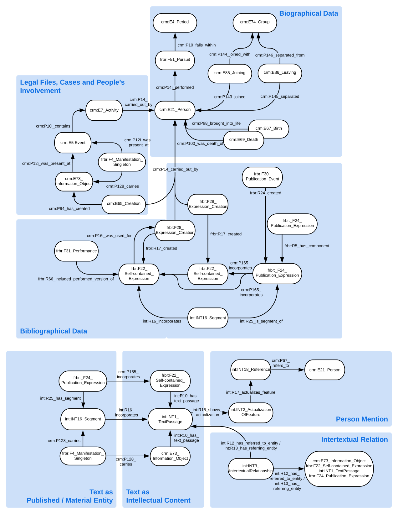

[Previous Post: Lesson 2: Meet the data. Examples of data perspectivity, with some thoughts on shopping for groceries.](https://howto.acdh.oeaw.ac.at/resource/posts/lesson-2-meet-the-data)

_– One week in –_

One of the core instruments of SemanticKraus is going to be a data model that covers all the biographical and bibliographical data contained in our source projects, as well as some other areas. SemanticKraus has a huge amount of data at its disposal, not only on texts and persons but also of mentions of persons in texts, of mentions of texts in texts, of persons and texts being linked to legal cases, etc. Accordingly, the main areas of the data model include:

- biographical data, including birth, death, occupation, party affiliation
- bibliographical data in the more common sense of published texts (literary, journalistic or other)
- bibliographical and event data specific to the Rechtsakten project: legal files and cases
- beneath the level of the whole texts: text passages and mentions resp. intertextual references on them
- data provenance

### Copy and Paste as a Virtue

Additionally, the goal of SemanticKraus is not to create a Semantic Web ontology based on its own custom data model, but on the contrary to draw from existing ontologies and, if possible, avoid creating a single custom class or property.

It is obvious that in a Semantic Web context, re-use is not just accepted, but it’s the goal of the whole endeavor. This is true not only for the data we prepare for re-use by others, but also for the vocabularies we use and create. Copying is, in this sense, a virtue, not a flaw. However, the question arises as to which vocabularies or ontologies are to be reused and how this is to be done. In a paper from 2020, Valentina Anita Carriero et al give an overview of ontology reuse practices in terms of ontology selection as well as the policies and methods of their reuse, and evaluate the state of the art. They count three common motivations guiding ontology selection: choosing ontologies that are standards published and maintained by authoritative organizations, choosing popular ontologies, and choosing after cognitive analysis. Clearly, there's nothing to be said against the third point. The importance of the first two motivations – deciding based on authority and popularity – seems worth noticing though, especially since in everyday life they don’t (or shouldn’t) play as big a role in decision-making as they do in ontology re-use. These two motivations for re-use save time, increase chances of data reuse and support interoperability.[^1]

[^1]: Carriero, V. A., et al. (2020), ‘The Landscape of Ontology Reuse Approaches’, in Cota, G., Daquino, M., and Pozzato, G. L., (eds.), _Applications and Practices in Ontology Design, Extraction, and Reasoning_. Amsterdam and Berlin: IOS Press and Akademische Verlagsgesellschaft AKA, pp. 21–38, s. pp. 25.

For SemanticKraus, all of these aspects factor in the decision not to design an ontology from scratch but to stick to terms provided in existing ontologies. 

### Short Parenthesis: Why a Project Ontology at all?

In case anyone is asking themselves: Why create a project ontology at all? It’s a valid question, since re-use is the issue here and relying solely on pre-existing terms is the ideal to strive for. After all, if all classes entities have been assigned to and all properties linking these entities have their definitions in some source ontology the classes’ and properties’ respective URIs resolve to – what’s wrong with an RDF data set by itself, without an accompanying ontology?

Well, there are a couple of good reasons: To maintain consistency throughout the course of the project, it is always a good idea to be able to refer to one document containing all the terms used. It is also much more practical than having to look up URIs and definitions in several different places. Finally, yet importantly, as soon as the ontology is part of the data, inferences can be drawn from it, explicating all the implicit knowledge that comes with the ontology. Even on a basic level, with an ontology that has a pretty light T-Box, there are still, e. g., class hierarchies to draw from, which amounts to something (and comes in handy later on with the ResearchSpace templating system ...). To bind all our terms from different sources together, our project ontology includes not only those terms that we use directly, but also all the ones higher up in the class hierarchy, until its various branches merge into one.

### More Criteria for Re-Use

I’m meeting [Matthias](https://www.oeaw.ac.at/acdh/team/current-team/matthias-schloegl), who in the project's initial phase is my go-to-source for questions in the area of data modeling. We talk through a course to a data model that fits our project’s needs. Among other things, Matthias is involved in [INTAVIA](https://intavia.eu), a project working on the integration of cultural heritage data across Europe. He shows me some serializations as modeling examples for SemanticKraus’s biographical data as well as the current INTAVIA project ontology. 

Regarding the question of ontologies re-use, Matthias quickly offers a couple of rule-of-thumb criteria:

- Do other projects in the field use them as well?
- Are they well documented, do they contain scope notes (e.g. in rdfs:comments)?
- Is there proper versioning?
- Do the URIs resolve?

The first criterion noticeably overlaps with one of Carriero’s three motivations listed above; the other three are more of a practical and technical nature and probably feed into the first rule: ontologies probably get re-used more often – criterion 1 – the more they adhere to criteria 2–4.

This first criterion might still be the most important one, when considering interoperability. There is a large number of ontologies available for every domain, some of which are quite complex – all the more users benefit from encountering standards they are already acquainted with.

### Re-Using Modeling Practices I

Instead of limiting re-use to the level of vocabularies, SemanticKraus exercises re-use also on the level of modeling practices, meaning: re-using not only vocabularies, but also how they are applied in other, similar contexts. INTAVIA is a good candidate for possible re-use of modeling practices, so we’re looking into how SemanticKraus can benefit from it, especially with regard to biographical data. 

For this area, INTAVIA utilizes a mix of CIDOC crm and BIO-CRM. The former is an ontology originally created for the field of cultural heritage to be used by different institutions – museums, archives – to model their object’s metadata. Since it is event based – events being the link between objects, persons, places, etc. – it also provides all of the most basic classes one needs to model biographical data, including birth and death. The latter one, BIO-CRM, is utilized in INTAVIA particularly for its notion of ‘roles’ people play in different contexts. For example: The person born in a birth event can be linked to this event simply via CIDOC's crm:P98_brought_into_life, but also by defining the role this person played in the event as the role of the person being born, via bioc:had_participant_in_role. The role then is an instantiation of the part the person played in the event, which then can be linked to the person itself through another property, bioc:inheres_in.

In other cases, a person’s occupation can also be modeled just like a role this person plays in relation to, e.g., an event or an employer; other roles people play as, e.g., participants of legal trials (which is especially relevant for Kraus related research data) can be modeled like this as well.

What SemanticKraus eventually took away from having a look at INTAVIA is details in modelling birth and death events as well as time-spans and places. SemanticKraus also utilizes CIDOC crm – as does INTAVIA – for a couple of reasons: CIDOC crm is not only one of the most commonly used ontologies in the field, its basic design principle – arranging entities around events – makes it very flexible. Down to the middle regions of its hierarchy, its classes stay quite abstract, which provides flexibility; if a class definition doesn’t quite fit, there’s always a superclass you can go to. Finally, there are other ontologies that are extensions of CIDOC crm that cover areas SemanticKraus deals with – and these ontologies already being extensions limits integration issues significantly. With regard to roles, the decision eventually was to use the more abstract classes of CIDOC crm instead of BIO-CRM, to limit the number of ontologies used and add to the model’s homogeneity.

### Re-Using Modeling Practices II

In another area of our data model, the bibliographical data, our inclination to re-using modeling practices took another form. In principle, for bibliographical data, the ontology of choice was one aligned with CIDOC crm: FRBRoo. Modeling bibliographical data with FRBRoo can be quite verbose, but comes with a high degree of precision (for example when differentiating between a text as written by an author vs. a text as published by a publisher, with different events – text creation and publication – attached). The main question was how to model bibliographical data of newspapers and other periodicals and of the texts within them. For this, we turned to PRESSoo – another extension of CIDOC crm with a focus on periodicals. While PRESSoo also offers a couple of custom classes, what came in handy for SemanticKraus’s purposes was the basic modeling of the relation between a periodical, its issues and the texts within these issues, all done with FRBRoo classes. The SemanticKraus ontology draws heavily from these modelings.

To cover the last area of the data model mentioned above, the area of text passages containing references to persons and other texts (or text passages), another ontology came in handy: INTRO. INTRO was created for the domain of intertextual relations, and to allow for this it does not only offer classes and properties for intertextual relations between text passages or texts, but it also offers necessary basic notions like text passages and features which occur on these passages (including references to persons).

### Creating a Project Ontology from the Data Model

When the question of which ontologies and classes to re-use is settled, it is time to create the project ontology. To conclude this blog entry, here are the necessary steps:

1. The decision on which ontologies to re-use needs to be specified: which version of the ontology? Ideally, the ontology already has an rdf or owl implementation (meaning: it’s not just a conceptual model, but also an .owl or .rdfs file); these implementations are not necessarily perfectly congruent with the conceptual model, so check for differences in relevant areas. When it comes to integrating ontologies, even if the ontologies are extensions of each other – which is the case with SemanticKraus and the CIDOC ontology family –, it is worth taking a look at which versions of each other they are harmonized with. If they don’t match, make sure the differences between versions don’t affect the classes and properties you intend to re-use. (For example: SemanticKraus utilizes a rdfs implementation of FRBRoo 2.4, which is harmonized with CIDOC crm 6.2.1, and an implementation of CIDOC crm 7.1.2.) Checking the change log helps.
2. There are different ways to go about creating the project ontology implementation. The ontology’s definitions can be nested into an rdf:RDF element in an xml file, the ontology header being an owl:ontology, followed by the definitions themselves. They can be copied and pasted from the different ontologies re-used. Some adjustments might be necessary. Of course, these adjustments contradict the primary motivation of re-using, so every one of these has to be a matter of conscience.\
   (For example: changing the values in rdf:about to resolving URIs seems a small intervention, less so adding an owl:inverseOf to properties where their inverse property is only implied.)
3. Since the rdf:about usually points to the original source of the property or class, the following might be a redundance, but still it could make sense to add a rdfs:isDefinedBy element to every definition, pointing at its respective source – possibly, but not necessarily the serialization. It could also be any other kind of representation, maybe even the pdf file containing the definitions.\
   (In the case of CIDOC crm, it is regularly pointed out that the pdf contains the ‘most official' version od the model.)
4. In order to take the imported classes’ and properties’ hierarchical relations to each other into account – which is information any reasoner can make good use of –, one could also include all the parent classes and properties up to a point where these branches merge.

- - -

### Prefixes:

crm: http://www.cidoc-crm.org/cidoc-crm/


frbr: https://cidoc-crm.org/frbroo/sites/default/files/FRBR2.4-draft.rdfs#


prov: http://www.w3.org/ns/prov# 

### Relevant links:

[CIDOC CRM: Versions of the CIDOC-CRM](https://cidoc-crm.org/versions-of-the-cidoc-crm)

[FRBRoo: Versions](https://cidoc-crm.org/frbroo/fm_releases)

[INTRO: Github Repository](https://github.com/BOberreither/INTRO)

[RDF 1.2 Concepts and Abstract Syntax](https://www.w3.org/TR/rdf12-concepts/)[RDF Primer](https://www.w3.org/TR/rdf-primer/)

[RDF Schema 1.1](https://www.w3.org/TR/rdf11-schema/)

[OWL Web Ontology Language Reference](https://www.w3.org/TR/owl-ref/)

<Download url="images/sk_model.owl" title="SemanticKraus Project Ontology (status 2023-03)" />

### Data Model Visualization:

- - -

(The project is funded by CLARIAH-AT with the support of BMBWF.)