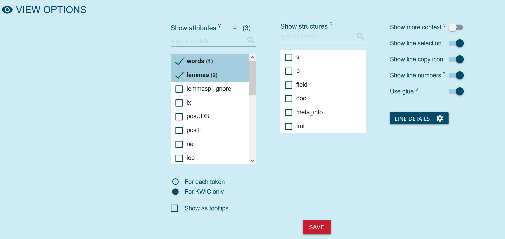
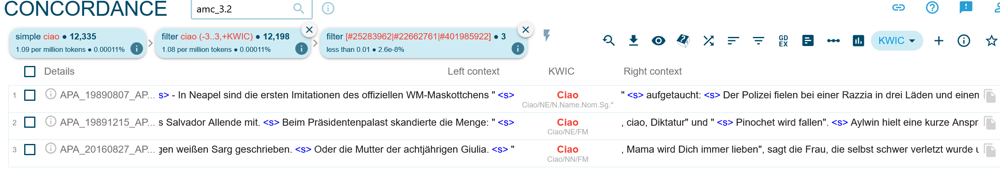

## Lernziele

- den Austrian Media Corpus (amc) als Corpus-Tool einordnen
- einfache Suchabfragen im amc durchführen
- CQL-Grundbegriffe für Suchabfragen in SKE nutzen
- Suchergebnisse aus dem amc vergleichen

## Einführung

### Das Austrian Media Corpus (amc)

Das Austrian Media Corpus (amc) ist eines der größten Textkorpora in deutscher Sprache. In ihm sind Text der österreichischen Printmedienlandschaftder letzten Jahrezehnte versammelt. Der Inhalt des amc kann mit dem Schlagwort „journalistische Prosa“ zusammengefasst werden: er umfasst Komplettausgaben von Zeitungen und Zeitschriften, Agenturmeldungen der Austria Presse Agentur (APA) sowie Transkripte von TV-Produktionen (vorwiegend von Nachrichtensendungen).

Das amc kann auf Anfrage genutzt werden, allerdings ausschließlich für Zwecke der wissenschaftlichen Forschung und Lehre und nur für die Untersuchung sprachwissenschaftlicher Fragestellungen.Ermöglicht wird das amc durch eine Kooperation zwischen der Austria Presse Agentur (APA) und der Österreichischen Akademie der Wissenschaften (ÖAW), konkret dem Austrian Centre for Digital Humanities and Cultural Heritage (ACDH-CH).
Die APA sammelt die Textproduktion der Printmedien und stellt diese dem ACDH-CH zur Verfügung.

Das amc wird jährlich am Jahresanfang um die Publikationen des soeben abgelaufenen Jahres aktualisiert, d.h. der aktuelle Datenbestand des amc reicht jeweils bis zum Ende des Vorjahrs.

### Mit dem amc arbeiten

Das ACDH-CH ergänzt die Texte, die von der APA zur Verfügung gestellt wurden, mithilfe linguistischer Annotationsverfahren wie Lemmatisierung, Wortartenzuordnung (Part-of-Speech tagging) oder Named Entitiy Recognition.
Anschließend werden die Ergebnisse vom ACDH-CH als amc in der Korpussuchmaschine NoSketch Engine online verfügbar gemacht. Dieses Werkzeug erlaubt die Suche und Auswertung der signifikanten Textmengen im amc und macht das Korpus in Kombination mit den verfügbaren Annotationen erst für die effiziente Bearbeitung quantitativer und qualitativer Forschungsfragen tauglich.

<SideNote type="info" title="Zugang zum amc">
Um das [amc nutzen](https://amc.acdh.oeaw.ac.at/access-conditions/) zu können, ist eine [Registrierung](https://amc.acdh.oeaw.ac.at/registrierung/) auf der Website notwendig. Sie erhalten wenig später Ihre Zugangsdaten und können auf die [Vollversion](https://noske-amc.acdh.oeaw.ac.at/crystal/) zugreifen.

Sollten Sie an einem geförderten Projekt arbeiten, wird von der APA eine Nutzungsgebühr erhoben. In diesem Fall nehmen Sie bitte mit dem amc Kontakt auf. Ansonsten ist der Zugang nach [Registrierung](https://amc.acdh.oeaw.ac.at/registrierung/) und Akzeptieren der [Nutzungsbedingungen](https://amc.acdh.oeaw.ac.at/nutzungsbedingungen/) kostenfrei. 

Zu Übungszwecken finden sie auf der amc-Website Zugang zu einer [Demo-Version](https://demo-amc.acdh.oeaw.ac.at/crystal/#open), für die Sie keinen Zugang benötigen.
</SideNote>

In der folgenden Lernressource machen Sie sich mit grundlegenden Begrifflichkeiten sowie der Arbeit mit der NoSketch Engine und der Corpus Query Language (CQL) vertraut.

## Grundlagen: Token vs. Strukturen

Wenn Sie mit einer Corpus-Suchmaschine arbeiten, gibt es einige Grundbegriffe, mit denen Sie sich vertraut machen sollten. Prinzipiell wird in der SKE und der CQL zwischen **Token** und **Strukturen** unterschieden.

### Token

Token sind das Ergebnis des sogenannten Tokenisierungsprozesses – d.h. der Zerlegung des Eingangstexts in linguistisch sinnvolle Einheiten. In der Regel entspricht ein Token einem orthographischen Wort. Die simpelste Tokenisierungsstrategie wäre: alles was zwischen zwei Leerzeichen steht, ist ein Token.

<SideNote type="info" title="Vereinfacht gefasst: Token sind die einzelnen Wörter, Satzzeichen oder Zahlen im Text">

</SideNote>

Diese vereinfachte Darstellung muss freilich um die Berücksichtigung von Satzzeichen ergänzt werden: Satzzeichen sollen vom vorangehenden Wort abgetrennt werden und bilden separate Token. Abkürzen verkomplizieren die Tokenisierung: zum Beispiel sind die Punkte in _z.B._ natürlich keine Satzzeichen, dürfen daher nicht abgetrennt werden, denn _z.B._ sollte als ein einziges Token behandelt werden.

<SideNote type="note" title="Fehleranfälligkeit: Sonderzeichen in Token">
Wie bei allen automatisierten Verarbeitungsschritten erfolgt die Tokenisierung bisweilen nicht fehlerfrei. So ist bei der Suche nach Token, die Satz- oder Sonderzeichen enthalten, zu berücksichtigen, dass evtl. die Tokenisierung diese Zeichen miss-interpretiert hat und daher das Wort fälschlicherweise in mehrere Token aufgeteilt wurde.
</SideNote>

### Token-Attribute

Die Informationen, die jedem Token zugeordnet werden, werden in der SKE **Attribute** genannt.

Einige der Token-Attribute im amc wären

- _word_ : Das einfachste Attribut beinhaltet die orthographische Form des Wortes.
- _lemma_ : hier steht die Grundform des Wortes (wie es von einem Lemmatisierungsprogramm ermitteln wurde).
- _lc_ : eine lower cased Version des Wortes. Die Suche in CQL ist case sensitiv, lc kann verwendet werden, um case insensitiv zu suchen. D.h. eine Suche \[word="Ciao"] findet nur genau „Ciao“. Die Suche \[lc="ciao"] findet ciao, Ciao, CIAO, CiAo etc.     
- _posTT_ : part-of-Speech tags nach dem STTS-Tagset, wie sie vom PoS tagger TreeTagger vergeben wurden.
- _pos_ : part-of-Speech tags, wie sie vom PoS tagger RFTagger vergeben wurden: zusätzlich zur Wortart werden auch morphologische Informationen angegeben.

  , das als PoS Nomen in den Token gefunden werden soll.')

  

  

<SideNote type="tip" title="Tipp: Attribute eines Korpus">
Die Liste aller Attribute eines Korpus lässt sich immer einfach unter dem Info-Zeichen im Overflow-Menü oder — völlig äquivalent — in der  _Corpus info_ im Dashboard des jeweiligen Corpus anzeigen.
</SideNote>

### Strukturen

Die Token sind in **hierarchische Strukturen** eingebettet.
Zum besseren Verständnis dieses Konzepts hier ein Beispiel, wie für den Import in die SKE vorbereitete Textdaten aufgebaut sind.

```
<doc id="APA_20170101_APA0001" datum_full="2017-01-01T00:11:16Z" 
     datum="2017-01-01" bibl="APA-Meldungen digital  vom 2017-01-01" 
     docsrc_name="APA-Meldungen digital" 
     region="agesamt" 
     mediatype="print" 
     Tokens="180" 
     ressort2="chronik ausland unzuordenbar" 
     autor="fre" 
  >
<p>
<s>
Maschine    N.Reg.Nom.Sg.Fem        NN     Maschine-n
mit         APPR.Dat                APPR   mit-i
mehr        PRO.Indef.Attr.-.*.*.*  ADV    mehr-r
als         CONJ.Comp.-             KOKOM  als-c
hundert     CARD                    CARD   hundert-m
Menschen    N.Reg.Dat.Pl.Masc       NN     Mensch-n
an          APPR.An                 APPR   an-i
Bord        N.Reg.Dat.Sg.Neut       NN     Bord-n
sollte      VFIN.Mod.3.Sg.Past.Subj VMFIN  sollen-v
nach        APPR.Dat                APPR   nach-i
Mexiko      N.Name.Dat.Sg.Neut      NE     Mexiko-n
fliegen     VINF.Full.-             VVFIN  fliegen-v
...
</s>
</p>
...
</doc>
```

Dieses Datenformat nennt sich (in der SKE-Terminologie) „Vertikale“: 

Strukturen sind mithilfe von Spitzklammern ausgezeichnet (wie aus XML bekannt), dazwischen finden sich in je einer separaten Zeile die schon bekannten Token mit ihren in Spalten organisierten Attributen wie z.B. Lemma- und Part-of-Speech-Informationen.
In diesem Beispiel ist zu erkennen, dass die Strukturen als XML-artige Annotationen die Token ergänzen.
Typische Strukturen sind Dokumente, Paragraphen (Absätze) und Sätze, die im amc als ´<doc>´ ´<p>´ und ´<s>´ ausgezeichnet werden.
Die Strukturen können Zusatzinformationen in Form von Attributen enthalten.