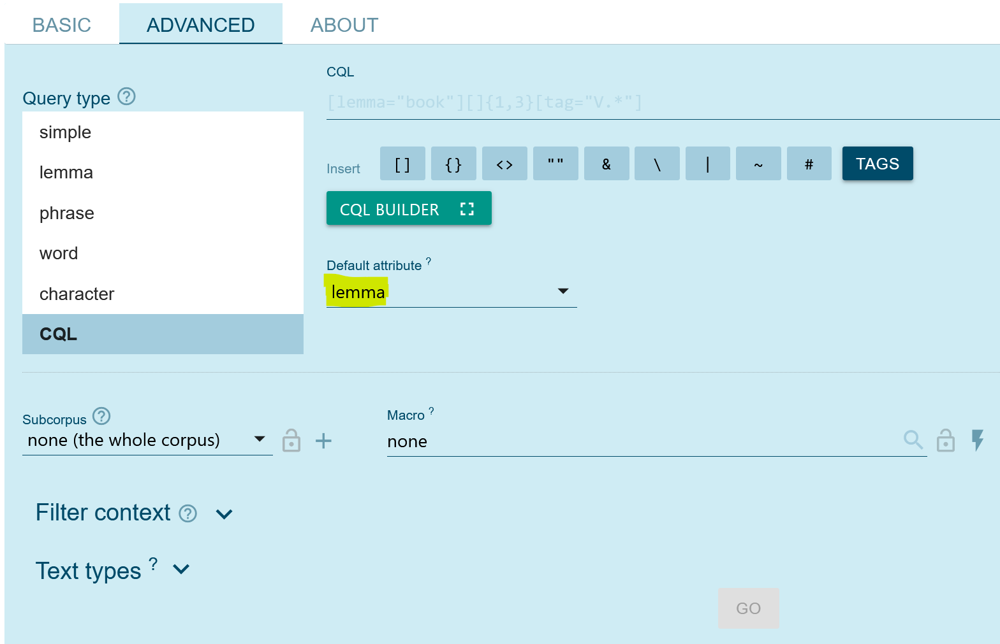

## Lernziele

- den Austrian Media Corpus (amc) als Corpus-Tool einordnen
- einfache Suchabfragen im amc durchführen
- CQL-Grundbegriffe für Suchabfragen in SKE nutzen
- Suchergebnisse aus dem amc vergleichen

## Einführung

### Das Austrian Media Corpus (amc)

Das Austrian Media Corpus (amc) ist eines der größten Textkorpora in deutscher Sprache. In ihm sind Text der österreichischen Printmedienlandschaft der letzten Jahrezehnte versammelt. Der Inhalt des amc kann mit dem Schlagwort „journalistische Prosa“ zusammengefasst werden: er umfasst Komplettausgaben von Zeitungen und Zeitschriften, Agenturmeldungen der Austria Presse Agentur (APA) sowie Transkripte von TV-Produktionen (vorwiegend von Nachrichtensendungen).

Das amc kann auf Anfrage genutzt werden, allerdings ausschließlich für Zwecke der wissenschaftlichen Forschung und Lehre und nur für die Untersuchung sprachwissenschaftlicher Fragestellungen. Ermöglicht wird das amc durch eine Kooperation zwischen der Austria Presse Agentur (APA) und der Österreichischen Akademie der Wissenschaften (ÖAW), konkret dem Austrian Centre for Digital Humanities and Cultural Heritage (ACDH-CH).
Die APA sammelt die Textproduktion der Printmedien und stellt diese dem ACDH-CH zur Verfügung.

Das amc wird jährlich am Jahresanfang um die Publikationen des soeben abgelaufenen Jahres aktualisiert, d.h. der aktuelle Datenbestand des amc reicht jeweils bis zum Ende des Vorjahrs.

### Mit dem amc arbeiten

Das ACDH-CH ergänzt die Texte, die von der APA zur Verfügung gestellt wurden, mithilfe linguistischer Annotationsverfahren wie Lemmatisierung, Wortartenzuordnung (Part-of-Speech tagging) oder Named Entitiy Recognition.
Anschließend werden die Ergebnisse vom ACDH-CH als amc in der Korpussuchmaschine NoSketch Engine online verfügbar gemacht. Dieses Werkzeug erlaubt die Suche und Auswertung der signifikanten Textmengen im amc und macht das Korpus in Kombination mit den verfügbaren Annotationen erst für die effiziente Bearbeitung quantitativer und qualitativer Forschungsfragen tauglich.

<SideNote type="info" title="Zugang zum amc">
Um das [amc nutzen](https://amc.acdh.oeaw.ac.at/access-conditions/) zu können, ist eine [Registrierung](https://amc.acdh.oeaw.ac.at/registrierung/) auf der Website notwendig. Sie erhalten wenig später Ihre Zugangsdaten und können auf die [Vollversion](https://noske-amc.acdh.oeaw.ac.at/crystal/) zugreifen.

Sollten Sie an einem geförderten Projekt arbeiten, wird von der APA eine Nutzungsgebühr erhoben. In diesem Fall nehmen Sie bitte mit dem amc Kontakt auf. Ansonsten ist der Zugang nach [Registrierung](https://amc.acdh.oeaw.ac.at/registrierung/) und Akzeptieren der [Nutzungsbedingungen](https://amc.acdh.oeaw.ac.at/nutzungsbedingungen/) kostenfrei. 

Zu Übungszwecken finden Sie auf der amc-Website Zugang zu einer [Demo-Version](https://demo-amc.acdh.oeaw.ac.at/crystal/#open), für die Sie keine Registrierung benötigen.
</SideNote>

In der folgenden Lernressource machen Sie sich mit grundlegenden Begrifflichkeiten sowie der Arbeit mit der **NoSketch Engine (SKE / NoSKE)** und der **Corpus Query Language (CQL)** vertraut.

## Grundlagen: Token vs. Strukturen

Wenn Sie mit einer Corpus-Suchmaschine arbeiten, gibt es einige Grundbegriffe, mit denen Sie sich vertraut machen sollten. Prinzipiell wird in der SKE und der CQL zwischen **Token** und **Strukturen** unterschieden.

### Token

Token sind das Ergebnis des sogenannten Tokenisierungsprozesses – d.h. der Zerlegung des Eingangstexts in linguistisch sinnvolle Einheiten. In der Regel entspricht ein Token einem orthographischen Wort. Die simpelste Tokenisierungsstrategie wäre: alles was zwischen zwei Leerzeichen steht, ist ein Token.

<SideNote type="info" title="Vereinfacht gefasst: Token sind die einzelnen Wörter, Satzzeichen oder Zahlen im Text">

</SideNote>

Diese vereinfachte Darstellung muss freilich um die Berücksichtigung von Satzzeichen ergänzt werden: Satzzeichen sollen vom vorangehenden Wort abgetrennt werden und bilden separate Token. Die Existenz von Abkürzungen  verkomplizieren die Tokenisierung: zum Beispiel sind die Punkte in _z.B._ natürlich keine Satzzeichen, dürfen daher nicht abgetrennt werden, denn _z.B._ sollte als ein einziges Token behandelt werden.

<SideNote type="warning" title="Fehleranfälligkeit: Sonderzeichen in Token">
Wie bei allen automatisierten Verarbeitungsschritten erfolgt die Tokenisierung bisweilen nicht fehlerfrei. So ist bei der Suche nach Token, die Satz- oder Sonderzeichen enthalten, zu berücksichtigen, dass evtl. die Tokenisierung diese Zeichen miss-interpretiert hat und daher das Wort fälschlicherweise in mehrere Token aufgeteilt wurde.
</SideNote>

### Token-Attribute

Die Informationen, die jedem Token zugeordnet werden, werden in der SKE **Attribute** genannt.

Einige der Token-Attribute im amc wären

- `word` : Das einfachste Attribut beinhaltet die orthographische Form des Wortes.
- `lemma` : hier steht die Grundform des Wortes (wie es von einem Lemmatisierungsprogramm ermitteln wurde).
- `lc` : eine lower cased Version des Wortes. Die Suche in CQL ist case sensitiv, lc kann verwendet werden, um case insensitiv zu suchen. D.h. eine Suche \[word="Ciao"] findet nur genau „Ciao“. Die Suche \[lc="ciao"] findet ciao, Ciao, CIAO, CiAo etc.     
- `posTT` : part-of-Speech tags nach dem STTS-Tagset, wie sie vom PoS tagger TreeTagger vergeben wurden.
- `pos` : part-of-Speech tags, wie sie vom PoS tagger RFTagger vergeben wurden: zusätzlich zur Wortart werden auch morphologische Informationen angegeben.

  

  

  

<SideNote type="tip" title="Tipp: Attribute eines Korpus">
Die Liste aller Attribute eines Korpus lässt sich immer einfach unter dem Info-Zeichen im Overflow-Menü oder — völlig äquivalent — in der  _Corpus info_ im Dashboard des jeweiligen Corpus anzeigen.
</SideNote>

### Strukturen

Die Token sind in **hierarchische Strukturen** eingebettet.
Zum besseren Verständnis dieses Konzepts hier ein Beispiel, wie für den Import in die SKE vorbereitete Textdaten aufgebaut sind.

```
<doc id="APA_20170101_APA0001" datum_full="2017-01-01T00:11:16Z" 
     datum="2017-01-01" bibl="APA-Meldungen digital  vom 2017-01-01" 
     docsrc_name="APA-Meldungen digital" 
     region="agesamt" 
     mediatype="print" 
     Tokens="180" 
     ressort2="chronik ausland unzuordenbar" 
     autor="fre" 
  >
<p>
<s>
Maschine    N.Reg.Nom.Sg.Fem        NN     Maschine-n
mit         APPR.Dat                APPR   mit-i
mehr        PRO.Indef.Attr.-.*.*.*  ADV    mehr-r
als         CONJ.Comp.-             KOKOM  als-c
hundert     CARD                    CARD   hundert-m
Menschen    N.Reg.Dat.Pl.Masc       NN     Mensch-n
an          APPR.An                 APPR   an-i
Bord        N.Reg.Dat.Sg.Neut       NN     Bord-n
sollte      VFIN.Mod.3.Sg.Past.Subj VMFIN  sollen-v
nach        APPR.Dat                APPR   nach-i
Mexiko      N.Name.Dat.Sg.Neut      NE     Mexiko-n
fliegen     VINF.Full.-             VVFIN  fliegen-v
...
</s>
</p>
...
</doc>
```

Dieses Datenformat nennt sich (in der SKE-Terminologie) „Vertikale“: 

Strukturen sind mithilfe von Spitzklammern ausgezeichnet (wie aus XML bekannt), dazwischen finden sich in je einer separaten Zeile die schon bekannten Token mit ihren in Spalten organisierten Attributen wie z.B. Lemma- und Part-of-Speech-Informationen.
In diesem Beispiel ist zu erkennen, dass die Strukturen als XML-artige Annotationen die Token ergänzen.

Typische Strukturen sind Dokumente, Paragraphen (Absätze) und Sätze, die im amc als `<doc>` `<p>` und `<s>` ausgezeichnet werden. Die Strukturen können Zusatzinformationen in Form von Attributen enthalten.

Typischerweise finden sich in den Attributen des `<doc>`-Elements die Metadaten zum entsprechenden Dokument.
Im amc entspricht der Inhalt eines`<doc>`-Elements einem Zeitungsartikel.
An Metadaten sehen wir im Beispiel Attribute wie _id_, _datum_, _autor_, _src_, _ressort2_, etc.

### Quiz

<Quiz>
  <Quiz.Card>
    <Quiz.MultipleChoice variant="multiple">
      <Quiz.Question>
        Welche der Aussagen treffen auf den Begriff "Token" zu?
      </Quiz.Question>

      <Quiz.MultipleChoice.Option isCorrect>
        Einem Token können zusätzliche Informationen in Form von Attributen zugeordnet werden.
      </Quiz.MultipleChoice.Option>

      <Quiz.MultipleChoice.Option isCorrect>
        Ein Token ist eine linguistisch sinnvolle Einheit.
      </Quiz.MultipleChoice.Option>

      <Quiz.MultipleChoice.Option isCorrect>
        Abkürzungen enthalten als Token auch Satzzeichen und dürfen nicht von diesen getrennt werden.
      </Quiz.MultipleChoice.Option>

      <Quiz.MultipleChoice.Option isCorrect>
        Satzzeichen bilden eigene Token.
      </Quiz.MultipleChoice.Option>

      <Quiz.MultipleChoice.Option>
        Ein Token ist ein orthographisches Wort.
      </Quiz.MultipleChoice.Option>

      <Quiz.Message type="correct">
        Richtig! Meistens sind orthographische Worte auch Token, aber auch Satzzeichen und Abkürzungen werden zu Token.
      </Quiz.Message>
    </Quiz.MultipleChoice>
  </Quiz.Card>

  <Quiz.Card>
    <Quiz.MultipleChoice variant="multiple">
      <Quiz.Question>
        Welche Informationen können aus Token-Attributen nicht erlesen werden?
      </Quiz.Question>

      <Quiz.MultipleChoice.Option isCorrect>
        Angaben zum Autor/ zur Autorin des Textes
      </Quiz.MultipleChoice.Option>

      <Quiz.MultipleChoice.Option>
        Angaben zur Morphologie eines Tokens
      </Quiz.MultipleChoice.Option>

      <Quiz.MultipleChoice.Option isCorrect>
        Angaben zu synonymer Verwendung des Tokens
      </Quiz.MultipleChoice.Option>

      <Quiz.MultipleChoice.Option>
        Angaben zum Lemma des Tokens
      </Quiz.MultipleChoice.Option>

      <Quiz.Message type="incorrect">
        Token-Attribute beschreiben einzelne Token näher, nicht den gesamten Text, in dem die Token vorkommen.
      </Quiz.Message>

      <Quiz.Message type="correct">
        Richtig!
      </Quiz.Message>
    </Quiz.MultipleChoice>
  </Quiz.Card>

  <Quiz.Card>
    <Quiz.MultipleChoice variant="multiple">
      <Quiz.Question>
        Wählen Sie bitte die richtige Antwort aus.
      </Quiz.Question>

      <Quiz.MultipleChoice.Option>
        Das amc beinhaltet Zeitungsartikel aus österreichischen Printmedien.
      </Quiz.MultipleChoice.Option>

      <Quiz.MultipleChoice.Option>
        Das amc ist eine Kooperation des ACDH-CH und der APA, die Texte für sprachwissenschaftliche Fragestellungen zur Verfügung stellt.
      </Quiz.MultipleChoice.Option>

      <Quiz.MultipleChoice.Option>
        Das amc ist ein Textcorpus, das aufgrund der linguistischen Annotation mithilfe der NoSketch-Engine und der Corpus Query Language durchsucht werden kann.
      </Quiz.MultipleChoice.Option>

      <Quiz.MultipleChoice.Option isCorrect>
        Alle genannten Antworten sind richtig.
      </Quiz.MultipleChoice.Option>
    </Quiz.MultipleChoice>
  </Quiz.Card>
</Quiz>


## Schnelleinstieg: Suche mit „Simple query“

Die einfachste Form der Suche im amc ist die **Simple query**.

Diese kann in der SKE im Menüfeld "Concordance" aufgerufen werden:

- entweder durch Auswahl im linken Menü, und dann unter dem Reiter "basic" in der SKE Maske
- oder im Dashboard über den Auswahlpunkt "Concordance". Die **simple query** wird wieder unter dem Reiter "basic" angezeigt.

Gibt man hier ein Wort ein, so sucht die SKE

- dieses Wort (und zwar case-insensitiv, d.h. ohne Berücksichtigung von Groß- und Kleinschreibung. Die Eingabe _SMS_ findet daher z.B. _SMS_, _sms_, _Sms_, etc.)
- entspricht die Sucheingabe auch einem Lemma, dann auch alle Flexionsformen dieses Lemmas. (D.h. eine Suche nach _Haus_ findet daher _Haus_, _Hauses_, _Hause_, _Häuser_, _Häusern_.)

### Mehrwort-Suche

Es kann auch eine Abfolge mehrerer Wörter angegeben werden, die SKE sucht dann nach genau dieser Abfolge, z.B. _ein schönes Haus_.

Da bei der **Simple query** wie erwähnt auch nach den **Wortformen eines Lemmas** gesucht wird, findet eine Suchanfrage _schön Haus_ auch alle Paarungen der Wortformen des Lemmas _schön_ und der Wortformen des Lemmas _Haus_ und das unabhängig von Groß- oder Kleinschreibung. Somit erscheinen im Ergebnis z.B. _schönes Haus_, _schönsten Hauses_, _Schöneren Häusern_ etc.

<SideNote type="info" title="Definite und indefinite Artikel in der Simple query">
Das Lemma für **definite Artikel** ist übrigens _die_, für **indefinite** ist es _eine_. Das heißt, die Abfrage _die schön Haus_ oder _eine schön Haus_ liefert die entsprechenden Kombinationen in allen Kasus und Numeri.
</SideNote>

### Wildcards

In der Simple query ist die Verwendung des Wildcards (Jokerzeichen, Asterisk) `*` möglich: es steht für beliebig viele (oder auch null) beliebige Zeichen.

#### Beispiele:

- Haus`*`: alle Wörter, die mit der Buchstabenfolge _Haus_ beginnen: _Haus_, _Hauses_, _Hausmaus_, _Haussa_, _Hausbesorgerin_ … aber auch alle Wortformen von Lemmata, die mit _Haus_ beginnen. Es wird also z.B. auch _Häusern_ gefunden.
- `*`aus : alle Wörter, die mit der Buchstabenfolge _aus_ enden: aus, Maus, Haus, Schildlaus …
- Ha`*`s: alle Wörter, die mit Ha beginnen, und mit _s_ enden: _Has_, _Haus_, _Hass_, _Handelsabschluss_, _Hafenmeistergattinnenpendlerbus_, etc. Wegen der beiden speziellen Eigenschaften case-insensitiv und Lemma-Suche wird aber auch z.B. _haltlos_ (case-insensitive) und _haltlose_ gefunden (Ergebnis einer Lemma-Suche, obwohl die Wortform gar nicht auf _s_ endet!)

Ein weiteres Beispiel für den case-insensitiven Charakter der Simple query: _deutsch*_ findet: _deutsch_, _deutsche_, _deutsches_ … aber auch: _Deutschlands_, _Deutschmatura_,...

## „Vollsuche“ mit der Corpus Query Language (CQL)

Wie wir gesehen haben, kann in der Simple query nur nach Token und dabei auch nur nach Wortformen gesucht werden, oder exakter ausgedrückt: es kann nach Werten im Attribut _word_ gesucht werden (wobei implizit intern zusätzlich die Attribute _lc_ und _lemma_ zur Suche herangezogen werden).

Im Gegensatz hierzu bietet die **CQL** weit mehr Möglichkeiten: Die Suche in beliebigen Attributen, die Suche in Strukturen, die Suche mit regulären Ausdrücken, etc.

<Video provider="youtube" id="nOMr_D6ISRM" startTime="1" />

### Suche auf der TOKENEBENE in CQL

Suchanfragen mit der CQL werden im Bereich **Advanced** unter Auswahl des **Query type** **CQL** eingegeben. 
In der Suche mit CQL wird jedes Token durch eckige Klammern bezeichnet.
Innerhalb dieser Klammern können die Bedingungen angegeben werden, welche die Attribute dieses Token erfüllen müssen:

- `[ word="Haus" ]` Alle Einträge mit der Buchstabenfolge „Haus“
- `[ lemma="Haus" ]` Alle Einträge mit dem Lemma „Haus“ – also „Haus“ „Hauses“ … „Häusern“
- `[ posTT="NN" ]` Alle Nomen
- `[]` (KEINE Bedingungen) : diese Suche findet ALLE Token

Diese Bedingungen können auf mehrere Worte ausgedehnt werden:

- `[ posTT="ADJA" ]` `[ lemma="Haus" ]`: alle Token mit der Wortart (attributives) Adjektiv, gefolgt von einem Eintrag mit dem Lemma „Haus“
  also z.B. schönes Haus, hohe Häuser, niedrigen Häusern…


<SideNote type="note" title="Leerzeichen in CQL-Abfragen">
Außerhalb der Anführungszeichen werden Leerzeichen in CQL-Abfragen völlig ignoriert. Es macht also nur einen Unterschied in der _Lesbarkeit_ und nicht im Suchergebnis ob man `[ posTT = "ADJA" ] [ lemma = "Haus" ]` oder `[posTT="ADJA"][lemma="Haus"]` schreibt.
</SideNote>

## Reguläre Ausdrücke

In der CQL können sogenannte **[reguläre Ausdrücke (regular expressions, Regex)](https://www.sketchengine.eu/guide/regular-expressions/)** verwendet werden, womit die Ausdrucksmächtigkeit und Flexibilität der Suche stark erhöht wird.
Die wichtigsten „Bausteine“ bei der Zusammenstellung eines regulären Ausdrucks sind:

- „.“ : Ein Punkt steht für jedes beliebige Zeichen, z.B. `[word="Ha.s"]` findet „Haus“ „Hass“ „Hals“ …
- „\*“ : steht für 0, 1 oder beliebig viele Wiederholungen des vorhergehenden Zeichens oder Ausdrucks. z.B. `[word="Hallo*"]` findet „Hall“ „Hallo“ „Halloo“ etc.
- „+“ : steht für 1 oder beliebig viele Wiederholungen des vorhergehenden Zeichens oder Ausdrucks, z.B. `[word="Hallo+"]` findet „Hallo“ „Halloo“ etc. … aber _nicht_ „Hall“.
 D.h., das Zeichen vor ‚*‘ ist _optional_, das Zeichen vor ‚+‘ hingegen ist _obligat_!
- „?“ : steht für 0 oder genau 1 Wiederholung des vorhergehenden Zeichens oder Ausdrucks, z.B. `[word="Hallo?"]` findet genau die beiden Formen „Hall“ und „Hallo“. D.h. das ‚?‘ steht für Optionalität, aber nicht für Wiederholbarkeit. 

**Kombination mit .: Üblich ist es, `*`, +, ? mit . (dem Platzhalter für jedes beliebige Zeichen) zu kombinieren.**

- \[word=".?und"] findet und, Mund, Hund, wund, rund, …
- \[word="Hunde.+"] findet Hundehütte, Hundekuchen, Hundefriseur aber natürlich auch Hunderttausend …
- [pos="N.Reg.`*`Pl.`*`"] findet alle Nomen im Plural

<SideNote type="note" title="Unterschiedliche Bedeutung des Asterisk in Simple Query und CQL">
Beachten Sie den Unterschied zur Wirkungsweise des `*` in der Simple query: dort steht alleine `*` schon für 0, 1, oder beliebig viele beliebige Zeichen.
In einem regulären Ausdruck bezieht sich hingegen ein `*` immer auf den _linken Nachbarn_: die Suchanfrage `Haus*` liefert in der Simple query bekanntlich alle Wörter, die mit „Haus“ beginnen, in der CQL jedoch „Hau“, „Haus“, „Hauss“, „Haussss“ etc., also „Hau“ gefolgt von 0, 1, oder beliebig vielen „s“, da sich der `*` in der CQL immer auf das vorhergehende Element – hier eben das „s“ – bezieht.
Will man ein Suchverhalten wie in der Simple query erreichen, muss die Abfrage in der CQL also wie folgt lauten: `[word="Haus.*"]`
</SideNote>

### Quiz

<Quiz>
  <Quiz.Card>
    <Quiz.MultipleChoice variant="multiple">
      <Quiz.Question>
        Mit welcher CQL-Abfrage könnten Sie im amc die Token "Wanze", "ganze", "Lanze", "tanze" finden?
      </Quiz.Question>

      <Quiz.MultipleChoice.Option>
        \[lemma="\*anze"]
      </Quiz.MultipleChoice.Option>

      <Quiz.MultipleChoice.Option isCorrect>
        \[word=".anze"]
      </Quiz.MultipleChoice.Option>

      <Quiz.MultipleChoice.Option>
        \[word="\*anze."]
      </Quiz.MultipleChoice.Option>

      <Quiz.MultipleChoice.Option>
        \[lemma=".\*anze"]
      </Quiz.MultipleChoice.Option>

      <Quiz.MultipleChoice.Option>
        \[lemma=".anze"]
      </Quiz.MultipleChoice.Option>

      <Quiz.MultipleChoice.Option>
        \[word="\*anze"]
      </Quiz.MultipleChoice.Option>

      <Quiz.Message type="correct">
        Sehr gut!
      </Quiz.Message>

      <Quiz.Message type="incorrect">
        Achtung! Es sollen auch flektierte Formen gefunden werden. Nur das erste Zeichen des Ausdrucks ändert sich.
      </Quiz.Message>
    </Quiz.MultipleChoice>
  </Quiz.Card>

  <Quiz.Card>
    <Quiz.MultipleChoice variant="multiple">
      <Quiz.Question>
        Warum können mit der Suche `[word=".anze"]`die Begriffe "Schanze", "Romanze" oder "Pflanze" nicht gefunden werden?
      </Quiz.Question>

      <Quiz.MultipleChoice.Option isCorrect>
        "." ersetzt nur 1 Zeichen.
      </Quiz.MultipleChoice.Option>

      <Quiz.MultipleChoice.Option>
        \[word=".anze"] sucht nur nach flektierten Verben
      </Quiz.MultipleChoice.Option>

      <Quiz.MultipleChoice.Option>
        Mit \[word=".anze"] können nur klein geschriebene Worte in den Texten gefunden werden.
      </Quiz.MultipleChoice.Option>

      <Quiz.Message type="correct">
        Richtig!
      </Quiz.Message>

      <Quiz.Message type="incorrect">
        Wenn Sie z.B. die Begriffe "Schanze" und "Pflanze" suchen, müssen Sie den Ausdruck "." für jedes zu findende Zeichen eingeben.
      </Quiz.Message>
    </Quiz.MultipleChoice>
  </Quiz.Card>

  <Quiz.Card>
    <Quiz.MultipleChoice variant="multiple">
      <Quiz.Question>
        Wie kann die CQL-Abfrage nach einem Token aussehen, um Ausdrücke wie "sie sind wie Katz und Maus", "die Katze ist aus dem Sack", oder auch Texte zu "eine Katze wartet im Tierheim", oder auch zum "Nobelpreisträger Bernhard Katz" zu finden?
      </Quiz.Question>

      <Quiz.MultipleChoice.Option isCorrect>
        \[lemma="Katze\*"]
      </Quiz.MultipleChoice.Option>

      <Quiz.MultipleChoice.Option>
        \[word="Katze."]
      </Quiz.MultipleChoice.Option>

      <Quiz.Message type="correct">
        Richtig!
      </Quiz.Message>

      <Quiz.Message type="incorrect">
        Achtung, Sie möchten wissen, in welchen Ausdrücken das Token "Katze", "Katz" oder sogar "Katzee" vorkommt, aber nicht "Katzel", "Katzen", o.ä.
      </Quiz.Message>
    </Quiz.MultipleChoice>
  </Quiz.Card>

  <Quiz.Card>
    <Quiz.MultipleChoice variant="multiple">
      <Quiz.Question>
        Warum ist es möglich mit \[word="Hunde.+"] die Ausdrücke "Hundertschaft" und "Hundezwinger" zu finden?
      </Quiz.Question>

      <Quiz.MultipleChoice.Option isCorrect>
        "+" findet immer das vorangehende Zeichen, zumindest einmal.
      </Quiz.MultipleChoice.Option>

      <Quiz.MultipleChoice.Option isCorrect>
        ".+" findet alle Ausdrücke, in denen sich ein beliebiges Zeichen beliebig oft, aber mindestens einmal wiederholt.
      </Quiz.MultipleChoice.Option>

      <Quiz.MultipleChoice.Option>
        "+" findet Wiederholungen, die zumindest so lang sind wie der vorangehene Ausdruck.
      </Quiz.MultipleChoice.Option>

      <Quiz.MultipleChoice.Option isCorrect>
        "." findet ein beliebiges Zeichen
      </Quiz.MultipleChoice.Option>

      <Quiz.Message type="correct">
        Richtig!
      </Quiz.Message>

      <Quiz.Message type="incorrect">
        Stellen Sie sicher,dass sie alle richtigen Antworten ausgewählt haben.
      </Quiz.Message>
    </Quiz.MultipleChoice>
  </Quiz.Card>

  <Quiz.Card>
    <Quiz.MultipleChoice variant="multiple">
      <Quiz.Question>
        Wie kann die CQL-Abfrage lauten, um "Pflanze", "Sprungschanze", "Wanze", "ganze", "Romanze" und "Landpomeranze" zu finden?
      </Quiz.Question>

      <Quiz.MultipleChoice.Option isCorrect>
        \[word=".+anze"]
      </Quiz.MultipleChoice.Option>

      <Quiz.MultipleChoice.Option>
        \[word=".?anze"]
      </Quiz.MultipleChoice.Option>

      <Quiz.MultipleChoice.Option isCorrect>
        \[word=".\*anze"]
      </Quiz.MultipleChoice.Option>
    </Quiz.MultipleChoice>
  </Quiz.Card>
</Quiz>


### Wiederholungen

Alternativ zu `*`, `+`, `?` kann man mit dem **ranges Operator** nicht nur festlegen, ob ein Ausdruck 0, 1 oder „öfter“ wiederholt werden soll, sondern es kann die _exakte_ Mindest- und Maximalzahl an Wiederholungen spezifiziert werden.

Die abstracte Syntax für diesen Operator lautet:
`{minimale Anzahl, maximale Anzahl}`

Damit gilt: 
`x{0,1}` bedeutet minimal 0 und maximal 1 Wiederholungen von `x` (und entspricht damit `x?`)  
`x{1,}`  bedeutet minimal 1 und eine uneingeschränkte maximale Anzahl an Wiederholungen von `x` (und entspricht damit `x+`)  
`x{0,}`  bedeutet minimal 0 und eine uneingeschränkte maximale Anzahl an Wiederholungen von `x` (und entspricht damit `x*`)  

Beispile:
- `[word=".{10}"]` genau 10 Wiederholungen von "." – also alle Wörter oder Zahlen mit einer Länge von 10 Zeichen
- `[word=".{10,}"]` mindestens 10 Wiederholungen von "." , keine Angabe der Maximalzahl: also alle Wörter oder Zahlen mit einer _Mindestlänge_ von 10 Zeichen
- `[word=".{10,15}"]` Wörter mit mindestens 10 und maximal 15 Zeichen
- `[posTT="ADJ."]{2,}` Abfolge von mindestens 2 Adjektiven (ADJ. findet sowohl ADJA als auch ADJD, d.h. attributive und prädikative/adverbiale Adjektive)

### Logische Verknüpfungen

Es stehen die logischen Operatoren **& (logisches UND)** und **\| (logisches ODER)** zur Verfügung. 

**A | B logisches oder** : es muss zumindest _eine_ der beiden Bedingungen A oder B erfüllt sein.

- `[word="Das|das"]` suche alle "Das" oder "das"
- `[pos="ADJA|ADJD|ADV"]` suche alle Ajdektive oder Adverben

**A & B logisches und**: es muss sowohl Bedingung A als auch Bedingung B erfüllt sein.

- `[word="schön" & posTT="ADV" & pos="ADV.*"]` finde „schön“, wenn sowohl der **TreeTagger (posTT)** als auch der **RFTagger (pos)** es als Adverb markiert haben.

### Gruppierung mit ( )

In regulären Ausdrücken können einzelne Komponenten mit **( )** zu Unterausdrücken zusammengefasst werden, die dann wiederum mit den schon bekannten Operatoren "`*` ? + | &" kombiniert werden können.

- `[word="(Das|das)"]` finde alle _Das_ oder _das_ Token
- `[word="(D|d)as"]` finde alle _Das_ oder _das_ Token
- `[word="(Das|das)+"]` finde alle Wiederholungen von _Das_ oder _das_ Token: _Das_, _das_, _DasDas_, _dasdas_, …


### Quiz

<Quiz>
  <Quiz.Card>
    <Quiz.MultipleChoice variant="single">
      <Quiz.Question>
        Wie nennt man den Operator, mit dem eine Minimal und/ oder Maximalanzahl an Wiederholungen eines Ausdrucks festgelegt werden kann? Welche Zeichen werden genutzt?
      </Quiz.Question>

      <Quiz.MultipleChoice.Option>
        strange Operator, \{ }
      </Quiz.MultipleChoice.Option>

      <Quiz.MultipleChoice.Option>
        length Operator, \[ ]
      </Quiz.MultipleChoice.Option>

      <Quiz.MultipleChoice.Option isCorrect>
        ranges Operator, \{ }
      </Quiz.MultipleChoice.Option>

      <Quiz.MultipleChoice.Option>
        distance Operator, \[ ]
      </Quiz.MultipleChoice.Option>

      <Quiz.Message type="correct">
        Genau, der ranges Operator ist gesucht. In den Klammern stehen die Minimal-, und Maximalwerte.
      </Quiz.Message>

      <Quiz.Message type="incorrect">
        Überlegen Sie noch einmal!
      </Quiz.Message>
    </Quiz.MultipleChoice>
  </Quiz.Card>

  <Quiz.Card>
    <Quiz.XmlCodeEditor
      code={"[word=\"klima\"]"}
      solution={"[word=\"klima.{7,}\"]"}
      validate="input"
    >
      <Quiz.Question>
        Veränderung Sie die Suchanfrage unten so, dass die Begriffe wie "klimaneutral", "klimatisiert", "klimageschichtlich" und "klimaschonend" gefunden werden können, die Begriffe "klimatisch" und "Klima" aber nicht gefunden werden.
      </Quiz.Question>

      <Quiz.Message type="correct">
        Genau! Ein Minimalwert von {7} muss gegeben sein, ein Maximalwert ist nicht notwendig.
      </Quiz.Message>

      <Quiz.Message type="incorrect">
        Überlegen Sie noch einmal. Welche Zeichen benutzt der Operator? Wie viele beliebige Zeichen müssen zumindest auf "klima" folgen?
      </Quiz.Message>
    </Quiz.XmlCodeEditor>
  </Quiz.Card>

  <Quiz.Card>
    <Quiz.MultipleChoice variant="single">
      <Quiz.Question>
        Die folgende Suche `[word="klima.{2,}" & posTT!="NN"]` liefert als Ergebnisse "klimatechnische", "klimatisierte", "klimabegünstigt", "klimabedingt", und "klimatisch". "Klimaschutz", "Klimagerät", "Klimawandelleugner" werden aber nicht gefunden. Warum?
      </Quiz.Question>

      <Quiz.MultipleChoice.Option>
        Die Worte "Klimaschutz", "Klimagerät", "Klimawandelleugner" überschreiten die Maximalanzahl an Wiederholungen nach dem Ausdruck "klima."
      </Quiz.MultipleChoice.Option>

      <Quiz.MultipleChoice.Option isCorrect>
        Aufgrund des logischen UND müssen zwei Kriterien erfüllt sein:  der Ausdruck "klima." muss vorkommen, UND es darf durch TreeTagger nicht als Nomen markiert worden sein.
      </Quiz.MultipleChoice.Option>

      <Quiz.MultipleChoice.Option>
        Aufgrund des logischen ODER können nur Treffer gefunden werden, die entweder das Wort "klima" beinhalten ODER aber Nomen sind. Bei zwei ausschließenden Kriterien wird immer nur das erste Kriterium unbedingt erfüllt.
      </Quiz.MultipleChoice.Option>

      <Quiz.Message type="correct">
        Ganz genau! Beide Kriterien müssen vom Suchergebnis erfüllt werden.
      </Quiz.Message>

      <Quiz.Message type="incorrect">
        Überlegen Sie nochmal!
      </Quiz.Message>
    </Quiz.MultipleChoice>
  </Quiz.Card>
</Quiz>


## Regex auch auf Token-Ebene

Die Operatoren für reguläre Ausdrücke können nicht nur auf den Inhalt von Token-Attributen angewendet werden, sondern auch auf ganze Token oder Abfolgen von Token:

- `[word="ein"] [pos="ADJ.*"]* [word="Haus"]` findet „ein“ und „Haus“ mit _beliebig vielen optionalen_ Adjektiven dazwischen: _ein Haus_, _ein schönes Haus_, _ein schönes großes Haus_, …
- `[lemma="schön"] []{0,4} [word="Haus"]` findet „schön“ gefolgt von Haus – in einem Abstand von maximal 4 Token. (Zur Erinnerung: ein `[]` passt auf _jedes beliebige_ Token.)
- `([lemma="schön"]|[lemma="groß"]) [lemma="Haus"]` findet „schön“ _oder_ „groß“ + „Haus“. (und ist äquivalent zur Anfrage `[lemma="schön|groß"] [lemma="Haus"]`)

### Gleichzeitiges Suchen im linken und rechten Kontext: meet und union

Bisher konnten wir nur entweder **im linken oder im rechten Kontext suchen**. Mit `meet` kann in beiden Kontexten gesucht werden:

- `(meet [TokenA] [TokenB] -linker_context rechter_context)` 

sucht nach \[TokenA] in deren linken _oder_ rechten Nachbarschaft ein \[TokenB] zu finden ist. Was als „Nachbarschaft“ gilt, wird dabei über die Zahlen in **\-linker_context** und **rechter_context** bestimmt.

z.B.: Suche nach dem Lemma „Hund“ in dessen linker oder rechter Umgebung im maximalen Abstand von 5 Token, die Lemmas „beißen“ oder „bissig“ stehen.

- `(meet [lemma="Hund"] [lemma="(beißen|bissig)"] -5 5)`

### Quiz


<Quiz>
  <Quiz.Card>
    <Quiz.MultipleChoice variant="multiple">
      <Quiz.Question>
        Sehen Sie sich das Sucheregbnis im Bild oben an. Wie könnte die Suchanfrage gelautet haben?
      </Quiz.Question>

      <Quiz.MultipleChoice.Option>
        (meet \[lemma="schützen"] \[lemma="Klima|Kanzler"] -2 2)
      </Quiz.MultipleChoice.Option>

      <Quiz.MultipleChoice.Option isCorrect>
        (meet \[lemma="schützen"] \[lemma="Klima"] -5 5)
      </Quiz.MultipleChoice.Option>

      <Quiz.MultipleChoice.Option>
        (meet \[lemma="schützen"] \[lemma="Klima"])
      </Quiz.MultipleChoice.Option>

      <Quiz.MultipleChoice.Option>
        (\[lemma="schützen"] \[lemma="Klima|Kanzler"] -2 2)
      </Quiz.MultipleChoice.Option>

      <Quiz.Message type="correct">
        Sehr gut!
      </Quiz.Message>

      <Quiz.Message type="incorrect">
        Überprüfen Sie , ob der Suchausdruck vollständig ist!
      </Quiz.Message>
    </Quiz.MultipleChoice>
  </Quiz.Card>

  <Quiz.Card>
    <Quiz.MultipleChoice variant="multiple">
      <Quiz.Question>
        Welche der Aussagen ist falsch?
      </Quiz.Question>

      <Quiz.MultipleChoice.Option>
        Mit meet kann im linken und rechten Kontext eines Ausdrucks gesucht werden.
      </Quiz.MultipleChoice.Option>

      <Quiz.MultipleChoice.Option>
        Die Nachbarschaft, in der gesucht wird, kann für den linken und rechten Kontext separat festgelegt werden.
      </Quiz.MultipleChoice.Option>

      <Quiz.MultipleChoice.Option isCorrect>
        Durch das Nutzen von RegEx können auch Suchen auf der Bedeutungsebene im AMC durchgeführt werden.
      </Quiz.MultipleChoice.Option>

      <Quiz.Message type="correct">
        Richtig, bei RegEx sind keinesemantischen Tags hinterlegt.
      </Quiz.Message>

      <Quiz.Message type="incorrect">
        Doch, das ist korrekt.
      </Quiz.Message>
    </Quiz.MultipleChoice>
  </Quiz.Card>
</Quiz>


## Suche auf Strukturebene in CQL

Sowohl bei der **Simple query** als auch bei den bisherigen Beispielen der CQL blieben Informationen auf der Strukturebene (Dokumente, Absätze, Sätze) unberücksichtigt. Hier wird nun gezeigt, wie _auf_ und _mit_ **Strukturinformationen** gesucht werden kann.
Wie oben gezeigt, werden Struktur-Informationen in den Input-Daten für die SKE mithilfe von XML-Elementen kodiert.
In HTML und XML gelten die folgenden Notationskonventionen:

- `<S> Beginn-tag einer Struktur namens „S“`
- `</S> End-tag einer Struktur namens „S“ `
- `<S/> Die gesamte Stuktur von Beginn bis Ende.`

Mit dieser Kodierung arbeiten wir auch in der Suchabfragesprache CQL. 

In amc steht die Struktur „doc“ (Dokument) für einen Zeitungsartikel, d.h.  

- `<doc /> Findet alle (Zeitungs)Artikel`
- `<doc> Findet alle Artikelanfänge`
- `<doc> [] Findet das _erste_ Token jedes Artikels`
- `[] </doc> Findet das _letzte_ Token jedes Artikels`

Strukturen können bekanntlich ihre eigenen Attribute aufweisen, und nach diesen kann wie folgt gesucht werden:

- `<doc id="xyz"/> Artikel mit der id „xyz“`
- `<doc docsrc="STANDARD" & year="2017"/> Artikel aus der Zeitung „Der Standard“ aus dem Jahr 2017`
  (beachten Sie, dass ein **logisches &** verwendet werden muss: Sie suchen nach Artikeln, die aus dem "STANDARD" stammen UND die im Jahr 2017 veröffentlicht wurden)

Für die Spezifikation der Werte der Strukturattribute können reguläre Ausdrücke genauso verwendet werden, wie es oben bereits für den Inhalt von Token-Attributen demonstriert wurde:

- `<doc year="199."/> alle Artikel aus den 1990ern`
- `<doc year="199(8|9)"/> alle Artikel aus 1998 oder 1999`

### within/ containing

Mit **containing** und **within** können Bedingungen auf Strukturen und auf Token miteinander kombiniert werden:

**containing**: wird verwendet um Einschränkungen auf _Strukturen_ auszudrücken: es wird nach Strukturen gesucht, die bestimmte „Dinge“ enthalten. z.B. alle Sätze die das Wort „Haus“ beinhalten:

- `<s/> containing [word="Haus"]`

**within**: wird verwendet um Einschränkungen auf _Token_ auszudrücken: es wird nach Token gesucht, die sich in bestimmten Strukturen befinden.
z.B. alle Fundstellen für „Haus“, aber nur, wenn sie in einem Artikel des „STANDARD“ stehen, der 2010 oder später erschienen ist.

- `[word="Haus"] within <doc docsrc="STANDARD" & year>="2010"/>`

- Auch die Verwendung von Negation (`not`) ist im Zusammenhang von `within` und `containing` möglich:
  z.B. suche nach ‚Ball‘ -- aber _nicht_ im Sportressort (ein Versuch, Beispiele mit der Bedeutung Tanz-Ball zu finden)  
- `[word="Ball"] not within <doc ressort2="sport"/>`

<Video provider="youtube" id="watch?v=g7IwzWNzhAI&list=PLPVgp0Xm6hWBLZzD7haCVbhC9pSfWZk1S&index=3" />

Merken Sie sich am Besten einfach, dass **containing** und **within** sich exakt so verhalten, wie Sie es von ihrer Wortbedeutung in Englischen erwarten würden! 

- `<s/> containing [word="Haus"]`: _search for any **structure**_ `<s>` _which is_ `containing` _a token_ `[word="Haus"]`
- `[word="Haus"] within <doc docsrc="STANDARD"/>` _search for any **token**_ `[word="Haus"]` _which is located_ `within` a structure `<doc docsrc="STANDARD"/>`

`containing` und `within` können auch miteinander kombiniert werden und es gibt sehr sinnvolle Anwendungen dafür!
Typischerweise wird das eingesetzt um Kontexte zu filtern. 
Beispielsweise könnte man auf der Suche nach Nennungen des Wortes Ball in der Bedeutung Tanzball auf Artikel einschränken, in denen typische Tanzballbegriffe vorkommen: 

- `[lemma="Ball"] within ( <doc ressort2 != "sport"/> containing [lemma="(Walzer|Polonaise|Champagner|Mitternachtseinlage)"] ) `

Also: suche nach "Ball" innerhalb von Artikeln die nicht aus dem Sportressort stammen, und in denen auch Walzer, Polonaise, Champagner oder Mitternachtseinlage vorkommen. 
Damit schränkt sich die Trefferanzahl für "Ball" im amc von ca. 800.000 auf "nur noch" ca. 50.000 ein. (Aber freilich gibt es darunter immer noch Artikel über Fußball, die _nicht_ korrekt mit Sportressort markiert wurden und in denen Siege mit Champagner gefeiert werden, oder Spieler mit dem Eigennamen "Walzer" vorkommen) 

<SideNote type="tip">
  Für solche kombinierten Filterungen sind in der NoSKE sogenannte Subkorpora oft hilfreich: Suchergebnisse lassen sich so einfach abspeichern, und nachfolgende Suchanfragen können dann auf das eben erstelle Subkorpus angewandt und damit stufenweise verfeinert werden. 
So könnte z.B. das Ergebnis der obigen Abfrage als "tanzball01"-Subkorpus gespeichert werden. In weiteren Abfragen könnte man z.B. jene Artikel aus diesem Subkorpus ausschließen, in denen  sportspezifische Wörter wie "Tor", "Elfmeter", "Torhüter", "Stürmer" etc. vorkommen und das Ergebnis in einem neuen, verfeinertes Subkorpus "tanzball02" speichern.  
</SideNote>
 

### Quiz

## Tipps & Tricks



### Vereinfachte Schreibweise

In der ADVANCED Suchmaske befindet sich unter dem Feld CQL ein Auswahlfeld für ein **Default attribute**, das mit dem Wert _lemma_ vorausgefüllt ist. Bei Abfragen auf dieses Attribut kann D.h. **lemma** ist quasi der Default des Default. Es gilt also:

- statt `[ lemma="Paradeiser" ]` kann (bei einem _default attribute_ "lemma") vereinfacht  `"Paradeiser"` geschrieben werden (die doppelten Anführungszeichen bleiben aber weiterhin verpflichtend!)

<SideNote type="info">
  Bei einfachen Abfragen ist das **Default attribute** eine willkommene Schreiberleichterung. Bei **komplexeren Suchen**, bei denen auf **mehr als nur ein Attribut** getestet werden soll, muss dann aber wieder auf die Langform zurückgegriffen werden. 
</SideNote>

### CQL Builder

Direkt unter dem Eingabefeld für CQL findet sich auch ein Schaltknopf namens **CQL BUILDER** – ein Tool, das bei der Formulierung von CQL-Anfragen helfen kann. Es kann durchaus sinnvoll sein, mit diesem Tool mit dem bisher erworbenen Wissen zu experimentieren, auch um weitere Funktionen zu entdecken. Genauere Erläuterungen finden sich in der [Beschreibung des CQL Builders bei Sketch Engine](https://www.sketchengine.eu/news/cql-builder/).

### _Escaping_ von Sonderzeichen

Da die Zeichen `. + * & | ( ) [ ]` in den CQL Abfragen eine Sonderbedeutung als Bestandteile regulärer Ausdrücke haben, müssen sie speziell gekennzeichnet werden, wenn man _buchstäblich_ nach ihnen suchen will.
Dieses _Aufheben der Sonderbedeutung_ nennt man _escapen_ eines Zeichens, und passiert durch Voranstellen eines `\ (backslash)`.

Das heißt

- `[word="etc."]` hier steht `.` für jedes beliebige Zeichen (Note: die Suche nach "etc." wird genauso noch die Abkürzung "etc." finden, denn _regular expression_-Punkt "matcht" auch mit dem dem "buchstäblichen" Punkt wie eben jedes andere beliebige Zeichen)  
- `[word="etc\."]` hier steht `.` tatsächlich für einen Punkt `(.)`
- `[word="..."]` findet daher _alle_ Token mit 3 Zeichen
- `[word="\.\.\."]` findet genau _punktipunktipunkti_ (3 Punkte)

### Tokensuche _ignoriert_ Strukturgrenzen

Standardmäßig werden Strukturgrenzen in der Suchanfrage _vollständig_ ignoriert! Wenn sie nicht explizit angegeben werden, bleiben Strukturen für die CQL also quasi unsichtbar.

Das heißt

- `[] []` findet _alle_ benachbarten Token, selbst wenn dazwischen eine Strukturgrenze liegt. 
- `[posTT="ADJ.*"] [posTT="NN]` findet also alle Adjekiv-Nomen-Kombinationen finden, auch über Satz-, Absatz- und sogar über Artikelgrenzen hinweg!

Abhilfe schafft hier nur die Verwendung von `within`:

- `[posTT="ADJ.*"] [posTT="NN] within <s/>` beschränkt die Suche auf Fundstellen, die sich innerhalb ein- und desselben `<s/>`, also innerhalb eines Satzes, befinden, was in den meisten Fällen wohl das erwünschte und sinnvolle Suchverhalten sein sollte.

### Attribute mit MULTIVALUE

In der SKE können Attribute als `MULTIVALUE` definiert werden. Das bedeutet, solche Attribute enthalten potenziell mehrere unterschiedliche Werte, die durch ein Trennzeichen (`MULTISEP`) voneinander abgegrenzt werden. Das ist im amc bei vielen Attributen des `<doc>`-Elements der Fall. So könnte z.B. kann das Attribut **mutation** eine Wert `"Länder,Abend,Morgen"` aufweisen: es ist also als `MULTIVALUE`-Attribut definiert, das Kommas (`,`) als Trennzeichen verwendet.

Für die Suche hat das die Konsequenz, dass der Inhalt des Attributs automatisch in seine Einzelwerte aufgegliedert wird und einfach nach den Einzelwerten gesucht werden kann, es bleibt aber auch der unveränderte Originalinhalt durchsuchbar.
Um beim Beispiel zu bleiben: ein `<doc mutation="Wien,Abend,Morgen" .../>` würde mit jeder der folgenden Suchanfragen gefunden werden:

- `mutation="Wien"`
- `mutation="Abend"`
- `mutation="Morgen"`
- `mutation="Wien,Abend,Morgen"`
- `mutation=".+Abend.+"`

<SideNote type="note">
  Ein Nebeneffekt dieser automatischen Aufteilung von `MULTIVALUE`-Attributen in ihre Einzelwerte ist allerdings, dass es bei Frequenzauswertungen zu verzerrenden Mehrfachzuordnungen kommt.
  Eine Frequenzanalyse der Anzahl der `<doc>` pro mutation lieferte in unserem Beispiel, für ein _einziges_ `<doc mutation="Wien,Abend,Morgen" .../>` folgende 4(!) Ergebnisse. 

- Wien : 1
- Abend : 1
- Morgen : 1
- Wien,Abend,Morgen : 1
</SideNote>

### Übersicht über die vorhandenen Attribute

Um sich einen Überblick über den Namen und den Inhalt der vorhandenen Attribute zu machen ist die "CORPUS INFO" sehr hifreich.
Zu dieser gelangt man alternativ über die gleichnamige Schaltfläche im Dashboard oder -- meist bequemer -- über das Informations-Ikon neben dem Korpusnamen, der in der NoSKE am oberen Rand jeder einzelnen Seite eingeblendet wird.  In der CORPUS INFO werden nicht nur statistische Daten über das Korpus angezeigt, sondern auch die Namen aller verfügbaren Token-Attribute, Strukturen und Struktur-Attribute.

Informationen zu den Strukuren finden sich dabei unter dem Titel "TEXT TYPES". Informationen zu den jeweiligen Struktur-Attributen werden durch einfaches Klicken auf einen konkreten Strukturnamen ausgeklappt.   

### Anzeige anpassen

Nach einer erfolgten Suche kann über Auswahl der **View options** (dem Auge-Symbol in der Werkzeugleiste) die Anzeige angepasst werden. Hilfreich ist, dass hier die Anzeige einzelner Attribute oder Strukturen ein- oder ausgeblendet werden kann. So kann man z.B., um sich wieder einmal zu erinnern, wie die Werte des pos-Attributs bei Nomen aufgebaut sind, nach einem Nomen suchen, und dann in den View Options das Attribut pos auf _sichtbar_ schalten. So kann man sich ein Attribut anhand exemplarischer Beispiele erschließen.
In **View Options** kann auch angegeben werden, ob die ausgewählten Attribute nur für den eigentlichen _Treffer_ (meist die beste Wahl) oder für _alle_ Wörter der KWIC-Liste angezeigt werden sollen.
Weiters besteht die Option, die ausgewählten Attribute as _tooltips_, d.h. nur bei _mouse over_ anzuzeigen.


### Frequency

Suchergebnisse können mit der Option  _Frequency_ aus der Werkzeugleiste übersichtlich(er) zusammengefasst werden. Das ist oft auch hilfreich, um die Korrektheit einer Suchanfrage zu überprüfen.
Bei der Analyse größerer Treffermengen kann es auch hilfreich sein, eine Frequenzliste des _linken_ oder _rechten_ _Nachbarn_ des Suchworts erstellen zu lassen (Auswahl von _1L_ bzw. _1R_). So lassen sich sehr oft „auffällige“ Muster gut isolieren. Zum Beispiel liefert eine Suchanfrage nach der informellen Grußform „baba“ (`[lc="baba"]`) ca. 10.000 Treffer. Erstellt man eine Frequenzliste der linken Nachbarn von „baba“, so sticht an erster Stelle das Wort „Ali“ mit ca. 1.800 Ergebnissen hervor, weil eben „Ali Baba“ eine hochfrequente Wortfolge ist, die so einfach aus dem Gesamtzählergebnis exkludiert werden, oder bei der Verfeinerung der Suchanfrage berücksichtigt werden kann.

<SideNote type="note">
Die _Frequency_ Auswertung ist natürlich auch _das_ essentielle Werkzeug für alle quantitativen Untersuchungen. Typischerweise werden damit die Ergebnisse einer CQL-Abfrage nach Metadaten-Faktoren wie `doc.region` (Region) oder `doc.year` (Erscheinungsjahr) ausgezählt. Die Ergebnisse können dann in unterschiedlichen Formaten (`txt xls xml csv`)  heruntergeladen und für die   Weiterverarbeitung am lokalen Rechner gespeichert werden.
</SideNote>

### Einschränkungen der Metadaten _ohne_ CQL Struktursuche

Wir haben gesehen, dass in der CQL oft Strukturelemente einbezogen werden, um die Suche nach bestimmten Kriterien in den Metadaten einzuschränken.

z.B. `[word="Haus"] within <s docsrc="STANDARD|PRESSE" year>="2010"/>` („Haus“ in STANDARD- oder PRESSE-Artikeln, die 2010 oder später erschienen sind.)

Alternativ können einfache Einschränkungen auf Basis der Metadaten auch im SKE _user-interface_ vorgenommen werden.
Dazu dient in der Suchmaske der Unterpunkt Text Types, wo die Suche auf `<doc>` mit spezifischen Attributwerten eingeschränkt werden kann.

Abgesehen davon, ist die dortige Auflistung der Attribute und ihrer möglichen Werte auch bei der Formulierung von CQL-Anfragen durchaus hilfreich, wenn man gerade wieder einmal nicht weiß, wie die Attributnamen genau lauten und welche Werte sie annehmen können.

## Weiterführende Videos und Links

### Allgemein zu SKE und Suche

- Concordance Introduction https://www.sketchengine.co.uk/user-guide/user-manual/concordance-introduction/
- Regular Expressions https://www.sketchengine.co.uk/user-guide/user-manual/concordance-introduction/regular-expression 
- Corpus Querying https://www.sketchengine.co.uk/documentation/corpus-querying/
- CQL Basics https://www.sketchengine.co.uk/documentation/cql-basics/
- Link: [Regular expressions Cheatsheet](https://www.sketchengine.eu/guide/regular-expressions/)

### Videos

- Video: [Einfache Suche in der Konkordanz](https://www.youtube.com/watch?v=FzI6tbO5EvQ)
- Video: [Fortgeschrittene Suche in der Konkordanz](https://www.youtube.com/watch?v=lhRNwhwG-V0)

### Tagsets im amc

_Kompakte Übersicht_

- Stuttgart-Tübingen-PoS-Tagset (STTS) wie es im PoS-attribut posTT verwendet wird: https://www.ims.uni-stuttgart.de/forschung/ressourcen/lexika/germantagsets
  (dieser Link findet sich auch in der SKE selbst unter Corpus info -> Tagset Description)
- Tagset des RFTaggers wie es im PoS-attribut pos verwendet wird: https://www.sketchengine.eu/german-rftagger-part-of-speech-tagset

_Detailierte Beschreibungen_

De-facto wurden alle für das amc verwendeten PoS-Tagger auf dem [TIGER Korpus](https://www.ims.uni-stuttgart.de/forschung/ressourcen/korpora/tiger/) trainiert.
Ausführliche Dokumentationen der Annotations-Konventionen für das TIGER Korpus finden sich hier:
[http://www.ims.uni-stuttgart.de/forschung/ressourcen/korpora/TIGERCorpus/annotation](http://www.ims.uni-stuttgart.de/forschung/ressourcen/korpora/TIGERCorpus/annotation)
Insbesondere relevant für das amc sind:
[„A Brief Introduction to the TIGER Treebank“ ](http://www.ims.uni-stuttgart.de/forschung/ressourcen/korpora/TIGERCorpus/annotation/tiger_introduction.pdf)

<SideNote type="note">
Die minimalen Adaptionen des STTS Tagsets finden sich im Appendix Appendix A2 A.2 Deviation from STTS in the TIGER Treebank
</SideNote>

„TIGER Morphologie-Annotationsschema“ : Beschreibung der kombinierten PoS plus Morphoplogie-tags in `pos`: 
http://www.ims.uni-stuttgart.de/forschung/ressourcen/korpora/TIGERCorpus/annotation/tiger_scheme-morph.pdf
