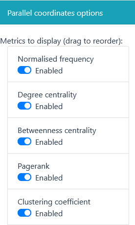
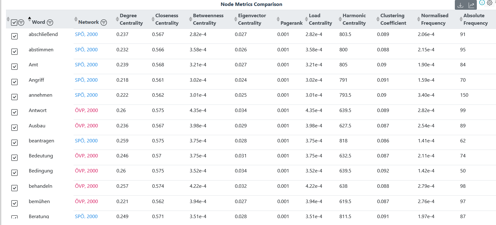

## Learning outcomes

After completing this resource, you will

- understand the purpose of DYLEN
- be able to read a visualisation that was created in DYLEN
- know how to undertake an ego network analysis with DYLEN
- generate a general network analysis

## Introduction

[DYLEN](https://dylen-tool.acdh.oeaw.ac.at/) is the acronym of the **Diachronic Dynamics of Lexical Networks.** It is an interactive visualisation tool that the Diachronic Dynamics of Lexical Networks project team created to provide insights into the dynamic lexical changes of Austrian German during the 21st century. It helps lexicographers and linguists to analyse the development of Austrian German lexemes over the course of time. It is an open source tool that can be used free of charge.

[DYLEN](https://dylen-tool.acdh.oeaw.ac.at/) enables lexical network research on large-scale authentic language data that are taken from two Austrian Geman corpora, the [Austria Media Corpus (amc)](https://amc.acdh.oeaw.ac.at/) and [Corpus of Austrian Parliamentary Records (ParlAT)](https://www.oeaw.ac.at/acdh/tools/parlat). 

DYLEN provides three options:

- Ego network,
- General network (party), 
- General network (speaker),

and 2 additional components:

- Node metrics comparison,
- Time series analysis.   

<SideNote type="info" title="amc and ParlAT">
Both corpora provide large-scale language data on Austrian German from the 21st century.

The amc is one of the largest German language corpora and reflects the Austrian media landscape almost in its entirety (newspapers, magazines, press releases and some news reel transcripts). It contains about 12 billion tokens and is updated every year. It reflects the Austrian media landscape. You can register for access for linguistic analysis [here](https://amc.acdh.oeaw.ac.at/) and learn more about it in this HowTo.

The [ParlAT corpus](https://www.oeaw.ac.at/acdh/tools/parlat) comprises the Austrian parliamentary records and contains around 75 million tokens. This corpus is expanded over time, too. It is also part of the CLARIN [ParlaMINT project](https://www.clarin.eu/parlamint).
</SideNote>

The following [comic](https://comic.acdh-dev.oeaw.ac.at/howto/comic) provides a visual summary of this article and illustrates the key features of the DYLEN tool.

## Networks

Diachronic networks derive from the texts in amc and ParlAT with the help of word embeddings. In NLP, word embeddings are representations of words. 

The user interface is very intuitive but every search starts with deciding on either an **ego network** or a **general network** (**party** or **speaker**). In each network type, you can analyse various parameters of a single entity or compare two entities. The first step on your diachronic network journey is to select the network that you would like to generate.

### Ego network

Connected words are **semantic neighbours** that share some aspects of the **target word**. Some can even substitute the target word in a particular context. The ego network visualises the **50** most closely related semantic neighbours of a target word. Note that it does not show the target word itself because it would render the visualisation impossible to read. The semantic neighbours are classified as parts of speech (POS), e.g. noun, proper nouns and verbs. 

, taken from the amc  texts in 1996.")

#### Instructions:

On the input field on the left side bar, you can

1. select a corpus (i.e., amc or PARLAT),
2. select a subcorpus (e.g., a specific newspaper),
3. type a target word (e.g., 'Geld'),
4. and finally click _Visualise_.

#### Understanding the visualisation

Once you clicked on visualise, DYLEN will generate your network. Let us stick with our "Geld" (money) example.

")

Above, you see the semantic neighbours represented by nodes that can be dragged further apart to get a better overview. Their size indicates their frequency. The bigger the node, the more commonly it is used in the corpus. You can click on each node to highlight the connections. The colours represent different parts of speech and you can change them to your preference.

### Time Series Analysis

The Time Series Analysis allows to compare two words over time; the comparison can be relative to the first year, last year or previous year.

#### Metrics and Node metric comparison

In addition, you can select the metrics for the parallel coordinates with the sliders. These metrics are presented in the parallel coordinates plot. Every graph line represents one word and each vertical axis stands for the value in the respective metric. You can visualise all words or selected words in the node metrics comparison. When you click the lines, you can inspect the values for each metric.

<SideNote type="info" title="What do the metrics mean?">
#### Frequency

...represents how often a word occurs.

#### Degree centrality

...represents how connected a word is. It shows the total number of edges linked to a node. In the example, "Haft" has a higher degree centrality than "Strafe", meaning that it is more strongly connected.

#### Betweenness centrality

...represents the number of shortest paths that pass through that node. It shows how frequently nodes tand between each other. Again, "Haft" shows more betweenness centrality than "Strafe", meaning that more shorter paths pass through "Haft".

#### Pagerank

...represents the notion that a node is as important as the combined importance of its linked nodes.

#### Clustering coefficient

...measures the degree to which nodes in a graph tend to cluster together.

_The above explanations are taken from the_ DYLEN _tool website and can be accessed and read in more detail via the information button in the node metric analysis visualisation._
</SideNote>

### General networks

General networks reflect the speeches of a particular politician or a political party. Those networks are larger than ego networks and require more filters that make the visualisation more legible. Under general networks you can explore **frequent lexemes** used by particular political parties **(general network (party))** or individual politicians **(general network (speaker))** in the Austrian Parliament. 

#### Instructions:

On the input field on the left side bar, you can

1. select a party, 
2. select a speaker (only for general network (speaker)),
3. (optional, but recommended) use the _Node filter_ to 

   - select a metric (e.g. degree centrality) 
   - adjust the percentage of nodes to be displayed,
4. and finally click _Visualise_. 

 comparison for SPÖ and ÖVP in 2000. The word \\\"brauchen\\\" (need) and its connections are highlighted in the first network visualisation.")

### Node Metrics Comparison

The general network analysis allows for node metric comparison too. You can choose between the same metrics as in the ego network. When you compare two parties or speakers, each component gets a different colour. Also, you can ask DYLEN to return a table for the node metrics with indicating colours (see below). 

### Time Series Analysis

In the general network analysis, the development of speakers or parties can be traced, like the ego network traces individual words. You can visualise your results as a graph on a timeline, or as a table with selected metrics and values. All your options for analysis are explained in more detail on the [DYLEN website](https://dylen-tool.acdh.oeaw.ac.at/) in the technical details in the _Time Series Analysis_ tab.

## Links

[About the DYLEN Project](https://dylen.acdh.oeaw.ac.at/about/)

[DYLEN Tool](https://dylen-tool.acdh.oeaw.ac.at/)

[DYLEN Comic](https://comic.acdh-dev.oeaw.ac.at/howto/comic)

[HowTo use the amc and CQL](https://howto.acdh.oeaw.ac.at/resource/posts/corpus-query-language-im-austrian-media-corpus)