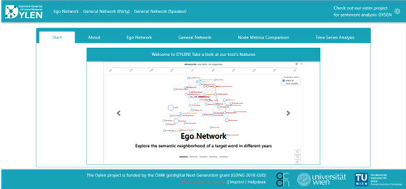

## Learning outcomes

After completing this resource, you will

- understand the purpose of Dylen
- be able to read a visualisation that was created in Dylen
- know how to undertake an ego network analysis with Dylen
- generate a General network analysis

## Introduction

[DYLEN](https://dylen-tool.acdh.oeaw.ac.at/) is the acronym of the **Diachronic Dynamics of Lexical Networks.** It is an interactive visualization tool that the Diachronic Dynamics of Lexical Networks project team created to provide insights into the dynamic lexical changes of Austrian German during the last 20 years. It helps lexicographers and linguists to analyse the development of Austrian German lexemes over the course of time. It is an open source tool that can be used free of charge.

[DYLEN](https://dylen-tool.acdh.oeaw.ac.at/) enables lexical network research on large-scale authentic language data that is taken from two Austrian Geman corpora, the [Austria Media Corpus (amc)](https://amc.acdh.oeaw.ac.at/) and [Corpus of Austrian Parliamentary Records (ParlAT)](https://www.oeaw.ac.at/acdh/tools/parlat). 

Dylen provides three options:

- Ego Network,
- General Network (Party), 
- General Network (Speaker),

and 2 additional components:

- Node Metrics Comparison,
- Time Series Analysis.   

<SideNote type="info" title="amc and ParlAT">
Both corpora provide large-scale language data on Austrian German from the last 20 years.

The amc is one of the largest German language corpora and reflects the Austrian media landscape almost in its entirety (newspapers, magazines, press releases and some news reel transcripts). It contains about 12 billion tokens and is updated every year. It reflects the Austrian media landscape  You can register for access for linguistic analysis [here](https://amc.acdh.oeaw.ac.at/) and learn more about it in this HowTo.

The [ParlAT corpus](https://www.oeaw.ac.at/acdh/tools/parlat) comprises the Austrian parliamentary records and contains around 75 million tokens. This corpus is expanded over time, too. It is also part of the CLARIN [ParlaMINT project](https://www.clarin.eu/parlamint).
</SideNote>

I will now guide you through on how to use the tool.

## Networks

### Ego Network

The Ego Network visualizes the **50** most closely related **semantic neighbours** of a **target word**.

#### Instructions:

On the input field on the left side bar

1. select a corpus (i.e., AMC or PARLAT), 
2. select a subcorpus (e.g., a specific newspaper),
3. type a target word (e.g., 'Geld'),
4. and finally click _Visualize_.

<SideNote type="info" title="Additional information">

</SideNote>

### General Networks

Under General Networks you can explore **frequent lexemes** used by particular political parties **(General Network Party)** or individual politicians **(General Network Speaker)** in the Austrian Parliament. 

#### Instructions:

On the input field on the left side bar

1. select a party, 
2. select a speaker (only for General Network Speaker),
3. (optional, but recommended) use the _Node filter_ to 

   - select a metric, 
   - adjust the percentage of nodes to be displayed,
4. and finally click _Visualize_. 

")

## Other components

### Node Metrics Comparison

### Time Series Analysis

## Links

HowTo use the amc and CQL