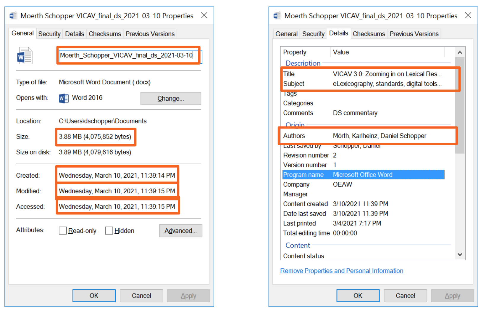
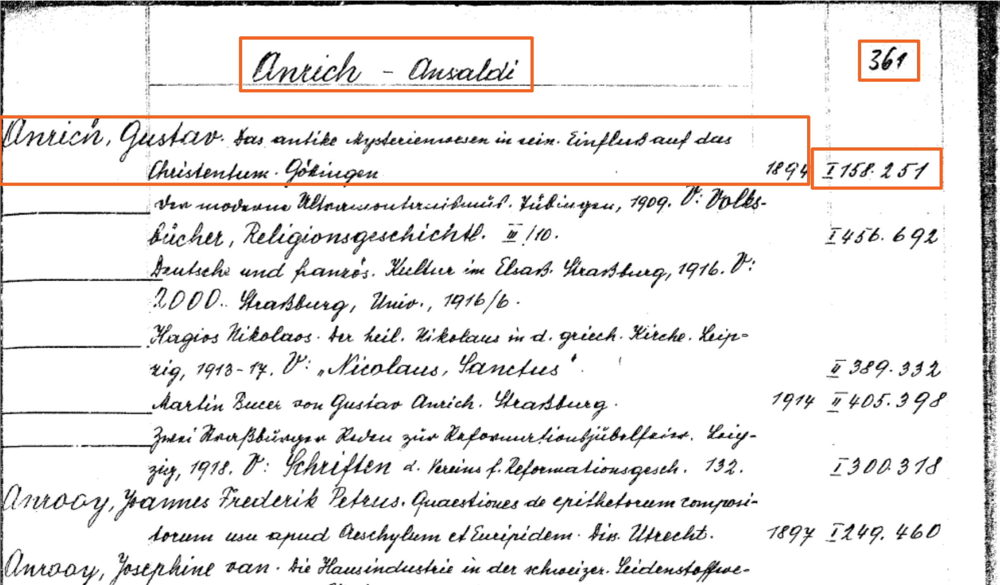
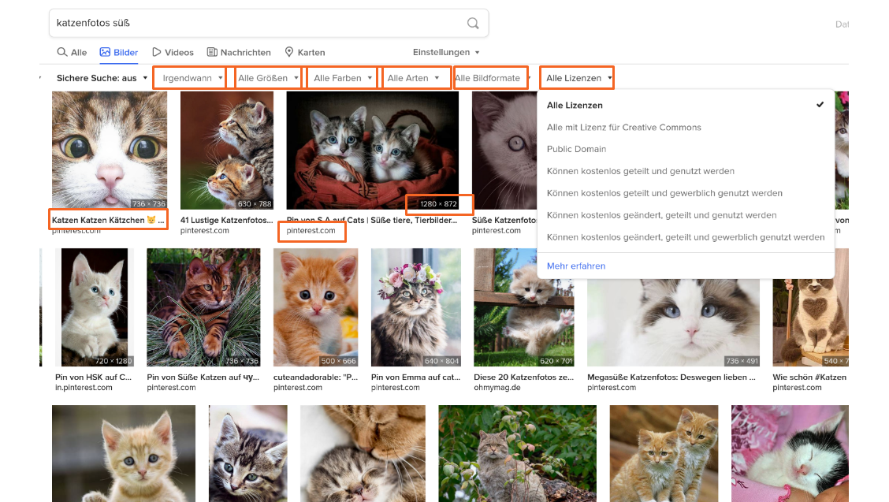
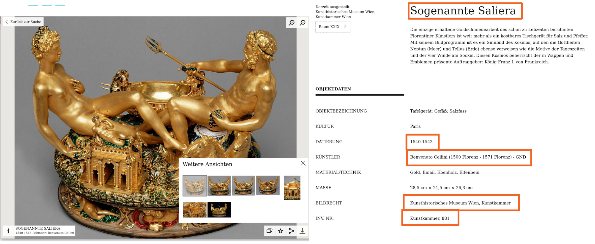
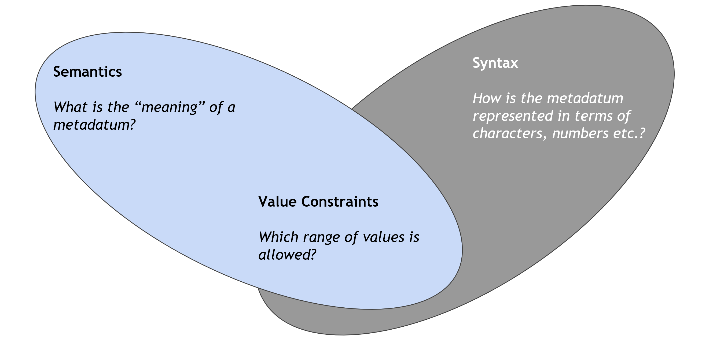

## Lernziele

- Den Nutzen und die Bedeutung von (guten) Metadaten für den Forschungsalltag erkennen
- Bestandteile von Metadaten unterscheiden können
- Metadaten auf Verlässlichkeit überprüfen können

<SideNote type="tip" title="Tipp: ">
Die Inhalte des Kapitels beruhen auf dem Impulsvortrag „Dokumentation und Metadaten“ der Tool Gallery 7.2. (17. November 2021) des ACDH-CH, dessen Aufzeichnung (Deutsch) auf Youtube verfügbar ist.
</SideNote>

<Video provider="youtube" id="gSpzRK7ujp0" caption="Aufzeichnung des Impulsvortrags von Daniel Schopper zu Dokumentation und Metadaten bei der Tool Gallery 7.2. am 17. November 2021" />

## Warum brauchen wir Metadaten?

Man stelle sich vor: Eine Forscherin arbeitet an einem Projektantrag zu einem Aspekt der lateinischen Grammatik. Als Arbeitsgrundlage benötigt sie ein digitales Corpus von Texten. Naheliegenderweise möchte sie sich nicht die Mühe machen und ein solches Corpus selbst aufbauen, sondern bestehende Texte wiederverwenden. Sie macht sich daher auf die Suche nach digitalen Ressourcen, die sie für ihr Textcorpus heranziehen kann. Ihre Recherche im Internet ist erfolgreich und sie stößt auf eine interessante Textsammlung, aber beim Versuch, auf den Datensatz zuzugreifen, scheitert sie an einem Login-Formular. Bei einer anderen Ressource hat sie etwas mehr Glück hat und kann den Datensatz herunterladen. Aber welches Format hat nun diese Datei, die sie auf ihrem Rechner hat, und wie kann sie sie öffnen. In einem dritten Fall kann sie den Datensatz herunterladen und öffnen - aber dann stellt sich die Frage: wie wurden die Daten produziert? Sind sie vollständig? Nach welchen Richtlinien ist die Digitalisierung erfolgt und sind die Daten daher für ihre Forschung überhaupt aussagekräftig? Und nicht zuletzt: Bei der Veröffentlichung der Texte wurde keine Lizenz angegeben – darf sie den Datensatz also überhaupt für ihre Forschung und ggf. Publikation verwenden? 

Diese und ähnliche basalen Informationen den potentiellen Nutzer*innen zur Verfügung zu stellen ist eine von vielen Aufgaben von Metadaten. Eine vollständiger Metadatenbeschreibung eines Datensatzes erlaubt die schnelle Beantwortung von Fragen wie z.B.:  

- Sind die Daten für mich relevant?  
- Darf ich die Daten überhaupt verwenden? Und wenn ja, unter welchen Bedingungen bzw. Einschränkungen? 
- Sind die Daten stimmig? Stimmen die Methoden, die zur Datengenerierung verwendet wurden, überein?  
- Wie kann ich den Inhalt der Daten lesen und verarbeiten? Und was brauche ich, um ihre Struktur zu verstehen? 

<Quiz>
  <Quiz.Card validateButtonLabel="Überprüfen">
    <Quiz.MultipleChoice variant="mulitiple">
      <Quiz.Question>
        **Übung**

        Schlüpfen Sie in die Rolle der beschriebenen Forscherin: Sie finden bei Ihrer Interrecherche heraus, dass einer der Texte, die Sie in ihr Corpus aufnehmen möchten, bereits unter [https://latin.packhum.org/loc/899/1/0#0](https://latin.packhum.org/loc/899/1/0#0) im Volltext verfügbar ist. Sie sind sich nicht sicher, ob der Text verlässlich ist und machen sich auf die Suche nach Metadaten: Von welcher Quelle wurde der Volltext übernommen? Wer ist dafür verantwortlich? Unter welchen Bedingungen können Sie den Text weiterverarbeiten und in Ihr Corpus integrieren? Wo auf den Seiten des Corpus lassen sich ev. Hinweise dazu finden?
      </Quiz.Question>

      <Quiz.MultipleChoice.Option>
        Der Volltext, auf dem der PHI Latin Texts Corpus basiert, ist nicht mehr vom Urheberrecht geschützt. Daher kann ich den Corpus weiterverarbeiten und in meinen Corpus integrieren.
      </Quiz.MultipleChoice.Option>

      <Quiz.MultipleChoice.Option isCorrect>
        Ich darf den PHI Latin Texts Corpus nur für persönliche Zwecke verwenden.
      </Quiz.MultipleChoice.Option>

      <Quiz.MultipleChoice.Option>
        Eingriffe und Kürzungen der digitalen Edition in den Ursprungstext sind gut nachvollziehbar.
      </Quiz.MultipleChoice.Option>

      <Quiz.MultipleChoice.Option isCorrect>
        Die Quell-Edition des Volltextes lässt sich herausfinden.
      </Quiz.MultipleChoice.Option>

      <Quiz.Message type="correct">
        **Richtig!** Leider gibt es zu diesem Text bzw. zum gesamten PHI Latin Texts Corpus wenig bis gar keine Metadaten. Auf der Startseite des Corpus [https://latin.packhum.org/](https://latin.packhum.org/) findet sich ein sehr allgemeiner Hinweis, dass die Verwendung nur für persönliche Zwecke erlaubt ist.

        Auf der Übersichtsseite der Texte des Autors ([https://latin.packhum.org/author/899](https://latin.packhum.org/author/899)) findet sich versteckt als „Pop-Up“ zumindest die Angabe der Edition, von der der Volltext stammt – das Datum legt nahe, dass die ursprüngliche Edition noch vom Urheberrecht geschützt ist und der Text daher nicht verwendet werden kann. Über etwaige Eingriffe oder Kürzungen, die der digitale Volltext in den Text der Ursprungsedition ausweist, ist auf der Seite nichts zu finden.
      </Quiz.Message>

      <Quiz.Message type="incorrect">
        **Knapp daneben!** Diese Informationen sind aber in diesem Beispiel auch nur schwer zu finden, denn leider gibt es zu diesem Text bzw. zum gesamten PHI Latin Texts Corpus wenig bis gar keine Metadaten. Auf der Startseite des Corpus [https://latin.packhum.org/](https://latin.packhum.org/) findet sich ein sehr allgemeiner Hinweis, dass die Verwendung nur für persönliche Zwecke erlaubt ist.

        Auf der Übersichtsseite der Texte des Autors ([https://latin.packhum.org/author/899](https://latin.packhum.org/author/899)) findet sich versteckt als „Pop-Up“ zumindest die Angabe der Edition, von der der Volltext stammt – das Datum legt nahe, dass die ursprüngliche Edition noch vom Urheberrecht geschützt ist und der Text daher nicht verwendet werden kann. Über etwaige Eingriffe oder Kürzungen, die der digitale Volltext in den Text der Ursprungsedition ausweist, ist auf der Seite nichts zu finden.
      </Quiz.Message>
    </Quiz.MultipleChoice>
  </Quiz.Card>
</Quiz>

Unsere Forscherin hat ihren Antrag schließlich abgeschlossen und mit Erfolg bei einem Fördergeber eingereicht: Das Projekt kann starten! Ihr Textcorpus nimmt Gestalt an und rasch finden sich andere Forscher*innen, die ihre Arbeit wiederverwenden möchten: Nun findet sie sich selbst in der Position, Metadaten zu ihrem Corpus erstellen zu müssen. Außerdem möchte der Fördergeber in einem Data Management Plan Auskunft darüber erhalten, wo die durch seine Mittel finanzierten Ergebnisse archiviert werden: Unsere Forscherin muss sich nun für ein mögliches Forschungsdatenrepositorium entscheiden und darüber informieren, welche Informationen in welchem Format das Respositorium für die Archivierung benötigt. 

**Fazit:** Wir alle sind sowohl _Nutzer*innen_ als auch _Produzent*innen_ von Metadaten und brauchen für alle Schritte im [Datenlebenszyklus](https://howto.acdh.oeaw.ac.at/resource/posts/grundlagen-datenmanagement#b-datenlebenszyklus--datenmanagement) grundlegende Kenntnisse, um Daten von anderen Projekten oder anderen Wissenschaftler*innen für unsere Forschung nachnutzen zu können bzw. mit anderen Personen an geteilten Daten zusammenarbeiten zu können.  

Selbst zwischen Mitarbeiter*innen ein und desselben Projekts entfalten sich E-Mail-Unterhaltungen mit Fragen wie: „Wo liegt die letzte Version von Datei X und welche Software brauche ich, um sie öffnen zu können?“ oder „Darf ich Datei Y aus dem Internet für … verwenden?“ Auch die [Übung zu den Grundlagen des Datenmanagements ](https://howto.acdh.oeaw.ac.at/resource/posts/datenmanagement-%C3%BCbung)hat bereits deutlich gezeigt, weshalb Metadaten wichtig sind: Nur mit Metadaten sind die Daten, die wir in unseren Projekten herstellen, überhaupt verständlich und im Verlauf bzw. am Ende des Projekts auffindbar und wieder- / weiterverwendbar.  

## Was sind Metadaten? Eine Bestandsaufnahme 

Aber was sind nun eigentlich Metadaten? Versuchen wir zunächst einmal eine Annäherung. Die einfache Antwort, die man häufig liest und die sich mit dem vorangegangen Beispiel deckt, lautet einfach: 

> Metadaten sind Daten über andere Daten. 

Das ist prinzipiell nicht falsch. Es stellt sich allerdings die Frage, ob diese Definition den Kern in vollem Umfang trifft, gerade wenn wir über geisteswissenschaftliche Metadaten sprechen? Deswegen folgt nun ein kurzer induktiv erstellter Überblick, wo überall Metadaten vorkommen können.  Denn “Metadaten sind überall”. 

Metadaten gibt es beispielsweise über die Daten auf unserem Computer. Hier haben wir es mit Dateien in einem Dateisystem zu tun. Diese Dateien liegen in bestimmten Ordnern, auf festgelegten physischen Laufwerken. Sie haben eine Größe, verschiedene Datumsangaben, Angaben zu Autoren, und sogar beschreibende Angaben wie den Titel, Thema usw. In der Regel beschreiben die Metadaten in unseren Dateisystemen _Eigenschaften der physischen Datei_ und ihrer Entstehung bzw. Bearbeitung. Schlagwörter, Inhaltsangaben etc. beziehen sich hingegen auf den Inhalt, die semantische Ebene einer Datei wie z.B. eines Word-Dokuments. 

Klar ersichtlich wird auch am obigen Beispiel: Metadaten in Computersystemen sind in aller Regel in „Feldern“ aufgebaut, die einen Wert besitzen, der aus einem möglichen Wertebereich stammt: Im Feld „Created“ darf nur eine Datums- und Zeitangabe stehen, in „Size“ nur eine ganze Zahl, die – je nach Größenordnung – z.B. als Kilobyte, Megabyte oder Gigabyte angezeigt wird. 

Metadaten begegnen uns aber auch in ganz anderer Form, wie Abbildung 2 zeigt. Hierbei handelt es sich um ein Digitalisat des historischen Nominalkatalogs der Universitätsbibliothek Wien: Bibliotheken gehören zu jenen Institutionen, die sich am längsten mit der Organisation von Metadaten befassen. Einerseits beziehen sich die Angaben darin auf die einzelnen Exemplare eines Buches, um sie mithilfe ihrer Signaturen im Speicher auffindbar zu machen. Anderseits aber enthält das Katalogisat auch implizit Informationen über alle gleichartigen Exemplare dieser Publikation: Autor, Titel und Publikationsdatum sind keine Eigenschaften eines physischen Objekts, sondern der Abstraktion davon.1 Darüber hinaus finden wir in der Abbildung auch Informationen, die dabei unterstützen, sich im Metadatensatz selbst zurechtzufinden, z.B. Seitenzahlen oder der Kolumnentitel.  

Aber auch wenn wir einfach eine Suchmaschine verwenden (siehe Abbildung 3), arbeiten wir in aller Regel mit Metadaten, um die Resultatliste nach bestimmten Parametern zu filtern: Im Fall der oben abgebildeten Bildersuche sind das technische Angaben (z.B. Aufnahmedatum, Größe, enthaltene Farben, Bildtypen, Bildformate), aber auch die Art der Lizenz oder die Herkunft der Daten. Im Normalfall werden die einzelnen Filter-Parameter nicht als Freitext eingeben, sondern aus einer Liste von möglichen Werten ausgewählt, sog. _kontrollierten Vokabularien_. 

Natürlich gibt es auch im Sektor des Kulturerbes Metadaten: Beispielsweise die sogenannten [“Tombstone”-Informationen](https://www.artic.edu/articles/872/how-to-read-a-label) eines Objekts – ein Begriff der ursprünglich von Beschreibungstexten im Museum kommt und sich in erweiterter Form auch in digitalen Sammlungen fortführt. Wie ein kleines Schildchen unterhalb eines Objektes oder Bildes in einem Museum bieten auch digitale Metadaten grundlegende Angaben wie z.B. beispielsweise Bezeichnung, Datierung oder relevante Personen, etc.  

### Zusammenfassung

Allen Metadaten ist gemeinsam, dass sie die Dinge, die sie beschreiben, aus verschiedenen Dimensionen erschließen. Dazu gehören in aller Regel: 

- Benennungen (z.B. Kennzeichnung, Beschriftung, Titel, etc.) 
- Zeitliche Dimension (Datums- und Zeitangaben) 
- Größe / Umfang 
- Geographische Dimension 
- Verhältnis zu natürlichen Personen oder Institutionen / Körperschaften 
- Inhaltliche Dimension (z.B. Verschlagwortung) 
- Rechtliche Dimension (Besitzverhältnisse, Lizenzangaben) 

Sprechen also Metadaten nur über Daten, wie die anfängliche Definition nahelegt? – Nein, bei genauerer Betrachtung greift diese Definition zu kurz. Denn in aller Regel beschreiben Metadaten nicht nur die digitalen Objekte, zu denen sie gehören, sondern auch zahlreiche Aspekte von all jenen realen und abstrakten „Dingen“, die ein digitales Objekt repräsentiert oder die mit ihm in Verbindung stehen.  

Am Beispiel von digitalen Objekten aus dem Bereich des Kulturerbes wird das ganz deutlich: Wer mit der digitalen Repräsentation eines Kunstwerks arbeitet, interessiert sich in in vielen Fällen besonders für jene Dimensionen, die gerade nicht durch die Fotografie oder den Scanvorgang erfasst werden können: beispielsweise die physischen Eigenschaften des digitalisierten Objekts oder die Ereignisse und Personen, die mit ihm in Verbindung stehen (z.B. Herstellung, Kauf/Verkauf bzw. ). Dieses Wissen über die „realen“ Objekte wird den „digitalen“ Objekten beigegeben, um unsere Gesamtsicht darin speichern zu können.  

**Fazit:** Bei digitalen Objekten kann man grundsätzlich drei Ebenen unterscheiden: 

- **Physische Ebene:** Digitale Objekte bestehen aus Bytes, die auf einem Datenträger “abgelegt sind”, haben also eine physische Komponente: Das können Dateien auf einem USB-Stick oder einer Festplatte sein, aber genauso Datenströme, die über ein Netzwerk zwischen Geräten ausgetauscht werden. Auf dieser Ebene werden die Eigenschaften der Objekte (und daher die „Werte“ der Metadaten, die sie beschreiben) über die physische Ablage der Dateien bestimmt. 
- **Logische Ebene:** Diese Ebene bezieht sich auf den inneren Aufbau der Daten, der es ermöglicht, dass sie von einer Software gelesen, angezeigt und manipuliert werden können. Beispiel: Damit mehrere Textverarbeitungsprogramme das selbe Dokument öffnen können, muss ein gemeinsames Format definiert sein: ein Regelwerk, das Funktionsbereiche definiert und sie auf entsprechende Datenstrukturen abbildet. Dieses Regelwerk muss allen Programmen „bekannt“ sein, die dieses Format lesen oder schreiben können sollen. 
- **„Konzeptionelle“ oder „semantische“ Ebene:** Dies ist die abstrakte Ebene des Dateiinhalts, die zunächst nur von Menschen durch Interpretation und „Hintergrundwissen“ erschlossen werden kann: Was bildet ein Foto oder Scan ab?   

 

## Aufbau von Metadaten 

Unabhängig vom technischen System oder Format, in welchem Metadaten gespeichert werden, ist der Aufbau von Metadaten stets derselbe. Um für die Nutzer und Ersteller verständlich und nützlich zu sein, müssen sich beide für jedes Feld (“Metadatum”) auf folgende Informationen einigen: 

- Welche **Bedeutung** hat das Metadatum? Welche Dimension (s.o.) bzw. welche Eigenschaft des beschriebenen Objektes deckt es ab? – Wie wir weiter unten sehen werden, kann die semantische Ebene einer Metadatumsdefintion mehr oder weniger eng gefasst sein.  (Z.B.: Beschreibt das Metadatum “Titel” beschreibt den Titel einer Publikation, nicht aber den (Adels-/Standes- etc.) Titel einer Person) 
- Hand in Hand mit der Frage der Beschreibungsdimension eines Metadatums geht die Definition, welche **Werte bzw. Wertebereiche** bei der Verwendung dieses Metadatums zulässig sein können. (z.B. Im Feld “Titel” dürfen nur Unicode-Zeichen stehen).  
- Und nicht zuletzt müssen Metadaten in einem Computersystem gespeichert werden, um benützbar zu werden. Hier stellt sich die grundlegende Frage: Auf welche Art und Weise und unter Verwendung welcher **Zeichen** werden die Informationen des Metadatums in einem Computersystem repräsentiert? Sinnvollerweise ist die Definition eines Metadatums von der tatsächlichen Art, der Speicherung – der **syntaktischen Ebene** – unabhängig. Dementsprechend gibt es oftmals mehrere syntaktische Varianten eines und desselben Metadatums, die sich nicht in ihrer Semantik, aber sehr wohl in ihrem Basisdatenmodell (z.B. RDF oder XML) und den durch sie bedingten syntaktischen Regeln unterscheiden.  

Um ein digitales Objekt beschreiben zu können, kann ein einzelnes Metadatum allein nicht ausreichen. Daher bewegen sich die Definitionen von Metadaten-Elementen eines gemeinsamen Metadatenschemas immer auch im Rahmen eines gemeinsamen **abstrakten Modells**, das die verschiedenen Metadaten-Elemente zu einem homogenen Ganzen verbindet. 

