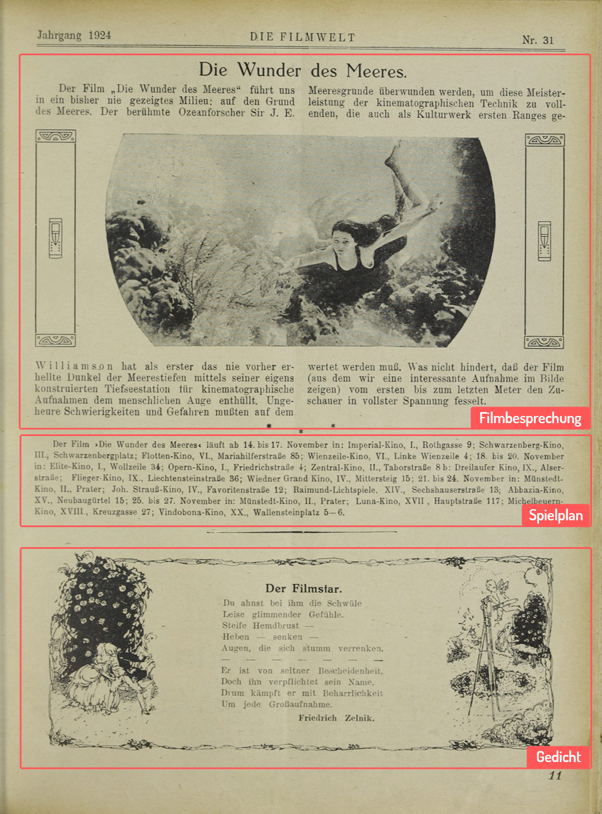
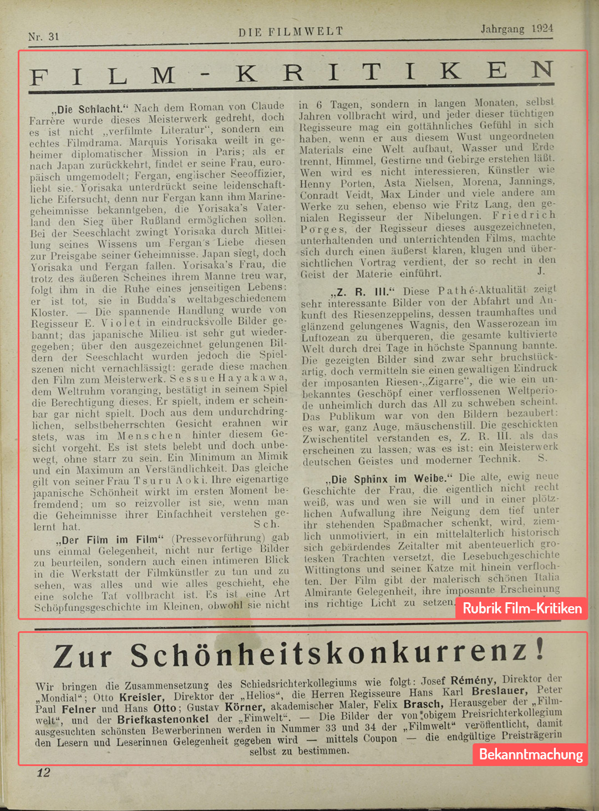

## Über das Übungsbeispiel

Die Übungsbeispiele sollen Sie durch diese Einführung in TEI begleiten und Ihnen beispielhaft einige Möglichkeiten aufzeigen, wofür die Guidelines der Text Encoding Initiative genutzt werden können.

Kodiert werden die Seiten 11 und 12 aus der in Wien erschienenen Zeitschrift _Die Filmwelt_, Nr. 31, Jahrgang 1924. Der gewählte Ausschnitt umfasst eine kurze Filmbesprechung inklusive Spielplan, ein Gedicht, mehrere kurze Beiträge aus der Rubrik "Film-Kritiken" sowie eine Bekanntmachung der Zeitschriftenredaktion. Diese Zeitschrift ist online verfügbar unter [ÖNB-ANNO](http://anno.onb.ac.at/) ([Filmwelt 31, 1924, Seite 11](http://anno.onb.ac.at/cgi-content/annoshow-plus?call=fwt|1924|0131|00000011||jpg||45|), [Filmwelt 31, 1924, Seite 12](http://anno.onb.ac.at/cgi-content/annoshow-plus?call=fwt|1924|0131|00000012||jpg||45|)).

Anhand dieses Beispiels wollen wir gemeinsam die unterschiedlichen Facetten erarbeiten, die in einem solchen Dokument kodiert werden können. Hierfür gehen wir von beispielhaften Forschungsfragen aus, die man an den Text stellen könnte und die sich durch die vorgestellte Kodierung beantworten lassen.

Natürlich können wir in diesem Use-Case nicht jedes Detail der TEI Spezifikation behandeln. Ein wichtiges Hilfsmittel für die Arbeit mit dem Vokabular der TEI Guidelines ist daher die ausführliche Dokumentation mit den zahlreichen darin enthaltenen Beispielen. Die relevanten Passagen aus den Guidelines werden in der Einführung zusätzlich verlinkt.

*Tipp:* Öffnen Sie die [Guidelines](https://tei-c.org/guidelines/P5/) während Ihrer Arbeit. Dort finden Sie Links zu Listen mit [Elementen](https://www.tei-c.org/release/doc/tei-p5-doc/en/html/REF-ELEMENTS.html) und [Attributen](https://www.tei-c.org/release/doc/tei-p5-doc/en/html/REF-ATTS.html), oder Sie können direkt nach einzelnen Komponenten suchen.

Das Ziel der Übung sollte es sein, dass Sie in jeder Praxis-Einheit zumindest einige Belegstellen selbst annotieren.