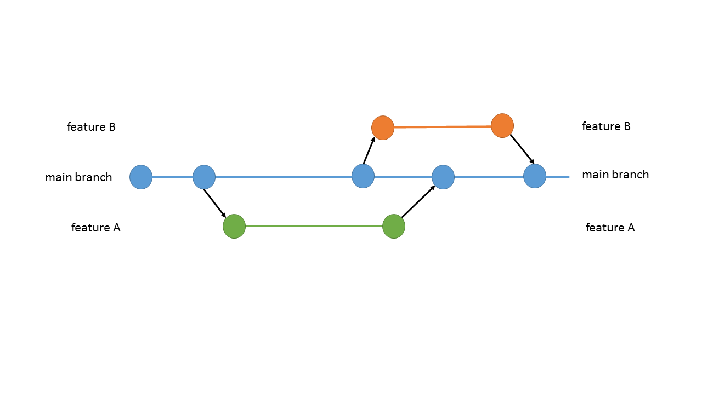
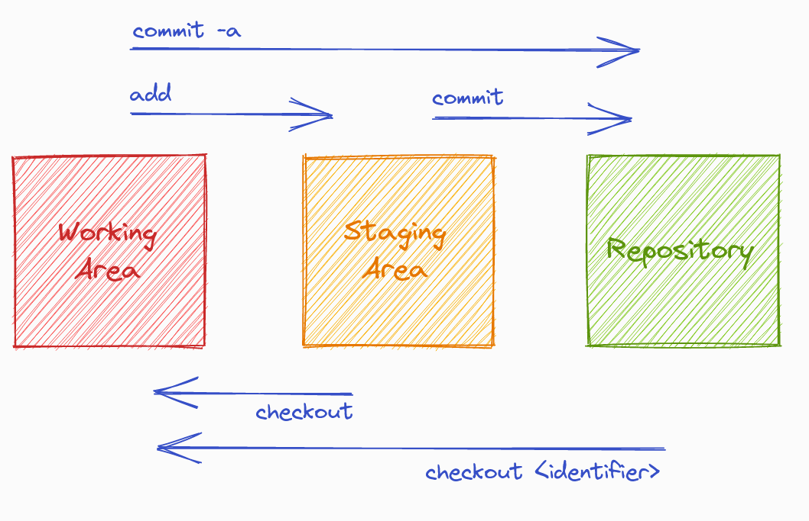

In this resource you will learn

- essential git commands
- how to use git commands in the terminal
- how to get and install the software you need

## Version control and tracking changes

**Git**'s main purpose is to track changes in your projects, either for yourself or to keep a team updated. It works best when used with **plaintext file formats** such as **source code, XML/TEI documents** or **Markdown content**. While Git will happily store _images_, _audio files_, or `.doc` and `.pdf` documents. However, it was not designed to help you with changes in those kinds of documents and cannot its full diffing/merging capacities with them. 

**Git**

- solves the problem of keeping versions of text documents in sync among sometimes thousands of collaborators working on a software product.
- It helps integrate changes by multiple collaborators and also solve situations where two people edit the same part of a document.

Git can record which changes, to which documents, have been made when, and by whom. It allows to keep a detailed revision history of a project, because it can save snapshots of a project at specific points in time, thus being open to review any time in the future.

Version control allows to save versions of content, restore previous versions, and compare different versions. This is especially beneficial when working with multiple documents, and when working in teams of more than one (potentially working on the same document).

Git allows to create separate branches for changes to any document. For example, in the image above, the document is represented by the **main branch**. When a change should be created, a copy, the branch "feature A" is **pulled** from the main branch. Once the change is made, the feature branch is ready to **merge** back into the main branch. Similarly, we can **fetch** a branch "feature B" and create another change. When changes have been **committed**, it can be **pushed** back into the main branch, too. Git version control features allow to trace those changes, consider them before they are **merged** into the main branch.

The paragraph above features terminology (in bold) that will become essential commands that enable us to work with Git.

### Official terminology: Working Area, Staging Area, Repository

So far, we have been using rather loose terminology. This diagram is a great summary of how content moves in Git, between the “working area”, which is simply the files and folders in a project as they exist on your computer, the “staging area”, which we can call a “holding zone”, and the “repository”, which are the permanently recorded commit snapshots.

- **Working area:** This is where you manipulate your files. For example, you can make change to the text in an MDX document. The working area usually resides on your local machine.
- **Staging area:** This "holding zone" allows to **stage** changes in your documents, and **commit** those changes once you are comfortable, and **push** these changes to your repository.
- **Repository:** A repository is a central location where the data, files and documents are stored and managed. You can be the sole user of a repository or you can be a collaborator in a team.

Let’s look at how change tracking with Git works in practice, in a local project on your computer (no network connection required). We’ll walk through how to work with Git in the terminal, because that is where Git was originally meant to be used, and because it helps to understand what is actually going on. This involves learning a handful of Git commands, and while that might seem intimidating at first, you’ll see that it becomes second-nature with a bit of practice very quickly. 

However, if you prefer to work with Git via a **graphical user interface (GUI)**, take a look at the bonus section at the end of this introduction, which lists some popular editor or operating system integrations.

<SideNote type="note">
The commands you learn for working in a local project also apply for working collaboratively. Working in the terminal helps to understand what is going on behind the scenes.
</SideNote>

## Installing git

### Windows

If you haven’t yet installed Git on your Windows computer, follow the instructions on https://git-scm.com/downloads, or https://gitforwindows.org/.

You should also provide some initial configuration.
The setup program runs as administrator as well as normal user. In general hit next and don’t change anything as most options are only relevant for advanced usage.

[One exception might be the editor](https://git-intro-wboe.acdh-dev.oeaw.ac.at/simple_windows_editors). But if you follow this howto, its use is not essential.

### Editors with git-support

To have an editor that supports us when working with git version control we suggest you use [Visual Studio Code.](https://code.visualstudio.com/) Just download the suggested stable build and install it.

See here why you might want to use VSCodium instead.

We suggest you let the setup program add an icon on your desktop. You can of course just search the start menu for VS(Codium) or (Visual Studio)Code.

Note that other specialized editors also support managing git repositories themselves. One notable example would be OxygenXML.

### add Mac and Linux

## Initialise a Git project in your terminal

First, we need to tell Git that it should start to manage a project directory and keep an eye on changes to documents there. On a Windows PC, run the program git shell, on Mac or Linux use the terminal of your choice. Navigate to the folder which contains the data you want to version (usually done by typing `cd {folder-name}`, e.g. cd Documents), and afterwards type: