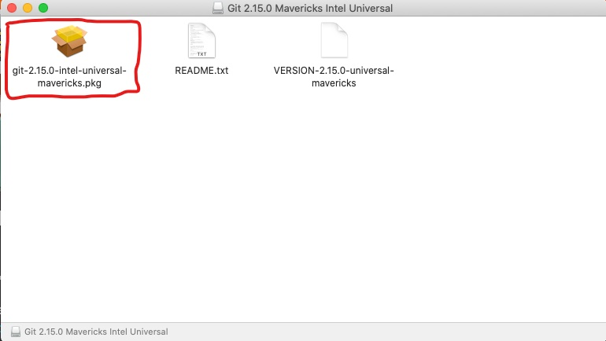
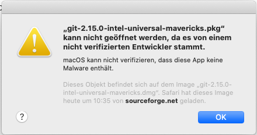
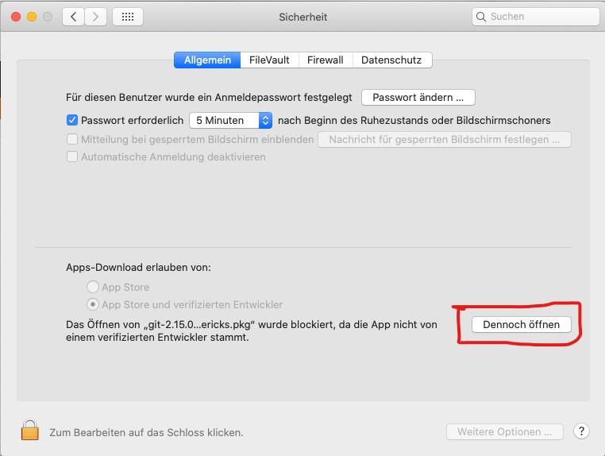
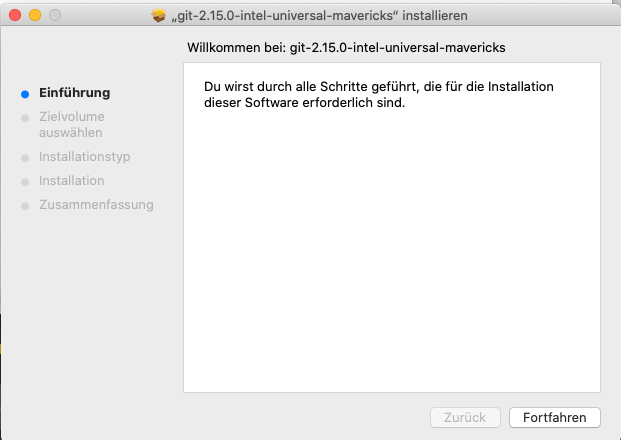

### Learning outcomes

- be familiar with git terminology
- be familiar with the git workflow
- install git
- understand essential git commands
- use git commands in the terminal / command line

## Version control and tracking changes

**Git**'s main purpose is to track changes in files and folders of a project, either for yourself or
when working collaboratively in a team. It works best when used with **plaintext file formats** such
as **source code, XML/TEI documents** or **Markdown content**. While Git will happily store
_images_, _audio files_, or `.doc` and `.pdf` documents, it is not able to help you withe changes in
documents in so-called binary formats .

**Git**

- solves the problem of keeping versions of text documents in sync among sometimes thousands of
  collaborators working on a software product.
- It helps integrate changes by multiple collaborators and also solve situations where two people
  edit the same part of a document.

Git can record which changes, to which documents, have been made when, and by whom. It allows to
keep a detailed revision history of a project, because it can save snapshots of a project at
specific points in time, allowing to review them any time in the future.

Version control allows to save versions of content, restore previous versions, and compare different
versions. This is especially beneficial when working with multiple documents, and when working in
teams (potentially working on the same document).


Git allows to create separate branches for changes to any document. For example, in the image above,
the document is represented by the **main branch**. When a change should be created, a copy, the
branch "feature A" is **pulled** from the main branch. Once the change is made, the feature branch
is ready to transfer back into the main branch. Similarly, we can **fetch** a branch "feature B" and
create another change. When changes have been **committed**, it can be **pushed** back into the main
branch, too. Git version control features allow to trace those changes, consider them before they
are **merged** into the main branch.

The paragraph above features **terminology** (in bold) that will become essential commands that
enable us to work with Git.

### Official terminology: Working Area, Staging Area, Repository

This diagram is a great summary of how content moves in Git, between the “working area”, which is
simply the files and folders in a project as they exist on your computer, the “staging area”, which
we can call a “holding zone”, and the “repository”, which are the permanently recorded commit
snapshots.


- **Working area:** This is where you manipulate your files. For example, you can make change to the
  text in an MDX document. The working area usually resides on your local machine.
- **Staging area:** This "holding zone" allows to **stage** changes in your documents, and
  **commit** those changes once you are comfortable, and **push** these changes to your repository.
- **Repository:** A repository is a central location where the data, files and documents are stored
  and managed. You can be the sole user of a repository or you can be a collaborator in a team.

Let’s look at how change tracking with Git works in practice, in a local project on your computer
(no network connection required). We’ll walk through how to work with Git in the terminal, because
that is where Git was originally meant to be used, and because it helps to understand what is
actually going on. This involves learning a handful of Git commands, and while that might seem
intimidating at first, you’ll see that it becomes second-nature with a bit of practice very quickly.

However, if you prefer to work with Git via a **graphical user interface (GUI)**, take a look at the
bonus section at the end of this introduction, which lists some popular editor or operating system
integrations.

<SideNote type="note">
  The commands you learn for working in a local project also apply for working collaboratively.
  Working in the terminal helps to understand what is going on behind the scenes.
</SideNote>

## Installing git

<SideNote type="tip" title="Don't be afraid of the command line interface (CLI)">
Many users, particularly Windows users, depend on using Graphical User Interfaces (GUI) in their daily lives and work schedules. GUIs have tabs, menus and windows that you can click on. GUIs are perceived as more user-friendly because they graphically represent the actions you take when you interact with the machine in front of you.

The command line interface (CLI) relies on text input. The user needs to know syntax and commands to
use it. So instead of clicking on symbols, you type what you would like your machine to do. To open
the command line, search for _terminal_ or _command promt_. When you open your CLI, it will look
something like this:

```bash
C:\Users\user_name>path_to_your_directory
```

When using a Mac, you will see the **$** character instead of **>**.

Here's an example for a basic command to use in your CLI: to navigate to a directory, type **cd**
and the directory name. Now you can navigate down the directory hierarchy. To go back up, type **cd
..**

```bash
C:\Users\user_name>cd path_to_your_directory
C:\Users\user_name\path_to_your_directory> cd a_small_folder
C:\Users\user_name\path_to_your_directory\a_small_folder> cd ..
C:\Users\user_name\path_to_your directory> cd ..
C:\Users\user_name>
```

There are multifple tutorials available that help you to familiarise with the command line.

</SideNote>

<SideNote type="info" title="Git for Windows, Mac, Linux">
## Windows

If you haven’t yet installed Git on your Windows computer, follow the instructions on
https://git-scm.com/downloads, or https://gitforwindows.org/.

You should also provide some initial configuration. The setup program runs as administrator as well
as normal user. In general hit next and don’t change anything as most options are only relevant for
advanced usage.

[One exception might be the editor](https://git-intro-wboe.acdh-dev.oeaw.ac.at/simple_windows_editors).
But if you follow this howto, its use is not essential.

### Editors with git-support

To have an editor that supports us when working with git version control we suggest you use
[Visual Studio Code.](https://code.visualstudio.com/) Just download the suggested stable build and
install it.

See here why you might want to use VSCodium instead.

We suggest you let the setup program add an icon on your desktop. You can of course just search the
start menu for VS(Codium) or (Visual Studio)Code.

Note that other specialized editors also support managing git repositories themselves. One notable
example would be OxygenXML.

## Mac

There are several ways to install git on MacOS. Depending on your needs and your familiarity with
the command line we suggest one of the following two ways:

### 1. Using the Git bundled with XCode Command Line Tools

Apple ships an older version of git with some add on tools for their MacOS. To get this git you only
have to

- Open a "terminal" (type "terminal" in Spotlight search, start the respective app)
- type `git` and press enter. So try run git.

Doing this will tell MacOS to get a view more programs from the internet. The bundle is called
"Xcode Command Line Tools". So if this already happened for some other reason you are ready. If not
you have to go through a few dialogs and after about 10 minutes everything is installed.

### 2. Using an installation package

The easiest way to install git on a Mac is to use an installer-package provided by Tim Harper.
However

- it will not give you the latest version of Git
- it will be harder to update
- it will complain that the software might be risky (which is highly unlikely)

If these three downsides do not matter to your workflow, here is a step by step guide:

1. Download the installer package at
   [https://sourceforge.net/projects/git-osx-installer/](https://sourceforge.net/projects/git-osx-installer/).
2. Open the downloaded _.dmg file and run the file with the ending _.pkg.
   
3. MacOS is likely to give you a warning, because it does not initially trust sourceforge.com as a
   source, as it is not a "verfied developer".  If this happens, please
   press ok and go to your "System Settings" - Security - General.
    There you will see at the bottom of the window a button
   that should prompt "open anyways" to be able to open and run the \*.pkg. Also prompt "open" at
   the following warning and the installer-package will start.
4. Please follow the instructions in the standard installation dialogue to install Git.



### 3. Using Homebrew

If you are not afraid of the command line, you can use the package manager "Homebrew" to install the
latest version of Git.

#### Installing Homebrew

If you do not have Homebrew installed yet, please paste the following line into your MacOS Terminal:
`/bin/bash -c "$(curl -fsSL https://raw.githubusercontent.com/Homebrew/install/HEAD/install.sh)"`

By pressing enter and starting the script the installation procedure will run in the terminal. At
each step the installer will pause and let you confirm, before it continues.

#### Installing git using Homebrew

After having installed Homebrew following the instructions above or if you already have Homebrew
installed, please paste the following into your MacOS terminal: `$ brew install git`. This prompt
will run the git-installation.

### Editors with git-support

To have an editor that supports us when working with git version control we suggest you use
[Visual Studio Code](https://code.visualstudio.com/). Just download the suggested stable build and
install it.

Note that other specialized editors also support managing git repositories themselves. One notable
example would be OxygenXML.

## Linux

### Getting Git

If you haven't yet installed Git on your computer, follow the instructions on
[https://git-scm.com/ Download for Linux and Unix](https://git-scm.com/download/linux).

git is part of every Linux Distribution nowadays and you install it using the usual package
management tools (like `apt`, `dnf`, `pacman`, `yum`, `zypper` etc.)

### Editors with git-support

To have an editor that supports us when working with git version control we suggest you use
[Visual Studio Code](https://code.visualstudio.com/). Just download the suggested stable build and
install it.

Note that other specialized editors also support managing git repositories themselves. One notable
example would be OxygenXML.

## Save your username and password, so type it only once

You also should make sure the `git-credential-libsecret` package is installed. This package exists
on fedora based distributions. On Ubuntu and debian you need to execute these commands in a terminal

```
sudo apt-get install build-essential libsecret-1-0 libsecret-1-dev
cd /usr/share/doc/git/contrib/credential/libsecret
sudo make
sudo git config --system credential.helper /usr/share/doc/git/contrib/credential/libsecret/git-credential-libsecret
```

</SideNote>

## Initialise a Git project in your terminal

First, we need to tell Git that it should start to manage a project directory and keep an eye on
changes to documents there. On a **Windows** PC, run the program **git shell** **(Git Bash)**, on
**Mac** or **Linux** use the terminal of your choice. Navigate to the folder which contains the data
you want to version (usually done by typing `cd {folder-name}`, e.g. _cd Documents_), and afterwards
type:

```bash
git init
```

This will initially set up Git’s internal bookkeeping metadata, which is stored in a hidden .git
folder. Git will respond with:


Let’s also create some new content. In a real research project this would mean editing or adding an
XML/TEI document or similar. To demonstrate the mechanics we’ll keep it basic here and use the
terminal to create a simple text file. When you want to create a text file via the command line: The
text in "", following _echo_, is the content of the text file which you specify with "filename.txt",
txt being a text file extension

```bash
echo "This is my text document." > my-document.txt
```

### Check status

We can always check what Git knows about the state of our project with:

```bash
git status
```

Note that Git informs us that changes have been made to a file called `my-document.txt`, but that
file is currently "untracked", which means it is not currently managed by Git's versioning. Git also
tells us that in order to tell it to keep track of changes to that file, we should "use `git add` to
track". Generally, if you find yourself in situations where you're unsure how to proceed,
`git status` will most of the time show helpful hints. It's probably the Git command you'll be using
most often.


## Mark content changes to be included in the version history

Let’s follow the advice and use `git add` to tell Git to keep an eye on changes to the newly created
document `my-document.txt`:

```bash
git add my-document.txt
```

<SideNote type="info" title="Adding multiple files">
  To add multiple files, it is possible to list them individually: ```bash git add
  first-document.txt second-document.txt ``` Or, to include _all_ changes to the project: ```bash
  git add -A ```
</SideNote>

Note that `git add` does not automatically **commit** the changes, but places them in the **staging
area**.

### Bundle changes into meaningful chunks

Including content changes in Git’s version history involves a two-step process. First, we put
changes in the “holding zone” or **“staging area”**. We can continue adding related changes to other
documents, or additional newly created documents. This allows **creating semantically meaningful
units of changes**.

When all related changes have been added to the “holding area”, we can save them together as a
version history snapshot, with a message that briefly describes the changes so it is easy to find
them later when viewing the version history.

These units are called **“commits”**, and **“committing”** means permanently recording a snapshot of
contents at a specific point in time, with a message describing the change:

```bash
git commit -m "Add test document"
```

Every project snapshot we commit to history should include a semantically meaningful set of changes,
and this may involve edits to different documents. `git add` allows to granularly choose which
changes, to which files should be part of the next snapshot, while `git commit` will label that set
of changes, and actually save a new snapshot.

<SideNote type="info" title="Commit messages">

Commit messages are usually written in imperative language. For example it is customary to say
“Change document title”, not “Changed document title”. Nevertheless, it’s perfectly fine to agree on
different project-specific conventions, just try to be consistent.

When in a hurry, it’s tempting to write non-descriptive commit messages like “Added changes”. Try to
come up with something that describes the change, you’ll thank yourself later!

</SideNote>

### View history of changes

Getting into the habit of assigning descriptive commit messages is especially helpful when viewing
the history of changes. Git will print a changelog with:

```bash
git log --oneline
```

Note that we have one entry in our version history, and that Git has assigned the commit message we
have provided, as well as an **internal identifier** to that entry. That identifier consists of 40
alphanumeric characters, but usually the first few characters are enough to uniquely address a
commit in a project.

Below, you see a sample information message that your terminal returns. It includes the identifier,
shows where the changes happened and the commit message:

```bash
7f733ac (HEAD -> main) Add test document
```

If you type `git log` instead, more detailed information will be displayed, including the individual
add that are bundled in your commit (if you have any) and the longer internal identifier.

### View individual snapshot

Git will display the exact changes which were made in a commit snapshot with:

```bash
git show 7f733ac
```

That last bit is the unique identifier which is assigned to every commit in Git's version history.
We've seen above how we can figure out these ids from inspecting the changelog displayed with
`git log`. Note that when you have followed the steps in this introduction on your own computer, the
unique identifier you see will be different from the one above. This is because identifiers are
calculated from filename and content, author, commit message, and commit date.

### Compare two snapshots

It is also possible to show changes between two specific commit snapshots. Let's first add another
change, so there are actually two separate entries in our commit history (again, how creating and
editing a document on the terminal works is unimportant here, but the two-step process of creating a
snapshot with `git add` and `git commit` should already be familiar):

```bash
echo "This is another document." > another-document.txt # creates a new document
sed -i s/text/test/ my-document.txt # changes "text" to "test" in `my-document.txt`
git add -A
git commit -m "Add new document and change initial document"
```

To list the difference between two commit snapshots we'll first find out their respective unique
identifiers, and then tell Git to compare those:

```bash
git log --oneline
git diff 7f733ac ab9b27f
```

<SideNote type="info" title="Diffing not-yet-committed work">

To compare working directory to staging area:

```bash
git diff
```

To compare staging area to repository, i.e. last commit to next commit:

```bash
git diff --staged
```

</SideNote>

The format in which the changes are displayed can be a bit hard to read in the terminal, especially
for larger changesets, so it's best to view them in a real text editor.

### Time travel

Alternatively, Git allows to "time travel" to a specific point in a project's history. You can
inspect how each document looked like at that point in time, without losing any subsequent changes:

```bash
git checkout 7f733ac
```

Once you're done looking around, don't forget to return to the present! The easiest way is with:

```bash
git checkout main
```

The `main` identifier is just a shortcut way to refer to the default timeline (it's actually the
default _branch_ of the timeline, because there can be multiple parallel timelines 🤯. Branches were
mentioned in the beginning and we'll have a look at these branches in the second post, **\[Link]**).

### Undo changes

Finally, Git also allows to undo changes. Even though Git forces us to be very intentional about
which changes end up in the changelog (we needed to go through the two-step `git add` and
`git commit` process after all), sometimes you'll still want to discard some of them.

There are three possible ways to do this.

```bash
git revert ab9b27f
```

Reverting a commit will keep that snapshot in the version history, and create a _new_ snapshot with
the changes removed. This is useful when you want to keep a record of the initial changes, and the
fact that they have been reverted.

```bash
git reset 7f733ac
```

Reseting history allows to "rewind the clock" to a specific point im time (addressed via unique
identifier), without losing the changes that have been made to documents in subsequent changes. It's
mostly useful as a way to "rewrite" history.

```bash
git reset --hard 7f733ac
```

The most brute-force way to undo changes is with a "hard reset". Be aware that this will not only
"rewind the clock" to a specific commit, but nuke any changes that have been make in the project
since that point in time. Those changes will be lost.

Lastly, if you only want to quickly change the _message_ of the last commit, for example because you
made a typo, you can:

```bash
git commit --amend
```

## Quiz

<Quiz>
  <Quiz.Card>
    <Quiz.MultipleChoice variant="multiple">
      <Quiz.Question>
        Which command moves changes to the "waiting area"?
      </Quiz.Question>

      <Quiz.MultipleChoice.Option isCorrect>
        git stage
      </Quiz.MultipleChoice.Option>

      <Quiz.MultipleChoice.Option>
        git add
      </Quiz.MultipleChoice.Option>

      <Quiz.MultipleChoice.Option>
        git commit
      </Quiz.MultipleChoice.Option>

      <Quiz.Message type="correct">
        Correct!
      </Quiz.Message>

      <Quiz.Message type="incorrect">
        Try again. Officially, the "waiting area" is called "staging area".
      </Quiz.Message>
    </Quiz.MultipleChoice>

  </Quiz.Card>

  <Quiz.Card>
    <Quiz.MultipleChoice variant="multiple">
      <Quiz.Question>
        Select all correct statements.
      </Quiz.Question>

      <Quiz.MultipleChoice.Option isCorrect>
        Git commits are snapshots of the status of document or file at a specific point in time.
      </Quiz.MultipleChoice.Option>

      <Quiz.MultipleChoice.Option isCorrect>
        \`git reset --hard "commit id" will remove all changes that have been created in a project after the commit which you pass to the command.
      </Quiz.MultipleChoice.Option>

      <Quiz.MultipleChoice.Option isCorrect>
        You can add various changes and then bundle them into one meaningful commit.
      </Quiz.MultipleChoice.Option>

      <Quiz.Message type="correct">
        Exactly, all of the above are correct.
      </Quiz.Message>

      <Quiz.Message type="incorrect">
        Try again
      </Quiz.Message>
    </Quiz.MultipleChoice>

  </Quiz.Card>
</Quiz>

## Training task

First, install git if you need to do so on your machine.

Second, create a new directory in you home directory (often the C://) called "Howto-Git".

Use the terminal or the git shell and navigate to this directory on the command line.

Run the \`git init\`command.

Create a new document called "teapot.txt" with this text (you could also do this outside the command
line):

- I’m a little teapot Short and stout Here is my handle Here is my spout.

Save the document and check its status.

Add the "teapot.txt" document.

Create a second document called "teapot2.txt" with this text (you could also create the document
outside the command line):

- When I get all steamed up Hear me shout 'Tip me over and pour me out!'.

(note that you use single quotation marks because the double ones are already used in the command to
create the document, if you do it from the command line.)

Add the "teapot.txt" document.

Commit both documents with the following commit-message: "add teapot lyrics".

Run \`git status\` to check if your commit has worked.

Run \`git log\` to see the identifier and the commit message.

## Links

### Cheatsheets

Git commands Github: https://education.github.com/git-cheat-sheet-education.pdf

Git commands Gitlab: https://about.gitlab.com/images/press/git-cheat-sheet.pdf
