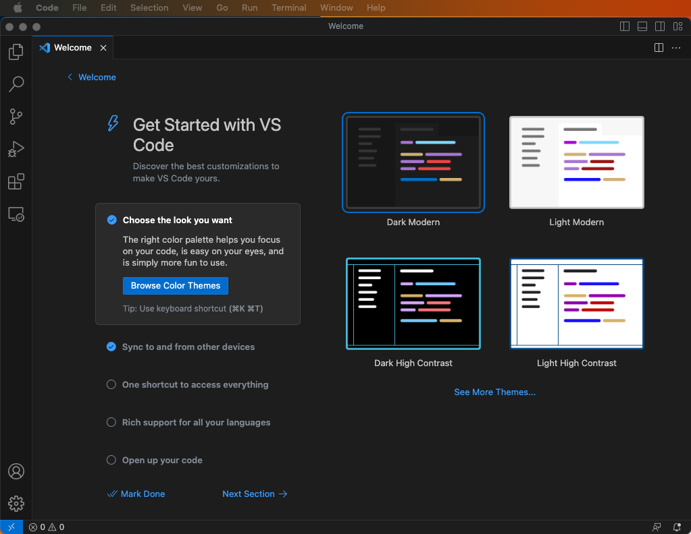
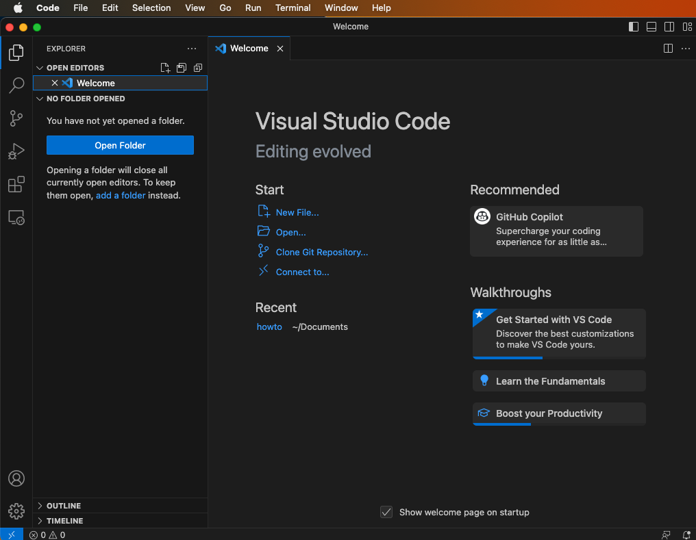
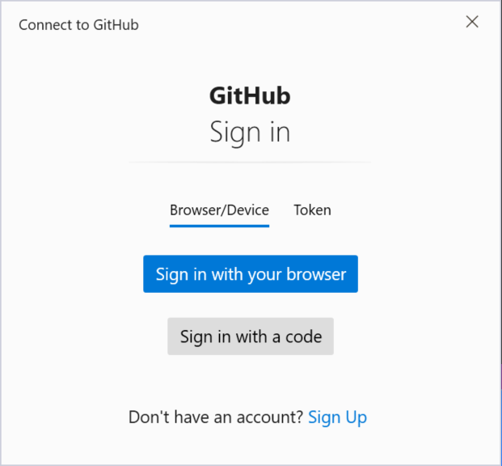

In this resource, you will learn

- use code editor VS Code for working collaboratively in Git with Windows, Mac and Linux
- track changes in VS Code
- clone and push a remote repository

## Starting our editor with add-ons: Visual Studio Code

### Windows

Open (Visual Studio) Code or VS(Codium) from the start menu. You can just open it and start typing Code or VS.


You can either read and follow the tips and customize the appearance or click on `🡰 Get Started`.


### MacOS

Open Visual Studio Code or VSCodium from your application folder.



You can either read and follow the tips and customize the appearance or click on `🡰 Get Started`.



### Linux

Open the start menu or the application drawer of your desktop environment and search for Code or VSCodium.

### Working with git in the editor

#### Access token

Follow the steps that are explained in getting an access token, so that you can link your editor to your Git account.

#### Cloning a repository and getting data

For example we want to clone `wboe-artikel` from https://gitlab.oeaw.ac.at/acdh-ch/wboe.
The data at this location, in this repository, is marked as private. So you need to log into gitlab.oeaw.ac.at with the account you set up to see the contents.

On the top right there is a `Clone` button which, when clicked, gives you two options `Clone with SSH`
and `Clone with HTTPS`. We need the HTTPS option. On the right there is a copy to clipboard button we can use.

If you installed Visual Studio Code there is a special kind of link that will open Visual Studio Code
if you allow it and start the cloning process with the right settings.


<SideNote type="note">
Getting access to the data on gitlab.oeaw.ac.at is different on all three OS
</SideNote>


#### Windows

You can paste the \`https://...\` of any git repository from a server in the text field that appears when we click \`Clone Git repository...\` on the start screen of VSCodium or Visual Studio Code.


After you hit enter a dialog appears asking you where to store the contents of the repository locally:


  
  The very first time for each web site like gitlab.oeaw.ac.at in Windows a dialog will open that asks
  us for user name and password.



#### MacOS

You can paste the \`https://...\` of any git repository from a server in the text field that appears when we click \`Clone Git repository...\` on the start screen of VSCodium or Visual Studio Code:


```
  On MacOS Visual Studio Code asks us for our username and password when we try to clone the
  repository the first time.
  !\[username password MacOS](/assets/images/username_password_MacOS.png "username password MacOS")
  These are passed to Git and Git saves them in the "keychain" which also for example Safari
  uses to save credentials.
```

#### Linux

```
  On Linux Visual Studio Code asks us for our username and password when we try to clone the
  repository the first time.
```

<SideNote type="info">


```
  If git-credential-libsecret is installed the username and password will be stored and Visual
  Studio Code will not ask us in the future. If it is not installed we have to type the password
  again next time we interact with the repository on the gilab server.
</Tab>
```
</SideNote>