### Learning outcomes

- use code editor VS Code for working collaboratively in Git with Windows, Mac and Linux
- track changes in VS Code
- clone and push a remote repository from the code editor

## Starting our editor with add-ons: Visual Studio Code

VS Code and VSCodium are examples for code editors. Using the commnand line or terminal instead has the same results. However, in a code editor, you can work in a graphical user interface.

### Windows

Open (Visual Studio) Code or VS(Codium) from the start menu. You can just open it and start typing Code or VS.


You can either read and follow the tips and customize the appearance or click on `🡰 Get Started`.


### MacOS

Open Visual Studio Code or VSCodium from your application folder.


You can either read and follow the tips and customize the appearance or click on `🡰 Get Started`.


### Linux

Open the start menu or the application drawer of your desktop environment and search for Code or VSCodium.

### Working with git in the editor

#### Access token

Follow the steps that are explained in getting an access token, so that you can link your editor to your Git account.

#### Cloning a repository and getting data

For example we want to clone `wboe-artikel` from https://gitlab.oeaw.ac.at/acdh-ch/wboe.
The data at this location, in this repository, is marked as private. So you need to log into gitlab.oeaw.ac.at with the account you set up to see the contents.

On the top right there is a `Clone` button which, when clicked, gives you two options `Clone with SSH`
and `Clone with HTTPS`. We need the HTTPS option. On the right there is a copy to clipboard button we can use.

If you installed Visual Studio Code there is a special kind of link that will open Visual Studio Code
if you allow it and start the cloning process with the right settings.


<SideNote type="note">
Getting access to the data on gitlab.oeaw.ac.at is different on all three OS
</SideNote>

<SideNote type="info">
#### Windows

You can paste the \`https://...\` of any git repository from a server in the text field that appears when we click \`Clone Git repository...\` on the start screen of VSCodium or Visual Studio Code.


After you hit enter a dialog appears asking you where to store the contents of the repository locally:


  The very first time for each web site like gitlab.oeaw.ac.at in Windows a dialog will open that asks
  us for user name and password.


#### MacOS

You can paste the \`https://...\` of any git repository from a server in the text field that appears when we click \`Clone Git repository...\` on the start screen of VSCodium or Visual Studio Code:


On MacOS Visual Studio Code asks us for our username and password when we try to clone the repository the first time.

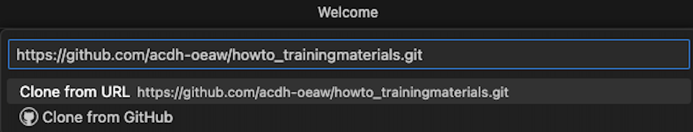


These are passed to Git and Git saves them in the "keychain" which also for example _Safari_ uses to save credentials.

#### Linux

On Linux Visual Studio Code asks us for our username and password when we try to clone the repository for the first time.

If git-credential-libsecret is installed the username and password will be stored and Visual Studio Code will not ask us in the future. If it is not installed we have to type the password again next time we interact with the repository on the gilab server.
</SideNote>

At the end there is a little dialog in the bottom right corner, click open there:


Because Visual Studio Code is a development environment where developers can execute code they just downloaded from somewhere on the internet, Visual Studio Code asks if we trust the current repository. Therefore, choose to "trust" the repository that you downloaded from a team you know.


[](command_line#cloning-a-remote-repository)

### Tracking changes

As you have already learnt in previous resources, git is very helpful in tracking changes in a project.

Git can record which changes, to which documents, have been made when, and by whom. It allows to keep a detailed revision history of a project, because it can **save snapshots** - the **commits** - of a project at specific points in time, thus being open to review any time in the future.

Version control allows to save versions of content, restore previous versions, and compare different versions. This is especially beneficial when working with multiple documents, and when working in teams of more than one (potentially working on the same document).

Before uploading any changes, you want to track them locally. After cloning the wboe-repo, let's open the `README.md` in Visual Studio Code. This is done while the uppermost mode on the left is selected (the two sheets, files)

We want to change something so we replace the text about adding a good description with `Done.`

Now we can select the third mode from the top (three connected circles, the graph changes and branches make up in version control)

This only lists those files that we change since we last made our changes permanent, committed (to) them.
The README.md is listed. If we double click it we get the following view:

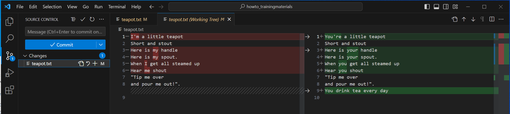

If we are not 100% sure about the changes we will now **stage**, that is prepare to be **commited**, we
can open each file and see the differences per line. This might also give us a hint what we did if the
last commit was a while back and we don't remember exactly what happened.

### Mark content changes to be included in the version history

Let's tell Git to keep an eye on changes to the newly created document `README.md`:

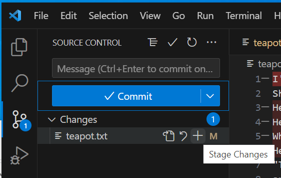

We put changes in the **staging area**, before we commit.

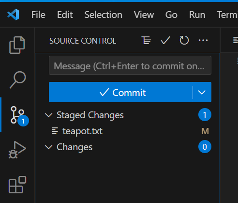

<SideNote type="info" title="Adding multiple files">

We can add multiple files by selecting the names as usual using shift or ctrl or command
and than hit the `+`.

</SideNote>

The above action is the same as 

```bash
git add -A
```

on the command line.

### Bundle changes into meaningful chunks and commit to them

Including content changes in Git's version history involves a two-step process. First, related changes are added to create semantically meaningful units of changes. But the changing a staged document will **not** propagate these changes in the next step. Keep that in mind.

When all related changes have been added to the "staging area", we can save them together as a version history snapshot, a **commit**, with a **commit message** that briefly describes _why_ changes were made. This makes it easier to understand them later when viewing the version history. **Committing** means permanently recording a snapshot of contents at a specific point in time. In VS Code, you do not need to type the command but use the commit button.

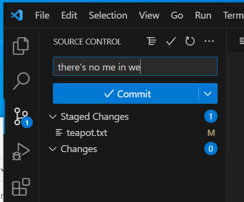

<SideNote type="info" title="Commit messages">
Whether on the command line or in an editor, choose to write meaningful commit messages. This help your work process when revisiting your changes.
</SideNote>

#### The very first commit error

If you are on a new machine and/or just installed Git you will get an error. Here is how it looks in
MacOS:

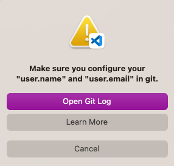

or Windows:

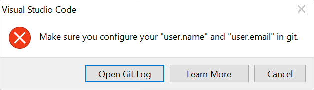

Whether you use `Learn More` or `Open Git log`, you will eventually see that Git just wants to know who commits here. We suggest to use `Open Git log` which shows a new set of controls at the bottom right.
Alternatively you can select "Terminal" and "New Terminal" from the menu bar

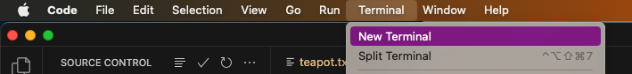

<SideNote type="info" title="The tell me who you are - message">

</SideNote>

<SideNote type="info" title="Text for copying">


```
> git -c user.useConfigOnly=true commit --quiet --allow-empty-message --file -
Author identity unknown

*** Please tell me who you are.

Run

  git config --global user.email "you@example.com"
  git config --global user.name "Your Name"

to set your account's default identity.
Omit --global to set the identity only in this repository.

fatal: no email was given and auto-detection is disabled
```
</SideNote>

There is no graphical interface for this most often one time configuration.
You need to copy the two suggested commands and execute them in a terminal. Visual Studio Code provides one. So click on "Terminal" at the bottom right.

<SideNote type="info" title="Unfortunately this differs again between the three OSes">
### Windows

Unfortunately when you click on "Terminal" now you get a terminal that does not know `git` (yet).
If you want to set your e-mail and name you need to click on the `V` next to the `+` next to `powershell`. This will open a `Git bash`.


### MacOS

Only on MacOS as a first time user you are asked to configure your shell a little. You can either skip that or maybe look at the defaults and use them. The keys you need to type are listed.

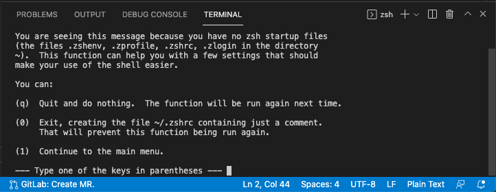


### Linux

  This is the only OS where you can just type the two commands.

</SideNote>

Now replace `you@example.com` and `Your Name` with your name and execute two commands to configure Git. You can copy the commands from above.


[](command_line#bundle-changes-into-meaningful-chunks-and-commit-to-them)

### Keeping repositories in sync: fetch, pull, push

To get our changes to the server so other people in our team can fetch them to review them for example
we now `push` what we `committed` on our machine to the server.

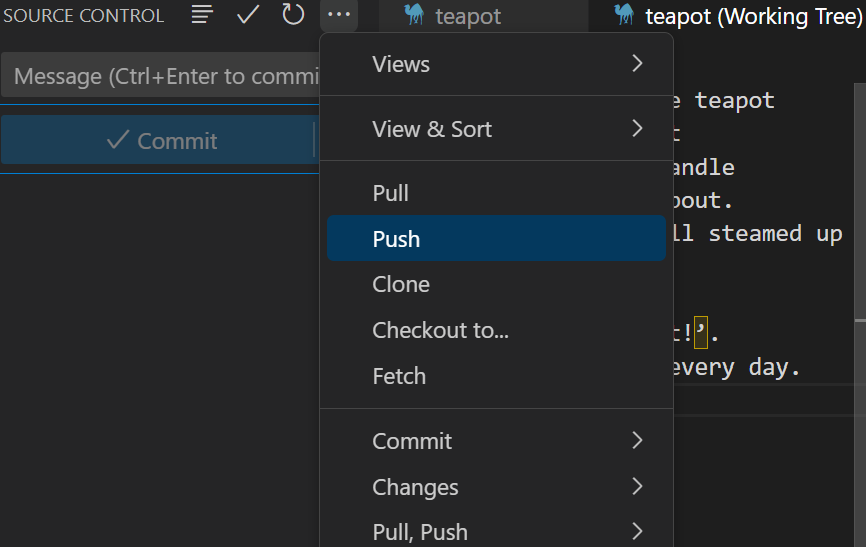

The opposite action is to `pull` from the server. This means getting all the changes accumulated there
and integrating them (merging them with our local changes if any) in the files we see locally.

If we just want to download all change not integrating them at the same time we `fetch` from the server.

### Merging and conflict resolution

What happens if two people edit the same file? Well it depends:

1. If the two edit different lines in the file then the changes can be `merged` automatically
   That is a good solution in the majority of cases and it saves a lot of time.
2. I two people edit the same line then there is a `conflict` that needs to be `resolved`

Conflicts are marked with these distinct lines

```bash
<<<<<<<< ...
One change
--------
The other change
>>>>>>>> ...
```

Note that Visual Studio Code provides us with a few controls we can click to resolve the conflict.

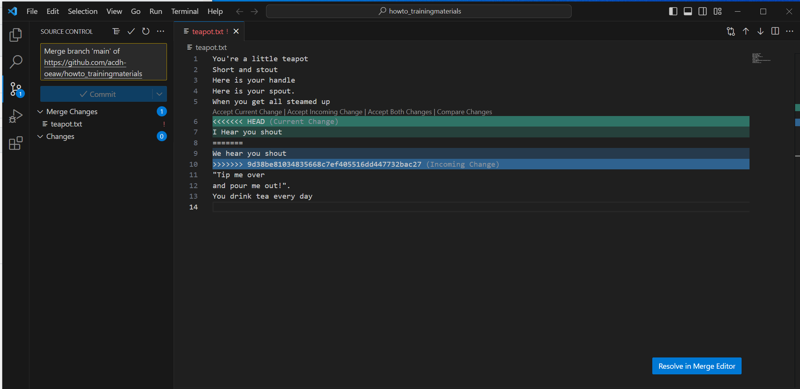

We now can decide which is the better change (or use both if applicable):

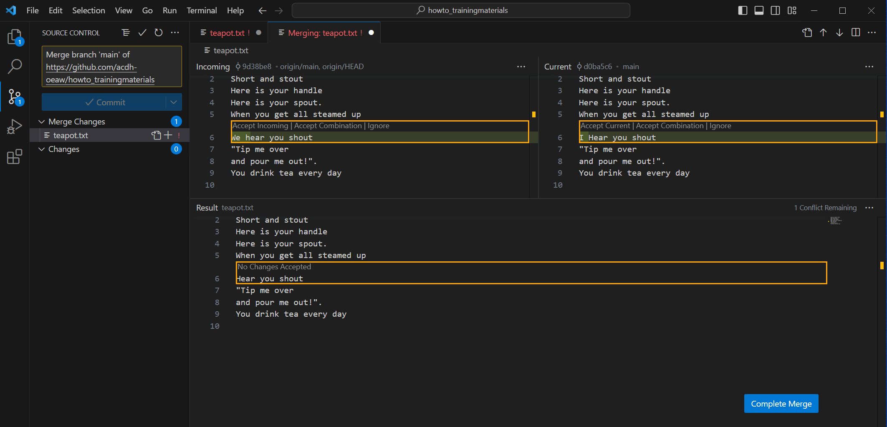

And after resolving **all** the conflicts we do a `merge commit` (the text is there automatically)

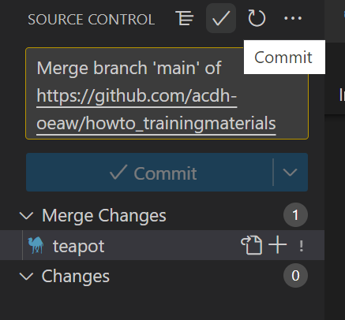

_Note_: **Never** commit before resolving all conflicts, removing all conflict markers.
You will make the maker lines permanent and They are made like this to break any programming
language and XML.


### Training task

Open your code editor. Clone the repository "https://github.com/acdh-oeaw/howto_trainingmaterials" to your local work station. We used it in the **Git collaboration** - resource too.

Inspect the repository by checking its status, and fetch all changes that have been created in the meantime. 

Navigate to the test-file.mdx and open it. In it, you will find several sentences talking about \*\*beagle\*\* dogs. Replace the word "beagle" or "beagles" with "Basset hound" and move all those sentences to the very end of the document. Save your actions and commit them with a meaningful message.

Perform \`git push\`.