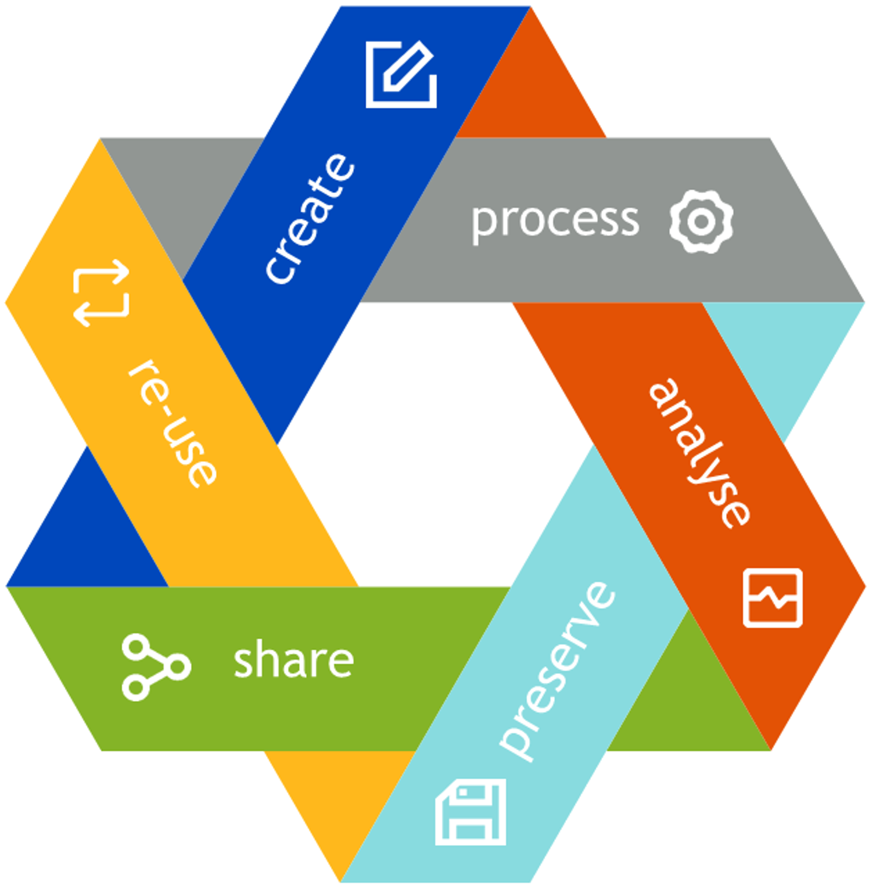
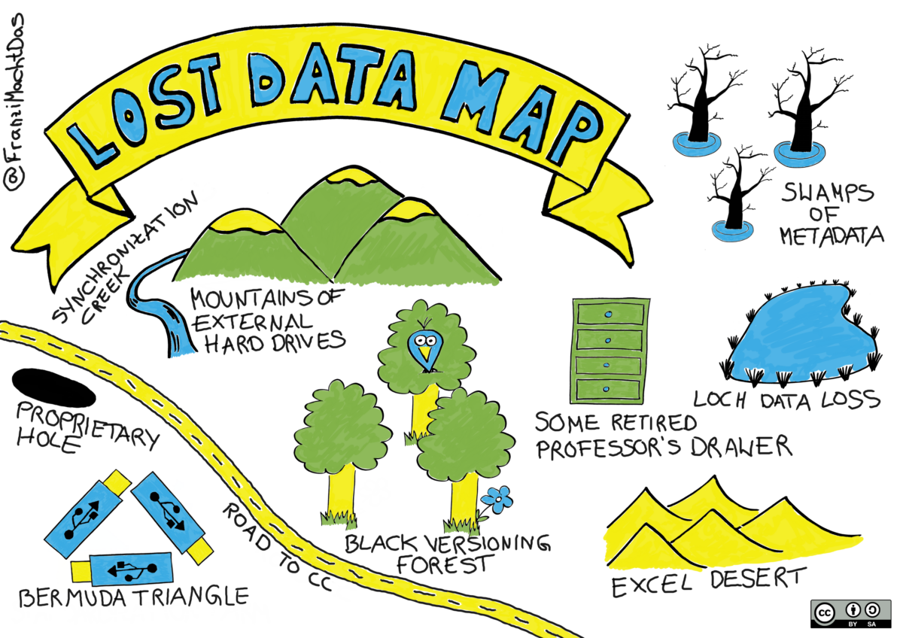

## Lernziele:

- Die Rolle und den Lebenszyklus von Daten in den Geisteswissenschaften verstehen
- Zentrale Fragen für die Datennutzung und Archivierung beantworten können
- Datenmanagement als wichtigen und zentralen Bestandteil der eigenen Forschung begreifen
- Grundlegende Regeln für Dateibenennung und Ordnerstrukturierung anwenden können
- Vor- und Nachteile von Dateiformaten für die Archivierung kennen
- Versionierungen effizient betreiben

## A. Einleitung: Daten in der Gesellschaft und Geisteswissenschaftlichen Forschung

Daten begegnen uns in allen Bereichen des Lebens. Zumeist denkt man bei Daten an (Forschungs-)Gebiete wie Statistik, Biologie, Meteorologie, Finanzen oder Transportwesen. Doch Daten sind auch ein zentraler Bestandteil von geisteswissenschaftlichen Forschungen. Je nach Disziplin und Fragestellung arbeiten die Geisteswissenschaften mit unterschiedlichen Arten von Daten und Materialien, wie zum Beispiel:  

- Primär- und Sekundärtexte, 
- Audio und Videomaterial, 
- Bilder und Objekte, 
- 3D-Daten und Geoinformationsdaten oder auch
- Tabellen, Simulationen und Datenbanken. (Andorfer, „[Forschungsdaten in den (digitalen) Geisteswissenschaften](nbn:de:gbv:7-dariah-2015-7-2)"; und DFG, „[Umgang mit Forschungsdaten](https://www.dfg.de/foerderung/grundlagen_rahmenbedingungen/gwp/index.html)“). 

Je nach Forschungsgebiet wird in den Geisteswissenschaften nicht nur mit bestehenden Daten gearbeitet, sondern oftmals werden neue Daten produziert, zum Beispiel durch Umfragen, Audio- und Videoaufzeichnungen, oder Digitalisierungen (siehe: Deutsche Forschungsgemeinschaft, „[Umgang mit Forschungsdaten](https://www.dfg.de/foerderung/grundlagen_rahmenbedingungen/gwp/index.html)“). 
Im Sinne der guten wissenschaftlichen Praxis (siehe: [ÖAWI](https://oeawi.at/richtlinien), [FWF, Research Integrity](https://www.fwf.ac.at/de/forschungsfoerderung/forschungsintegritaet-forschungsethik) und [DFG](https://www.dfg.de/foerderung/grundlagen_rahmenbedingungen/gwp/index.html)) sollten am Ende eines Projektes nicht nur die Ergebnisse, sondern auch die zugrunde liegenden Daten veröffentlicht werden . Dies erfordert, dass (Forschungs-)Daten nicht nur während des Projekts, sondern auch nach Ende des eigenen Forschungsprojekts langfristig zugänglich, wiederverwendbar, überprüfbar und reproduzierbar werden - unabhängig vom ursprünglichen Datenersteller oder Projektkontext. Zu diesem Zweck müssen die Daten während aller Projektphasen von der Planung bis zum Abschluss oder - anders ausgedrückt - während ihres gesamten Datenlebenszyklus verwaltet werden. Um eine möglichst reibungslose Arbeit mit den Daten während des Projekts und deren Nachnutzbarkeit zu gewährleisten, ist ein gutes Datenmanagement unerlässlich.

**Einstiegsfragen:** 

Denken Sie an Ihre eigene Forschungsdisziplin und/oder Ihr Forschungsprojekt. Welche Antworten treffen auf Sie zu? Die Fragen dienen lediglich der Orientierung und es kann daher auch mehr als Antwort auf Sie zutreffen.

<Quiz>
  <Quiz.Card>
    <Quiz.MultipleChoice>
      <Quiz.Question>
        Mit welchen Arten von Daten arbeiten Sie? (Mehrfachantwort möglich)
      </Quiz.Question>

      <Quiz.MultipleChoice.Option isCorrect>
        Texte (analog, digital)
      </Quiz.MultipleChoice.Option>

      <Quiz.MultipleChoice.Option isCorrect>
        Audiomaterial und/oder Videoaufzeichnungen
      </Quiz.MultipleChoice.Option>

      <Quiz.MultipleChoice.Option isCorrect>
        Bilder und/oder Objekte
      </Quiz.MultipleChoice.Option>

      <Quiz.MultipleChoice.Option isCorrect>
        Interviews
      </Quiz.MultipleChoice.Option>

      <Quiz.MultipleChoice.Option isCorrect>
        Tabellen
      </Quiz.MultipleChoice.Option>

      <Quiz.MultipleChoice.Option isCorrect>
        Geoinformationsdaten
      </Quiz.MultipleChoice.Option>

      <Quiz.MultipleChoice.Option isCorrect>
        3D-Daten
      </Quiz.MultipleChoice.Option>

      <Quiz.MultipleChoice.Option isCorrect>
        Simulationen
      </Quiz.MultipleChoice.Option>

      <Quiz.MultipleChoice.Option isCorrect>
        Datenbanken
      </Quiz.MultipleChoice.Option>

      <Quiz.Message type="correct">
        Auch wenn Sie nur eine oder zwei Arten von Forschungsdaten angekreuzt haben, wird ein stringentes Datenmanagement hilfreich für Ihre Forschungsarbeit und deren weitere (öffentliche) Nutzung sein. Wenn Sie mit vielen unterschiedlichen Datentypen arbeiten, sollten Sie sich unbedingt einen durchdachten Plan für ein Datenmanagement zurechtlegen.
      </Quiz.Message>

      <Quiz.Message type="incorrect">
        Auch wenn Sie nur eine oder zwei Arten von Forschungsdaten angekreuzt haben, wird ein stringentes Datenmanagement hilfreich für Ihre Forschungsarbeit und deren weitere (öffentliche) Nutzung sein. Wenn Sie mit vielen unterschiedlichen Datentypen arbeiten, sollten Sie sich unbedingt einen durchdachten Plan für ein Datenmanagement zurechtlegen.
      </Quiz.Message>
    </Quiz.MultipleChoice>
  </Quiz.Card>

  <Quiz.Card>
    <Quiz.MultipleChoice>
      <Quiz.Question>
        Arbeiten Sie alleine oder in einem (größeren) Forschungsteam?
      </Quiz.Question>

      <Quiz.MultipleChoice.Option isCorrect>
        Ich arbeite alleine.
      </Quiz.MultipleChoice.Option>

      <Quiz.MultipleChoice.Option isCorrect>
        Ich arbeite in einem Forschungsteam an meiner Arbeitsstelle.
      </Quiz.MultipleChoice.Option>

      <Quiz.MultipleChoice.Option isCorrect>
        Ich arbeite mit externen Projektmitarbeitern und Projektmitarbeiterinnen von anderen Institutionen.
      </Quiz.MultipleChoice.Option>

      <Quiz.Message type="correct">
        Aktives Datenmanagement ist besonders bei Forschungsprojekten und in der Teamarbeit sehr wichtig. Aber auch wenn Sie alleine arbeiten, vereinfacht ein gutes Datenmanagement die Arbeit.
      </Quiz.Message>

      <Quiz.Message type="incorrect">
        Aktives Datenmanagement ist besonders bei Forschungsprojekten und in der Teamarbeit sehr wichtig. Aber auch wenn Sie alleine arbeiten, vereinfacht ein gutes Datenmanagement die Arbeit.
      </Quiz.Message>
    </Quiz.MultipleChoice>
  </Quiz.Card>

  <Quiz.Card>
    <Quiz.MultipleChoice>
      <Quiz.Question>
        Haben Sie sich schon Gedanken über einen Datenmanagementplan für Ihre Forschungsarbeit/Forschungsprojekt gemacht?
      </Quiz.Question>

      <Quiz.MultipleChoice.Option isCorrect>
        Ja
      </Quiz.MultipleChoice.Option>

      <Quiz.MultipleChoice.Option>
        Nein.
      </Quiz.MultipleChoice.Option>

      <Quiz.Message type="correct">
        Sehr gut! Wir hoffen, dass wir Ihnen trotzdem noch ein paar hilfreiche Informationen und Tipps geben können, um den Prozess zu verbessern.
      </Quiz.Message>

      <Quiz.Message type="incorrect">
        Kein Problem! Sie werden hier einige einfache Grundlagen lernen, um Ihr Datenmanagement effizient zu gestalten.
      </Quiz.Message>
    </Quiz.MultipleChoice>
  </Quiz.Card>
</Quiz>

## B. Datenlebenszyklus & Datenmanagement

Daten sind das Herzstück eines jeden Forschungsprojekts, denn:

- Unser Wissen über ein bestimmtes Thema basiert auf **Daten**.
- **Daten** bilden den Ausganspunkt von Forschungsprojekten und -fragen.
- Das Arbeiten mit und Analysieren von **Daten** generiert neue **Daten** und neues Wissen im Verlauf eines Projekts.
- Neue Forschungsergebnisse beruhen auf **Daten**.

Üblicherweise haben (Forschungs-)Daten eine über ein konkretes Projekt hinausgehende Lebensdauer, was mit Hilfe des sogenannten Datenlebenszyklus (data life cycle) visualisiert wird: Im Laufe eines Forschungsprojekts werden Daten generiert (create), bearbeitet (process), analysiert (analyse), aufbewahrt (preserve), geteilt (share) und – im besten Fall – wiederverwendet (re-use). Die Grafik symbolisiert sehr gut, dass der Lebenszyklus von Daten aufrechterhalten werden sollte, damit die Bearbeitung darauf aufbauender Fragestellungen ermöglicht wird. Außerdem kann die Generierung von Daten oftmals kostenintensiv sein, weshalb eine langfristige Aufbewahrung der gewonnenen Daten besonders wichtig ist (siehe: [IANUS Lebenszyklus](https://ianus-fdz.de/lebenszyklus), [UK Data Service](https://ukdataservice.ac.uk/learning-hub/research-data-management/)).

Welchen Gefahren Daten im Laufe ihres Datenlebenszyklus ausgesetzt sind, hat Franziska Mau in der Grafik „Lost Data Map“ eindringlich visualisiert – kommt Ihnen die eine oder andere Gefahr bekannt vor?

Eine oft genutzte aber besonders anfällige Methode für einen Datenverlust stellt die Speicherung von Daten auf USB-Sticks dar. Geht der Stick verloren oder ist dieser beschädigt, so sind auch die darauf gespeicherten Daten verloren. Dasselbe gilt für externe Festplatten. Außerdem stellt bei beiden Speichermedien die Synchronisierung mit lokalen Rechnern oder Netzlaufwerken eine Gefahrenquelle dar, da diese nicht immer einwandfrei klappt oder nicht regelmäßig durchgeführt wird und es somit zu Ungleichheiten im Datenbestand kommt. Eine weitere Gefahrenquelle für einen Datenverlust sind private Rechner oder externe Festplatten, die mit dem Ausscheiden einer Person aus einem Projekt nicht mehr zugänglich sind. Auch proprietäre Daten sind gefährdet, vor allem wenn die darauf abgestimmte Software nicht mehr zur Verfügung steht und die Daten daher nicht mehr auslesbar sind.

Im nächsten Abschnitt wollen wir einige grundlegende und einfach anwendbare Prinzipien des Datenmanagements vorstellen, um diese Tücken zu vermeiden.

**Weiterführende Literatur und Links:**

- Trognitz, Martina. "[Der Lebenszyklus von Forschungsdaten](https://ianus-fdz.de/lebenszyklus)." _IANUS_. 7. August 2017.
- UK Data Service. "[The importance of managing and sharing data](https://ukdataservice.ac.uk/learning-hub/research-data-management)." _University of Essex_. 2012-2022.

## C. Eine Einführung in das Datenmanagement

### C.1. Schritt 1: Die Planung - Gut vorbereitet in ein erfolgreiches Datenmanagement starten

Der erste wichtige Schritt für ein erfolgreiches Datenmanagement ist dessen Planung. Diese sollte am Beginn eines jeden Forschungsprojekts stehen, also bevor die Arbeit im Projekt startet, bzw. an oder mit Daten gearbeitet wird. Die geplanten Abläufe des Datenmanagements in einem wissenschaftlichen Projekt werden in einem sogenannten Datenmanagementplan (DMP) dokumentiert. Ein Datenmanagementplan beantwortet unter anderem folgende Fragen:

- Was möchte man mit dem Projekt erreichen?
- Wie möchte man dieses Ziel erreichen?
- Welche Vorgaben (zum Beispiel von den Fördergebern) sind dabei zu erfüllen?
- Welche Standards, Regulatoren und Verpflichtungen muss man beachten und nachkommen? Das beinhaltet:

  - Nationale/internationale Gesetze, Verträge, Vorgaben von Ethikkommissionen
  - Institutspolitik, Best Practice Modelle
  - Standards in der eigenen Forschungsdisziplin, wie zum Beispiel: [CLARIN Standards](https://standards.clarin.eu/sis/), [PARTHENOS - Standardization Survival Kit (SKK)](http://www.parthenos-project.eu/)
- Wie möchte man die Daten (während des Projekts und vor allem danach) teilen und mit wem (e.g. Fachpublikum, Öffentlichkeit)? Zwei wichtige Prinzipien in diesem Kontext sind:

  - FAIR Data: [FAIR Data Principles](https://force11.org/info/the-fair-data-principles/), [Go Fair](https://www.go-fair.org/), Jones und Grootveld: "[How FAIR are your data](https://www.cessda.eu/content/download/3845/35038/file/20170707_How_FAIR_are_your_data_Jones.pdf)?"
  - Open Science: Daten sollten nicht nur auffindbar und nachnutzbar, sondern möglichst offen für alle zur Verfügung gestellt werden; siehe: [FOSTER Open Science](https://www.fosteropenscience.eu/resources).

Bei Förderanträgen im wissenschaftlichen Bereich wird vermehrt die Vorlage eines Datenmanagementplans gefordert. Wenn Sie die obenstehenden Fragen beantworten und ausformulieren, dann haben Sie bereits die wichtigsten Eckpunkte Ihres Datenmanagementplans gesammelt, denn:

> „A data management plan or DMP is a formal document that outlines how data are to be handled both during a research project, and after the project is completed.” (Wikipedia, „Data management plan“)

Diese knappe, aber treffende Definition hebt zwei zentrale Bereiche des Datenmanagements hervor: die Frage nach dem Urheberrecht bzw. der Lizenzierung und die Veröffentlichung bzw. Langzeitarchivierung von Daten nach Projektende. Beim Urheberrecht bzw. der Nutzung von lizenzierten Daten ist vorab zu klären, unter welchen Bedingungen die Daten Dritter im eigenen Projekt verwendet werden dürfen. Beim Aspekt der Veröffentlichung und Archivierung geht es um die im Rahmen des Forschungsprojekts neu gewonnenen Daten und Ergebnisse. Hier sollten Sie sich Gedanken darüber machen, in welcher Form eine Veröffentlichung der Daten geplant ist und in welcher Form eine Langzeitarchivierung (und somit Zugänglichkeit) Ihrer Daten gewährleistet werden kann. Dies bezieht ebenfalls die Frage nach der Vergabe einer geeigneten Lizenz mit ein.

<SideNote type="tip">
Vertiefende Informationen zu gesetzlichen Vorgaben und Richtlinien gibt Vanessa Hannesschläger im Video „[Lizenzen, Urheberrecht und der Umgang mit sensiblen Daten](https://www.youtube.com/watch?v=Xq9z0gKXRZc)“ (Vortrag Tool Gallery 7.2. Datenmanagement, 16. November 2021).
</SideNote>

**Literatur und weiterführende Links:**

Für weiterführende Informationen, Richtlinien und Beispiele für Datenmanagementpläne sind folgende Seiten empfehlenswert:

- [Forschungsdaten.info: Der Datenmanagementplan](https://www.forschungsdaten.info/themen/informieren-und-planen/datenmanagementplan/)
- [IANUS: Datenmanagement](https://www.ianus-fdz.de/it-empfehlungen/datenmanagement)
- [DCC: Data Management Plans](https://www.dcc.ac.uk/resources/data-management-plans)
- [Science Europe: Practical Guide to the International Alignment of Research Data Management](https://www.scienceeurope.org/our-resources/practical-guide-to-the-international-alignment-of-research-data-management/)
- [FWF: Forschungsdatenmanagement](https://www.fwf.ac.at/de/forschungsfoerderung/open-access-policy/forschungsdatenmanagement/)
- [OpenAIRE und EUDAT: ARGOS](https://argos.openaire.eu/splash/)
- [DMPonline](https://dmponline.dcc.ac.uk/)

### C.2. Schritt 2: Daten effizient organisieren und strukturieren

Ein sicherer Ort für die Datenablage ist gefunden, doch dieser allein reicht noch nicht aus. Damit man sich an diesem Ort nicht verläuft und anderen (und auch sich selbst) dabei hilft, bestimmte Daten schnell und auch nach einer (kürzeren oder längeren) Pause die Inhalte rasch und effizient zu finden, verstehen und nutzen zu können, ist es sinnvoll, sich vorab klare Regeln für die Benennung von Dateien und Ordnern und geeignete Ordnerstrukturen zu überlegen. Wir wollen uns in diesem Kapitel einige leicht umzusetzende Best-Practice Beispiele ansehen. Diese können an unserem Übungsbeispiel am Ende des Kapitels ausprobiert und dann auf eigene Forschungsprojekte angewendet werden.

Viele kennen das Problem einer inkonsistenten Ordner- und Dateibenennung aus dem eigenen Privatleben. Bei der Arbeit und vor allem in einem Team kann dies noch schneller zu Problemen führen. Schon ein paar einfache Maßnahmen können hier zur besseren Strukturierung beitragen.

Gute Datei- und Ordnernamenskonventionen:

- Verwenden Sie **eindeutige** Namen, die sich **klar voneinander unterscheiden** (vermeiden Sie z.B. Namen, die sich nur in der Groß- und Kleinschreibung voneinander unterscheiden).
- Verwenden Sie **beschreibende** Namen, die einen Hinweis auf den Inhalt der Datei, bzw. des Ordners geben.
- Seien Sie bei der Benennung **konsistent** (ändern Sie Ihr Vorgehen nicht mitten im Projekt).
- Datei- und Ordnernamen sollten **so lang wie nötig**, aber **so kurz wie möglich** gehalten werden.