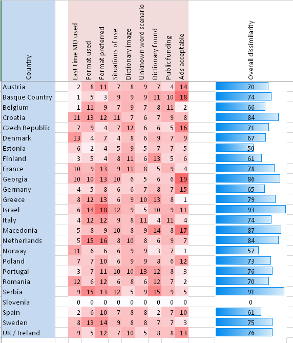

# Summary:

The goal of this course is to introduce students to the important role played by dictionary usage research when developing and implementing new dictionaries. The course will address the question of how different types of target users (in terms of age, language proficiency and pre-existing skills) or different types of use (encoding, decoding, translation etc.) influence the scope of the dictionary, the lemma selection process or the very structure of a dictionary entry. At the end of this course, students will have a fundamental understanding of the ways in which user research (both commercially and academically) can contribute to the tailoring of lexicographic content. Going beyond the realm of user-centered lexicography, the course will also explore possible user contributions in the creation of content and the increasing importance of crowdsourcing in lexicography.

# Learning outcomes:

Upon completion of this course, students will be able to:

- understand the role of users in dictionary-making process
- distinguish between different types of users, as well as understand some of the specifics of different user groups
- know different methods for conducting user research, including advantages of shortcomings of each of the method
- understand the concept of crowdsourcing and different techniques of using the method in dictionary compilation.

## Dictionary users and their role in making a dictionary

When starting to plan a compilation of a dictionary, one always has to consider its users. As Atkins and Rundell point out (2008: 32), in order to meet the needs of (most) users, one needs "to get the clearest possible picture of who these users are and what kinds of question they will ask of their dictionary". One of the first and most important tasks of dictionary editors and lexicographers is to prepare a profile of their user(s), and read up on the latest literature on dictionary use. In this course, we will look at different types of users, different methods used for conducting dictionary use research, and some recent developments on including users into dictionary-making process.

## Different types of dictionary users

There are various types of dictionary users, differing in age, education, language proficiency, contexts in which they will use a dictionary, and so forth. While a dictionary may attempt to target several different types of users, one group should be selected as the main target group. This will then have an effect on dictionary macrostructure and microstructure, for example on the amount of information provided (e.g. number of headwords), wording of the definitions and even data presentation (which features will be given more prominence).

## Example scenario

### Type of dictionary: General Bilingual Dictionary

There are many criteria that can be used to classify dictionaries. If we use form as a criteria, we can distinguish between monolingual, covering only one language, bilingual, covering two languages and multilingual, covering more than two languages. Many bilingual dictionaries are bidirectional which means they actually contain two dictionaries in one; of the two languages involved, one is once a source language and once a target language. Let us assume we are planning a general bilingual dictionary for Italian - German/ German-Italian.

### Expected users:

One of the main users groups of this dictionary are translators, as one of the purposes of the dictionary is assisting in translation tasks (this is also mentioned on the dictionary cover). Translators as a user group is a heterogeneous group and can be divided into two sub-user groups: translation students and professional translators.

**Translation students:** They have linguistic and cultural transfer skills in at least two working languages, in this case German and Italian. These skills include lexical, grammatical and pragmatic knowledge of both languages. One of the languages might their native language, or they have near-native competence of at least one of the two languages. However, translation students still have to improve their linguistic and cultural transfer skills and they have to acquire domain competences, i.e. knowledge in domain specific fields and domain-specific language. Translation students are expected to possess relevant dictionary skills such as how to consult dictionaries and search for external resources (e.g. corpora, encyclopedia etc.).

**Professional translators:** They have high language and cultural skills in at least two working languages. One of the languages might be their native language, or they have near-native competence of at least one of the working languages, in this case German and Italian. They have domain competences, i.e. knowledge in domain specific fields and domain specific language, or at least they are aware that additional knowledge is needed from external sources. Professional translators have high dictionary use skills.

Another potential user group are **language learners:**

**Learners of German:** Language learners of German (as L2) might be high school students or university students with Italian as their native language.

**Learners of Italian:** Language learners of Italian (as L1) might be high school students or university students with German as their native language.

**What the users will use the dictionary for:**

Translation students will use the dictionary to:

- understand the source text
- find equivalents in the target language
- find contextual information
- translate from L1 to L2
- translate from L2 to L1

Professional translators will use the dictionary for:

- understand the source text
- find equivalents in the target language
- find contextual information
- translate from L1 to L2
- translate from L2 to L1 (less common, since professional translators are usually required to translate into their native language)

Language Learners of German will use the dictionary to:

- find pronunciation information of a German word
- find grammatical information of a German word
- understand a German text
- find the German equivalent of an Italian word
- produce a German text
- identify and recognise false friends, i.e. two words or expressions in different languages that have similar forms but different meanings, since false friends are included within notes in the dictionary

A good representation of the complexity of user groups is offered by Arhar et al. (2016); while their figure was prepared to show the Slovenian dictionary user typology, it can be regarded as quite universal and can be applied in other countries or language communities.  Three broader user groups are distinguished according to situations of dictionary use: users in (formal) education, users in professional context, and users in spare time. Each group is quite heterogeneous; for example, users in the group using the dictionaries in the professional context range from those with linguistic education (linguists, proofreaders, translators) to those without but with frequent production of different types of texts (e.g. journalists, marketing people, lawyers).

Nonetheless, it is also important to consider that there are differences between user groups across different countries. These differences are a consequence of differences in user habits, and, sometimes relatedly, the level of development of lexicography in a particular country. The evidence of this has been provided by Kosem et al. (2018), a study using the data obtained in the European survey on dictionary use (Kosem et al. 2017). This was by far the largest-scale survey of dictionary users, with a focus on monolingual dictionaries. The survey was completed by 9,562 respondents, over 300 respondents per country on average. In Figure 2, we can see the comparison between the Slovenian dictionary users and dictionary users from 24 other countries in the way they replied to nine different questions on dictionary use and attitude towards dictionaries. The scores are available per question (see Kosem et al. 2018 for more details on the questions asked), for example we can see that on the question about whether they find ads on dictionary websites acceptable, the users from Greece, Norway, Belgium, Romania and Sweden replied were similarly to the Slovenian users. Overall similarities or dissimilarities are indicated by blue ribbons on the right, showing that especially Estonian, but also Norwegian, Finnish and Spanish users seem to exhibit most similarities in dictionary habits and preferences with the Slovenian users.

