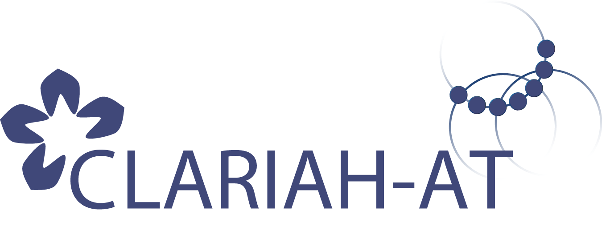

**This is a blog post series** about SemanticKraus, a research project of the [ACE](https://www.oeaw.ac.at/acdh/ace/austrian-corpora-and-editions), a research unit at the ACDH-CH of the Austrian Academy of Sciences. Read more [here](https://www.oeaw.ac.at/acdh/projects/semantickraus) (or in the blogposts to follow). These blog entries must not (and in fact cannot) be mistaken for a progress report, a research paper, or a series of technical instructions. Certain information is highly subjective and optional and digressions are expected.

Purpose of this series is to disclose the project process by sharing our experiences in a less formal, and oftentimes less technical level. Ideally, the ideas and resources provided in these posts will find application in other research projects dealing with the same era, perhaps even inspiring others to connect their data to the Linked Open Data Cloud. 

Special thanks to everyone who shared their insights with me.

## The SemanticKraus Project

In short, the project deals with index data of three different Karl Kraus related research resp. edition projects:

- [Die Fackel online](https://fackel.oeaw.ac.at), a complete digital edition of the influential periodical Kraus edited from 1899 to 1936.
- [Karl Kraus Rechtsakten](https://www.kraus.wienbibliothek.at), a digital edition of Kraus’s legal files from the estate of his long-time lawyer Oskar Samek. 
- [A digital edition of Dritte Walpurgisnacht](http://kraus1933.ace.oeaw.ac.at), Kraus’s stance in the face of the National Socialist takeover in 1933, unpublished during Kraus’s lifetime. 

All of these projects – which are in one way or another linked to the ACDH-CH – have amassed substantial amounts of index data. _Die Fackel online_, for example, includes an index of persons mentioned within the more than 22,000 pages of _Die Fackel_, amounting to a total of 16,900 names and 129,000 mentions. Kraus’s legal files are accompanied by indices containing the data of 1,700 persons and 2,100 literary and non-literary works mentioned or cited in the legal files (which by themselves amount to about 4,000 documents). The index of _Dritte Walpurgisnacht_ – notably a single, voluminous work – lists 400 people and 1,100 texts (the majority of which are newspaper articles) that are mentioned or quoted in 3,000 text passages. 

The project’s goal is to combine all these data into one single data set for display in a customized user interface. This transformation will enable interoperability with other data and other systems by transforming it to RDF, adhering to Semantic Web standards. This way, digital Kraus research will be linked to the Linked Open Data cloud.

The project is funded by [CLARIAH_AT](https://digital-humanities.at/de/dha/clariah-at).

