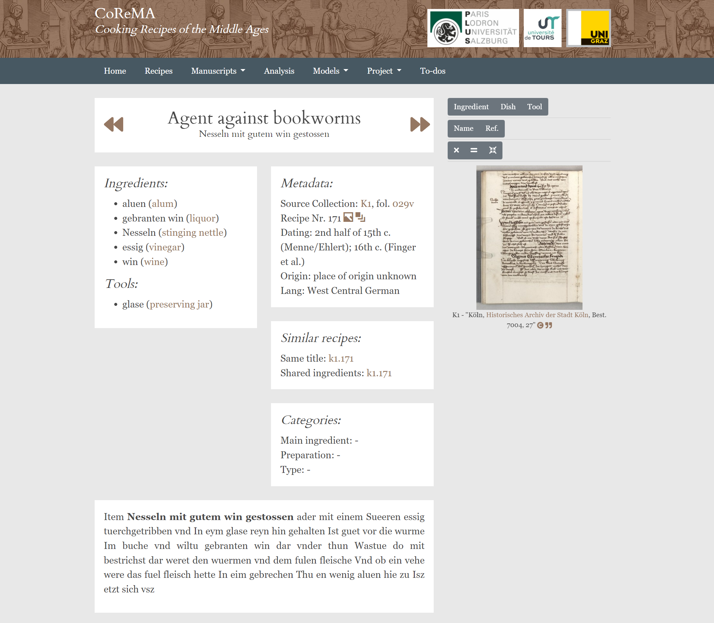
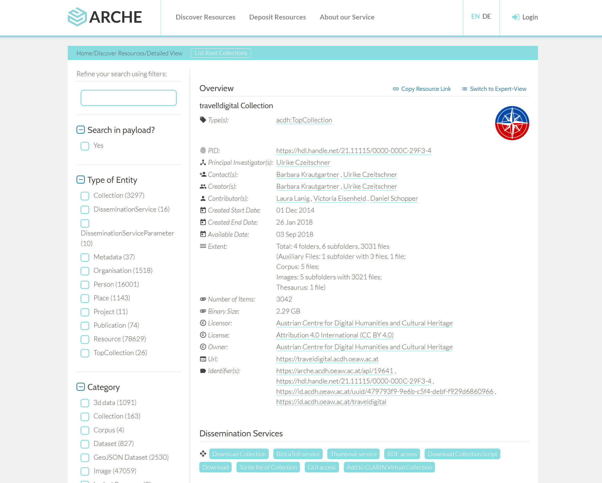
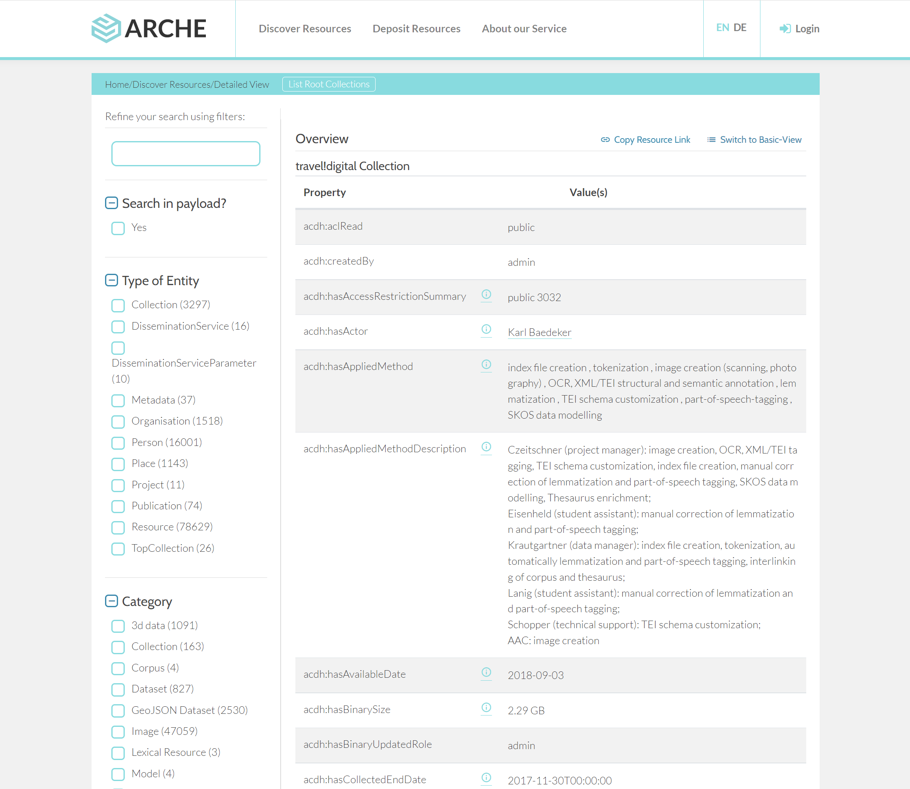
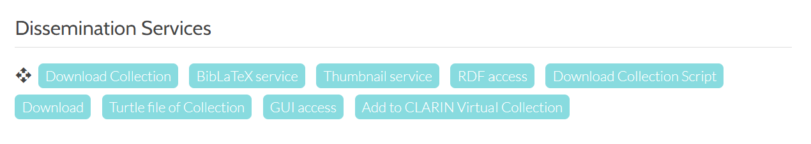
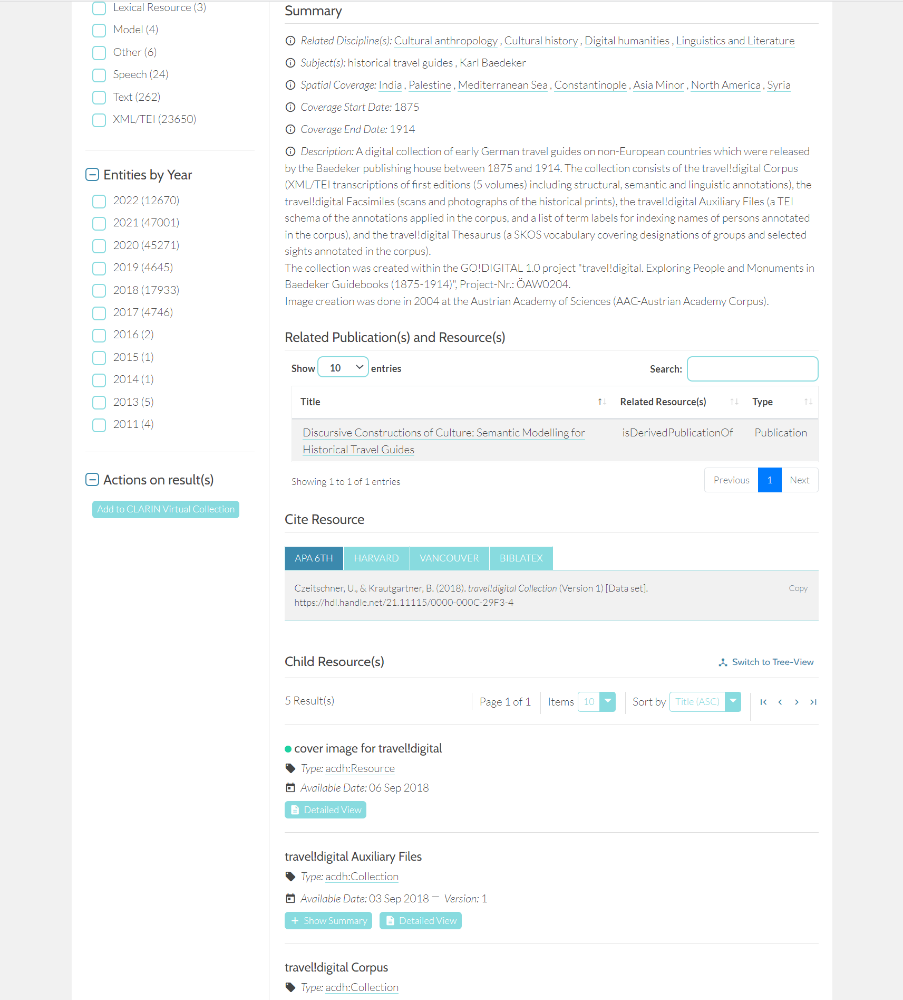
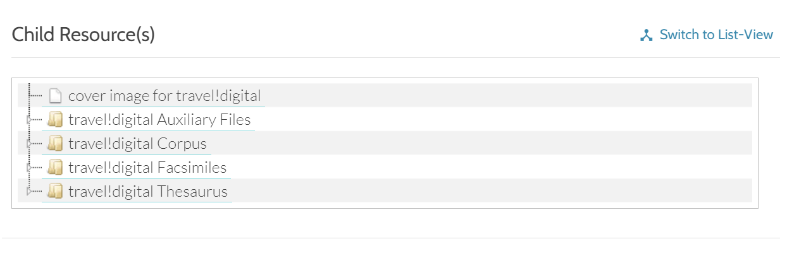
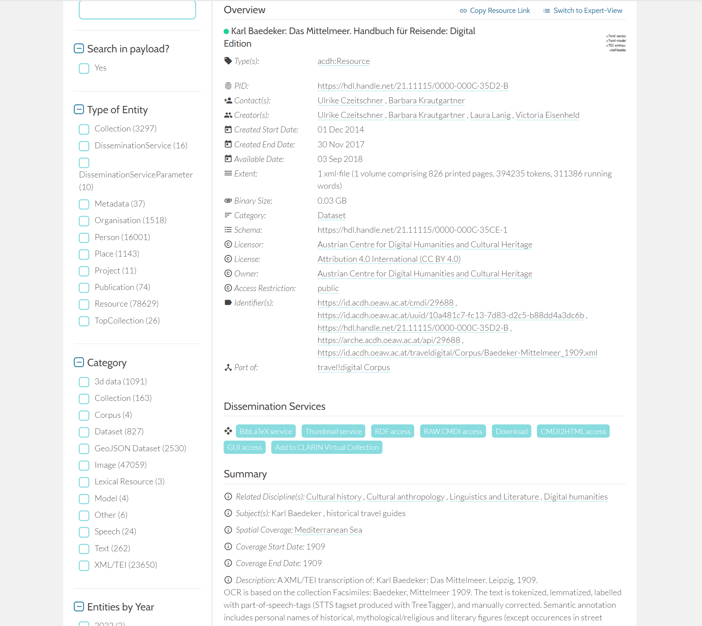
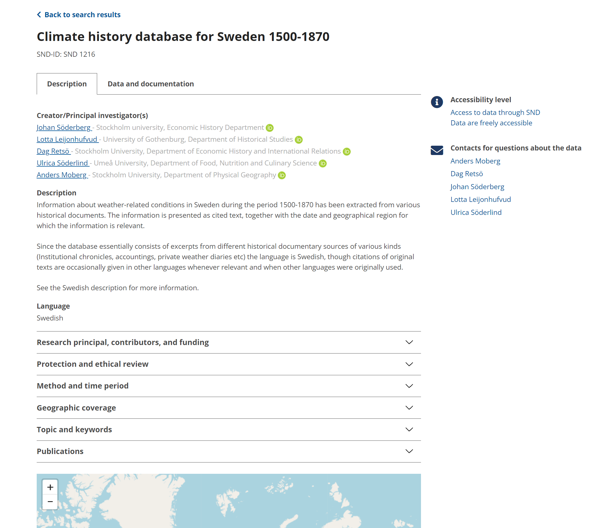
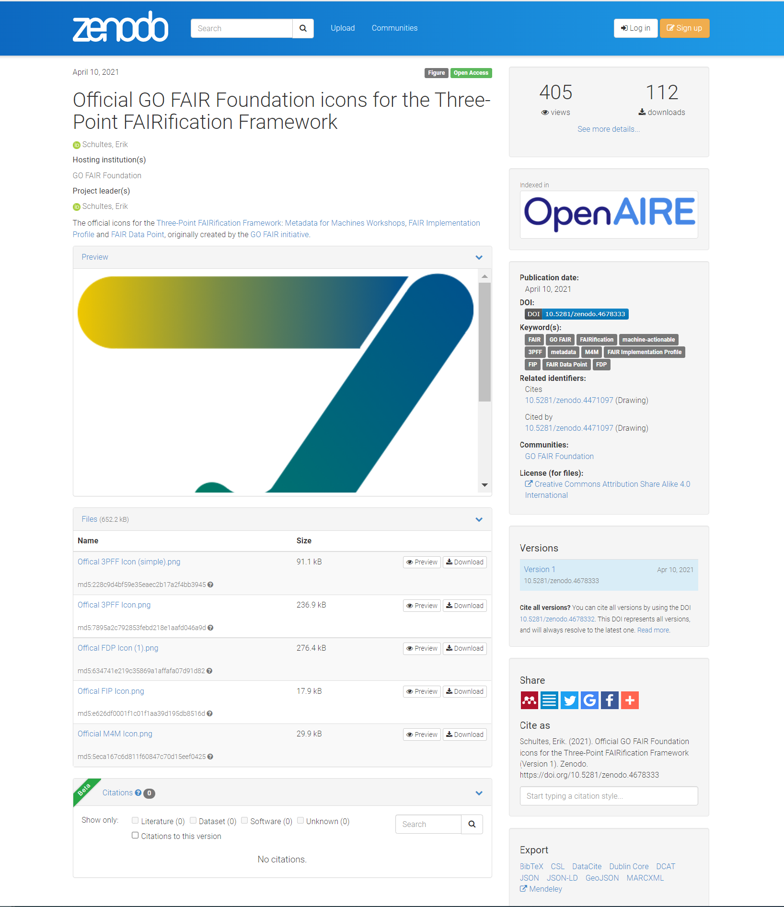
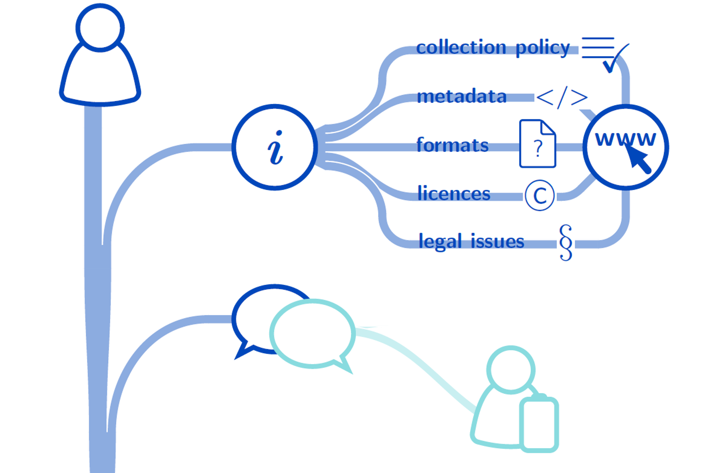

## Lernziele: 

- Den Begriff und die Notwenigkeit der (Langzeit)Archivierung verstehen. 
- Die Unterschiede von analoger und digitaler Archivierung erklären können. 
- Digitale Langzeitarchive finden, kennenlernen und vergleichen 
- Digitale Langzeitarchivierung für das eigene Projekt planen und umsetzen. 

<SideNote type="tip" title="Tipp: Video verfügbar">
Die Inhalte des Kapitels beruhen auf dem Impulsvortrag “Langzeitarchivierung” der Tool Gallery 7.2. (November 2021) des ACDH-CH, dessen Aufzeichnung (Deutsch) auf Youtube verfügbar ist.
</SideNote>

<Video provider="youtube" id="G3MsDinXS7U" caption="Impulsvortrag zu Langzeitarchivierung von Martina Trognitz im Rahmen der ACDH-CH Tool Gallery 7.2, 17.11.2021" startTime="12" />

Im letzten Kapitel der Reihe zu Datenmanagement geht es um das Thema digitale Langzeitarchivierung. Bei diesem Schritt zeigt sich auch, ob man im Projekt ein aktives und konsistentes Datenmanagement betrieben hat, oder nicht. Umso wichtiger ist es, die Archivierung bereits bei der Planung und Implementierung eines Projekts mit zu berücksichtigen. Bevor wir aber zu den konkreten Planungsschritten und Arbeitsabläufen in der digitalen Langzeitarchivierung kommen, fangen wir zunächst mit der Klärung der Grundbegriffe zur Archivierung an. 

## Definition von Archivierung 

Die Definition für das Archiv auf Wikipedia bietet bereits eine sehr gute Ausgangsbasis: 

> “Ein Archiv (lat. archivum ‚Aktenschrank‘; aus altgr. ἀρχεῖον archeíon ‚Amtsgebäude‘) ist eine Institution oder Organisationseinheit, in der Archivgut zeitlich unbegrenzt im Rahmen der Zuständigkeit des Archivs oder des jeweiligen Sammlungsschwerpunktes aufbewahrt, benutzbar gemacht und erhalten wird (Archivierung)” 

[[Wikipedia, Archiv](https://de.wikipedia.org/wiki/Archiv)]. 

Dies zeigt, dass die Begriffe “Archiv” und “Archivierung” eng zusammenhängen.  

Analoge Archive – also Archive, die physisches Material aufbewahren – enthalten dabei die zu bewahrenden Objekte sowie eventuell begleitendes Material, das diese Objekte dokumentiert. Bei analogen Archiven sind die Objekte und das archivierte Material nur lokal am physischen Ort des Archivs zugänglich. Als digitales Hilfsmittel gibt es aber Online-Findbücher – zumeist eine digitale Version der analogen Findbücher oder Karteikarten – um die Objekte im physischen Archiv zu finden. Findbücher dienen auch als ein Verzeichnis des erschlossenen archivierten Materials. Neben einem physischen Standort benötigt ein analoges Archiv auch spezifische klimatische Bedingungen in den Räumlichkeiten, um z.B. alte Manuskripte zu erhalten.

### Digitale Archivierung

Wenn man dieser Beschreibung die digitale Archivierung (auch digitale Langzeitarchivierung) gegenüberstellt, so wird deutlich, dass man es im Digitalen - vor allem bei Digitalisaten von physischen Objekten - im Grunde _nur_ mit Dokumentationsmaterial zu tun hat: entweder direkt digital erstellt oder digitalisiert. Die physischen Objekte wie ein Buch oder ein Keramikgefäß wird man im Digitalen nicht finden, sondern immer nur ihre digitalen Surrogate. Dabei gehen Informationen und Qualitäten der physischen Objekte verloren, die durch das Dokumentationsmaterial bzw. die Metadaten ergänzt und angereichert werden müssen. Der Vorteil von einem digitalen Archiv ist, dass die darin gespeicherten Daten ortsunabhängig angesehen und abgerufen werden können. Um Daten in einem digitalen Archiv zu finden, gibt es analog zu den Findbüchern durchsuchbare Online-Kataloge.  

Ein digitales Archiv hat allerdings auch eine physische Komponente, denn es benötigt redundanten Speicherplatz in der physischen Welt. Redundant bedeutet, dass die Daten idealerweise nicht nur in einem, sondern parallel in zwei oder drei Rechenzentren gespeichert werden. Daneben braucht es spezialisierte Workflows um Daten ins Archiv zu überführen und langfristig dort zu behalten. Eine Dokumentation und Spezifikation von verschiedenen Aufgaben im Bereich der digitalen Archivierung aus Sicht der Betreiber eines digitalen Archivs findet sich im [OAIS Referenzmodell](http://www.oais.info/). 

.")

Das primäre Ziel der digitalen Archivierung ist es digitale Materialien zu bewahren, um diese zu lesen, zu öffnen und deren Bearbeitung zu ermöglichen. Wenn man von Langzeitarchivierung spricht, geht man von einem Zeitraum von mindestens 10 Jahren aus. Eine Festlegung auf eine bestimmte Aufbewahrungsdauer ist jedoch schwierig, da sie u.a. davon abhängig ist, wie lange die bewahrende Institution besteht und wie es um die Finanzierung des Archivs bestellt ist.  

Es gibt generell zwei unterschiedliche Ansätze zur digitalen Archivierung: 

- Die **Migration von Dateiformaten:** Hierbei werden veraltete, bzw. obsolete Dateiformate in ein aktuelles Dateiformat überführt. Ein gutes Beispiel ist MS Word. Das Dateiformat von MS Word wurde mit Microsoft Word 2007 von \*.doc auf das XML-basierte Dateiformat \*.docx umgestellt. Wenn ein Archiv nun Dateien im MS-Word-Format archiviert, dann müssten alle vorhandenen Dokumente in\*.doc-Format nach \*.docx überführt, also migriert, werden. 
- Die **Emulation von Softwareumgebungen:** In diesem zweiten Ansatz belässt man Dateien in ihrem originalen Format. Stattdessen stellt das Archiv Softwarepakete bereit, welche die originale Softwareumgebung bei der Erstellung und Bearbeitung einer Datei emulieren und somit ermöglichen die Dateien im Ausgangsformat öffnen und nutzen zu können.  

Zusätzlich zu den Daten werden weitere Informationen wie beispielsweise Metadaten gespeichert, die dann dabei helfen das Material zu finden, zu lokalisieren und abzurufen bzw. zu öffnen. 

## Digitale Langzeitarchivierung

Kommen wir zum Thema der digitalen Langzeitarchivierung. Zunächst stellt sich die Frage: Warum sollte man eigentlich Daten archivieren? Dies wurde in den Grundlagen des Datenmanagements schon ausführlicher behandelt. Das Hauptziel ist es, den Lebenszyklus der Daten zu erhalten.  

.")

Gerade die Aspekte “preserve” (archivieren) und “share” (teilen) sind wichtige Bestandteile aus diesem Lebenszyklus, für die eine Langzeitarchivierung Grundvoraussetzung ist, um nachhaltig zu funktionieren.

Ein weiterer Grund Daten zu archivieren ist die Einhaltung der [FAIR-Data-Prinzipien](https://www.go-fair.org/fair-principles/). Diese wurden 2016 in der Zeitschrift [“Scientific Data”](https://www.nature.com/articles/sdata201618) veröffentlicht und beziehen sich sowohl auf digitale Daten als auch deren Metadaten. Das Akronym FAIR steht für “**F**indable – **A**ccessible – **I**nteroperable – **R**eusable”. Diese Prinzipien sollen den Zugang und die Nachnutzung von Daten nicht nur für Menschen erleichtern, sondern auch die Maschinenlesbarkeit der Daten spielt eine große Rolle.

Was versteckt sich nun hinter den Schlagwörtern?

- **Findable:** Daten sollen auffindbar sein. Relevant dafür sind die Metadaten sowie auch ein persistenter Identifikator (PID), mit dem man die Daten wieder finden kann.
- **Accessible:**  Die Daten sollen zugänglich sein. Dies bedeutet nicht unbedingt “frei zugänglich” sondern – gerade im Hinblick auf maschinenlesbare Daten – über ein standardisiertes Protokoll abrufbar und zugreifbar.
- **Interoperable:** Daten sollen interoperabel sein, also mit Daten aus anderen Quellen kombiniert werden können. Dies bedingt, dass Standards für Daten und Metadaten angewendet werden, um sicherzustellen, dass Daten nicht nur in ihrer eigenen Umgebung verwendet werden, sondern auch zusammen mit anderen Daten nachgenutzt werden können.
- **Reusable:** Daten sollen zudem auch nachnutzbar sein. Dies bedingt unter anderem eine hinreichende Dokumentation der Daten, also die Beantwortung der Frage: Wie und in welchem Kontext sind die Daten zu verstehen? Zudem soll über eine Lizenzinformation geklärt werden, in welcher Form oder unter welchen Bedingungen die Daten nachgenutzt werden können. Wichtig ist es auch hier, institutions- und fachabhängige Standards einzuhalten.

Die meisten Archive sorgen dafür, dass möglichst viele FAIR-Data Principles eingehalten werden. Dies bedeutet, dass man sich im besten Falle nur noch darum kümmern muss, eine ordentliche Dokumentation bereitzustellen und die passende Lizenz auszuwählen.

<SideNote type="info" title="Mehr Informationen zu den FAIR-Prinzipien">
Mehr Informationen zu den FAIR-Prinzipien unter folgenden URLs:

- [Forschungsdaten.info, FAIRE Daten](https://www.forschungsdaten.info/themen/veroeffentlichen-und-archivieren/faire-daten/)
- [Top 10 FAIR Data & Software Things](https://librarycarpentry.org/Top-10-FAIR/)
- [A FAIRy tale](https://doi.org/10.5281/zenodo.2248200)
- [FAIR Data Austria](https://forschungsdaten.at/fda/)
- [Jones & Grootveld 2017](https://www.cessda.eu/content/download/3845/35038/file/20170707_How_FAIR_are_your_data_Jones.pdf)
</SideNote>

### Beispiele für digitale Archive:

Es gibt eine große Vielzahl an digitalen Archiven, die man grob in fachübergreifende bzw. auf bestimmte Disziplinen fokussierte Repositorien einteilen kann. Hier einige Beispiele:

Fachübergreifende Archive:

- [DANS in Den Haag (NL)](https://easy.dans.knaw.nl/ui/home)
- [GAMS in Graz (AT)](http://gams.uni-graz.at/context:gams)
- [ARCHE in Wien (AT)](https://arche.acdh.oeaw.ac.at/browser/)
- [Swedish National Data Service (SWE)](https://snd.gu.se/en)
- [Zenodo (CERN)](https://zenodo.org/)

Auf die Disziplin Archäologie fokussierte Archive:  

- [Archaeology Data Service in York (UK)](https://archaeologydataservice.ac.uk/)
- [the Digital Archaeological Record](https://www.tdar.org/about/) & [Open Context](https://opencontext.org/) (USA)
- [Archaeological Information System of the Czech Republic (CZ)](http://www.aiscr.cz/en/)

## Wie findet man ein digitales Archiv für seine Daten?

Ein empfehlenswerter Startpunkt ist die Suche über **[re3data.org](http://www.re3data.org)** (_Registry of Research Data Repositories_). Dort kann man Repositorien zum Beispiel nach Land, nach Fachdisziplin und anderen Kriterien filtern. Ähnliche Portale sind [OpenDOAR](https://v2.sherpa.ac.uk/opendoar/) und [ROAR](http://roar.eprints.org/). Auf letzteren Portalen sind aber viele Repositorien gelistet, die rein auf Publikationen spezialisiert sind. Idealerweise beginnt man daher die Suche auf re3data.org, und wenn man dort zu keinem zufriedenstellenden Ergebnis kommt kann man über die anderen Portale weitersuchen.

### Welche Fragen sollte man sich bei der Suche nach einem geeigneten Archiv für seine Daten stellen?

**Passen die Daten in die Sammlungsstrategie des Archivs?** 

In [ARCHE](https://arche.acdh.oeaw.ac.at/) werden beispielsweise nur geisteswissenschaftliche Daten aufgenommen. Das heißt z.B. eine meteorologische Sammlung wäre dort nicht gut aufgehoben, sondern müsste in einem anderen Archiv abgelegt werden.

**Werden alle Datentypen innerhalb der eigenen Daten vom Archiv unterstützt?** 

Gerade wenn man beispielsweise mit 3D-Modellen oder geoinformatischen Daten arbeitet, sollte man darauf achten, ob das Archiv Expertise im Umgang mit diesen Daten hat und diese unterstützt.

**Ist das Archiv vertrauenswürdig?** 

Um dies zu beurteilen gibt es verschiedene Mechanismen oder Hinweise. Zum einen kann man sich die Webpräsenz des Archivs ansehen, quasi als dessen Visitenkarte. Zum anderen kann man sich die Zertifizierungen des Archivs ansehen. Hier gibt es zum Beispiel das [CoreTrustSeal](https://www.coretrustseal.org/), die [Nestor](https://www.langzeitarchivierung.de/Webs/nestor/DE/Zertifizierung/zertifizierung_node.html)-Zertifizierung oder eine Zertifizierung nach [ISO 16363](http://www.iso16363.org/). Bei Archiven mit einem Core Trust Seal – dem am leichtesten zu erreichenden Zertifikat der drei Beispiele – ist man aber schon sehr gut aufgehoben. Üblicherweise halten sich die zertifizierten Archive an bestimmte Referenzmodelle – allen voran das [OAIS Referenzmodell](http://www.oais.info/) (siehe auch [Open Archival Information System](https://www.oclc.org/research/publications/2000/lavoie-oais.html), sowie [CCSDS, Magenta Book).](https://public.ccsds.org/pubs/650x0m2.pdf)

## Datensammlungen und Archivinterfaces in der Praxis

Schauen wir uns ein paar Beispielen an, wie Datensammlungen in verschiedenen Archiven aussehen und wie ihre jeweilige Präsentation aufgebaut ist. 

### DANS - French Literary Manuscripts in England, 1100-1500:

URL: [https://easy.dans.knaw.nl/ui/datasets/id/easy-dataset:111039](https://easy.dans.knaw.nl/ui/datasets/id/easy-dataset:111039)

Als erstes werfen wir einen Blick in das Archiv DANS des KNAW und NWO (NL) mit dem System “Easy”.

Oben findet sich die Suchmaske, auf dem unteren Teil der Seite wird die Detailansicht einer Datensammlung angezeigt – in unserem Beispiel die “French Literary Manuscripts in England, 1100-1500". Die Detailansicht gliedert sich in drei Reiter: Übersicht (Overview), Beschreibung (Description) und die Dateien der Datensammlung (Data files). Die Übersicht gliedert sich in einen Zitierhinweis, eine allgemeine Beschreibung und die Beziehungen z.B. zu anderen Datensammlungen.

Die Beschreibung listet detaillierte Metadaten zur Datensammlung auf.  

Der Reiter Dateien beinhaltet ein Downloadinterface für alle Dateien der Datensammlung. Hier kann man einzelne Dateien anklicken und diese entweder herunterladen oder – wenn ein Online-Viewer für das jeweilige Format eingebaut ist – sich diese auch direkt online ansehen.

<Quiz>
  <Quiz.Card>
    <Quiz.MultipleChoice>
      <Quiz.Question>
        Sie möchten in DANS nach Datenbanken suchen, die sich mit Menschenrechten beschäftigen. Was müssen Sie dabei beachten?
      </Quiz.Question>

      <Quiz.MultipleChoice.Option>
        Da DANS eine niederländische Datenbank ist, kann ich den Begriff auch nur in Niederländisch eingeben.
      </Quiz.MultipleChoice.Option>

      <Quiz.MultipleChoice.Option>
        Ich benutze die englische Übersetzung human rights und muss nichts weiter beachten.
      </Quiz.MultipleChoice.Option>

      <Quiz.MultipleChoice.Option isCorrect>
        Ich bentuzte die englische Übersetzung und da diese aus zwei Wörtern besteht, nutze ich außerdem noch doppelte Anführungszeichen.
      </Quiz.MultipleChoice.Option>

      <Quiz.Message type="correct">
        Sehr gut - das ist richtig! DANS akzeptiert nur englische und niederländische Begriffe und Wortkombinationen sollten in Anführungszeichen gesetzt werden.
      </Quiz.Message>

      <Quiz.Message type="incorrect">
        Falsch - In der Hilfeseite finden Sie Tipps zur Suche.
      </Quiz.Message>
    </Quiz.MultipleChoice>
  </Quiz.Card>

  <Quiz.Card>
    <Quiz.MultipleChoice>
      <Quiz.Question>
        Welche Lizenz hat die Datenbank "Human Rights Uses Consensus"?
      </Quiz.Question>

      <Quiz.MultipleChoice.Option>
        CC-BY
      </Quiz.MultipleChoice.Option>

      <Quiz.MultipleChoice.Option isCorrect>
        CC-BY-SA
      </Quiz.MultipleChoice.Option>

      <Quiz.MultipleChoice.Option>
        CC-BY-NC
      </Quiz.MultipleChoice.Option>

      <Quiz.Message type="correct">
        Sehr gut, das ist richtig!
      </Quiz.Message>

      <Quiz.Message type="incorrect">
        Das ist nicht korrekt - die Lizenzangabe finden Sie unter "Description".
      </Quiz.Message>
    </Quiz.MultipleChoice>
  </Quiz.Card>
</Quiz>

### GAMS – CoReMa (Cooking Recipes of the Middle Ages)

URL: [https://gams.uni-graz.at/context:corema](https://gams.uni-graz.at/context:corema)  

Das zweite Beispiel kommt von GAMS in Graz. Das Repositorium hat einen projektbasierten Ansatz mit individuell gestalteten Oberflächen. Hier zu sehen ist das Projekt “Cooking Recipes of the Middle Ages”, in dem die verschiedenen Rezepte zu sehen und aufzurufen sind. Über ein Menü kann man innerhalb des Projektes navigieren und weitere Informationen zu dem Projekt finden. Eine Übersicht zur Anzahl der vorhandenen Rezepte oder aller Daten ist hier nicht sofort ersichtlich. 

### ARCHE – travel!digital Collection

URL: [https://arche.acdh.oeaw.ac.at/browser/oeaw_detail/19641](https://arche.acdh.oeaw.ac.at/browser/oeaw_detail/19641)  

Unser hauseigenes Archiv am ACDH-CH ist [ARCHE](https://arche.acdh.oeaw.ac.at/). Hier dargestellt ist das Beispiel der travel!digital Collection.

Als Einstieg in die Sammlung bekommt man eine Liste an Metadaten, die sich mithilfe der Expert-View erweitern lässt. 

Mithilfe der Dissemination Services hat man die Möglichkeit die Daten der Sammlung herunterzuladen, ihre Metadaten und auch die einzelnen Dateien in verschiedenen Formaten anzuzeigen und mit ihnen zu arbeiten.  

Es gibt einen Zitierhinweis, und unter “Child Resources” wird aufgelistet, welche Dateien Bestandteil der Sammlung sind. Die Elemente in “Child Resources” können entweder als Liste oder, mittels “Tree View”,  als aufklappbarer Dateibaum betrachtet werden.  

Wenn man dann auf eine Datei klickt wird man – anders als in DANS – nicht gleich zum Download weitergeleitet, sondern bekommt zunächst eine Ansicht der Metadaten der ausgewählten Datei. Der Download ist von dieser Überblicksseite über den Download-Button als einer von vielen Dissemination Services möglich. 

### SND – Climate history database for Sweden 1500-1870

URL: [https://snd.gu.se/en/catalogue/study/snd1216/1/1#dataset](https://snd.gu.se/en/catalogue/study/snd1216/1/1#dataset)  

Das Beispiel des Swedish National Dataservice (SND) beinhaltet eine Datenbank mit aus historischen Dokumenten extrahierten Klimadaten. Es gibt die Reiter für eine Beschreibung (Description) und die Daten und ihre Dokumentation (Data and documentation). Letzterer wird zuerst angezeigt und beinhaltet einen Zitierhinweis mit der Option, sich das Zitat in bestimmten Zitierstilen oder Formaten (z.B. Harvard, BibTex oder RIS) herunterzuladen. Zudem finden sich weitere Eckdaten, wie Information zu Personen, die an der Erstellung der Datensammlung beteiligt waren oder der Lizenzhinweis. 

Im Reiter _Description_ findet sich die Beschreibung der Ressourcen inklusive Metadaten zum Projekt wie etwa die genaue Zeitspanne, die mit den Daten abgedeckt wird, der Projektförderung, der beteiligten Wissenschaftler*innen sowie zu Publikationen, die mit der Ressource zusammenhängen. 

### Zenodo - Official GO FAIR Foundation icons for the Three-Point FAIRification Framework

URL: [https://zenodo.org/record/4678333#.Yfp1YurMKPo](https://zenodo.org/record/4678333#.Yfp1YurMKPo)  

Auch auf Zenodo werden Name, Titel, die Bestandteile der Datensammlung, sowie Metadaten angezeigt. Letztere sind bei Zenodo allerdings nicht ganz so umfänglich wie bei den bisherigen Beispielen.  

Die fünf angeführten Beispiele machen deutlich, dass es einige grundlegenden Elemente gibt, die sich innerhalb aller Repositorien wiederfinden:  

- Eine Sammlung von Dateien (Datensammlung) 
- Metadaten für die Datensammlung und teilweise für einzelne Dateien 
- Ein Link, meist in Form eines persistenten Identifikators wie DOI oder Handle 
- Hinweise und Funktionalitäten für die Nutzung der Dateien 

  - Ein Zitierhinweis 
  - Eine Lizenz 
  - Eine Download-Funktion 

## Praxishinweise für Langzeitarchivierung 

Diese grundlegenden Gemeinsamkeiten der Repositorien bilden eine gute Basis für einige Praxishinweise. Aus den im vorherigen Abschnitt präsentierten sichtbaren Elementen lassen sich aus Sicht des Archivs folgende zentrale Komponenten der Langzeitarchivierung einer Datensammlung auflisten: 

<SideNote type="note" title="Zentrale Komponenten der Langzeitarchivierung einer Datensammlung">
- Eine Datensammlung enthält zumeist eine **Reihe an Dateien**, die in **bestimmten Formaten** vorliegen. 
- Die Dateien werden mit **Metadaten** näher beschrieben – je nach Archiv mit verschiedenen Attributen und zumeist ist eine Lizenzangabe enthalten. 
- Es gibt eine **[persistente URI](https://ianus-fdz.de/sites/default/files/ianusredfiles/pdf/PID-TestbedErgebnisse.pdf)** – z.B. in Form eines DOI, Handle, URI, ARK o.ä.  

Zwei weitere, meist nicht sehr sichtbare, jedoch wichtige Komponenten aus Sicht des Archivs sind folgende: 

- Im Hintergrund besteht meist eine **redundante Datenspeicherung**. 
- Es gibt in den meisten Fällen einen definierten **Workflow zur Vorbereitung der Daten**, welcher der Einspeisung ins Archiv vorausgeht.
</SideNote>

Für den **Datengeber** resultieren daraus folgende Aufgaben: 

- Die Beschäftigung mit **Formatvorgaben der Ziel-Archive**. [DANS](https://dans.mijnonlinedevelopment.nl/en/file-formats/), [GAMS](http://gams.uni-graz.at/archive/objects/context:gams/methods/sdef:Context/get?mode=about&locale=de), [ARCHE](https://arche.acdh.oeaw.ac.at/browser/formats-filenames-and-metadata) (vgl. [IANUS](https://www.ianus-fdz.de/it-empfehlungen/dateiformate)), oder [SND](https://snd.gu.se/en/manage-data/organise/file-format) haben Vorgaben zu Dateiformaten. Zenodo hat keine spezifischen Vorgaben zu Dateiformaten. Allerdings garantiert Zenodo im Gegensatz zu den genannten Archiven auch nicht, dass die Dateien immer zu öffnen sind sondern lediglich, dass die Dateien so wie sie abgelegt sind nicht kaputt gehen, also eine sog. _data degradation_ oder _bit rot_ vermieden wird.  
- Die Archive haben unterschiedliche **Metadatenschemata** (dazu mehr in Kapitel Metadaten) in Verwendung. Beispiele sind [Dublin Core](https://www.dublincore.org/), [DataCite](https://schema.datacite.org/), [ARCHE](https://arche.acdh.oeaw.ac.at/browser/formats-filenames-and-metadata#metadata), etc.  
- Zudem ist eine **Lizenz** für die Daten auszuwählen. Gut geeignet sind meist [Creative Commons](https://creativecommons.org/)-Lizenzen. Der [Licence Selector](https://ufal.github.io/public-license-selector/) ein sehr empfehlenswertes Tool, das Unterstützung bei der Entscheidung für eine bestimmte Lizenz bieten kann. 
- Die oben genannten Aufgaben kann man als Datengeber bereits im **Datenmanagementplan** vorsehen, um so die Vorbereitung der Daten zur Langzeitarchivierung bereits von Anfang des Projektes an zu berücksichtigen und die nötigen Arbeitsschritte einzuplanen (siehe nächster Abschnitt). 

Um eine persistente URI und den redundanten Speicher kümmert sich das Archiv. 

## Planung der Langzeitarchivierung im Datenmanagementplan 

Um die Archivierung schon vor dem Start des Projekts oder bei Projektstart im **Datenmanagementplan** einzuplanen, sollte man folgende Überlegungen anstellen: 

- **Welches Archiv** möchte man zur Archivierung seiner Daten verwenden?

  - Welche Vorgaben macht das Zielarchiv? 
  - Welche Vorlaufzeiten sind einzuplanen und welche Kosten fallen an? 
  - Es empfiehlt sich, frühzeitig Kontakt mit dem Zielarchiv im Hinblick auf eine geplante Archivierung und deren Planung aufzunehmen. 
- Bereits im Laufe des Projektes – z.B. am Ende eines Arbeitspakets – sollte man die **Daten auswählen, die aus dem entsprechenden Arbeitsschritt archiviert werden sollen**. Am Ende des Projekts erfolgt dann noch einmal ein Review und eine Zusammenstellung aller zu archivierenden Daten. 
- Anhand der Informationen des Archivs zur Datenvorbereitung kann man planen, wie die Daten vorbereitet werden müssen. 

  - Welche **Dateiformate** müssen am Ende vorliegen? 
  - Welche **Metadaten** muss ich am Ende bereitstellen? 
- Bereits am Anfang des Projekts sollte man sich über die anzuwendende **Lizenz** Gedanken machen. 

  - ARCHE und auch [DARIAH Open](https://dariahopen.hypotheses.org/495) empfehlen die [CC BY 4.0](https://creativecommons.org/licenses/by/4.0/) Lizenz. Diese kommt den Praktiken einer klassischen wissenschaftlichen Arbeit mit Zitation und Nachnutzung von Information sowie Daten am Nächsten. 
- Zudem muss man sich überlegen, **wann** man die **Daten ans Archiv übergeben** möchte. 

Wenn man diese Überlegungen von Anfang an mit ins Datenmanagement einbezieht, minimiert das den Arbeitsaufwand am Ende des Projekts. 

### Auswahlkriterien für die zu archivierenden Daten

Um Daten für die Archivierung auszuwählen gibt es eine Reihe von sinnvollen **Auswahlkriterien**. 

- Relevanz wie z. B. der wissenschaftliche oder historische Wert der Daten. 
- Sind die Daten einzigartig oder leicht replizierbar? 

  - Wenn die Daten bereits an anderer Stelle archiviert sind, müssen sie nicht ein zweites Mal archiviert werden. 
  - Wenn Daten leicht replizierbar sind, ist eine Archivierung ggf. nicht unbedingt notwendig. Jedoch sollten die Schritte zur Replikation dokumentiert und ggf. archiviert werden. 
- Wie ist das Disseminationspotential der Daten? 

  - Kann ich die Daten gut teilen? 
  - Sind die Daten gut nachnutzbar? 
- Gibt es rechtliche Vorgaben die eine Archivierung verhindern oder einschränken? 
- Die Qualität der Daten ist relevant für die Archivierung.  

  - Verwackelte Fotos muss man nicht unbedingt archivieren, es sei denn es ist z.B. das einzige verbleibende Foto eines wichtigen historischen Objekts, das zerstört wurde. 
- Wie hoch sind die Kosten für die Datenerstellung? 

  - In der Herstellung sehr zeit- oder kostenintensive Daten sollten eher archiviert werden. 
  - Liegt eine ausreichende Dokumentation vor, die insbesondere eine Nachnutzung der Daten ermöglicht?