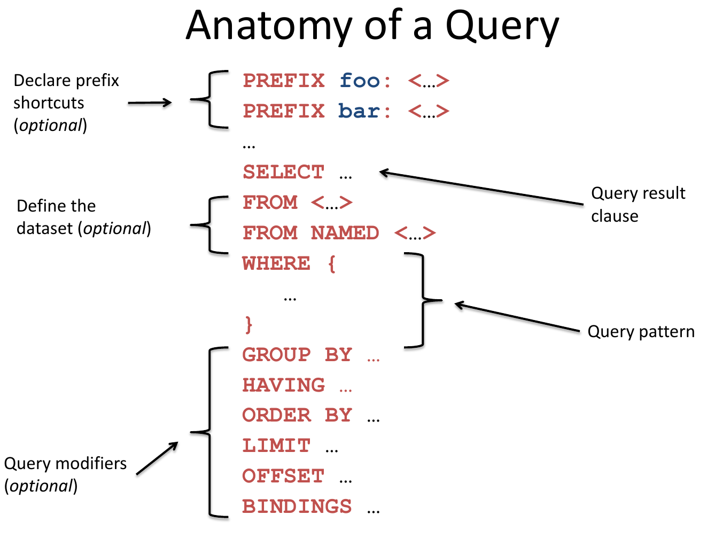
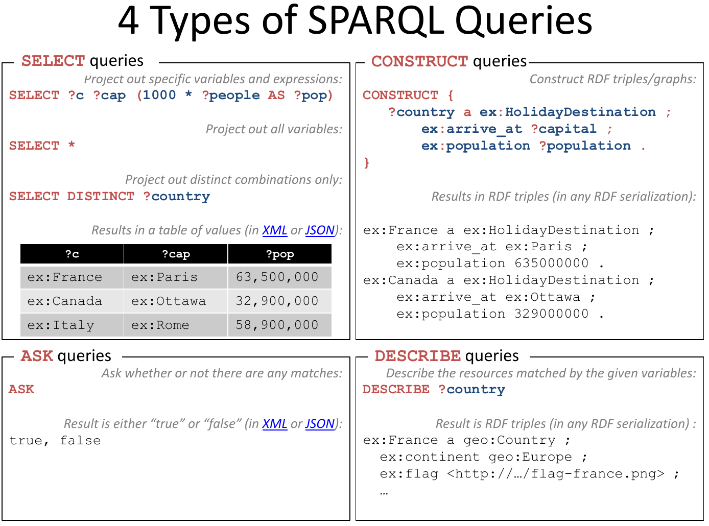

## Prosopographical data in the semantic web

In the following we introduce the basic terminology in relation to data modelling and semantic web.

### Main concepts

**Ontology**

- In the context of Digital Humanities, an Ontology is mostly defined as _"a formal, explicit
  specification of a shared conceptualization."_ (Studer et al, 1998)
- An ontology is an explicit model of concepts, which are defined with clear semantics.
- It is important that users of an ontology understand the underlying assumptions about the chosen
  domain.
- Normally an ontology is expressed as a set of classes and properties representing concepts and
  their relationships.

**RDF - Resource Description Framework**

- https://www.w3.org/RDF/
- abstract data model to state anything about anything by anybody
- URIs to identify entities
- triples: `<subject predicate object>` to form a graph
- named graphs: allows to assign a fourth identifier to a group of triples (quad mode) and use that
  to further describe the "named graph".

  ```turtle
  @prefix cidoc: <http://www.cidoc-crm.org/cidoc-crm/> .
  @prefix dct: <http://purl.org/dc/terms/> .
  @prefix ns1: <https://omnipot.acdh.oeaw.ac.at/> .
  @prefix rdfs: <http://www.w3.org/2000/01/rdf-schema#> .
  @prefix void: <http://rdfs.org/ns/void#> .

  ns1:provenance {
      <https://viecpro.acdh-dev.oeaw.ac.at/entities#> a void:Dataset ;
          dct:created "2021-06-02"^^xsd:date ;
          dct:creator "Matthias Schlögl, Peter Andorfer"@de ;}

  <https://viecpro.acdh-dev.oeaw.ac.at/entities#> {
      <https://viecpro.acdh.oeaw.ac.at/entity/100008/death> a cidoc:E69_Death ;
      rdfs:label "Death of Wolf Pickl"@de ;
  }
  ```

**OWL - Web Ontology Language**

- https://www.w3.org/OWL/ (2012)
- W3C-specification on how to formalize ontological information

**SKOS - Simple Knowledge Organisation System**

- https://www.w3.org/TR/skos-reference/ (2009)
- schema for modelling controlled vocabularies (such as taxonomies, thesauri, etc.) in a way that is
  compliant to Linked Open Data.
- is based on concepts (terms) which can be supplemented with labels, notes, comments, etc.
- SKOS concepts can be linked to each other using hierarchical or associative relations
- can also be linked to other vocabularies

**SPARQL- SPARQL Protocol And RDF Query Language**

- https://www.w3.org/TR/rdf-sparql-query/ (2008)
- query language for RDF

**LOD - Linked Open Data**

- https://www.w3.org/wiki/LinkedData, https://www.w3.org/DesignIssues/LinkedData
- "set of best practices for publishing structured data on the Web"

  _Use URIs as names for things Use HTTP URIs so that people can look up those names. When someone
  looks up a URI, provide useful information. Include links to other URIs. so that they can discover
  more things._

**LOD-cloud**

- https://lod-cloud.net/


### Description of sample datasets

See the
[presentation slides](https://docs.google.com/presentation/d/1fZ8Oh3__fL8ZI3qka3LBomFoN8BvDAVW).

#### VieCPro

- Project: The Viennese Court – A Prosopographical Portal (ÖAW Innovationsfond 2020 - 2022)
- Data model: Event-based, basic entities + typed temporalized relations between them
- currently 12905 Persons, 1398 Types, 376 Persons

#### NAMPI

- Project: Nuns and Monks - Prosopographical Interfaces (ÖAW go!digital Next Generation 2019-2021)
- https://nampi.icar-us.eu/
- https://github.com/nam-pi
- Data model: Factoid-based (Document Interpretation Act => Aspects)
- currently 465 Persons, 429 Religious titles, 1692 Document Interpretation acts

### Tooling

**TripleStore**

- database for RDF
- graph as underlying data model

**SPARQL**

- https://www.w3.org/TR/rdf-sparql-query/
- query language for RDF

**APIS**

- framework for managing and publishing prosopographical data
- implemented in Python with Postgresql DB as persistence layer
- RDF-serialisation exposed via API

**NAMPI**

- https://nampi.icar-us.eu/, https://data.nampi.icar-us.eu/
- prosopographical database system based on RDF and the factoid model
- Java-Application as backend + client accessing data via API, data stored in Apache Jena Fuseki
  Triplestore

**ResearchSpace** - https://www.researchspace.org/

- semantic knowledge platform
- Java application with predefined frontend-components and a flexible templating mechanism operating
  directly on SPARQL endpoint to retrieve and present data

### SPARQL basics

- Query language for the semantic web
- since 2008 W3C recommendation
- since 2013 SPARQL 1.1 W3C recommendation

**The anatomy of a SPARQL query**

Following illustration describes the different parts of a SPARQL query.



- **Prefixes:** optional, used to shorten URIs if they make query difficult to read if spelled out
  in full. Use prefix in query
- **Define dataset:** optionally restrict the graph from which to select
- **Query result clause:** which variables should be returned in the result
- **Query pattern:** formulate filtering conditions
- **Query modifiers:** modify and specify your query further (eg. group results by a particular
  variable, limit query, etc.)
- Variables are freely chosen names prefixed by `?`

**Four types of SPARQL queries**

- **SELECT** : returns values based on some query pattern
- **CONSTRUCT** : creates a new graph consisting of new triples
- **ASK** : returns a yes/no answer, e.g. do any entities with given property exist
- **DESCRIBE** : provides information about a resource, without explicitly stating the query
  pattern. The query processor determines the result set.



### Recommended reading

- [Addlesee, Angus. "Creating Linked Data". Medium, 23. April 2019.](https://medium.com/wallscope/creating-linked-data-31c7dd479a9e)

- ["Tackling Big Data Challenges with Linked Data". Medium, 29. Dezember 2018.](https://medium.com/wallscope/tackling-big-data-challenges-with-linked-data-278b0761a6de)

- [DuCharme, Bob. Learning SPARQL](http://www.learningsparql.com)

- Glimm, Birte. "Semantic Web Grundlagen - Einführung in RDF", 2011, 20.

- [Haslhofer, Bernhard, Antoine Isaac, und Rainer Simon. "Knowledge Graphs in the Libraries and Digital Humanities Domain". ArXiv:1803.03198 [Cs], 2018, 1–8.](https://doi.org/10.1007/978-3-319-63962-8_291-1)

- [Hitzler, Pascal. "A review of the semantic web field". Communications of the ACM 64, Nr. 2 (25. Januar 2021): 76–83.](https://doi.org/10.1145/3397512)

- ["Introducing SPARQL: Querying the Semantic Web"](https://www.xml.com/pub/a/2005/11/16/introducing-sparql-querying-semantic-web-tutorial.html)

- [Schreiber, Guus, Raimond, Yves. "RDF 1.1 Primer"](https://www.w3.org/TR/rdf11-primer/)

- ["SPARQL 1.1 Overview"](https://www.w3.org/TR/sparql11-overview/)

- [Linked Open Data-cloud](https://upload.wikimedia.org/wikipedia/commons/d/d8/LOD_Cloud_Diagram_as_of_September_2011.svg)

Video resources:

- ["Knowledge Engineering with Semantic Web Technologies by Dr. Harald Sack"](https://www.youtube.com/playlist?list=PLoOmvuyo5UAcBXlhTti7kzetSsi1PpJGR)

- [OpenHPI Tutorials. 1.0 Overview, 2019](https://www.youtube.com/watch?v=eJ9H1SakPoA) "RDF 1.1
  Turtle". https://www.w3.org/TR/turtle/.
