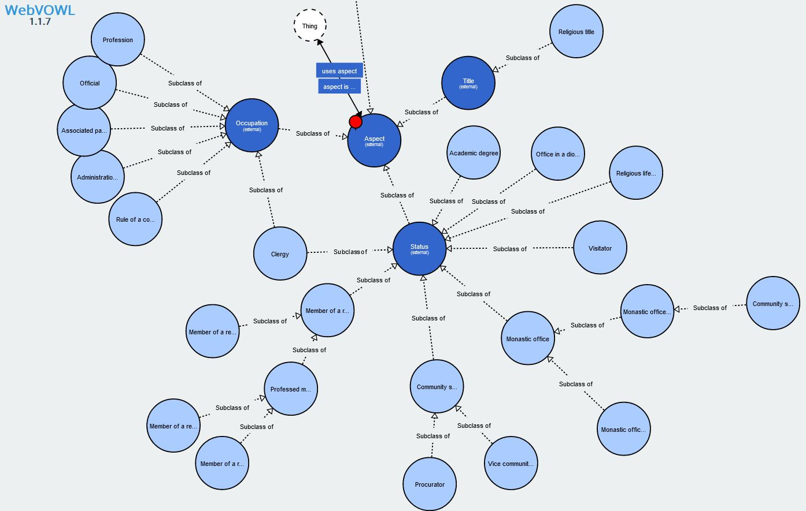
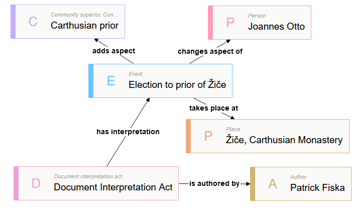
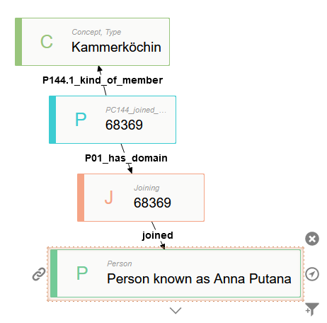

## Main concepts

### Vocabulary

- What is a vocabulary?

  [_"A vocabulary is a set of familiar words within a person's language. A vocabulary, usually developed with age, serves as a useful and fundamental tool for communication and acquiring knowledge."_](https://en.wikipedia.org/wiki/Vocabulary)

  When we use our vocabulary, we are able to give names to the world around us and what we experience. These vocabularies serve as semantic descriptions of concepts which we aquire and share with others. However, if we use a word like "tree", many people will understand the term what entity we refer to. However, the vocabulary is not very specific and there are multiple factors that influence what we actually mean when we use the term "tree".

- What is a controlled vocabulary?

  [_"When we organize our information and label it however, there is so much richness, variance, and confusion in terminology that we often need to impose some order to facilitate agreement between the concepts within the database and the vocabulary of the person using it."_](https://boxesandarrows.com/what-is-a-controlled-vocabulary/)

  [_"Controlled vocabularies provide a way to organize knowledge for subsequent retrieval. [...] Controlled vocabulary schemes mandate the use of predefined, authorised terms that have been preselected by the designers of the schemes, in contrast to natural language vocabularies, which have no such restriction."_](https://en.wikipedia.org/wiki/Controlled_vocabulary)

- Why use controlled vocabularies?
  - make explicit the meaning of terms
  - common understanding of things
  - organize large volumes of data (group, categorize)
  - ensure interoperability between machines (which depend on a clearly structured vocabulary)

#### Simple Knowledge Organisation System - SKOS

- [_"a common data model for sharing and linking knowledge organization systems via the Web"_](https://www.w3.org/TR/skos-reference/)
- developed in order to create a schema for modelling controlled vocabularies (such as taxonomies, thesauri, etc.) in a way that is compliant with Linked Open Data principles.
- SKOS is based on concepts (terms) which can be supplemented with labels, notes, comments, etc.
  - The central entity is a `skos:Concept`
- skos:Concepts can be collected into a coherent
  - `skos:ConceptScheme`
- skos:Concepts can have multiple lexical (language-specific) representations "labels":
  - `skos:prefLabel`, `skos:altLabel`, `skos:hiddenLabel`
- Those concepts can be linked to each other using hierarchical or associative relations. Those semantic relations between skos:Concepts can be expressed with:
  - `skos:narrower`, `skos:broader`, `skos:related`
- to express a semantic relation between concepts from two distinct vocabularies, following mapping relations can be used:
  - `skos:exactMatch`, `skos:closeMatch`, `skos:narrowerMatch`, `skos:broaderMatch`

### Recommended reading

- [Zaytseva, Ksenia. "Controlled Vocabularies and SKOS". DARIAH Campus, 23 March 2020](https://campus.dariah.eu/resource/controlled-vocabularies-and-skos)
- [Cofield, Melanie. "LibGuides: Metadata Basics: Controlled Vocabularies"](https://guides.lib.utexas.edu/metadata-basics/controlled-vocabs)
- [Hedden, Heather. "Taxonomies and Controlled Vocabularies Best Practices for Metadata". Journal of Digital Asset Management 6, Nr. 5 (1. Oktober 2010): 279–84.](https://doi.org/10.1057/dam.2010.29)
- ["SKOS Simple Knowledge Organization System Primer"](https://www.w3.org/TR/skos-primer/)
- ["Using OWL and SKOS"](https://www.w3.org/2006/07/SWD/SKOS/skos-and-owl/master.html)
- ["Vocabularies | Heritage Data"](https://www.heritagedata.org/blog/vocabularies-provided/)

### Recommended Services for Linked Open Vocabularies

- [Vocabs Services](https://vocabs.dariah.eu/en/)
- [Basic Register of Thesauri, Ontologies & Classifications](https://bartoc.org/)
- [Linked Open Vocabularies](https://lov.linkeddata.es/dataset/lov/)

### Sample datasets

Description of aspects of the sample datasets relevant for vocabularies discussion.

#### VieCPro

One central controlled vocabulary in _VieCPro_ categorizes the functions/roles/occupations (Funktionsbezeichnungen) at the Viennese Court (see: [viecpro-vocabs.skos.ttl](downloads/viecpro-vocabs.skos.ttl)).

Example of a sample occupation/role expressed as a concept (represented by term `"Kaplan"`), together with the relation to a more general (_broader_) concept (`"Geistliches Personal"`).

```turtle
<https://vocabs.acdh-dev.oeaw.ac.at/apisthesaurus/2629>
  skos:broader <https://vocabs.acdh-dev.oeaw.ac.at/apisthesaurus/4797>;
  skos:prefLabel "Kaplan"@de .

<https://vocabs.acdh-dev.oeaw.ac.at/apisthesaurus/4797> a skos:Concept;
  skos:prefLabel "Geistliches Personal"@de;
  skos:topConceptOf <https://vocabs.acdh-dev.oeaw.ac.at/apisthesaurus/ApisSchema>
```

```turtle
<https://vocabs.acdh-dev.oeaw.ac.at/apisthesaurus/2630> a skos:Concept;
  skos:altLabel "Geistliches Personal >> Hofkaplan"@de, "reverse label: Geistliches Personal [REVERSE] >> Hofkaplan [REVERSE]"@de,
    "reverse name: Hofkaplan [REVERSE]"@de;
  skos:broader <https://vocabs.acdh-dev.oeaw.ac.at/apisthesaurus/4797>;
  skos:prefLabel "Hofkaplan"@de .
```

#### NAMPI

Closely corresponding to the Funktionsbezeichnung of _VieCPro_, in _NAMPI_ there is a classification of religious status and occupation. However, partly owing to the factoid-based data model, it is not represented as skos:Concepts, but rather as subClass hierarchy of the generic concept `Aspect`, defined in the dedicated [monastic-life ontology](downloads/monastic-life.owl):



[Visualisation of NAMPI Monastic Life Ontology](http://www.visualdataweb.de/webvowl/#iri=https://raw.githubusercontent.com/nam-pi/monastic-life-owl/master/monastic-life.owl)

For the purpose of this exercise we've derived a controlled vocabulary from the original data in SKOS (see: [nampiSkos.ttl](downloads/nampiSkos.ttl))

```turtle
@prefix skos: <http://www.w3.org/2004/02/skos/core#> .
@prefix rdf: <http://www.w3.org/1999/02/22-rdf-syntax-ns#> .
@prefix nampi: <https://purl.org/nampi/owl/core#> .
@prefix mon: <https://purl.org/nampi/owl/monastic-life#> .
@prefix asp: <https://purl.org/nampi/data/aspect/> .

nampi:aspect rdf:type skos:Concept ;
  skos:prefLabel "Aspect"@en ;
  skos:narrower nampi:title ;
  skos:narrower nampi:appellation ;
  skos:narrower nampi:occupation ;
  skos:narrower nampi:status .

nampi:status rdf:type skos:Concept ;
  skos:prefLabel "Status"@en ;
  skos:broader nampi:aspect ;
  skos:narrower mon:clergy ;
  skos:narrower mon:academic_degree ;
  skos:narrower mon:community_superior ;
  skos:narrower mon:member_of_a_religious_community ;
  skos:narrower mon:office_in_a_diocese ;
  skos:narrower mon:religious_life_outside_a_community ;
  skos:narrower mon:visitator ;
  skos:narrower mon:monastic_office .

mon:academic_degree rdf:type skos:Concept ;
  skos:prefLabel "Academic degree"@en ;
  skos:broader nampi:status ;
  skos:narrower asp:7f4f9789-f5c9-4802-9439-c77ab3f00755 .

asp:7f4f9789-f5c9-4802-9439-c77ab3f00755 rdf:type skos:Concept ;
  skos:prefLabel "Doctor of Laws"@en ;
  skos:broader mon:academic_degree .
```

## Exercise

### Predefine namespace prefixes

```sparql
PREFIX skos: <http://www.w3.org/2004/02/skos/core#>
PREFIX rdf: <http://www.w3.org/1999/02/22-rdf-syntax-ns#>
PREFIX nampi: <https://purl.org/nampi/owl/core#>
PREFIX mon: <https://purl.org/nampi/owl/monastic-life#>
PREFIX asp: <https://purl.org/nampi/data/aspect/>
```

### Task 1: Explore the vocabularies via SPARQL

a) What are the terms?

```sparql
SELECT DISTINCT ?c WHERE {
  ?c  a skos:Concept.
}
```

b) How many are there?

```sparql
SELECT (COUNT(?c) as ?count) WHERE {
  ?c  a skos:Concept.
}
```

c) Which properties do the concepts have?

```sparql
SELECT ?p (COUNT(?c) as ?count) WHERE {
  ?c  a skos:Concept.
  ?c ?p [].
}
GROUP BY ?p
```

d) Are they structured (hierarchically)?

```sparql
SELECT distinct ?uri ?prefLabel ?broaderLabel ?narrowerLabel WHERE {
  ?uri skos:prefLabel ?prefLabel .
    OPTIONAL {?uri skos:broader ?broader .
    ?broader skos:prefLabel ?broaderLabel} .
    OPTIONAL {?uri skos:narrower ?narrower .
    ?narrower skos:prefLabel ?narrowerLabel} .
}
ORDER by desc((str(?broaderLabel)))
LIMIT 100
```

### Task 2: Explore the use of the vocabularies

How are the concepts actually used (for categorisation)? (For which entities are the concepts asserted?)

```sparql
SELECT ?o ?p  ?c ?l   WHERE {
  ?c a skos:Concept; skos:prefLabel ?l.
  ?o ?p ?c.
}
LIMIT 10
```

Can also be inspected in [detail-view of the concept](https://lod-playground.acdh-dev.oeaw.ac.at/resource/?uri=https%3A%2F%2Fvocabs.acdh-dev.oeaw.ac.at%2Fapisthesaurus%2F2639)

However due to the underlying data model, there are intermediate "nodes" between category/concept and person:

- Example from NAMPI:

  

  ```sparql
  SELECT ?p ?c ?l  WHERE {
    BIND (<https://purl.org/nampi/data/aspect/885c176c-b919-45e8-b6b8-accc14ff20f3> AS ?c)
    ?c a skos:Concept; skos:prefLabel ?l.
    ?e nampi:adds_aspect ?c.
    ?e nampi:changes_aspect_of ?p.
  }
  LIMIT 10
  ```

- Example from VieCPro:

  

  ```sparql
  SELECT ?p  ?c ?l  WHERE {
    BIND (<https://vocabs.acdh-dev.oeaw.ac.at/apisthesaurus/3542> AS ?c)
    ?c a skos:Concept; skos:prefLabel ?l.
    ?j <http://www.cidoc-crm.org/cidoc-crm/P144.1_kind_of_member> ?c.
    ?j crm:P01_has_domain ?d.
    ?d crm:P143_joined ?p.
  }
  LIMIT 10
  ```

### Task 3: Find equivalent or similar terms

Find equivalent or similar terms in the vocabularies from VieCPro and NAMPI and express equivalence or other semantic relation between these formally in SKOS.

- skos:exactMatch "Priest" (NAMPI) and "Priester" (VieCPro)

  ```turtle
  <https://vocabs.acdh-dev.oeaw.ac.at/apisthesaurus/2989> a skos:Concept;
    skos:altLabel "reverse name: Priester [REVERSE]"@de;
    skos:prefLabel "Priester"@de;
    skos:topConceptOf <https://vocabs.acdh-dev.oeaw.ac.at/apisthesaurus/ApisSchema> .

  asp:619860f5-623e-4248-835d-067f784c61be rdf:type skos:Concept ;
    skos:prefLabel "Priest"@en ;
    skos:broader mon:clergy .
  ```

- skos:exactMatch "Coadiutor" (NAMPI) and "Koadjutor" (VieCPro)

  ```turtle
  <https://vocabs.acdh-dev.oeaw.ac.at/apisthesaurus/3760> a skos:Concept;
    skos:altLabel "reverse name: Koadjutor [REVERSE]"@de;
    skos:prefLabel "Koadjutor"@de;
    skos:topConceptOf <https://vocabs.acdh-dev.oeaw.ac.at/apisthesaurus/ApisSchema> .

  asp:ee8326a1-2b5d-4e72-9479-902b030905d7 rdf:type skos:Concept ;
    skos:prefLabel "Coadiutor"@en ;
    skos:broader mon:clergy .
  ```

- skos:exactMatch "Procurator" (NAMPI) and "Prokurator" (VieCPro)

  ```turtle
  <https://vocabs.acdh-dev.oeaw.ac.at/apisthesaurus/3172> a skos:Concept;
    skos:altLabel "reverse name: Prokurator [REVERSE]"@de;
    skos:prefLabel "Prokurator"@de;
    skos:topConceptOf <https://vocabs.acdh-dev.oeaw.ac.at/apisthesaurus/ApisSchema> .

  mon:procurator  rdf:type skos:Concept ;
    skos:prefLabel "Procurator "@en ;
    skos:broader mon:community_superior .
  ```

- skos:closeMatch "Dominican prior" (NAMPI) and "Carthusian prior" (NAMPI) and "Prior" (VieCPro) [Questionable: is a closeMatch correct here?]

  ```turtle
  <https://vocabs.acdh-dev.oeaw.ac.at/apisthesaurus/4496> a skos:Concept;
    skos:altLabel "Geistliches Personal >> Prior"@de, "reverse label: Geistliches Personal [REVERSE] >> Prior [REVERSE]"@de,
      "reverse name: Prior [REVERSE]"@de;
    skos:broader <https://vocabs.acdh-dev.oeaw.ac.at/apisthesaurus/4797>;
    skos:prefLabel "Prior"@de .

  asp:885c176c-b919-45e8-b6b8-accc14ff20f3 rdf:type skos:Concept ;
    skos:prefLabel "Carthusian prior"@en ;
    skos:broader mon:community_superior .

  asp:d0bc56ff-c0fd-4701-b1b4-577a3fc8d70e rdf:type skos:Concept ;
    skos:prefLabel "Dominican prior"@en ;
    skos:broader mon:community_superior .
  ```

- skos:closeMatch "Novice" (NAMPI) and "Novizin" (VieCPro) [Questionable: is a closeMatch correct here?]

  ```turtle
  <https://vocabs.acdh-dev.oeaw.ac.at/apisthesaurus/4626> a skos:Concept;
    skos:altLabel "reverse name: Novizin [REVERSE]"@de;
    skos:prefLabel "Novizin"@de;
    skos:topConceptOf <https://vocabs.acdh-dev.oeaw.ac.at/apisthesaurus/ApisSchema> .

  asp:e4d0b440-a5e3-4be3-9ca9-d292c9cb414a rdf:type skos:Concept ;
    skos:prefLabel "Novice"@en ;
    skos:broader mon:member_of_a_religious_community .
  ```

- skos:closeMatch "Minister of ceremonies" (NAMPI) and "Zeremoniar" (VieCPro) [Questionable: is a closeMatch correct here?]

  ```turtle
  <https://vocabs.acdh-dev.oeaw.ac.at/apisthesaurus/3542> a skos:Concept;
    skos:altLabel "reverse name: Zeremoniar [REVERSE]"@de;
    skos:prefLabel "Zeremoniar"@de;
    skos:topConceptOf <https://vocabs.acdh-dev.oeaw.ac.at/apisthesaurus/ApisSchema> .

  asp:24188eda-cfd4-470f-a41c-693b3dd0045e rdf:type skos:Concept ;
    skos:prefLabel "Minister of ceremonies"@en ;
    skos:broader mon:office_in_a_diocese .

  asp:24188eda-cfd4-470f-a41c-693b3dd0045e rdf:type skos:Concept ;
    skos:prefLabel "Minister of ceremonies"@en ;
    skos:broader mon:clergy .
  ```

### Task 4: Formulate SPARQL-queries making use of the new relation to get related items from the two datasets

a) Show all concepts with close or exact match

```sparql
SELECT ?c1 ?c2 ?matchtype WHERE {
  {  ?c1 a skos:Concept; skos:exactMatch ?c2.
    BIND ("exact" as ?matchtype)
  } UNION {
 { ?c1 a skos:Concept; skos:closeMatch ?c2.
      BIND ("close" as ?matchtype)
    }} }
    LIMIT 20
```
