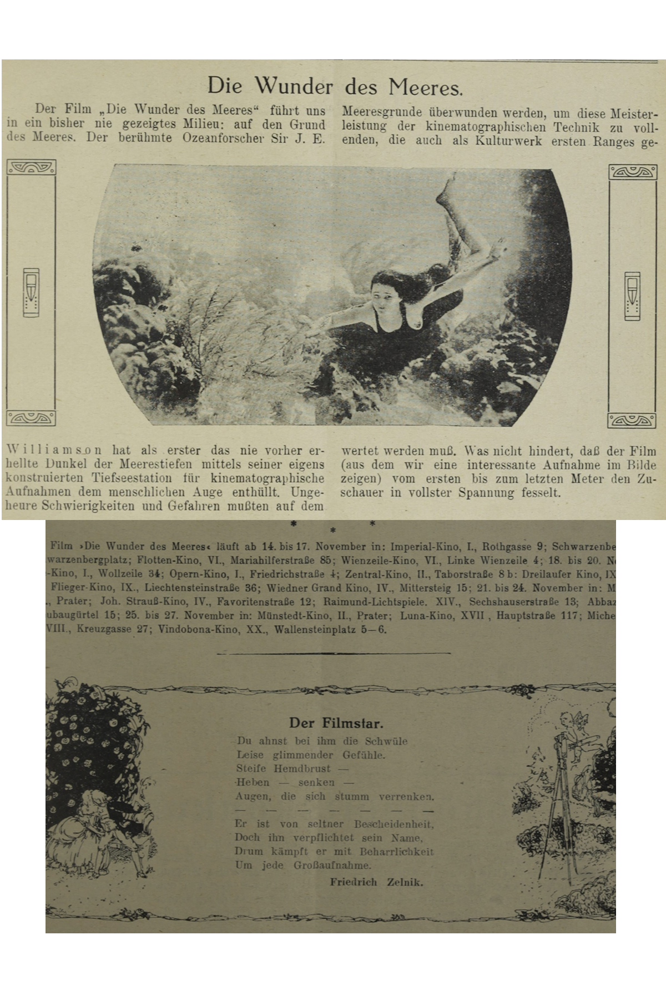

## Semantisches Markup

### Lernziele:

- Grundlegende Begriffe des semantischen Markup
- Auszeichnung von Angaben zu Personen und Orten
- der Nachspann als Verzeichnis und Verweise

### Grundlagen Basics

Das semantische Markup wird genutzt, um den Inhalt eines Textes auszuzeichnen. Im Grunde sind Ihnen durch die TEI keine Grenzen gesetzt, was Sie und in welcher Tiefe Sie auszeichnen. Die Auszeichnungen, die Sie verwenden, werden von den Fragen abhängig sein, die Sie an Ihren Text stellen. Das semantische Markup zeichnet die Bedeutung der Textelement aus. Dazu gehören zum Beispiel Werktitel, Personennamen, Orts- und Zeitangaben, aber auch Verweise und Register. Die folgenden Elemente werden in den nächsten Übungen verwendet. Sie sind Beispiele für semantisches Markup, aber es gibt noch wesentlich mehr Attribute, die Sie nutzen können.

- **Werktitel** `<title>`: Hier kann zum Beispiel der Titel eines Theaterstücks, eines Gedichtes, oder auch eines Buches ausgezeichnet werden.
- **Personennamen** `<persName>`: Der Personenname bezeichnet den gesamten Namen einer Person, sowohl Vor- als auch Nachname. Wenn Sie Vorname `<forename>` und Nachname `<surname>`auch auszeichnen wollen, so könnten Sie diese innerhalb des `<persName>`-Elements setzen.
- **Datumsangaben** `<date>`: Dieses Element enthält ein Datum oder einen Zeitpunkt. Jedes Format ist möglich.
- **Namen von Organisationen** `<orgName>`: Mit diesem Element können Sie Organisationen auszeichnen.
- **Adressen** `<address>` und `<addrLine>`: So können Sie Adressen `<address>` und eine Adressenzeile `<addrLine>`auszeichnen.
- **Adressen** mit detailierter Auszeichnung: Sie können dem Element `<address>`auch die Komponenten für Bezirke `<district>` und Straßen `<street>` unterordnen.
- **Ortsangaben** `<placeName>`: Mit diesem Element können Sie Orte auszeichnen.
- **Verweis** auf 'etwas' oder 'jemanden': Um auf bestimmte Personen, Dinge, Orte etc. zu verweisen, können Sie den 'referencing string' `<rs>` nutzen. Sie können dies z.B. nutzen, wenn eine Person oder ein Ort in Ihrem Text mit unterschiedlichen Begriffen bezeichnet wird, Sie aber zeigen möchten, dass es sich immer um dieselbe Person oder denselben Ort handelt.
- **Verweis** auf eine andere 'Quelle': Um auf andere Quellen innerhalb oder außerhalb Ihres Dokumentes zu verweisen, können Sie 'reference' `<ref>` nutzen. Zusätzlich können Sie einen Kommentar oder Text ergänzen, wenn dies notwendig ist.
- **Textabschnitte im `body`** `<div>` @type poem + @ana #verse: Der `body` kann durch das allgemeine Element `div` weiter in Abschnitte untergliedert werden. Das Attribut `@type poem` bestimmt ein Gedicht, `@ana #verse` steht für den Verweis auf einen analytischen Kommentar - das Gedicht ist in Versen geschrieben.
- **Nachspann** 'back matter' `<back>`: Mit diesem Element können Sie den Nachspann eines Textes auszeichnen.
- **Analyseverweis** 'interpretation' `<interp>` + @xml:id verse: Mit diesem Element könnnen Sie auf die Interpretation eines Textabschnittes hinweisen. Hier zum Beispiel wurde der Text als Verstext interpretiert.

#### Praktische Anwendung

##### Beispiel 1

Im folgenden Beispiel sehen Sie die Filmrezension zu *Der Film im Film*. Hier werden innerhalb eines durch ein Attribut genauer bestimmtes `<div>`-Element der Titel des Films `<title>`, sowie mehrere Personennamen `<persName>` ausgezeichnet. Beachten Sie bitte, dass auch der Verfasser mit `<persName>` ausgezeichnet wird, ebenso der Titel eines weiteren Films ausgezeichnet wird.

```xml
<?xml-model href="http://www.tei-c.org/release/xml/tei/custom/schema/relaxng/tei_all.rng" type="application/xml"
	schematypens="http://purl.oclc.org/dsdl/schematron"?>
<TEI xmlns="http://www.tei-c.org/ns/1.0">
  <teiHeader>
    <fileDesc>
      <titleStmt>
        <title>Die Filmwelt - ein Ausschnitt</title>
      </titleStmt>
      <publicationStmt>
        <p>Publication Information</p>
      </publicationStmt>
      <sourceDesc>
        <p>Information zur Veröffentlichung</p>
      </sourceDesc>
    </fileDesc>
  </teiHeader>
  <text>
    <body>
      <div type="review" n="2">
        <p><title>„Der Film im Film“</title> (Pressevorführung) gab uns einmal
        Gelegenheit, nicht nur fertige Bilder zu beurteilen, sondern auch einen
        intimeren Blick in die Werkstatt der Filmkünstler zu tun und zu sehen, was
        alles und wie alles geschieht, ehe eine solche Tat vollbracht ist. Es ist
        eine Art Schöpfungsgeschichte im Kleinen, obwohl sie nicht in 6 Tagen,
        sondern in langen Monaten, selbst Jahren vollbracht ward, und jeder dieser
        tüchtigen Regisseure mag ein gottähnliches Gefühl in sich haben, wenn er aus 
        diesem Wust ungeordneten Materials eine Welt aufbaut, Wasser und Erde
        trennt. Himmel, Gestirne und Gebirge erstehen läßt. Wen wird es nicht
        interessieren, Künstler wie <persName>Henny Porten</persName>, <persName>Asta Nielsen</persName>,
        <persName>Morena</persName>, <persName>Jannings</persName>, <persName>Conradt Veidt</persName>,<persName>Max Linder</persName> und viele andere am Werke zu sehen,
        ebenso wie <persName>Fritz Lang</persName>, den genialen Regisseur der <title>Nibelungen</title>.
        <persName>Friedrich Porges</persName>, der Regisseur dieses ausgezeichneten, unterhaltendenund unterrichtenden Films, machte sich durch einen äußerst klaren, klugen und übersichtlichen Vortrag 
        verdient, der so recht in den Geist der Materie einführt.</p>
        <byline><persName>J.</persName></byline>
       </div>
      </body>
  </text>
</TEI>
```

##### Beispiel 2

Im folgenden Beispiel sehen Sie die Auszeichnung zweier Spielstätten, in denen der Film *Die Wunder des Meeres* gezeigt wurde. Wie bereits im vorangegangenen Beispiel wird der Werktitel ausgezeichnet, genauso der Spielzeitraum `<date>`, und die Spielorte. Deren Adressen werden hier beispielhaft auf zwei unterschiedliche Weisen dargestellt. Einerseits finden Sie das Element `<addrLine>`, andererseits kann hier genauso mit `<address>` genauer in Bezirk `<district>`und Straße `<street>`unterteilt. Die Name der Kinos werden als `<orgName>`ausgezeichnet.

```xml
<?xml-model href="http://www.tei-c.org/release/xml/tei/custom/schema/relaxng/tei_all.rng" type="application/xml"
	schematypens="http://purl.oclc.org/dsdl/schematron"?>
<TEI xmlns="http://www.tei-c.org/ns/1.0">
  <teiHeader>
    <fileDesc>
      <titleStmt>
        <title>Title</title>
      </titleStmt>
      <publicationStmt>
        <p>Publication Information</p>
      </publicationStmt>
      <sourceDesc>
        <p>Information about the source</p>
      </sourceDesc>
    </fileDesc>
  </teiHeader>
  <text>
    <body>
      <div>
        <p>Der Film <title>»Die Wunder des Meeres«</title> läuft ab <date>14. bis 17. November</date> in:
          <list>
            <item><orgName>Imperial-Kino</orgName>, <address><addrLine>I., Rothgasse 9</addrLine></address>;</item>
            <item><orgName>Schwarzenberg-Kino</orgName>, <address><district>III.,</district> <street>Schwarzenbergplatz</street></address>;</item>
          </list></p>
      </div>
    </body>
  </text>
</TEI>
 
```

##### Beispiel 3

Im folgenden Beispiel finden Sie einen kurzen Ausschnitt aus der Rezension des Films *Die Schlacht*. Hier werden ein Ortsname `<placeName>`, Personenname `<persName>`, sowie eine Anapher `<rs>`ausgezeichnet.

```xml
<?xml-model href="http://www.tei-c.org/release/xml/tei/custom/schema/relaxng/tei_all.rng" type="application/xml"
	schematypens="http://purl.oclc.org/dsdl/schematron"?>
<TEI xmlns="http://www.tei-c.org/ns/1.0">
  <teiHeader>
    <fileDesc>
      <titleStmt>
        <title>Die Filmwelt - ein Ausschnitt</title>
      </titleStmt>
      <publicationStmt>
        <p>Publication Information</p>
      </publicationStmt>
      <sourceDesc>
        <p>Information zur Veröffentlichung</p>
      </sourceDesc>
    </fileDesc>
  </teiHeader>
  <text>
    <body>
      <div type="reviews">
        <head type="columnTitle">FILM-KRITIKEN</head> 
        <div type="review" n="1">
          <p><title>„Die Schlacht.“</title> Nach dem Roman von <persName>Claude Farrère</persName> wurde 
          dieses Meisterwerk gedreht, doch es ist nicht „verfilmte Literatur“, sondern ein echtes Filmdrama. 
          <persName>Marquis Yorisaka</persName> weilt in geheimer diplomatischer Mission in <placeName>Paris</placeName>; 
          als <rs>er</rs> nach <placeName>Japan</placeName> zurückkehrt, findet er seine Frau, europäisch umgemodelt; ...</p>
        </div>
      </div>
    </body>
  </text>
</TEI>   
```

Beispiel für den Verweis auf eine andere 'Quelle' mit `<ref>`:

```xml
<ref>Nummer 33</ref>
<ref>34</ref>
```

##### Beispiel 4

Nun sehen Sie ein Beispiel eines Gedichts, das explizit als Verstext ausgewiesen ist. 

```xml
<?xml-model href="http://www.tei-c.org/release/xml/tei/custom/schema/relaxng/tei_all.rng" type="application/xml"
	schematypens="http://purl.oclc.org/dsdl/schematron"?>
<TEI xmlns="http://www.tei-c.org/ns/1.0">
  <teiHeader>
    <fileDesc>
      <titleStmt>
        <title>Die Filmwelt - ein Ausschnitt</title>
      </titleStmt>
      <publicationStmt>
        <p>Publication Information</p>
      </publicationStmt>
      <sourceDesc>
        <p>Information zur Veröffentlichung</p>
      </sourceDesc>
    </fileDesc>
  </teiHeader>
  <text>
    <body>
      <div type="poem" ana="#verse">
        <lg>
          <head>Der Filmstar.</head>
          <l>Du ahnst bei ihm die Schwüle</l>
          <l>Leise glimmender Gefühle.</l>
          <l>Steife Hemdbrust —</l> 
          <l>Heben — senken —</l> 
          <l>Augen, die sich stumm verrenken.</l>
          <l>— — — — — —</l> 
          <l>Er ist von seltner Bescheidenheit.</l> 
          <l>Doch ihn verpflichtet sein Name,</l> 
          <l>Drum kämpft er mit Beharrlichkeit</l>
          <l>Um jede Großaufnahme.</l>
          <byline>Friedrich Zelnik.</byline>
        </lg>
      </div>
    </body>
  </text>
</TEI>
```

Die Raute ist ein Verweis auf ein anderswo im Dokument definiertes Element. Fügen Sie nach dem schließenden `<body>`-Tag einen Nachspann `back` mit einem `<interp>`-Element und das Attribut @xml:id mit dem Wert verse ein. Der Inhalt dieses Elements beschreibt, worum es sich handelt:

```xml
<back>
  <interp xml:id="verse">Gedicht in Versform</interp>
</back>
```

##### Übung 1a: Inhalte im Text auszeichnen



<Quiz>
  <Quiz.Card validateButtonLabel="Überprüfen">
    <Quiz.XmlCodeEditor
      code={"<?xml-model href=\"http://www.tei-c.org/release/xml/tei/custom/schema/relaxng/tei_all.rng\" type=\"application/xml\"\n\tschematypens=\"http://purl.oclc.org/dsdl/schematron\"?>\n<TEI xmlns=\"http://www.tei-c.org/ns/1.0\">\n  <teiHeader>\n    <fileDesc>\n      <titleStmt>\n        <title>Die Filmwelt - ein Ausschnitt</title>\n      </titleStmt>\n      <publicationStmt>\n        <p>Publication Information</p>\n      </publicationStmt>\n      <sourceDesc>\n        <p>Information zur Veröffentlichung</p>\n      </sourceDesc>\n    </fileDesc>\n  </teiHeader>\n  <text>\nDie Wunder des Meeres.\nDer Film „Die Wunder des Meeres“ führt uns in ein bisher nie \ngezeigtes Milieu: auf den Grund des Meeres. Der berühmte Ozeanforscher Sir J. E. Williamson\nhat als erster das nie vorher erhellte Dunkel der Meerestiefen mittels seiner eigens konstruierten \nTiefseestation für kinematographische Aufnahmen dem menschlichen Auge enthüllt. \nUngeheure Schwierigkeiten und Gefahren mußten auf dem Meeresgrunde überwunden \nwerden, um diese Meisterleistung der kinematographischen Technik zu vollenden, \ndie auch als Kulturwerk ersten Ranges ge wertet werden muß. Was nicht hindert, \ndaß der Film (aus dem wir eine interessante Aufnahme im Bilde zeigen) vom ersten \nbis zum letzten Meter den Zuschauer in vollster Spannung fesselt.\nElite-Kino I., Wollzeile 34;\nOpern-Kino I., Friedrichstraße 4;\n  </text>\n</TEI>"}
      solution={"<?xml-model href=\"http://www.tei-c.org/release/xml/tei/custom/schema/relaxng/tei_all.rng\" type=\"application/xml\"\n\tschematypens=\"http://purl.oclc.org/dsdl/schematron\"?>\n<TEI xmlns=\"http://www.tei-c.org/ns/1.0\">\n  <teiHeader>\n    <fileDesc>\n      <titleStmt>\n        <title>Die Filmwelt - ein Ausschnitt</title>\n      </titleStmt>\n      <publicationStmt>\n        <p>Publication Information</p>\n      </publicationStmt>\n      <sourceDesc>\n        <p>Information zur Veröffentlichung</p>\n      </sourceDesc>\n    </fileDesc>\n  </teiHeader>\n  <text>\n    <body>\n     <div type=\"article\">\n        <head>Die Wunder des Meeres.</head>\n        <p>Der Film <title>„Die Wunder des Meeres“</title> führt uns in ein bisher nie \n        gezeigtes Milieu: auf den Grund des Meeres. Der berühmte Ozeanforscher <persName>Sir J. E. Williamson</persName> \n          hat als <rs>erster</rs> das nie vorher erhellte Dunkel der Meerestiefen mittels seiner eigens konstruierten \n        Tiefseestation für kinematographische Aufnahmen dem menschlichen Auge enthüllt. \n        Ungeheure Schwierigkeiten und Gefahren mußten auf dem Meeresgrunde überwunden \n        werden, um diese Meisterleistung der kinematographischen Technik zu vollenden, \n        die auch als Kulturwerk ersten Ranges ge wertet werden muß. Was nicht hindert, \n        daß der Film (aus dem wir eine interessante Aufnahme im Bilde zeigen) vom ersten \n        bis zum letzten Meter den Zuschauer in vollster Spannung fesselt.</p>\n      </div>\n      <div type=\"movieSchedule\">\n       <list>\n        <item><orgName>Elite-Kino</orgName>, <address><district>I.,</district> <street>Wollzeile 34</street></address>;</item> \n        <item><orgName>Opern-Kino</orgName>, <address><district>I.,</district> <street>Friedrichstraße 4</street></address>;</item> \n       </list>\n      </div>\n    </body>\n  </text>\n</TEI>"}
      validate="input"
    >
      <Quiz.Question>
        Um einen Überblick über die Filmlandschaft gegen Ende des Jahres 1924 zu bekommen und mehr über den Typus der Filmzeitschrift zu erfahren, möchte die Forschungsgruppe wissen, welche Texttypen vorhanden sind, welche Filme genannt wurden, welche Personen damals dem Publikum vorgestellt wurden und wo das Publikum die Filme sehen konnte. Bitte zeichnen Sie deshalb im anschließenden Textabschnitt folgendes aus:

        1. Kennzeichnen Sie den gesamten Textabschnitt als `<body>`.
        2. Zeichnen Sie diesen bestimmten Textabschnitt außerdem als Artikel `<div type="article">`aus.
        3. Zeichnen Sie den Titel des Artikels mit `<head>`aus.
        4. Zeichnen Sie danach bitte zwei Absätze aus, einmal die Filmbeschreibung, einmal die Abgabe zu den Spielstätten.
        5. Zeichnen Sie in beiden Abschnitten den Filmtitel als `<title>`aus.
        6. Zeichnen Sie Sir J.E. Williamson als Person mit dem Element `<persName>`aus.
        7. Zeichnen Sie den Ausdruck "erster" als Verweise auf eine Person aus mit `<rs>`.
        8. Zeichnen Sie bitte die zwei Spielstätten einerseits als neuen Abschnitt , anderseits als Liste `<list>` aus, und die jeweilige Angabe zur Spielstätte als `<item>`.
        9. Zeichnen Sie nun in jedem Listenelement die Spielstätte als `<orgName>`aus.
        10. Zeichnen Sie die angegebene Adresse richtig aus: benutzen Sie bitte die Elemente `<address>`, `<distric>` und `<street>`. Achten Sie bitte darauf alle Elemente richtig ineinander zu verschachteln.
        11. Überprüfen Sie, ob Sie die Elemente, die nur einzelne Worte oder Satzteile umschließen, geschlossen haben.
        12. Schließen Sie bitte die Elemente, die noch offen sind in der richtigen Reihenfolge, sodass sie richtig verschachtelt sind.

        Der Fließtext, den Sie bearbeiten sollen, ist im Codeblock bereits für Sie eingefügt.
      </Quiz.Question>

      <Quiz.Message type="correct">
        Sehr gut!
      </Quiz.Message>

      <Quiz.Message type="incorrect">
        Haben Sie alle Elemente, die Sie geöffnet haben, wieder geschlossen?
        Achten  Sie bitte darauf, welche Kindelementen von welchen Elternelementen abhängig sind.
        Achten Sie bitte auch auf die Groß- und Kleinschreibung.
      </Quiz.Message>
    </Quiz.XmlCodeEditor>
  </Quiz.Card>
</Quiz>


##### Quiz 1b: Verweise

<Quiz>
  <Quiz.Card validateButtonLabel="Überprüfen">
    <Quiz.MultipleChoice>
      <Quiz.Question>
        In der Filmzeitschrift, die Sie im Rahmen der Forschungsgruppe bearbeiten, gibt es unterschiedliche Textarten. Deshalb entscheiden Sie sich, dem `<body>`einen Nachspann `<back>`, der als analytischer Kommentar dient, anzufügen. Hier sammeln Sie die Definitionen der verschiedenen Textformen und sorgen so für einheitliche Verweise. Wie weisen Sie innerhalb des `<body>`auf diesen analytischen Kommentar und die unterschiedlichen Textarten hin? Bitte wählen Sie die richtige Antwort aus.
      </Quiz.Question>

      <Quiz.MultipleChoice.Option>
        a) Ich verweise mit dem Attribut `@ana`. Damit verweise ich auf den Kommentar.
      </Quiz.MultipleChoice.Option>

      <Quiz.MultipleChoice.Option isCorrect>
        b) Ich verweise mit dem Attribut `@ana`, gefolgt von einer klaren Auszeichnung, worauf ich mich im Analytischen Kommentar beziehe. Dazu nutze ich den Hashtag: `ana=#verse`
      </Quiz.MultipleChoice.Option>

      <Quiz.MultipleChoice.Option>
        c) Ich verweise mit dem Hashtag `#verse`darauf, dass es sich um einen Text in Versform handelt.
      </Quiz.MultipleChoice.Option>

      <Quiz.MultipleChoice.Option>
        d) Ich beschreibe im `<back>`die Textart und diese Beschreibung kopiere ich an den passenden Stellen in den `<body>`.
      </Quiz.MultipleChoice.Option>

      <Quiz.Message type="correct">
        Richtig!
      </Quiz.Message>

      <Quiz.Message type="incorrect">
        Leider falsch, überlegen Sie bitte noch einmal!
      </Quiz.Message>
    </Quiz.MultipleChoice>
  </Quiz.Card>
</Quiz>


### Grundlagen Intermediate

Nachdem Sie nun schon die ersten Elemente kennengelernt haben, werden Sie nun Möglichkeiten einer genaueren Auszeichnung durch Attribute und Werte kennenlernen. Häufig wird Ihnen das globale Attribut `@type`begegnen, dem Sie dann einen bestimmten Wert zuweisen können, zum Beispiel `type=movie`, um zu zeigen, dass es sich um einen Film handelt. Auch das Attribut `@subtype`kann verwendet werden, um mehr in die Tiefe zu gehen. In vielen Fällen werden Sie Ihre Arbeit auf ein vorgefertigtes Schema aufbauen, das Sie an Ihre Bedürfnissen anpassen können. Damit sind für Sie schon einige Attribute vorgegeben, die Sie nutzen können. Wenn Sie mehr über Schema erfahren möchten, können Sie auf der Website der  mehr erfahren. Bei der Auszeichnung sind Ihnen kaum Grenzen gesetzt; abhängig von Ihrer Forschungsfrage werden Sie sich aber für bestimmte Attribute entscheiden und festlegen, wie detailliert Sie Ihren Text auszeichnen.

#### Praktische Anwendung

Anhand unserer Filmzeitschrift werden im folgenden Beispiel verschiedenartige Werktitel (Filmtitel mit `@type=movie`, Zeitschriftentitel mit `@type=journal`) unterschieden, und es wird angegeben, ob ein Personenname eine historische (persName type="historical"), religiöse (@type=religious) oder fiktionale (@type=fictional) Figur bezeichnet. Sofern es sich um letzteres handelt, ist zu ergänzen, dass der Figurenname aus den Bereichen 'Film' (@subtype=filmCharacter) oder 'Literatur' (@subtype=literaryCharacter) stammt. Zudem wird bei Personennamen zwischen Titel, Vor- und Nachnamen differenziert. Organisationsbezeichnungen werden unterteilt in Kinos (orgName type="cinema") und Filmfirmen (@type=filmCompany), Ortsbezeichnungen in Städte (placeName type="city") und Länder (@type=country).

- **Titel** `<title>` + @type movie / journal: Zusätzlich zum Titel geben Sie an, um welches Medium es sich handelt.
- **Personen** `<persName>` + @type historical / fictional / religious: Mit diesen Werten legen Sie mehr Information über die Personen fest.
- **Fiktive Personen** `<persName>` @type fictional + @subtype filmCharacter / literaryCharacter: Wenn Sie einen fiktiven Personennamen auszeichnen möchten, können Sie zudem auszeichnen, ob diese Figur aus Film oder Literatur stammt.
- **Personenname im Detail** `<persName>` + `<roleName>` + `<forename>` + `<surname>`: Sie können einen Personennamen auch in seinen einzelnen Bestandteilen auszeichnen. Verschachteln Sie im Attribut `<persName>`den Rollennamen `<roleName>`
- **Namen von Organisationen** `<orgName>` + @type cinema / filmCompany: Mit `cinema`können Sie das Kino auszeichnen, mit `filmCompany` die Filmproduktions-/Filmvertriebsfirma
- **Ortsangaben** `<placeName>` + @type city / country: Mit `city`können Sie die Stadt, wo vorgeführt wird, näher definieren, mit `country` das Land.
- **Datumsangaben** `<date>` + @from + @to (Werte YYYY-MM-DD): Genauere Datumsangaben können Sie im Format Jahr-Monat-Tag angeben und so einen Beginn `@from`und ein Ende `@to`angeben. Da die Datumsangaben in unserem Beispieltext keine einzelnen Tage, sondern Zeiträume beschreiben, sind geeignete Attribute zu ergänzen.
- **Verweis** `<rs>` + @type chiffre: Findet sich im Text eine Chiffre, kann mit `@type chiffre` darauf verwiesen werden. Bei den Verweisen ist anzugeben, worauf sie referenzieren.
- **Verweis** `<ref>` + @type issue: Mit `@type issue`können Sie auf andere Ausgaben der Zeitschrift verweisen. Bei den Verweisen ist anzugeben, worauf sie referenzieren.

[^21]

[^21]: Die vollständige Annotation dieses Schrittes finden Sie in Datei `5_Semantik_II_FW_11_12.xml`

``

Beispiele für verschiedene Arten von Werktiteln:

```xml
<egXML xmlns="http://www.tei-c.org/ns/Examples">
  <title type="movie">„Die Wunder des Meeres“</title>
</egXML>

<egXML xmlns="http://www.tei-c.org/ns/Examples">
  <title type="movie">„Die Schlacht.“</title>
</egXML>

<egXML xmlns="http://www.tei-c.org/ns/Examples">
  <title type="journal">„Filmwelt“</title>
</egXML>
```

Beispiele für verschiedene Arten von Personennamen mit ausgewiesenen Komponenten:

```xml
<persName type="historical">
  <roleName>Sir</roleName>
  <forename>J.</forename>
  <forename>E.</forename>
  <surname>Williamson</surname>
</persName>

<persName type="historical">
  <surname>Sch.</surname>
</persName>

<persName type="fictional"
  subtype="filmCharacter">
  <roleName>Marquis</roleName>
  <surname>Yorisaka </surname>
</persName>

<persName type="religious">
  <roleName>Budda's</roleName>
</persName>
```

Beispiel für eine Zeitspanne:

```xml
<date from"1924-11-14" to="1924-11-17">14. bis 17. November</date>
```

Beispiele für verschiedene Arten von Organisationen:

```xml
<orgName type="cinema">Imperial-Kino</orgName>
<orgName type="filmCompany">„Mondial“</orgName>
```

Beispiele für verschiedene Arten von Ortsnamen:

```xml
<placeName type="city">Paris</placeName>
<placeName type="country">Japan</placeName>
```

Beispiel für den Verweis auf eine 'Chiffre':

```xml
<rs type="chiffre">∆</rs>
```

Beispiele für den Verweis auf andere Ausgaben der Zeitschrift:

```xml
<ref type="issue">Nummer 33</ref>
<ref type="issue">34</ref>
```

##### Übung 2a: Inhalte genauer auszeichnen.

Ihre Forschungsgruppe ist zufrieden mit Ihrer ersten Auszeichnung. Allerdings stellen Sie fest, dass für die spätere Erforschung des Textes eine genauere Auszeichnung sinnvoll wäre. Lesen Sie bitte das Beispiel der Übung 1a.

1. Ergänzen Sie bitte im ersten Absatz, dass es sich bei dem Titel um einen Filmtitel handelt, `type="movie"`.
2. Ergänzen Sie bitte Details zum Namen des Ozeanforschers. Es handelt sich um eine historische Person, mit dem Titel `roleName` Sir, zwei Vornamen `forename`und einem Nachnamen `surname`.
3. Ergäzen Sie bitte in der Liste der Spielstätten, dass es sich hier um Kinos handelt.
4. Vergessen Sie bitte nicht, alle Attribute zu schließen.

```xml
<body>
 <div type="article">
    <head>Die Wunder des Meeres.</head>
       <p>Der Film <title
      >„Die Wunder des Meeres“</title> führt uns in ein bisher nie gezeigtes Milieu: auf den Grund des Meeres. Der berühmte Ozeanforscher <persName
      >Sir J. E. Williamson</persName> hat als <rs
      >erster</rs> das nie vorher erhellte Dunkel der Meerestiefen mittels seiner eigens konstruierten Tiefseestation für kinematographische Aufnahmen dem menschlichen Auge enthüllt.</p>
       <p>Der Film <title>»Die Wunder des Meeres«</title> läuft
        <list>
         <item><orgName>Flotten-Kino</orgName>, <address><district
            >VI.,</district> <street
            >Mariahilferstraße 85</street></address>;</item>
         <item><orgName>Wienzeile-Kino</orgName>, <address><district
            >VI.,</district> <street
            >Linke Wienzeile 4</street></address>;</item>
        </list>
        </p>
  </div>
</body>
```

*\#==== Lösung - in finaler Version entfernen*

```xml
<body>
 <div type="article">
  <head>Die Wunder des Meeres.</head>
   <p>Der Film <title
        type="movie"
      >„Die Wunder des Meeres“</title> führt uns in ein bisher nie gezeigtes Milieu: auf den Grund des Meeres. Der berühmte Ozeanforscher <persName
        type="historical"
      ><roleName>Sir</roleName> <forename>J.</forename> <forename
        >E.</forename> <surname
        >Williamson</surname></persName> hat als erster das nie vorher erhellte Dunkel der Meerestiefen mittels seiner eigens konstruierten Tiefseestation für kinematographische Aufnahmen dem menschlichen Auge enthüllt. </p>
   <p>Der Film <title type="movie">»Die Wunder des Meeres«</title> läuft
    <list>
      <item><orgName type="cinema">Flotten-Kino</orgName>, <address><district
            >VI.,</district> <street
            >Mariahilferstraße 85</street></address>;</item>
      <item><orgName type="cinema">Wienzeile-Kino</orgName>, <address><district
            >VI.,</district> <street
            >Linke Wienzeile 4</street></address>;</item>
    </list>
   </p>
  </div>
</body>
```

*\====#*

##### Übung 2b: Personennamen auszeichnen

Sie werden gebeten, die erwähnten Personen und Figuren aus der Kritik zum Film "Die Schlacht" auszuzeichnen. "Die Schlacht" ist die erste von mehreren Filmkritiken in der Zeitschrift. Eine Kollegin aus der Forschungsgruppe hat die Ortsnamensauszeichnung und alle anderen Auszeichnungen bereits für Sie vorbereitet.


Bitte zeichnen Sie Folgendes aus:

1. Bei jeder Figur oder Person soll ausgezeichnet werden, ob es sich um eine historische Person `type="historical"`oder eine fiktive Figur `type="fictional"` handelt.
2. Achten Sie bitte darauf, dass Sie bei jeder Auszeichnung innerhalb des Elements `persName` auch den Vornamen `forename`, den Nachnamen `surname` und den Titel der Person `roleName` auszeichnen.
3. Nicht jede Erwähnung einer Person oder Figur werden alle Teile des Namens erwähnt, zeichnen Sie bitte diese Teile aus, die Sie in der Textvorlage vorfinden.
4. Bei *Claude Farrère* handelt es sich um eine historische Figur, aber *Marquis Yorisaka* und *Fergan* sind Filmfiguren.
5. Zeichnen Sie bitte die Filmfiguren *Yorisaka* und *Fergan* zusätzlich zum `type="fictional"`diese Figuren auch als explizit als Filmfigur `subtype="filmCharacter"`aus.
6. Bitte vergessen Sie nicht, alle Elemente zu schließen.

```xml
<body>
  <div type="reviews">
   <head type="columnTitle">FILM-KRITIKEN</head>
    <div type="review" n="1">
     <p><title
          type="movie"
        >„Die Schlacht.“</title> Nach dem Roman von Claude Farrère wurde dieses Meisterwerk gedreht,
     doch es ist nicht „verfilmte Literatur“, sondern ein echtes Filmdrama. Marquis Yorisaka weilt in geheimer diplomatischer
     Mission in <placeName type="city">Paris</placeName>; als er nach <placeName
          type="country"
        >Japan</placeName> zurückkehrt, findet er seine Frau,
     europäisch umgemodelt; Fergan, englischer Seeoffizier, liebt
     sie. Yorisaka unterdrückt seine leidenschaftliche Eifersucht, denn nur Fergan kann ihm
     Marinegeheimnisse bekanntgeben, die Yorisaka’s Vaterland den Sieg über <placeName
          type="country"
        >Rußland</placeName>
     ermöglichen sollen.</p>
    </div>
  </div>
</body>
```

*\#==== Lösung - in finaler Version entfernen*

```xml
<body>
  <div type="reviews">
   <head type="columnTitle">FILM-KRITIKEN</head>
    <div type="review" n="1">
     <p><title type="movie">„Die Schlacht.“</title> Nach dem Roman von <persName
          type="historical"
        ><forename>Claude</forename>
     <surname>Farrère</surname></persName> wurde dieses Meisterwerk gedreht,
     doch es ist nicht „verfilmte Literatur“, sondern ein echtes Filmdrama. <persName
          type="fictional"
          subtype="filmCharacter"
        ><roleName>Marquis</roleName>
     <surname>Yorisaka</surname></persName> weilt in geheimer diplomatischer
     Mission in <placeName type="city">Paris</placeName>; als er nach <placeName
          type="country"
        >Japan</placeName> zurückkehrt, findet er seine Frau,
     europäisch umgemodelt; <persName
          type="fictional"
          subtype="filmCharacter"
        ><surname>Fergan</surname></persName>, englischer Seeoffizier, liebt
     sie. <persName type="fictional" subtype="filmCharacter"><surname
          >Yorisaka</surname></persName>
     unterdrückt seine leidenschaftliche Eifersucht, denn nur <persName
          type="fictional"
          subtype="filmCharacter"
        ><surname>Fergan</surname></persName> kann ihm
     Marinegeheimnisse bekanntgeben, die <persName
          type="fictional"
          subtype="filmCharacter"
        ><surname
          >Yorisaka’s</surname></persName> Vaterland den Sieg über <placeName
          type="country"
        >Rußland</placeName>
     ermöglichen sollen.</p>
    </div>
  </div>
</body>
```

*\====#*

##### Übung 2c: Fehler entdecken und verbessern

Nachdem Sie die Namensauszeichnung erledigt haben, stellen Sie fest, dass Ihre Kollegin zwar die Ortsnamen ausgezeichnet hat, aber die teilweise genauere Bezeichnungen `type` fehlen oder falsch sind. Bitte lesen Sie den Ausschnitt und ergänzen Sie fehlendes bzw. stellen Sie die Fehler richtig. Sie müssen drei Änderungen oder Ergänzungen vornehmen.

```xml
<body>
  <div type="reviews">
   <head type="columnTitle">FILM-KRITIKEN</head>
    <div type="review" n="1">
     <p><title type="movie">„Die Schlacht.“</title> Nach dem Roman von <persName
          type="historical"
        ><forename>Claude</forename>
     <surname>Farrère</surname></persName> wurde dieses Meisterwerk gedreht,
     doch es ist nicht „verfilmte Literatur“, sondern ein echtes Filmdrama. <persName
          type="fictional"
          subtype="filmCharacter"
        ><roleName>Marquis</roleName>
     <surname>Yorisaka</surname></persName> weilt in geheimer diplomatischer
     Mission in <placeName
          type="country"
        >Paris</placeName>; als er nach <placeName
        >Japan</placeName> zurückkehrt, findet er seine Frau,
     europäisch umgemodelt; <persName
          type="fictional"
          subtype="filmCharacter"
        ><surname>Fergan</surname></persName>, englischer Seeoffizier, liebt
     sie. <persName type="fictional" subtype="filmCharacter"><surname
          >Yorisaka</surname></persName>
     unterdrückt seine leidenschaftliche Eifersucht, denn nur <persName
          type="fictional"
          subtype="filmCharacter"
        ><surname>Fergan</surname></persName> kann ihm
     Marinegeheimnisse bekanntgeben, die <persName
          type="fictional"
          subtype="filmCharacter"
        ><surname
          >Yorisaka’s</surname></persName> Vaterland den Sieg über <placeName
        >Rußland</placeName>
     ermöglichen sollen.</p>
    </div>
  </div>
</body>
```

*\#==== Lösung - in finaler Version entfernen*

```xml
<body>
  <div type="reviews">
   <head type="columnTitle">FILM-KRITIKEN</head>
    <div type="review" n="1">
     <p><title type="movie">„Die Schlacht.“</title> Nach dem Roman von <persName
          type="historical"
        ><forename>Claude</forename>
     <surname>Farrère</surname></persName> wurde dieses Meisterwerk gedreht,
     doch es ist nicht „verfilmte Literatur“, sondern ein echtes Filmdrama. <persName
          type="fictional"
          subtype="filmCharacter"
        ><roleName>Marquis</roleName>
     <surname>Yorisaka</surname></persName> weilt in geheimer diplomatischer
     Mission in <placeName type="city">Paris</placeName>; als er nach <placeName
          type="country"
        >Japan</placeName> zurückkehrt, findet er seine Frau,
     europäisch umgemodelt; <persName
          type="fictional"
          subtype="filmCharacter"
        ><surname>Fergan</surname></persName>, englischer Seeoffizier, liebt
     sie. <persName type="fictional" subtype="filmCharacter"><surname
          >Yorisaka</surname></persName>
     unterdrückt seine leidenschaftliche Eifersucht, denn nur <persName
          type="fictional"
          subtype="filmCharacter"
        ><surname>Fergan</surname></persName> kann ihm
     Marinegeheimnisse bekanntgeben, die <persName
          type="fictional"
          subtype="filmCharacter"
        ><surname
          >Yorisaka’s</surname></persName> Vaterland den Sieg über <placeName
          type="country"
        >Rußland</placeName>
     ermöglichen sollen.</p>
    </div>
  </div>
</body>
```

*\====#*

#### Grundlagen Semantik advanced

Der Granularität der Annotation sind kaum Grenzen gesetzt. Weitere Möglichkeiten für die Verfeinerung der semantischen Annotation unseres Beispieltexts könnten darin bestehen, explizit zu kodieren, dass es sich bei einem Vor- bzw. Nachnamen lediglich um Initialen handelt, oder welchem Reimschema die Verszeilen folgen. Um übersichtlicher zu arbeiten, können weiterführende Eigenschaften auch im Nachspann `<back>`genauer behandelt werden.

Verwendete Elemente / Attribute / Werte:

- `<forename>` oder `<surname>`+ @full init: Die optionale Auszeichnung `@full` zeigt an, ob der Name vollständig `yes`(voreingestellt), in abgekürzter Form `abb`oder als Initiale `init`im Text angeführt ist.
- `<l>` + @rhyme a / b etc: Nach der Auszeichnung Zeile `<l>` können Sie zudem angeben, welches Reimschema gegeben ist, zum Beispiel `rhyme= abababcc`.

[^22]

[^22]: Die vollständige Annotation dieses Schrittes finden Sie in Datei `6_Semantik_III_FW_11_12.xml`

#### Praktische Anwendung

Beispiele für Namensinitialen:

```xml
<forename full="init">Initiale</forename>
<surname full="init">Initiale</surname>
```

Beispiel Reimschema:

```xml
<lg rhyme="aabbcdcd">
<l rhyme="a">Du ahnst bei ihm die Schwüle</l>
<l rhyme="a">Leise glimmender Gefühle.</l>
<l>Steife Hemdbrust —</l>
<l rhyme="b">Heben — senken —</l>
<l rhyme="b">Augen, die sich stumm verrenken.</l>
<l>— — — — — —</l>
<l rhyme="c">Er ist von seltner Bescheidenheit.</l>
<l rhyme="d">Doch ihn verpflichtet sein Name,</l>
<l rhyme="c">Drum kämpft er mit Beharrlichkeit</l>
<l rhyme="d">Um jede Großaufnahme.</l>
</lg>
```

##### Übung 3a: Initialen auszeichnen

Während Sie an der Filmzeitschrift arbeiten, stellen Sie fest, dass nicht alle Namen vollständig ausgeschrieben wurden. Dies möchten Sie anzeigen, um Ihr team einen schnelleren Überblick zu verschaffen. Lesen Sie bitte die folgenden Auszeichnung und entscheiden Sie sich für die richtige Aussage.

```XML
<persName>
<forename full="init">
 <choice>
  <abbr>J.</abbr>
   <expan>John</expan>
 </choice>
</forename>
<forename full="init">
 <choice>
  <abbr>E.</abbr>
   <expan>Ernest</expan>
  </choice>
</forename>
<surname rend="spaced">Williamson</surname>
</persName>
```

#### Grundlagen Nachspann

Im Beispieltext wurden bisher die "Namen" von Personen und Orten ausgezeichnet. Darüber hiausgehende Eigenschaften wurde bisher nicht angegeben. Zu diesen Eigenschaften können zum Beispiel das Geschlecht einer Person, oder deren berufliche Rolle gehören. Genauso können Geburtsnamen, Künstlernamen etc. ausgezeichnet werden. Bei Orten können beispielweise die Geokoordinaten oder auch größere geografische Einheiten wie Kontinente zuordnen.

Derartige Zusatzinformation sind nicht Teil des kodieten Textes selbst. Deshalb werden Sie im Anschluss an den `<body>` im Nachspan `<back>` in entsprechende Listen angeführt. Sie enthalten alle Personen und Orte sowie die gewünschten Informationen, wobei jeder Listeneintrag mit einer eindeutigen ID-Nummer versehen ist. Die einzelnen Belegstellen im Text erhalten Attribute, die auf diese ID-Nummern verweisen. Dadurch erhöht sich die semantische Aussagekraft beträchtlich: man kann Textstellen gezielt finden, z.B. alle Schauspielerinnen, oder alle Personen, die einen Künstlernamen haben, oder man könnte nach Städten und Ländern auf einem bestimmten Kontinent suchen.

Nachspann mit Listen:

- `<listPerson>` + @type historical / fictional: Hier sehen Sie Angaben, die in einer Liste historischer oder fiktiver Personen verwendet werden können.
- `<person>` + @xml:id pe1 / pe2 etc.: Jede Person wird mit einer einzigartigen ID-Nummer ausgezeichnet.
- `<person>` + @sex F / M / O / N / U: Einer Person können Sie ein Geschlecht zuordnen, und zwar `M` "männllich", `F` "weiblich", `O`"divers", `N` "nicht anwendbar", oder `U` "unbekannt".
- `<person>` + @role actor / author / filmDirector / filmProducer / writer: Mit diesen Attributen können Sie eine berufliche Rolle auszeichnen.
- `<persName>` + @type artistName / birthName + `<forename>` + `<surname>`: Mit diesen Attribute können Sie eine Künstler- oder Geburtsname auszeichnen.
- `<birth>` + @when + `<placeName>` + `<settlement>` + @type city + `<country>`: Mit diesem Attribut können Sie einen Geburtsort auszeichnen.
- `<death>` + @when + `<placeName>` + `<settlement>` + @type city + `<country>`: Mit diesem Attribut können Sie einen Sterbeort auszeichnen.
- `<listPlace>`: Hier sehen Sie Angaben, die in einer Liste von Orten verwendet werden können.
- `<place>` + @xml:id + pl1 / pl2 etc.: Jeder Ort wird mit einer einzigartigen ID-Nummer ausgezeichnet.
- `<location>` + `<country>` + @key FR / JA / RU: Mit diesem Attribut können Sie bestimmte Länder auszeichnen. Wenn Sie die ISO 3166 Bezeichnungen nutzen, kann Ihre Auszeichnung universell verstanden werden.
- `<location>` + `<bloc>` + @type continent
- `<persName>` + @ref #pe1 / #pe2 etc.
- `<placeName>` + @ref #pl1 / #pl2 etc.

[^23]

[^23]: Die vollständige Annotation dieses Schrittes finden Sie in Datei `6_Semantik_III_FW_11_12.xml` [Auszeichnung des Geschlechts](https://www.tei-c.org/release/doc/tei-p5-doc/en/html/ref-teidata.sex.html) [Auszeichnung nach ISO 3166](https://www.iso.org/iso-3166-country-codes.html)

#### Praktische Anwendung

Beispiel Nachspann mit historischer Personenliste und Komponenten:

```xml
<back>
  <listPerson type="historical">
  <person xml:id="pel" sex="M"
    role="filmDirector">
    <persName>
    <forename>John</forename>
    <forename>Ernest</forename>
    <surname>Williamson</surname>
    </persName>
    <birth when="1881-12-08">8. Dezember 1881
    <placeName>
      <settlement type="city">Liverpool</settlement>
      <country>Großbritannien</country>
    </placeName>
    </birth>
    <death when="1966-07-15">15. Juli 1966
    <placeName>
      <settlement type="city">Norfolk</settlement>
      <country>USA</country>
    </placeName>
    </death>
  </person>
  <person xml:id="pe2" sex="M" role="author">
    <persName>
    <forename>Friedrich</forename>
    <surname>Zelnik</surname>
    <birth when="1885-05-17">17. Mai 1885
    <placeName>
      <settlement type="city">Czernowitz</settlement>
      <country>Österreich-Ungarn</country>
    </placeName>
    </birth>
    <death when="1950-11-29">29. November 1950
    <placeName>
      <settlement type="city">London</settlement>
      <country>Großbritannien</country>
    </placeName>
    </death>
  </person>
 </listPerson>
</back>
```

Wie Sie an den beiden oben gezeigten Beispielen sehen können, wurde jede Person mit einer einzigartigen ID-Nummer ausgezeichnet, und darüber hinaus Geschlecht und eine berufliche Rolle definiert. Bitte achten Sie bei der Auszeichnung der Zeitangaben zu Geburt und Tod auf das Format: Jahr-Monat-Tag.

##### Übung 4a: Personen im Nachspann auszeichnen

Als dritte Person soll nur Claude Farrère ausgezeichnet werden, dessen Roman Vorlag für dem Film "Die Schlacht war". Bitte nutzen sie die nachstehenden Informationen, um eine richtige Auszeichnung für die Personenliste im Nachspann zu schreiben.

1. Claude Farrère ist die dritte *Person*, die ausgezeichnet werden soll. Nutzen Sie die ID-Nummer `"pe3"`. Er ist zudem Schriftsteller und männlich.
2. Claude Farrères Geburtsname lautet Frédéric Charles Bargone.
3. Er wurde am 27. April 1876 in Lyon, Frankreich, geboren und starb am 21. Juni 1957 in Paris, Frankreich.
4. Da Sie nur eine weitere Person auszeichnen und diese der `<listPerson>` hinzufügen würde, müssen Sie `<back>` und `<listPerson>`nicht nochmals auszeichnen.
5. Vergessen Sie nicht alle Elemente, die Sie eingefügt haben, wieder zu schließen.

*\#==== Lösung - in finaler Version entfernen*

```xml
  <person xml:id="pe3" sex="M" role="writer">
    <persName type="artistName">
    <forename>Claude</forename>
    <surname>Farrère</surname>
    </persName>
    <persName type="birthName">
    <forename>Frédéric</forename>
    <forename>Charles</forename>
    <surname>Bargone</surname>
    </persName>
    <birth when="1876-04-27">27. April 1876
    <placeName>
      <settlement type="city">Lyon</settlement>
      <country>Frankreich</country>
    </placeName>
    </birth>
    <death when="1957-06-21">21. Juni 1957
    <placeName>
      <settlement type="city">Paris<settlement>
      <country>Frankreich</country>
    </placeName>
    </death>
  </person>
```

*\====#*

##### Übung 4b: Besonderheiten bei Auszeichnung von zu Personen gehörigen Eigenschaften

In der Rezension zum Film *"Die Schlacht"* wird beschrieben, dass die Frau des Marquis Yorisaka sich in ein buddhistisches Kloster zurückzieht. Dem Text folgend, soll auch Buddha ausgezeichnet werden. Lesen Sie sich bitte die unten stehende Auszeichnung durch. Was fällt Ihnen im Vergleich zu vorangegangene Personenauszeichnungen auf? Wählen Sie bitte alle passenden Antworten aus.

```xml
<person xml:id="pe29" sex="M">
  <persName>
  <roleName>Buddha</roleName>
  <forename>Siddharta</forename>
  <surname>Gautama</surname>
  </persName>
  <birth when="-0563">563 v. Chr.
  <placeName>
    <settlement type="city">Lumbini</settlement>
    <country>heute Nepal</country>
  </placeName>
  </birth>
  <death when="-0483">483 v. Chr.
  <placeName>
    <settlement type="city">Kushinagar</settlement>
    <country>heute Indien</country>
  </placeName>
  </death>
</person>
</listPerson>
</back>
```

a) Eine Datumsangabe ohne Monats- und Tagesangabe ist möglich. b) Um die Zeit vor Christus anzugeben, muss vor die Jahreszahl "-" eingefügt werden. c) Die Orte Lumbini und Kushinagar sind heute anders zu verorten als zu Lebzeiten Buddhas. d) Buddha ist ein Ehrentitel und wird deshalb als `<roleName>` ausgezeichnet.

*\#==== Lösung - in finaler Version entfernen* Alle vier Antworten sind richtig. *\====#*

Beispiel Nachspann mit fiktionaler Personenliste und Komponenten:

```xml
<back>
  ...
  <listPerson type="fictional">
  <person xml:id="pe26" sex="M">
    <persName>
    <forename>Richard</forename>
    <surname>Wittington</surname>
    </persName>
  </person>
  <person xml:id="pe27" sex="M">
    <persName>
    <roleName>Marquis</roleName>
    <surname>Yorisaka</surname>
    </persName>
  </person>
  <person xml:id="pe28" sex="M">
    <persName>
    <surname>Fergan</surname>
    </persName>
  </person>
  </listPerson>
  ...
</back>
```

Hier wäre es vermutlich sinnvoll, weitere Informationen anzuführen wie z.B. aus welchem Stück, Roman oder Film die jeweilige Figur stammt, wer das Werk geschrieben, wer die Rolle verkörpert hat etc. Um die Beispieldateien einigermaßen übersichtlich zu gestalten und den Rahmen dieser Übung nicht zu sprengen, wurde darauf jedoch verzichtet.

Beispiel Nachspann mit Ortsliste und Komponenten:

```xml
<back>
  ...
  <listPlace>
  <place xml:id="p11">
    <placeName>
    <settlement>Paris</settlement>
    <idno type="geonames">2988506</idno>
    </placeName>
    <location>
    <country key="FR">Frankreich</country>
    <bloc type="continent">Europa</bloc>
    </location>
  </place>
  <place xml:id="p12">
    <placeName>
    <country>Japan</country>
    <idno type="geonames">1861060</idno>
    </placeName>
    <location>
    <country key="JA">Japan</country>
    <bloc type="continent">Asien</bloc>
    </location>
  </place>
  <place xml:id="p12">
    <placeName>
    <country>Russland</country>
    <idno type="geonames">2017370</idno>
    </placeName>
    <location>
    <country key="RU">Russland</country>
    <bloc type="continent">Europa</bloc>
    <bloc type="continent">Asien</bloc>
    </location>
  </place>
  </listPlace>
</back>
```

Beispiele Belegstellen im Text, die auf Listeneinträge referenzieren:

```xml
<persName type="historical" ref="#pe1"
  <roleName>Sir</roleName>
  <forename full="init">J.</forename>
  <forename full="init">E.</forename>
  <surname>Williamson</surname>
</persName>

<placeName type="city" ref="p11">Paris</placeName>
```

Wenn Sie im Fließtext den Verweis auf einen Listeneintrag ergänzen möchten, gehen Sie wie folgt vor: positionieren Sie den Cursor nach dem Elementnamen bzw. nach dem letzten vorhandenen Attribut, fügen Sie ein Leerzeichen ein und tippen Sie `ref="` ein. Der Editor ergänzt das schließende Anführungszeichen und positioniert den Cursor automatisch dazwischen. Zudem erscheint ein Dropdown-Menü mit den vorhandenen ID-Nummern. Wenn Sie eine ID-Nummer markieren, zeigt der Editor eine Vorschau an, was die exakte Zuordnung wesentlich erleichert. Wenn Sie die richtige ID-Nummer gefunden haben, drücken sie Enter, der Editor fügt eine Raute sowie die ID-Nummer ein `ref="#pe1"`.

[^6]

[^6]: Die vollständige Annotation dieses Schrittes finden Sie in Datei `4_Semantik_I_FW_11_12.xml`

## weiterführende Links:

https://www.tei-c.org/release/doc/tei-p5-doc/de/html/ND.html#NDPER