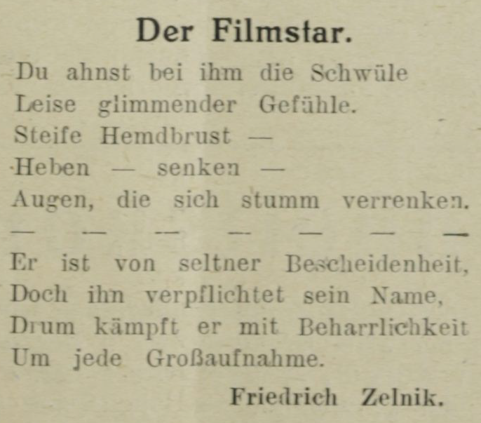
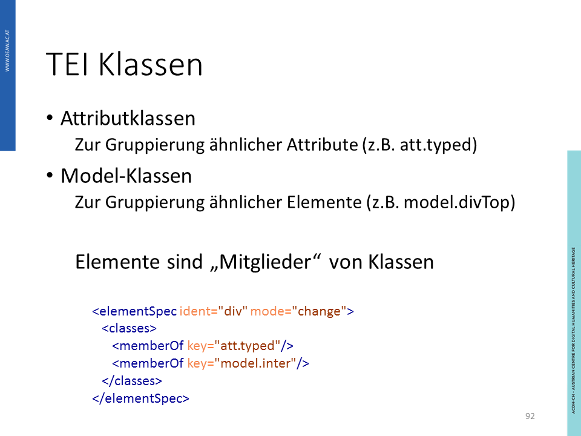
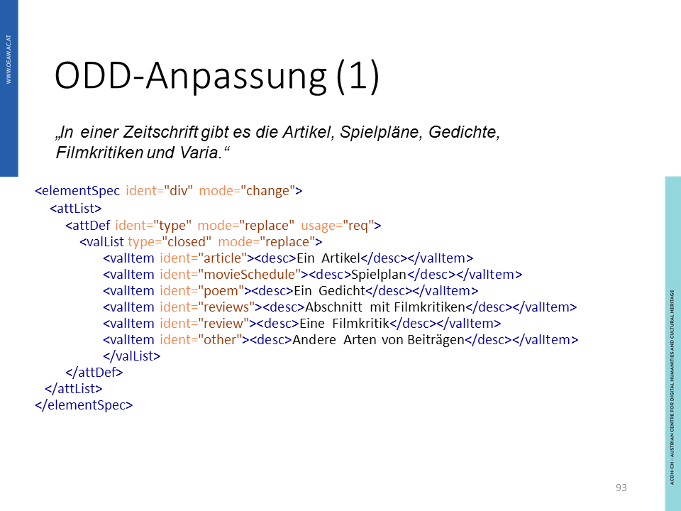
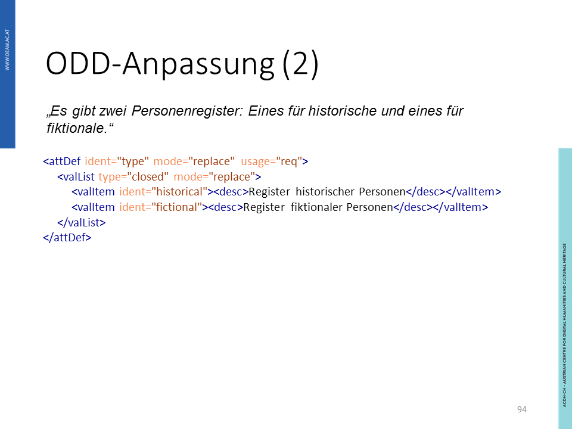
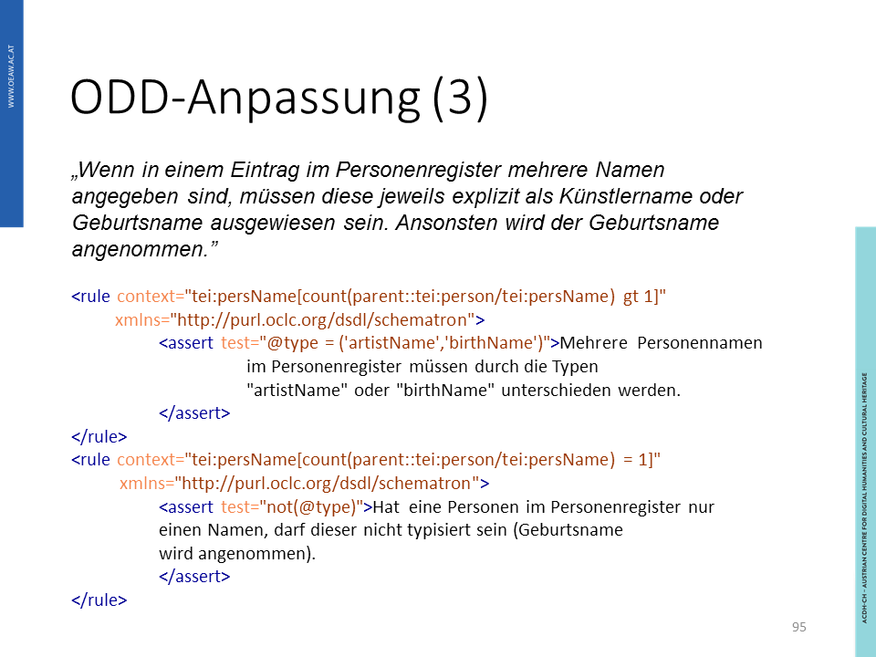
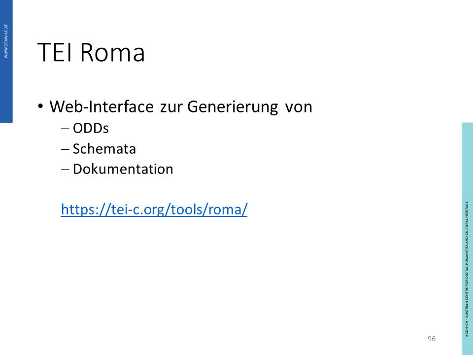

## Lerninhalte

- Datenmodellierung
- TEI Schema
- TEI Klassen
- TEI-Customization mit Roma

### Grundlagen: Module und Schemata

Selten benötigt man in einem Projekt alle von der TEI zur Verfügung gestellten Komponenten. Daher empfiehlt es sich, das verwendete Schema den eigenen Bedürfnissen anzupassen. Dies erleichtert zum einen die Annotationsarbeit, indem der Editor (z.B. [Oxygen](https://www.oxygenxml.com/)) nur die für ein Projekt relevanten Elemente und Attribute einblendet. Zum anderen dokumentiert ein angepasstes Schema die eigene Annotationsstrategie und macht sie für Dritte nachvollziehbar. Das [TEI Consortium](https://tei-c.org/) bietet neben dem Schema _'All'_ bereits einige an unterschiedliche Bedürfnisse angepasste und reduzierte Versionen an, wie z.B. ‘TEI Lite’, ‘Corpus’, ‘Drama’ oder ‘Speech.’ Darüber hinaus besteht die Möglichkeit, selbst eine Auswahl aus den zahlreichen Modulen zu treffen, Adaptierungen an bestehenden Elementen und Attributen vorzunehmen sowie eigene Komponenten hinzuzufügen und entsprechend zu dokumentieren. Mit [TEI Roma](http://www.tei-c.org/Roma/) steht ein webbasiertes Werkzeug bereit, dass Sie dabei unterstützt.

Unter einem Schema versteht man eine festgelegte Auswahl von TEI Komponenten für den jeweiligen Text und Kontext, für den sie verwendet werden sollen. Einige dieser Schemata werden vom TEI Consortium zur Verfügung gestellt und setzen sich aus verschiedenen _Modulen_ zusammen. Diese _Module_ können genutzt werden, um bestimmte Textkomponenten auszuzeichnen. Werden sie kombiniert, so entsteht ein Schema, nach dem die Auszeichnung in TEI valid ist. Die _Module_ enthalten verschiedenste Elemente und Attribute, die für den jeweiligen Zweck sinnvoll sind. Hier finden Sie eine Liste der [Module](https://www.tei-c.org/release/doc/tei-p5-doc/en/html/ST.html#STMA/), unten seien nur ein paar Beispiele genannt:

- **header**: Die hier enthaltenen Elemente sind Ihnen teilweise schon bekannt aus dem Modul **TEI header** bekannt. Diese Elemente zeichnen vor allem Metadaten zu Ihrem Dokument aus.
- **namesdates**: Dieses Modul, "Names, Dates, People, and Places" enthält, wie der Name schon sagt, Elemente und Attribute um Informationen zu Personen, Zeitpunkten und Orten auszuzeichnen. Beispielsweise gibt es das Element `<name>`, das durch die Attribute `<role="actor">`und `<type="person">` erweitert werden kann, um in einem Text einen Schauspieler auszuzeichnen.
- **verse**: Dieses Modul bietet Elemente und Attribute um Texte in Versform auszuzeichnen, zum Beispiel durch Tags für Strophen `<lg type="stanza">`, Zeilen `<l>`, oder die Auszeichnung eines Reimschemas.

Das Schema "All" enthält alle zu diesem Zeitpunkt verfügbaren TEI Module, derzeit sind dies 23. Im Gegensatz dazu bietet das Schema "Bare" das absolute Minimum, das Sie für eine Annotation benötigen. Selten werden alle verfügbaren Komponenten benötigt, deshalb gibt es bereits einige reduziertere Schema, wie z.B. "TEI Lite", "Corpus", "Drama" oder "Speech". Wie die Namen schon verraten, wurden diese Schemata zur leichteren Annotation bestimmter Texte oder von bestimmten Textteilen zusammengestellt. Das TEI Consortium stellt bestimmte [Schemata](https://tei-c.org/guidelines/customization/) zur Verfügung, andere werden von der Community verwaltet. Hier einige Beispiele:

- **TEI Lite**: Dieses Schema bietet generische Komponenten, die für "90% of the needs of 90% of the TEI user community" die meisten Zwecke erfüllen. Dieses Schema kann schnell erlernt werden, und wird sehr häufig eingesetzt.
- **Corpus**: Dieses Schema eignet sich für die Auszeichnung von unterschiedlichsten Sprachkorpora. Man findet hier unter anderem Komponenten, mit denen man kontextuelle, aber auch linguistische Informationen auszeichnen kann.
- **Drama**: Dieses Schema eignet sich für die Auszeichnung performativer Texte, zum Beispiel Theaterstücke oder Filmskripte. Komponenten, die man hier findet, sind zum Beispiel `<castlist>`, um die Figuren auszuzeichen, Regieanweisungen, aber auch `<epilogue>`und `<prologue>` als spezifische Abschnitte des auszuzeichnenden Textes.
- **Speech**: Dieses Schema eignet sich zur Auszeichnung transkribierter gesprochener Texte. Allerdings ist es möglich, dass für detailliertere Diskursanalysen oder phonologische Untersuchungen das Schema erweitert werden sollte, damit es sinnvoll verwendet werden kann.

Darüber hinaus besteht die Möglichkeit, selbst eine Auswahl aus den zahlreichen Modulen zu treffen, Adaptierungen an bestehenden Elementen und Attributen vorzunehmen sowie eigene Komponenten hinzuzufügen und entsprechend zu dokumentieren. Mit [TEI Roma](http://www.tei-c.org/Roma/) steht ein webbasiertes Werkzeug bereit, das Sie dabei unterstützt. Sie können ein sehr schlankes Schema durch die Elemente, die Sie benötigen, erweitern, aber auch das größtmögliche Schema reduzieren und Komponenten entfernen, die Sie nicht benötigen.

Folgenden Grundaktionen zur Anpassung stehen Ihnen zur Verfügung. Bitte achten Sie darauf, dass Ihr Schema auch nach den Anpassungen nach TEI_all gültig bleibt:

- Elemente entfernen
- Elemente umbenennen
- Die sogenannten "content models" von Elementen und Klassen verändern
- Attribute und Werte für Elemente und Klassen verändern
- Klassenzugehörigkeit modifizieren
- neue Elemente (zu bestehenden Klassen) hinzufügen

#### Praktische Anwendung

Sehen Sie sich bitte das folgende Beispiel für ein Schema an, das zur Validierung der Annotation des Beispieltextes benutzt wurde:

```xml
<?xml version="1.0" encoding="UTF-8"?>
<?xml-model href="http://www.tei-c.org/release/xml/tei/custom/schema/relaxng/tei_all.rng" type="application/xml" schematypens="http://relaxng.org/ns/structure/1.0"?>
<?xml-model href="http://www.tei-c.org/release/xml/tei/custom/schema/relaxng/tei_all.rng" type="application/xml"
	schematypens="http://purl.oclc.org/dsdl/schematron"?>
```

Im oben gezeigten Beispiel sehen Sie die ersten Zeilen der Auszeichnung unserer Beispielzeitschrift. Neben der Angabe der Kodierung der genutzten Zeichen `UTF-8`, finden Sie hier auch die Angabe zum verwendeten Schema. Die Auszeichnung mit Referenz-URI, `?xml-model href="http://www.tei-c.org/release/xml/tei/custom/schema/relaxng/tei_all.rng"` zeigt, dass diese Auszeichnung gegen das `relaxng`- Schema validiert wird. Das bedeutet, dass alle Elemente, Klassen und Attribute, die in diesem Schema verfügbar sind, als gültig akzeptiert werden. Entsprechende Referenzen finden Sie auf der TEI-Website, sofern Sie sich auf ein bereits vorhandenes Schema beziehen.

Die Auszeichnung des Schemas finden Sie zu Beginn einer Auszeichnung Ihres Dokumentes im folgenden Ausdruck: `?xml-model href="http://www.tei-c.org/release/xml/tei/custom/schema/relaxng/tei_all.rng"`.

Insgesamt gibt es derzeit 23 Module, in denen die Deklarationen der verfügbaren Elemente festgehalten werden. Aus ihnen können Sie beliebig viele für Ihr Schema wählen. Die TEI empfiehlt, dass die Module **core**  (Elemente, die in jedem TEI Dokument vorkommen), **header** (gemeinsame Metadaten), **textstructure** (grundlegende Textstruktur) und **TEI** (TEI Infrastruktur) immer vorkommen sollten. Eine Auflistung der Module finden Sie [hier](https://tei-c.org/release/doc/tei-p5-doc/en/html/ST.html). 

Eine Auflistung der Schema, die von der TEI zur Verfügung gestellt werden und auch in Roma bzw im Editor Oxygen verfügbar sind, finden Sie [hier](https://tei-c.org/guidelines/customization/).

##### Übung 1a: Schema erkennen

Sie möchten ein Schema nutzen, um Ihre Auszeichnung von _Friedrich Zelniks_ Gedicht **Der Filmstar** zu validieren.



```xml
?xml-model href="http://www.tei-c.org/release/xml/tei/custom/schema/relaxng/tei_all.rng
<TEI xmlns="http://www.tei-c.org/ns/1.0">
  <teiHeader>
    <fileDesc>
      <titleStmt>
        <title>Die Filmwelt - ein Ausschnitt</title>
      </titleStmt>
      <publicationStmt>
        <p>Information zur Veröffentlichung</p>
      </publicationStmt>
    </fileDesc>
  </teiHeader>
  <text>
    <body>
      <div xml:id="Zelnik1" type="poem">
       <head xml:lang="de"> Der Filmstar </head>
       <lg n="1">
         <l>Du ahnst bei ihm die Schwüle</l>
         <l>Leise glimmender Gefühle</l>
         <l>Steife Hemdbrust -</l>
         <l>Heben - senken -</l>
         <l>Augen, die sich stumm verrenken.</l>
        </lg>
        <lg n="2">
         <l>Er ist von seltner Bescheidenheit,</l>
         <l>Doch ihn verpflichtet sein Name,</l>
         <l>Drum kämpft er mit Beharrlichkeit</l>
         <l>Um jede Großaufnahme.</l>
        </lg>
      </div>
    </body>
  </text>
</TEI>
```

<Quiz>
  <Quiz.Card validateButtonLabel="Überprüfen">
    <Quiz.MultipleChoice>
      <Quiz.Question>
        Wie können Sie vorgehen?
      </Quiz.Question>

      <Quiz.MultipleChoice.Option>
        a) Ich nutze das Schema _'All'_, da ich noch nicht sicher bin, was ich auszeichnen möchte und mir alle Freiheiten offen halten möchte.
      </Quiz.MultipleChoice.Option>

      <Quiz.MultipleChoice.Option isCorrect>
        b) Ich nutze das Schema _'Lite'_, da ich die Reimstruktur auszeichnen möchte und das Schema hierfür ausreichend ist.
      </Quiz.MultipleChoice.Option>

      <Quiz.MultipleChoice.Option isCorrect>
        c) Ich stelle sicher, dass das Modul _verse_ Teil des Schemas ist, das ich verwende.
      </Quiz.MultipleChoice.Option>

      <Quiz.MultipleChoice.Option>
        d) Ich arbeite mit dem Schema, dass mir eine erfahrene Kollegin empfiehlt. Auf Ihr Wissen kann ich vertrauen.
      </Quiz.MultipleChoice.Option>

      <Quiz.Message type="correct">
        Sehr gut!
      </Quiz.Message>

      <Quiz.Message type="incorrect">
        Überlegen Sie nochmal!
      </Quiz.Message>
    </Quiz.MultipleChoice>
  </Quiz.Card>
</Quiz>


##### Übung 1b: Schema erkennen

<Quiz>
  <Quiz.Card>
    <Quiz.MultipleChoice>
      <Quiz.Question>
        Welche der folgenden Möglichkeiten haben Sie bei der Anpassung eines Schemas an Ihre Bedürfnisse NICHT?
      </Quiz.Question>

      <Quiz.MultipleChoice.Option>
        a) Elemente entfernen
      </Quiz.MultipleChoice.Option>

      <Quiz.MultipleChoice.Option>
        b) Elemente umbenennen
      </Quiz.MultipleChoice.Option>

      <Quiz.MultipleChoice.Option>
        c) Die sogenannten "content models" von Elementen und Klassen verändern
      </Quiz.MultipleChoice.Option>

      <Quiz.MultipleChoice.Option>
        d) Attribute und Werte für Elemente und Klassen verändern
      </Quiz.MultipleChoice.Option>

      <Quiz.MultipleChoice.Option isCorrect>
        e) Elemente alphabetisch sortiert anzeige
      </Quiz.MultipleChoice.Option>

      <Quiz.MultipleChoice.Option>
        f) Klassenzugehörigkeit modifizieren
      </Quiz.MultipleChoice.Option>

      <Quiz.MultipleChoice.Option>
        g) neue Elemente (zu bestehenden Klassen) hinzufügen
      </Quiz.MultipleChoice.Option>

      <Quiz.Message type="correct">
        Richtig! Die Möglichkeit der alphabetischen Sortierung ist für die Definition dessen, worauf Elemente, Klassen, Attribute im Text verweisen, irrelevant.
      </Quiz.Message>

      <Quiz.Message type="incorrect">
        Überlegen Sie nochmal!
      </Quiz.Message>
    </Quiz.MultipleChoice>
  </Quiz.Card>
</Quiz>


### TEI Klassen

In TEI finden sich über 500 Elemente. Wie Sie inzwischen wissen, finden sich diese Elemente (und ihre Attribute) in den TEI Modulen. Doch auch wenn die Element einem Modul zugeordnet sind, haben viele Elemente und Attribute Gemeinsamkeiten, die über die Grenzen der Module hinausgehen. Zur besseren Übersicht und Verständlichkeit dieser Gemeinsamkeiten wurden die Elemente in Klassen eingeteilt. Bevor man sich näher mit den Klassen einzelner Elemente beschäftigt, muss angemerkt werden, dass zwei unterschiedliche Möglichkeiten des Ausdrucks von Gemeinsamkeiten gibt: wenn man Elemente danach einteilt, dass sie Attribute teilen, werden sie über Attributsklassen klassizifiert. Werden Elemente danach klassifiziert, dass sie im _content model_ am selben Ort in der Texthierarchie vorkommen, spricht man von Model-Klassen.

<SideNote type="note" title="Ererbte Eigenschaften">
Die Mitglieder einer Klasse teilen bestimmte Eigenschaften miteinander. Diese Eigenschaften werden kaum im Element selbst definiert, sondern ergeben sich aus der Mitgliedschaft in einer Klasse. Ebenso werden Eigenschaften "vererbt", wenn die Klasse eines Elements oder Attributs einer Über- oder Unterklasse zugeordnet ist.
</SideNote>

**Attributklassen** (_[attribute class](https://www.tei-c.org/release/doc/tei-p5-doc/en/html/ST.html#STECAT)_): Gruppierung ähnlicher Attribute (z.B. `<att.typed>`)

**Beispiel:** Die Attributklasse [`<att.canonical>`](https://www.tei-c.org/release/doc/tei-p5-doc/en/html/ref-att.canonical.html) umfasst die Attribute "key" und "ref", die autorisierte Informationen mit Elementen wie `<birth>`,`<country>`,`<title>`, oder auch Personennamen `<forename>` verknüpfen. Man muss also nicht bei jedem der genannten Elemente die Attribute definieren, sie werden durch die Zugehörigkeit zur Klasse zugewiesen. Gleichzeitig haben diese Element die genannten Attribute gemeinsam und sind durch sie miteinander verbunden. Jede Attributsklasse startet mit "att.".

Achtung: Die Attributsklasse `<att.global>` der globalen Attribute ist in jedem TEI-Modul definiert und deshalb immer verfügbar. Wenn Sie und aber bestimmte Attributsklassen nutzen möchten, müssen diese in den von Ihnen für Ihr Schema gewählten Modulen verfügbar sein, da sie ansonsten für Sie nicht nutzbar sind.

**Model-Klassen** (_[model class](https://www.tei-c.org/release/doc/tei-p5-doc/en/html/ST.html#STECCM)_): Gruppierung ähnlicher Elemete (z.B. `<model.divTop>`)

**Beispiel:**  Die Model-Klasse [`<model.pLike>`](https://www.tei-c.org/release/doc/tei-p5-doc/en/html/ref-model.pLike.html) umfasst Elemente, die Absatz `<p>` (paragraph) -ähnliche Strukturen auszeichnen. Durch die Zugehörigkeit zur Model-Klasse `<model.pLike>` wird festgelegt, dass sowohl das Element `<p>` (Absatz), als auch `<ab>` (ein unbestimmtes, absatzartiges Element, das nicht dieselbe semantische Konnotation eines Absatzes hat) eine absatzähnliche Struktur aufweisen. Jede Model-Klasse startet mit "model.", danach folgt eine Bezeichnung der Elemente, die folgt.

#### Praktische Anwendung

Im folgenden Codeblock sehen Sie ein Beispiel einer Auszeichnung eines Elements. Das Element [`<elementSpec>`](https://www.tei-c.org/release/doc/tei-p5-doc/en/html/ref-elementSpec.html) zeichnet die Struktur, den Inhalt und die Verwendung eines bestimmten Elements aus. In diesem Fall geht es um das Element `<div>`.  Des weiteren sehen Sie hier, welchen Klassen das Element angehört, nämlich einerseits der Attributsklasse `<att.typed>`, andererseits oder Model-Klasse `<model.inter>`.  Über diese Klassen sind nun bestimmte Eigenschaften und Ähnlichkeiten zu anderen Elementen festgelegt.

```xml
<elementSpec ident="div"mode="change">
  <classes>
    <memberOf key="att.typed"/>
    <memberOf key="model.inter"/>
  </classes>
 <elementSpec>  
```

### ODD-Anpassung

Wenn Sie für Ihr Projekt ein für Ihre Bedürfnisse angepasstes Schema (_customization_) erstellen, können Sie dies in einer [TEI ODD-Datei](https://tei-c.org/guidelines/customization/getting-started-with-p5-odds/) tun. Diese Datei beeinflusst die Anpassungsregeln, an denen sich Ihr TEI Textdokument orientiert. TEI ODD steht für "TEI- One Document Does it all". Diese Datei muss in der Datei-Endung **.odd** enden und `<namespace>` **http://www.tei-c.org/ns/1.0** enthalten. Es wird in der TEI ODD Auszeichnungssprache in einem XML-Dokument geschrieben und enthält die Dokumentation von Schemafragmenten, aber auch von ausgeschriebenen Verweisen und weiteren Referenzen. ODD  nützt das **tagdocs**-Modul, mit dem sich TEI-Richtlinien anpassen lassen.

Das Schema wir durch die `<schemaSpec>`definiert, die wiederum Definitionen und Verweise auf Elemente `<elementSpec>`, Klassen `<classSpec>`, Makrospefizikationen `<makroSpec>` oder Module `<moduleRef>` enthält.
`<moduleRef>` nimmt eine Sonderstelluung ein, weil hier entweder durch _url_ auf ein externes Schema in der RelaxNG Sprache verwiesen wird (so kann auf Schemata, die nicht aus TEI stammen, verwiesen werden), oder durch _key_ auf bereits vorhandene TEI Module. Nach der Definition des Schemas können auch die Elemente in ihrer Benennung, Funktion o.Ä. verändert und angepasst werden.

#### Praktische Anwendung

Im Rahmen der ODD-Anpassung werden auch bestehende Elemente den eigenen Bedürfnissen angepasst. Im folgenden ersten Beispiel wird im Element`<elementSpec>` eine Reihe von Attributen für die Zwecke der Auszeichnung des Beispieltextes definiert. Die Ausdrücken `<mode="change">` und `<mode="replace">` zeigen klar an, dass hier Veränderungen und Ersetzungen vorgenommen werden. Außerdem wird genau beschrieben, für welche Textteile die Attribute "article", "movieSchedule", "poem", "reviews", "review" und "other" angewendet werden sollen. Wenn Sie diese Liste `<attList>` mit der Auszeichnung der Abschnitte unseres Beispieltextes vergleichen, werden Sie feststellen, dass die im ODD-Dokument festgeschriebenen Definitionen angewandt wurden.

```xml
<elementSpec ident="div" mode="change">
  <attList>
    <attDef ident="type" mode="replace" usage="req">
      <valList type="closed" mode="replace">
        <valltem ident="article"><desc>Ein Artikel</desc></valltem>
        <valltem ident="movieSchedule"><desc>Spielplan</desc></valltem>
        <valltem ident="poem"><desc>Ein Gedicht</desc></valltem>
        <valltem ident="reviews"><desc>Abschnitt mit Filmkritiken</desc></valltem>
        <valltem ident="review"><desc>Eine Filmkritik</desc></valltem>
        <valltem ident="other"><desc>Andere Arten von Beiträgen</desc></valltem>
      </valList>
    </attDef>
  </attList>
</elementSpec>
```

/_ _ /

/_ _ /

/_ _ /

/_ _ /

/_ _ /

/ _Verweis [I](https://roma2.tei-c.org/)_ /

### Weiterführende Informationen

Text Encoding Initiative. "P5: Guidelines for Electronic Text Encoding and Interchange," https://www.tei-c.org/release/doc/tei-p5-doc/en/html/index.html.

———. "Using the TEI," https://tei-c.org/release/doc/tei-p5-doc/en/html/USE.html.

———. "TEI Modules," https://www.tei-c.org/release/doc/tei-p5-doc/en/html/ST.html#STMA.

———. "Roma: generating customizations for the TEI," http://www.tei-c.org/Roma/.

———. "Lite," https://tei-c.org/guidelines/customization/Lite/.

———. "Names, Dates, People, and Places," https://www.tei-c.org/release/doc/tei-p5-doc/en/html/ND.html.

———. "Transcription of Speech," https://www.tei-c.org/release/doc/tei-p5-doc/it/html/TS.html.

———. "Performance Texts," https://www.tei-c.org/release/doc/tei-p5-doc/en/html/DR.html.

———. "Verse," https://www.tei-c.org/release/doc/tei-p5-doc/en/html/VE.html.

———. "The TEI Header," https://www.tei-c.org/release/doc/tei-p5-doc/en/html/HD.html.

———. "The TEI Infrastructure," https://tei-c.org/release/doc/tei-p5-doc/en/html/ST.html.

Dumont, Stefan. 2017. "TEI-Customization," https://www.i-d-e.de/wp-content/uploads/2017/11/IDE_2017_TEI-Customization.pdf.

———. "Getting started with P5 ODDs" https://tei-c.org/guidelines/customization/getting-started-with-p5-odds/.