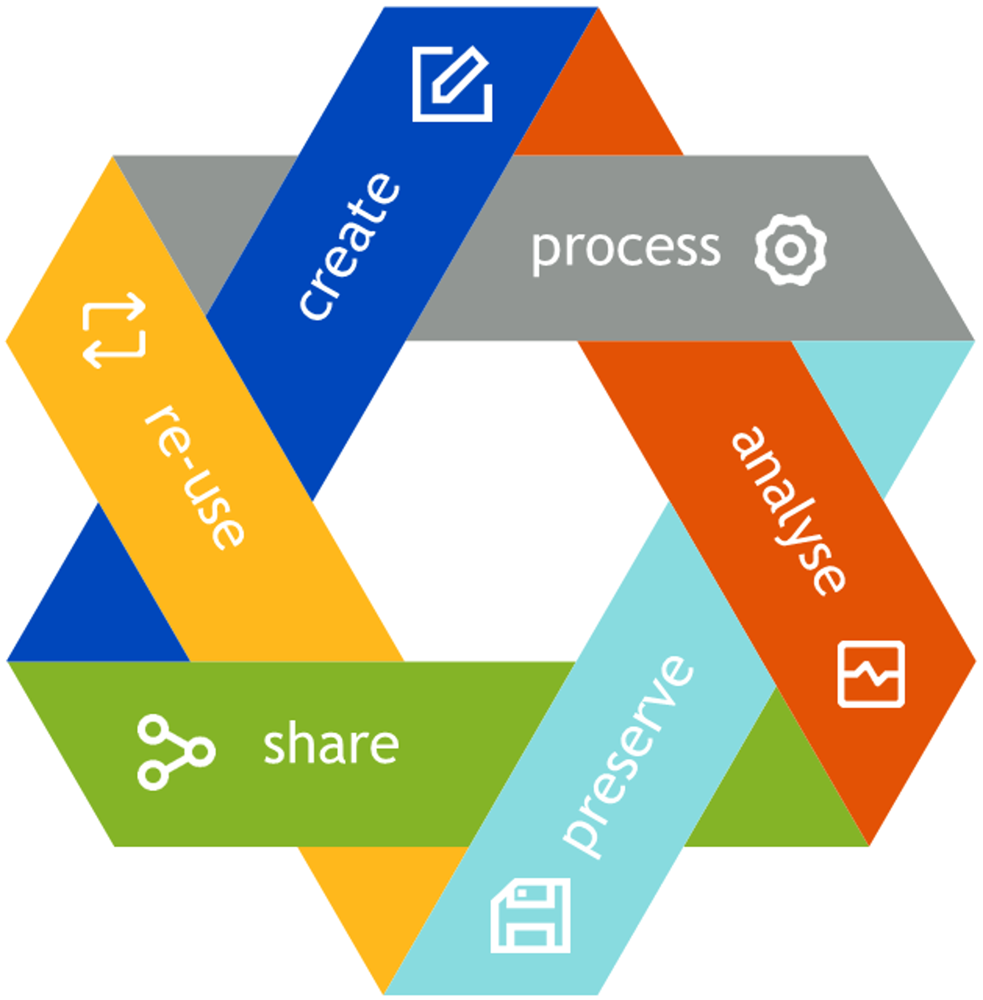

# **Workshop - Test**

Let us create an enty in the CMS workflow.

<SideNote type="note" title="Hint">
You can add didactic elements to your learning material.
</SideNote>

The text continues after the picture.

**Add a picture:**

<figcaption>"LostData", by MT, licensed under <a href="https://creativecommons.org/licenses/by/4.0">CC-BY-4.0</a></figcaption>

**Versuch mit neuem Widget:**

<Figure src="images/screen_howto_addpeople.png" alt="Test">
"Lost Data Map", by Martina Trognitz, is licensed under [https://creativecommons.org/licenses/by/4.0/](https://creativecommons.org/licenses/by/4.0/)
</Figure>