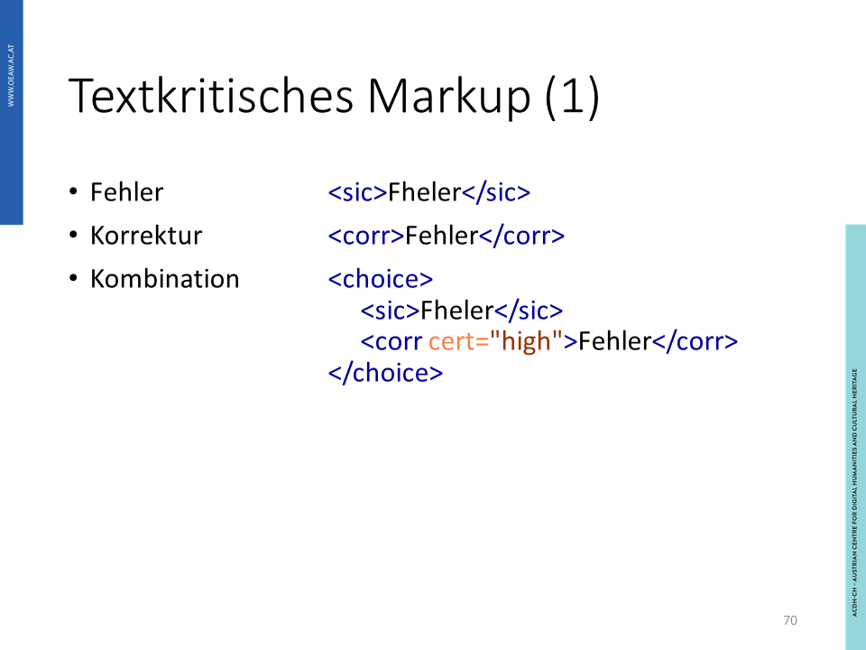
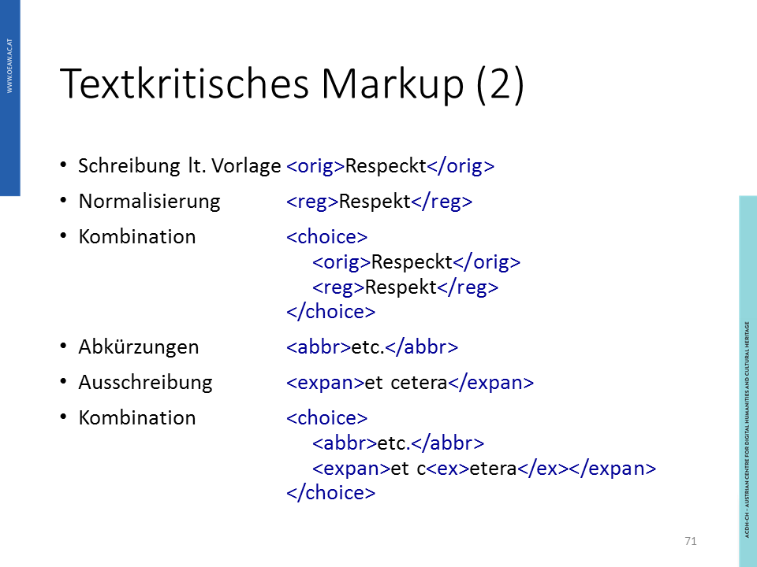
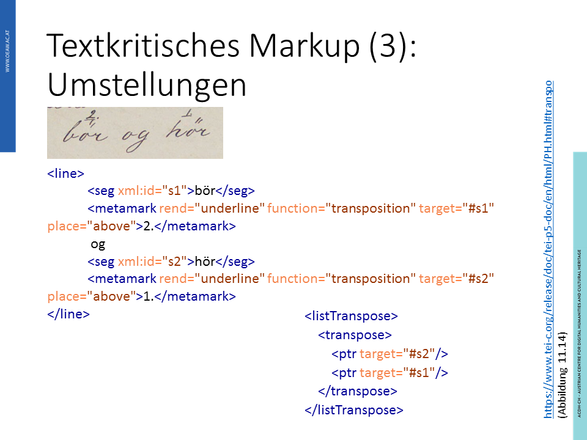
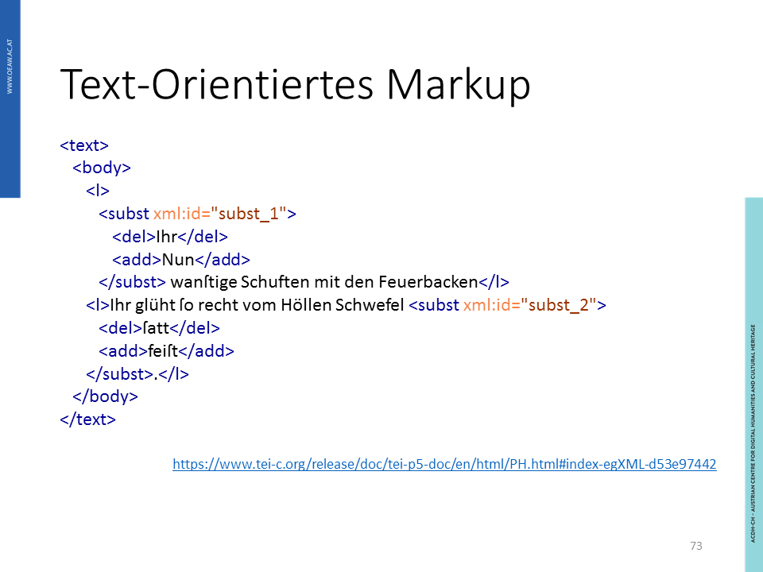
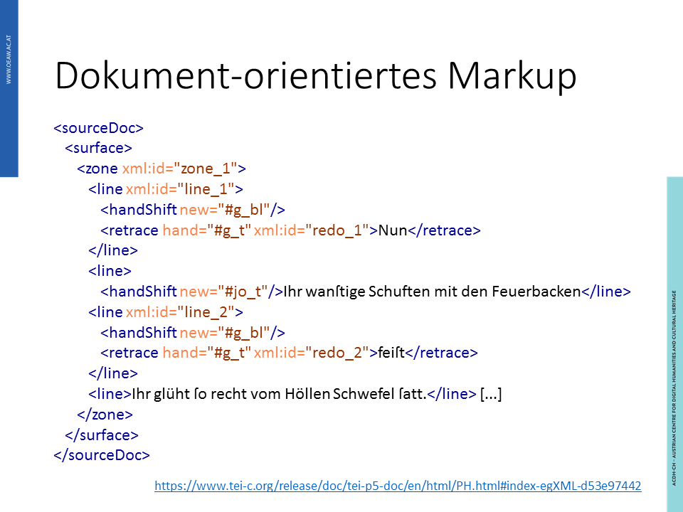
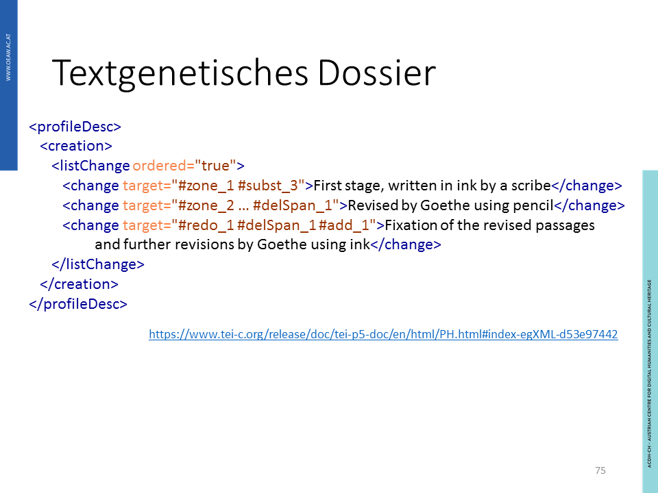
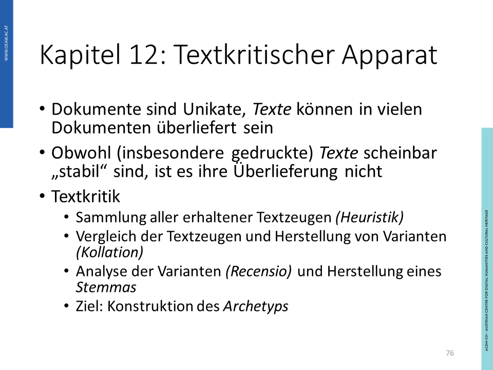
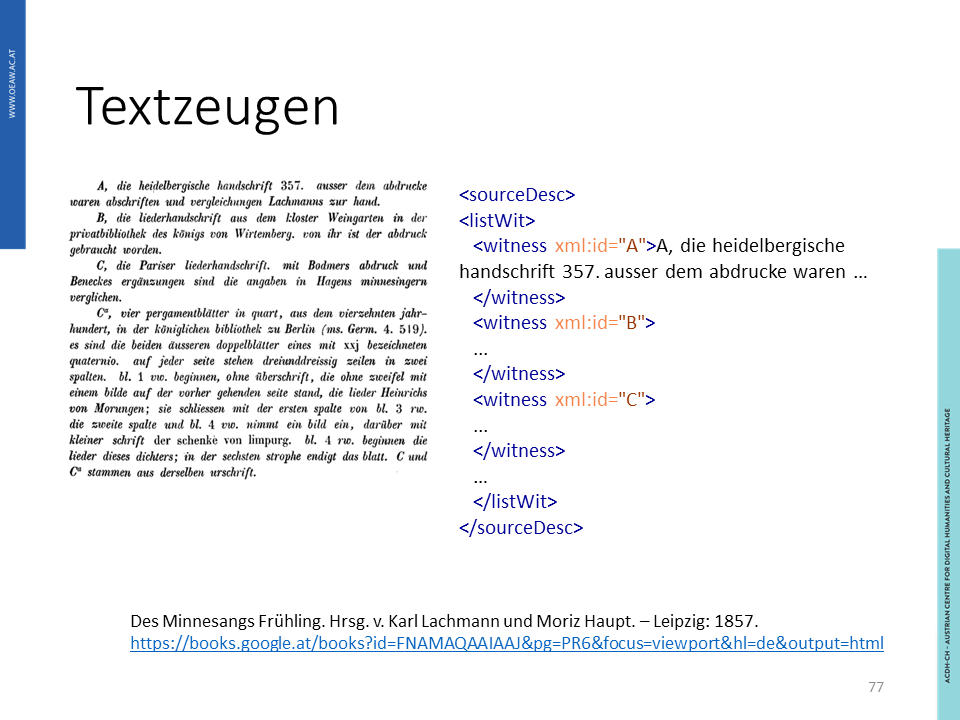

## Lerninhalte

- Textkritisches Markup
- Dokument-orientiertes Markup
- Textkritischer Apparat

## Grundlagen

Dokumente sind Unikate, und Texte können in vielen Dokumenten überliefert sein. Obwohl (insbesondere gedruckte) Texte scheinbar „stabil“ erscheinen, so ist es ihre Überlieferung nicht.

Textkritik ist daher eine Methode um alle Einflüsse der Entstehung und Überlieferung auf die Gestalt der uns vorliegenden, überlieferten Texte herauszuarbeiten. Dies beinhaltet unter anderem folgende Schritte:

- Sammlung aller erhaltener Textzeugen (Heuristik)
- Vergleich der Textzeugen und Herstellung von Varianten (Kollation)
- Analyse der Varianten (Recensio) und Herstellung eines Stemmas
- Qualität der Lesart anhand von Kriterien wie Spache, Stil und innere Schlüssigkeit (Examinatio)
- Fehlerkorrektur durch Herausgeber (Emendatio)

Das Ziel der Textkritik ist die Konstruktion des Archetyps des Textes. In der digitalen Edition ist es möglich, den Prozess der Textkritik übersichtlich zu veranschaulichen.

## Praktische Anwendung

/// Die Inhalte kommen vor allem aus der TEI Dokumentation. Wollen wir dafür direkt auf die TEI Dokumentation verweisen oder sie anhand eines eigenen Beispiels erläutern?

### Textzeugen

### Textgenetisches Dossier

### Praktische Anwendung: Textkritisches Markup

Bei der Auszeichnung des textkritischen Markups wird der editierte Text sowie die Veränderungen durch die textkritischen Methoden dargestellt. So kann auch die Textgenese an des [kritischen Apparates](https://tei-c.org/release/doc/tei-p5-doc/en/html/TC.html) nachvollzogen werden, der Platz für Variationen und Anmerkungen bietet.

### Verbindung von Text und Apparat

Verweis [I](https://www.tei-c.org/release/doc/tei-p5-doc/en/html/ref-metamark.html)

Verweis [I](https://www.tei-c.org/release/doc/tei-p5-doc/en/html/PH.html#transpo)

Verweis [I](https://www.tei-c.org/release/doc/tei-p5-doc/en/html/PH.html#index-egXML-d53e97442)

Verweis [I](https://www.tei-c.org/release/doc/tei-p5-doc/en/html/PH.html#index-egXML-d53e97442)

Verweis [I](https://www.tei-c.org/release/doc/tei-p5-doc/en/html/PH.html#index-egXML-d53e97442)

- - -

Verweis [I](https://books.google.at/books?id=FNAMAQAAIAAJ&pg=PR6&focus=viewport&hl=de&output=html)

Verweis [I](https://books.google.at/books?id=FNAMAQAAIAAJ&hl=de&pg=RA1-PR2#v=onepage&q&f=false)

