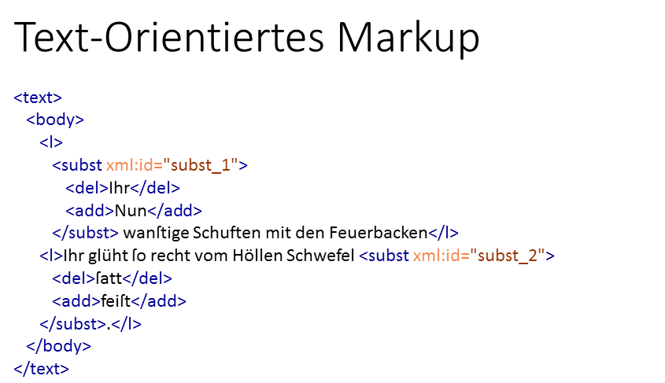
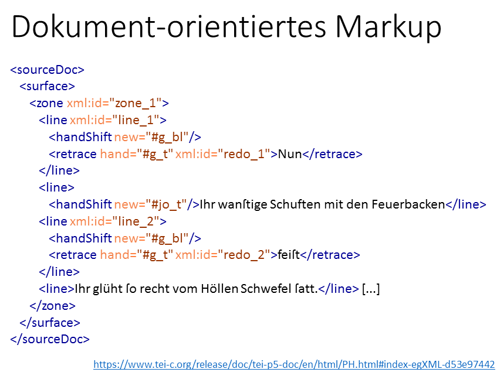
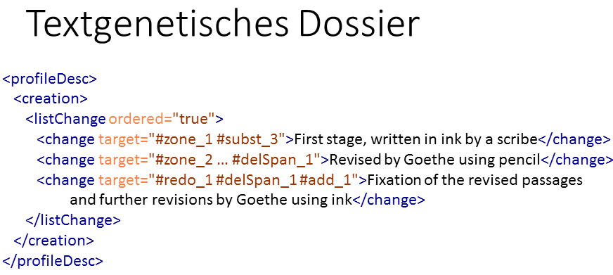
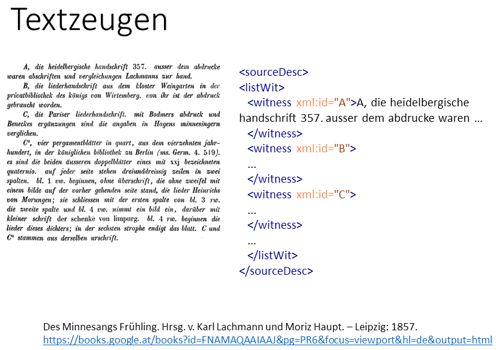
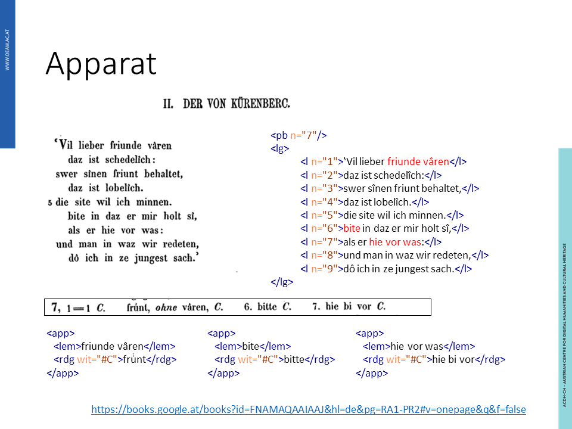
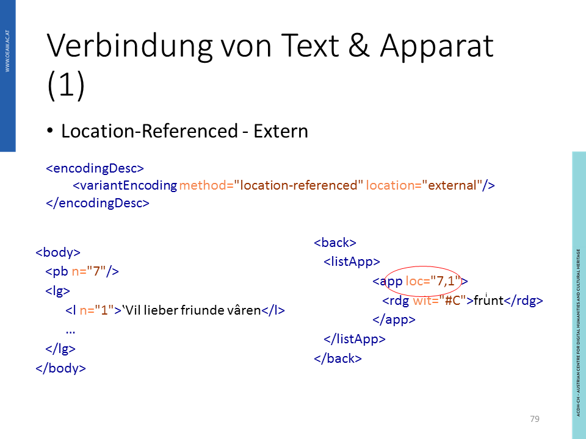
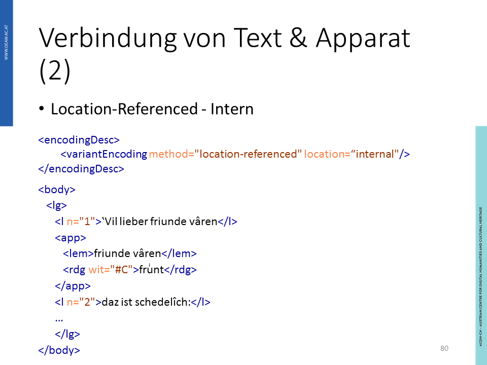
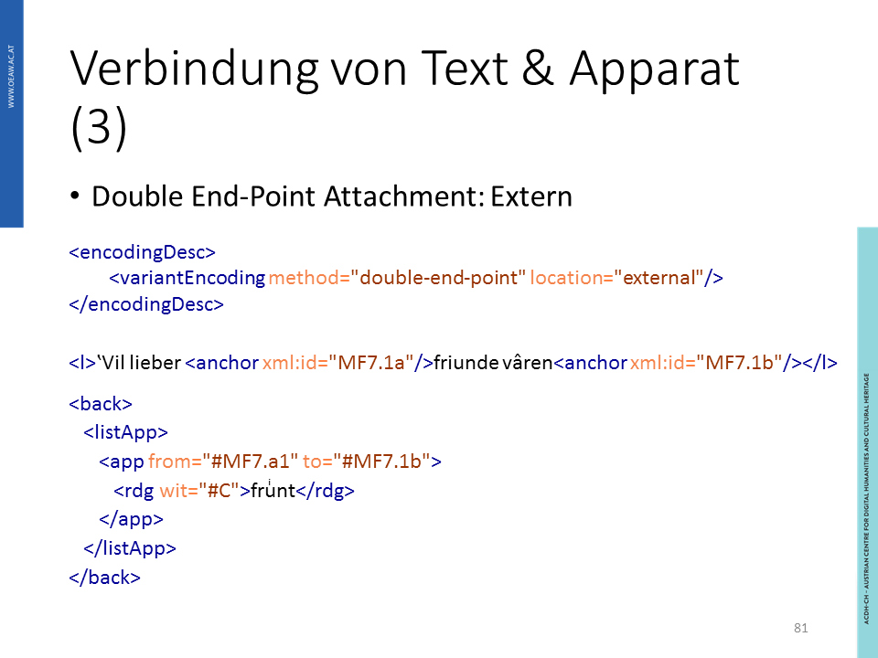
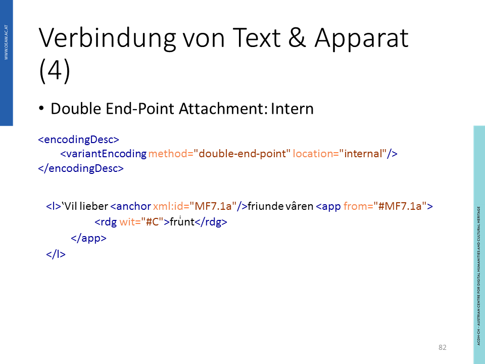
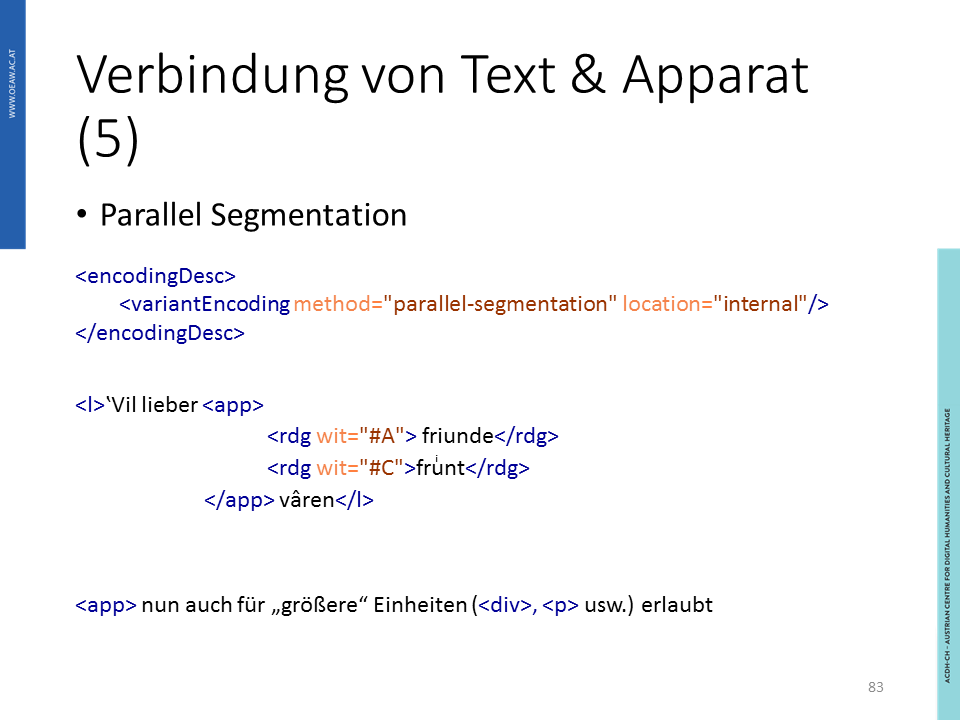

## Lerninhalte

- Textkritisches Markup
- Dokument-orientiertes Markup
- Textkritischer Apparat

## Grundlagen

Dokumente sind Unikate, und Texte können in vielen Dokumenten überliefert sein. Obwohl (insbesondere gedruckte) Texte scheinbar „stabil“ erscheinen, so ist es ihre Überlieferung nicht.

Textkritik ist daher eine Methode um alle Einflüsse der Entstehung und Überlieferung auf die Gestalt der uns vorliegenden, überlieferten Texte herauszuarbeiten. Dies beinhaltet unter anderem folgende Schritte:

- Sammlung aller erhaltener Textzeugen (Heuristik)
- Vergleich der Textzeugen und Herstellung von Varianten (Kollation)
- Analyse der Varianten (Recensio) und Herstellung eines Stemmas
- Qualität der Lesart anhand von Kriterien wie Spache, Stil und innere Schlüssigkeit (Examinatio)
- Fehlerkorrektur durch Herausgeber (Emendatio)

Das Ziel der Textkritik ist die Konstruktion des Archetyps des Textes. In der digitalen Edition ist es möglich, den Prozess der Textkritik übersichtlich zu veranschaulichen.

Die TEI bevorzugt keine bestimmte Erstellungsweis des textkritischen Apparats. Es ist den Editor*innen überlassen, wie viele Textzeugen angegeben werden, ob am Ende eine Edition eines einziges Textes erstellt sein soll, ob ein positiver oder negativer Apparat geführt wird. Durch die vielfältigen Markup-Optionen stehen Ihnen alle Varianten offen.

## Praktische Anwendung

/// Die Inhalte kommen vor allem aus der TEI Dokumentation. Wollen wir dafür direkt auf die TEI Dokumentation verweisen oder sie anhand eines eigenen Beispiels erläutern?

### Textzeugen

### Textgenetisches Dossier

## Praktische Anwendung: Textkritisches Markup

Bei der Auszeichnung des textkritischen Markups wird der editierte Text sowie die Veränderungen durch die textkritischen Methoden dargestellt. So kann auch die Textgenese an des [kritischen Apparates](https://tei-c.org/release/doc/tei-p5-doc/en/html/TC.html) nachvollzogen werden, der Platz für Variationen und Anmerkungen bietet. Im Folgenden finden Sie mehrere Beispiele für die Anwendung des textkritischen Markups.

### Korrektur offensichtlicher Fehler

")

Im Beispiel wird ein Tippfehler im Text als auch dessen Korrektur ausgezeichnet. Einerseits können sie beide Schritte - das Erkennen des Fehlers [`<sic>`](https://tei-c.org/release/doc/tei-p5-doc/en/html/ref-sic.html)und die entsprechende Korrektur [`<corr>`](https://tei-c.org/release/doc/tei-p5-doc/en/html/ref-corr.html) - separat auszeichnen, andererseits können Sie sich des [Elements `<choice>`](https://tei-c.org/release/doc/tei-p5-doc/en/html/ref-choice.html) bedienen, um die richtige Lesart und den Fehler darzustellen. Dieses Element verbindet mehrere Kodierungsmöglichkeiten an derselben Textstelle, `<sic>`und  `<corr>` sind Kindselemente, die einander ausschließen. Beachten Sie, dass mit dem Attribut `cert="high"` festgehalten wird, dass die vorgenommene Korrektur sehr wahrscheinlich richtig ist.

### Normalisierung, Abkürzung

Nicht jeder wahrgenommen Fehler, so wie der Tippfehler im obigen Beispiel, ist ein Fehler, der korrigiert werden sollte. Beispiele für Textelemente, die als Fehler wahrgenommen werden können, sind beispielsweise Änderungen in der Rechtschreibung, die dazu führen, dass Schreibweisen normalisiert, also der Norm angepasst, werden. Das textkritische Markup kann solche Veränderungen dokumentieren. Ein weiteres Beispiel sind Abkürzungen, die durch zusätzliche Ausschreibung im textkritischen Markup erklärt werden können. Unten sehen Sie wie Auszeichnungsmöglichkeiten kombiniert werden können. Ähnlich wie oben wird wieder das Elemente `<choice>` genutzt.

")

### Umstellungen

Eine [Umstellung im Text](https://tei-c.org/release/doc/tei-p5-doc/en/html/PH.html#transpo) wird häufig durch Metazeichen im Text angezeigt. Im Beispiel unten wurden Zahlen über die entsprechenden Textbausteine geschrieben, um deren richtige Reihenfolge anzuzeigen. Die Kodierung beschreibt auch nicht das beabsichtigte Ergebnis in einer Reinschrift oder dem Druck, sondern sie dokumentiert die Darstellung im Text. In der hier gezeigten Auszeichnung wird gezeigt, dass die Umstellung in einer Zeile `<line>` passiert, die Umstellungsfunktion `transposition` wird angegeben, sowie Information zum Metazeichen `<metamark>` selbst, das unterstrichen `rend="underline"` über dem Text `place="above"` steht. Zusätzlich werden die Umstellungen im Text in einer Liste `<listTranspose>` dokumentiert, hier wird durch die individuelle `id` auch auf einen ganz bestimmten Eintrag verwiesen.

: Umstellungen")

### Text-orientierte und dokument-orientierte Markup

Je nachdem, was sie mit der Auszeichnung ihres Textes beabsichtigen, können Sie unterschiedliche Schwerpunkte setzen. Im Folgenden sehen Sie dieselbe Textpassage, die auf zwei unterschiedlichen Weisen ausgezeichnet wurde.  Bei der ersten Auszeichnung liegt der Fokus des **text-orientierten Markups** auf Veränderungen im Text, angezeigt durch das Löschen `<del>` und Hinzufügen `<add>` von Textbausteinen. Diese Veränderungen werden an der entsprechenden Stelle im Text (hier Anfang einer Zeile und Ende der Folgezeile) angezeigt. Ebenso implizieren diese Textänderungen eine Aussagen über die chronologische Entstehung des Textes: was gelöscht wird, muss schon vor der Hinzufügung im Text vorhanden gewesen sein. Zudem werden einmalige Identifikationen vergeben, die später nachverfolgt werden können. [Hier](https://www.tei-c.org/release/doc/tei-p5-doc/en/html/PH.html#PH-meta) können Sie näheres über Streichungen und Ergänzungen nachlesen.

Verweis [I](https://www.tei-c.org/release/doc/tei-p5-doc/en/html/PH.html#index-egXML-d53e97442)

In der folgenden zweiten **dokument-orientierten** Auszeichnungsweise liegt der Fokus auf anderen Aspekten der Textgenese:  Es werden hier nicht nur die Änderungen im Text ausgezeichnet, zudem liefert das Markup auch Informationen über die verschiedenen Personen, die in den Text eingegriffen haben. Individuelle Identifikationen verweisen auf Information, die genauer im Apparat nachzulesen ist. Das Element `<handShift>` ist mit einer Identifikation versehen, das Attribut `new` deutet an, wessen Hand die Veränderung vorgenommen hat.  Die Änderungen selbst werden ebenfalls wieder durch Identifikationen ausgewiesen, `<retrace>`. Beachten Sie bitte, dass die Änderungen auch genau im Text verortet werden und die beiden Änderungen in unterschiedlichen Zeilen `<line>` stattgefunden haben. Hinzu kommt hier die Auszeichnung [`<zone>`](https://tei-c.org/release/doc/tei-p5-doc/en/html/ref-zone.html): mit diesem Element wird ein bestimmter physisch vorhandener Bereich einer schriftsprachlichen Quelle ausgewiesen. In diesem Bereich der Textvorlage finden sich wiederum die beiden vorhin genannten Zeilen `<line>`.  

### Verbindung von Text und Apparat

Verweis [I](https://www.tei-c.org/release/doc/tei-p5-doc/en/html/ref-metamark.html)

Im Apparat werden die Identifikationen genau beschrieben, sodass sie für weitere Auszeichnungen und Verwendung klar verständlich sind. Hier werden durch das globale [Element `<change>`](https://tei-c.org/release/doc/tei-p5-doc/en/html/ref-att.global.change.html)  eine oder mehrere Veränderungen spezifiziert. Was im Text durch die Auszeichnung angedeutet wurde, wird nun genauer erklärt: Ein Schreiber hielt Goethes Werk fest, der Autor fügte dann Veränderungen hinzu. Die Veränderungen werden im [Element `<profileDesc>`](https://www.tei-c.org/release/doc/tei-p5-doc/de/html/ref-profileDesc.html) zusammengefasst, das wiederum die Entstehungsgeschichte eines Textes dokumentieren kann.

Über die Darstellung von Primärquellen wie Autographen können Sie [hier](https://www.tei-c.org/release/doc/tei-p5-doc/en/html/PH.html#index-egXML-d53e97442) mehr nachlesen.

## Praktische Anwendung: Textkritische Apparat

Die Erstellung textkritischer Apparate mit dem Ziel der Konstruktion des Archetypen eines Textes gehört zu den zentralen Aufgabengebieten der Philologie. Der textkritische Apparat bezeugt die Dokumente, in denen der Text überliefert wurde (**Heuristik**), er bietet die Möglichkeit die Textzeugen und Varianten zu vergleichen (**Kollation**), er dolumentiert die Analyse der Varianten (**Recensio**) und ein so entstehendes **Stemma** des Textes. Natürlich kann das Ziel des textkritischen Apparats die Wahl der Editionsmethoden und die Auszeichnung beeinflussen. EInen näheren Einblick in die verschiedenen Möglichkeiten, die TEI bietet, finden Sie [hier](https://tei-c.org/release/doc/tei-p5-doc/en/html/TC.html). Im folgenden Beispiel wird [Karl Lachmann und Moriz Haupts Ausgabe _Des Minnesangs Frühling_](https://books.google.at/books?id=FNAMAQAAIAAJ&pg=PR6&focus=viewport&hl=de&output=html) aus dem Jahr 1857 und ihr textkritischer Apparat in TEI beschrieben.

### Beschreibung der Textzeugen

Im vorliegenden Dokument nennen die Herausgeber die Textzeugen, die für diese Ausgabe verwendet wurden. Diese Benennung folgt einer bereits von Lachmann im seinem Werk über Walther von der Vogelweide etablierten Bezeichnung. Um nun auf diese Textzeugen in TEI referenzieren zu können, wird jedem Textzeugen eine Identifikation zugewiesen `<witness xml:id="A">`, die in in einer [Liste der Textzeugen](https://tei-c.org/release/doc/tei-p5-doc/en/html/TC.html#TCAPWL) `<listWit>` dokumentiert ist. Diese Liste sollte entweder im **Front Matter** oder im `<sourceDesc>`-Element im **Header** festgehalten werden. Wie Sie sehen enthält die Identifikation der einzelnen Textzeugen die Beschreibung, die im Originaldokument überliefert wird. TEI zeichnet in diesem Fall die Metainformation über den Metatext zum literarischen Text aus.

- - -

### Der Apparat

Im [Digitalisat](https://books.google.at/books?id=FNAMAQAAIAAJ&hl=de&pg=RA1-PR2#v=onepage&q&f=false), ebenso wie in der physischen Ausgabe, sind Text und Apparat des Textes _II. Der von Kürenberc_ räumlich getrennt. Wird der Text nun in TEI ausgezeichnet und später ausgegeben, kann diese räumliche Trennung überwunden werden. Sie sehen hier das Digitalisat neben der Auszeichnung der Zeilen `<l>`, in der in dieser Ausgabe vorhandene Text wiedergegeben wird.

Den Zeilen sind die Lesarten im Apparat gegenüber gestellt. Unter dem Element `<app>`, findet sich der Eintrag im kritischen Apparat, in den ein Lemma `<lem>` und verschiedene Lesarten `<rdg>` eingebettet sind.

Verweis [I](https://books.google.at/books?id=FNAMAQAAIAAJ&hl=de&pg=RA1-PR2#v=onepage&q&f=false)

Weiterführende Links:
--. Textkritischer Apparat, Kapitel 12 der TEI. !\[https://tei-c.org/release/doc/tei-p5-doc/en/html/TC.html]