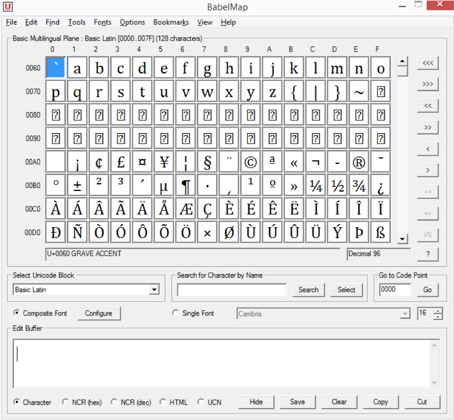
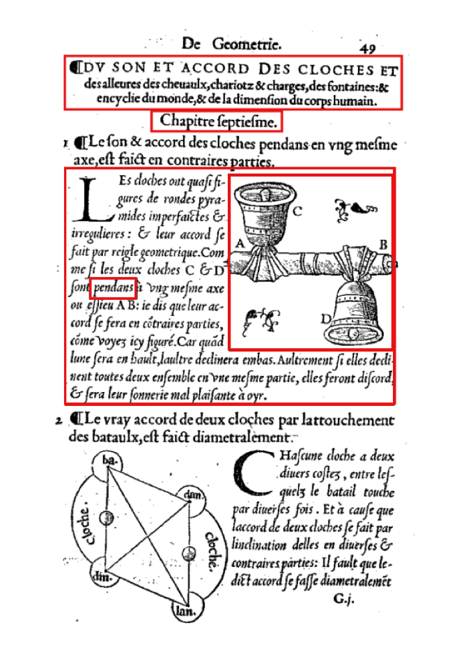
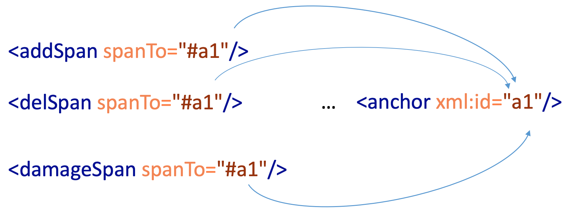

## Lernziele

- Unterscheidung von Unicode & Nicht-Unicode Zeichenf
- Definition der Begriffe Text vs. Dokument
- Arbeit mit Faksimiles


## Einführung: Texte und ihre Vorlagen


Beim Anblick der oben abgebildeten Seite mit einem Text von Balzac, in dem handschriftlich Korrekturen eingetragen wurden, stellt sich die Frage: wo ist hier der Text? Ist der Drucktext gemeint, der Schreibprozess oder die umgesetzten Änderungen? Abhängig von der Sichtweise auf den Text und auf die Fragestellungen, die man beantworten möchte, ist grundsätzlich alles möglich. Die **Übersetzung von Fragestellungen in Markup** kann man als **Datenmodellierung** bezeichnen. Man kann zwar einen Text nicht in all seinen Facetten in den Computer übertragen, jedoch drückt das, was man annotiert, ein Modell des Textes aus, das von den zugrundeliegenden Interessen mitbestimmt wird.

Wenn in der Einführung des TEI Markup davon die Rede war, dass man mit Markup das Aussehen eines Textes kodieren kann, ist das nur halb richtig: der Text selbst – zumindest aus Sicht der TEI - ist etwas Abstraktes. Vielmehr sind es die *Vorlagen* des kodierten Textes, die ein Aussehen haben, die physischen Dokumente. Wie ein Text digital hergestellt wird und wie er in maschinenlesbarer Form abgebildet ist, wird vom Editor bestimmt – und das ist, wie jeder weiß, der z.B. mit der Transkription von Handschriften betraut war, ein Übersetzungsprozess.

Sehr vereinfacht kann man behaupten:

- Ein Fleck auf einem Blatt Papier oder Pergament wird als Graph identifiziert.
- Der Graph wird einem Graphem einer natürlichen Sprache zugewiesen, also einem Lautwert.
- Im Zusammenspiel mit den anderen Graphemen im Kontext wird ein 'Wort' identifiziert.
- Die Bedeutung dieses Wortes wird durch Einbeziehung der anderen Wörter in seiner Umgebung, im Dokument und Weltwissen des Lesers generiert, und im Wechselspiel daraus wiederum wird das Dokument an sich 'verständlich'.

Diese Kette von interpretativen Vorgängen erlernen menschliche Leser durch Übung – Maschinen hingegen fehlt diese Fähigkeit. Sie können durch statistische Algorithmen inzwischen erstaunliche Erfolge bei der Texterkennung (auch von Handschriften) erzielen, sogar Layout erkennen und daraus einfache Textstrukturen ableiten. Möchte man jedoch das Wissen über einen Text festhalten, muss das zu einem großen Teil manuell geschehen. Die Frage, welche Aspekte von diesem Übersetzungs- und Interpretationsprozess explizit gemacht werden und welche nicht, bezeichnet man als Datenmodellierung: Ist die Form von Buchstaben signifikant? Ist es wichtig für eine bestimmte Forschungsfrage, dass die Datumszeile im Brief rechtsbündig steht? Ist es für die Leserschaft wichtig, dass der Text, den man kodiert, voller Pleonasmen ist? Oder ist es das Ziel, unterschiedliche Versionen eines Textes miteinander vergleichbar zu machen?

## Zeichen vs. Glyphen

### Grundlagen

Die Unterscheidung der Begriffe "Zeichen" und "Glyphen" ist an dieser Stelle von zentraler Bedeutung. Unter Zeichen versteht man die Abstraktion von konkreter, sichtbarer Form, während man konkrete, sichtbare Zeichen, die in unterschiedlichen Schriftarten anders aussehen, als Glyphen bezeichnet.


Die obenstehende Abbildung zeigt das Zeichen a in unterschiedlichen Schriftarten. Die konkrete und sich unterscheidende Repräsentation des Zeichens ist also ein Glyphe. Eine Zusammenstellung von abstrakten Zeichen, die benötigt werden um Dokumente in einem bestimmten Schriftsystem darzustellen wird als **character set** bezeichnet. Während der Grundbegriff den Zeichensatz in einem Dokument bezeichnet, so wandelt sich der Begriff im Digitalen etwas. Hier wird ein bestimmtes abstraktes Zeichen wird hierbei intern durch einen eindeutigen Code repräsentiert. Deswegen bezeichnet man einen solchen digitalen Zeichnsatz auch als **coded character set**. Ein Beispiel hierfür ist Unicode.



Mehr Informationen zu Unicode: [Unicode Standards](https://www.unicode.org/standard/where/), [Unicode Charts](https://www.unicode.org/charts/)

Für die konkrete Darstellung dieser Zeichen in einem digitalen System sind den Glyphen einer bestimmten Schriftart die Codes des verwendeten Zeichensatzes zugeordnet.

Aber es gibt in TEI auch die Möglichkeit, Glyphen und Zeichen zu annotieren, die nicht in Unicode enthalten sind. Mehr dazu in der Praktischen Anwendung.

### Praktische Anwendung

#### Auszeichnung von Nicht-Unicode Zeichen

Zeichen, die im Unicode-Zeichensatz vorhanden sind, können ohne weiteres auch auf dem Computer dargestellt, transkribiert und annotiert werden. Aber auch die Auszeichnung von Zeichen, die nicht in Unicode vorhanden sind, ist möglich. Hierfür kommen folgende Elemente zum Einsatz:

Die **character declaration** `<charDecl>` umfasst die Information über nicht-standard Zeichen. Die Elemente `<char>`und `<glyph>`beinhalten eine kurze Beschreibung des Zeichens oder Glyphens. Auch wenn sie inhaltlich ähnlich sind, so werden diese beiden Elemente unterschiedlich verwendet. `<char>` definiert ein Zeichen das im aktuellen Zeichensatz des Dokuments nicht vorhanden ist, während `<glyph>` ein Zeichen annotiert, das schon einmal entweder im Zeichensatz des Dokuments oder durch ein `<char>` definiert wurde. Bei beiden wird als ein Attribut eine ID definiert, mit der im Text das definierte Zeichen referenziert werden kann.

Hier ein Beispiel für eine 'character declaration'

```xml
<charDecl>
 <char xml:id="aENL">
  <charName>LATIN LETTER ENLARGED SMALL A</charName>
  <mapping type="standard">a</mapping>
 </char>
</charDecl>
```

Das Element `<g/>` (gaiji) repräsentiert ein nicht-Standard-Zeichen oder Glyphe und ist quasi ein Stellvertreter für dieses Zeichen innerhalb des Textes. Dabei verweist das Attribut `ref`auf die in der character declaration festgelegte ID.

```xml
<p> ... <g ref="#Filig">Fi</g>lthy riches...</p>
<!-- in the charDecl -->
<glyph xml:id="Filig">
 <localProp name="Name"
  value="LATIN UPPER F AND LATIN LOWER I LIGATURE"/>
 <figure>
  <graphic url="Filig.png"/>
 </figure>
</glyph>
```

Mehr Informationen zur Auszeichnung von nicht-standard-Zeichen ist in der [TEI-Dokumentation](https://www.tei-c.org/release/doc/tei-p5-doc/en/html/WD.html#D25-20) zu finden.

##### Übung

// Haben wir hier ein passendes Übungsbeispiel?

## Arbeit mit Faksimiles

### Grundlagen

Eine gängige Alternative zur direkten Transkription von primären Quellen oder eine andere Konvertierung in Form von digitalen Zeichen ist die Einbettung derselben in TEI als Digitalisate der Quelle, für gewöhnlich in Form von Bildern. Diese Art von Ressource wird **digitales Faksimile** genannt, und besteht im einfachsten Fall aus einer Sammlung an Bilder zusammen mit Metadaten, die diese Bilder als Quellenmaterial identifizieren.

Auf diese kann auf vielfältige Weise innerhalb des TEI-Dokuments Bezug genommen werden... was ist alles möglich? WEITER

### Praktische Anwendung

#### Einbindung von Faksimiles und parallele Transkription

Das Element `<facsimile>` ist die vielseitigste Möglichkeit um mit Faksimiles in TEI zu arbeiten. Das Element umschließt die Repräsentation einer Texquelle in Form von Digitalisaten der Primärquelle. Diee wird in einzelne "Oberflächen" also `<surface>`unterteilt (z.B. Seiten eines Dokuments), die benannt werden um später referenziert werden zu können. Diese einzelnen Oberflächen können eine oder mehrere Grafiken mit dem Element `<graphic>`zugewiesen bekommen.

```xml
<facsimile>
  <surface xml:id="page1">
    <graphic url="page1.png" />
  </surface>
  <surface xml:id="page2">
    <graphic url="page2-highRes.png" />
    <graphic url="page2-lowRes.png" />
  </surface>
</facsimile>
```

Über das Mittel der sogenannten "parallelen Transkription" werden die Inhalte der Faksimile unter Referenzierung der jeweiligen Seiten oder Oberflächen im Element `<text>`transkribiert. Hierbei werden also die Faksimile und die Transkription innerhalb des TEI-Dokuments getrennt und nicht miteinander verwoben, was für mehr Übersichtlichkeit im Dokument sorgt.

```xml
<facsimile>
  <surface xml:id="page1" start="#pb1">
    <graphic url="page1.png"/>
  </surface>
	…
</facsimile>

<text>
  <body>
    <pb facs="#page1" xml:id="pb1"/>
      <head>…</head>
  </body>
</text>
```

Im oben abgebildeten Codebeispiel markiert das Element `<pb>`('page beginning') den Anfang einer neuen Seite in einem Dokument mit Pagination. Gleichsam kann `<lb>`den Beginn einer Zeile und `<cb>`den Beginn einer Spalte anzeigen und referenzieren. Das Attribut `facs` bezeichnet hierbei die Referenz von einem Element, das transkribierten Text enthält zu einem Bild oder einem Teil eines Bildes das diesen Text repräsentiert.

Zur besseren Adressierung von einzelnen Textteilen oder auch anderen Layoutelementen auf einem Faksimile kann eine Seite in mehrere Zonen aufgeteilt werden. Dies geschieht mit dem Element `<zone>`, das einen zweidimensionalen Bereich in Form eines geschlossenen Polygons innerhalb des `<surface>`dokuments definiert. Dies kann von einem simplen Rechteck bis hin zu einem frei geformten Polygon mit beliebig vielen Punkten gehen. Im untenstehenden Beispiel



```xml
<surface xml:id="page1" ulx="0" uly="0" lrx="200" lry="300">
  <graphic url="page1.png"/>
  <zone xml:id="zone1" ulx="25" uly="25" lrx="180" lry="60">
    <graphic url="page1-detail.png"/>
  </zone>
</surface>

<text>
   <body>
      <head facs="#zone1"> DU SON ET ACCORD DES CLOCHES ET <lb/>
      des alleures des chevaulx, chariotz &amp; charges, des fontaines: ...</head>
   </body>
</text>
```

Im gezeigten Beispiel wird im Surface Element das Grundkoordinatensystem festgelegt. Die Attribute `ulx`und `uly`definieren die x und y Koordinate für die linke obere Ecke. Die Attribute `lrx`und `lry`die entsprechenden Koordinaten für die rechte untere Ecke der Oberfläche. Analog können die Koordinaten einer rechteckicken Zone im Element `<zone>`definiert werden. Verwendet man eine Polygon mit mehr Punkten kommt das Attribut `points`zum Einsatz, welches eine Liste an Koordinaten von Punkten im karthesischen Koordinatensystem enthält. Mehr Informationen zu diesem Thema finden Sie in der [TEI Dokumentation](https://tei-c.org/release/doc/tei-p5-doc/en/html/PH.html#PH-surfzone).

##### Übung

Annotieren Sie bitte die im Faksimile von Seite 11 der Filmwelt eingezeichneten Zonen als eine parallele Transkription der Seite.


Der Dateiname der Grafik lautet "Filmwelt_1923_31_11.jpg".

Die linke obere Ecke der Seite hat die Koordinaten 0,0. Die rechte untere Ecke die Koordinaten 1081,1457.

Die **Zone 1** (der Spielplan) hat folgende Koordinaten: die linke obere Ecke ist 52,780. Die rechte untere Ecke liegt bei 1023,934.

Der transkribierte Inhalt von Zone 1 lautet wie folgt:

```
Der Film »Die Wunder des Meeres« läuft ab 14. bis 17. November in: Imperial-Kino, I., Rothgasse 9; Schwarzenberg-Kino,
III., Schwarzenbergplatz; Flotten-Kino, VI., Mariahilferstraße 85; Wienzeile-Kino, VI., Linke Wienzeile 4; 18. bis 20. November
in: Elite-Kino, I., Wollzeile 34: Opern-Kino, I., Friedrichstraße 4; Zentral-Kino, II., Taborstraße 8b: Dreilaufer Kino, IX., Alser-
straße; Flieger-Kino, IX., Liechtensteinstraße 36; Wiedner Grand Kino, IV., Mittersteig 15; 21. bis 24. November in: Münstedt-
Kino, II., Prater; Joh. Strauß-Kino, IV., Favoritenstraße 12; Raimund-Lichtspiele. XIV., Sechshauserstraße 13; Abbazia-Kino,
XV., Neubaugürtel 15; 25. bis 27. November in: Münstedt-Kino, II., Prater; Luna-Kino, XVII , Hauptstraße 117; Michelbeuern-
Kino, XVIII., Kreuzgasse 27; Vindobona-Kino, XX., Wallensteinplatz 5—6. ∆
```

Die **Zone 2** (Gedicht "Der Filmstar") hat folgende Koordinaten: die linke obere Ecke ist 389,1028. Die rechte untere Ecke liegt bei 703,1300.

Der transkribierte Inhalt von Zone 2 lautet wie folgt:

```
Der Filmstar.
Du ahnst bei ihm die Schwüle
Leise glimmender Gefühle.
Steife Hemdbrust —
Heben — senken —
Augen, die sich stumm verrenken.
— — — — — —
Er ist von seltner Bescheidenheit.
Doch ihn verpflichtet sein Name,
Drum kämpft er mit Beharrlichkeit
Um jede Großaufnahme.
Friedrich Zelnik.
```

Lösung:

```xml
<tei>
  <facsimile>
    <surface xml:id="page11" ulx="0" uly="0" lrx="1081" lry="1457">
      <graphic url="Filmwelt_1923_31_11.jpg"/>
      <zone xml:id="zone1" ulx="52" uly="780" lrx="1023" lry="934">
      ==> braucht es eine Grafik?
      </zone>
      <zone xml:id="zone2" ulx="389" uly="1028" lrx="703" lry="1300">
      </zone>
    </surface>
  <facsimile>

  <text>
    ==> Texttranskription hier
  </text>
</tei>
```

#### Aussehen der Vorlage

Im TEI-Dokument kann nicht nur der textliche Inhalt eines Dokuments sondern auch das Aussehen des Textes in der Vorlage ausgezeichnet werden.

Eine einfache Art ein hervorgehobenes Wort oder eine Phrase auszuzeichnen ist die Verwendung globaler Attribute, die auf alle Elemente eingesetzt werden können. Eine generische Hervorhebung vom umgebenden Text, die häufig angewendet wird, ist das Element **'higlighted'** `<hi>`. Die Art der Hervorhebung wird mit dem Attribut `rend`festgelegt. Dies kann unter anderem die Werte `bold`, `italic`oder `centered`haben.

Hier ein Beispiel für die Verwendung des Elements. Auf der Seite 12 der Zeitschrift ist am Anfang jeder Filmkritik der Titel des Films in fetter Schrift hervorgehoben. Dies könnte für den ersten Absatz zum Film "Die Schlacht" wie folgt ausgezeichnet werden:

```xml
<hi rend="bold">"Die Schlacht."</hi> Nach dem Roman von Claude Farrère wurde dieses Meisterwerk gedreht, ...
```

Ein häufiger wiederkehrendes, spezielleres Aussehen kann auch zentral im TEI Header definiert werden. Dies geschieht im Abschnitt 'Tagging Declaration' `<tagsDecl>`mit dem Element `rendition`, das in der Textauszeichnung einem Element als Attribut zugeordnet wird.

Im TEI-Header wird die rendition wie folgt mittels CSS-Attributen zentral definiert. Dies kann auch komplexer werden.

```xml
<encodingDesc>
  <tagsDecl>
    <rendition xml:id="b" scheme="css">font-weight:bold;</rendition>
  </tagsDecl>
</encodingDesc>
```

Der Einsatz im Text erfolgt als ein Attribut das auf die zentrale Definition im Header referenziert. In diesem Fall wird einem Absatz in diesem Stil ausgezeichnet:

```xml
<p rendition="#b">…</p>
```

Die CSS-Attribute können aber auch direkt in einem Attribut in der Texttranskription zur Definition des Aussehens eines Wortes etc. verwendet werden - analog zur HTML-Syntax. Hierfür kommt das Attribut `style` zum Einsatz. Die selbe CSS Definition wie im obigen Beispiel sähe in dieser Variante wie folgt aus:

```xml
<p style="font-weight:bold;">…</p>
```

Neben Auszeichnungen können auch Umbrüche im Text ausgezeichnet werden. Seitenumbrüche `<pb/>` Zeilenumbrüche `<lb/>` Spaltenumbrüche `<cb/>`

Innerhalb dieser Umbruch-Auszeichnung kann angegeben werden ob es hierbei zu einer Wortabteilung kommt. Hierfür wird das Attribut `break="yes"` oder `"no"`verwendet.

Um das vorige Beispiel zu ergänzen:

```xml
<hi rend="bold">"Die Schlacht."</hi> Nach dem Roman von Claude <lb break="no"/> Farrère wurde dieses Meisterwerk gedreht, ...
```

Kolumnentitel, Kustoden, Seitenzahlen etc. <fw type="header">…</fw> <fw type="pageNum">- 11 -</fw> <fw type="catchword">…</fw>

##### Übung

Zeichnen im Inhalt des folgenden Absatz aus der Filmwelt die Hervorhebungen mithilfe des 'highlighted'-Elements aus sowie die korrekten Zeilenumbrüche aus, inklusive dem Hinweis, ob es zu einer Wortabteilung kommt.


Rohtext:

```xml
Wir bringen die Zusammensetzung des Schiedsrichterkollegiums wie folgt: Josef Rémény, Direktor der
„Mondial“; Otto Kreisler, Direktor der „Helios“, die Herren Regisseure Hans Karl Breslauer, Peter
Paul Felner und Hans Otto; Gustav Körner, akademischer Maler, Felix Brasch, Herausgeber der „Film-
welt“, und der Briefkastenonkel der „Fimwelt“. — Die Bilder der von obigem Preisrichterkollegium
ausgesuchten schönsten Bewerberinnen werden in Nummer 33 und 34 der „Filmwelt“ veröffentlicht, damit
den Lesern und Leserinnen Gelegenheit gegeben wird — mittels Coupon — die endgültige Preisträgerin
selbst zu bestimmen.
```

Lösung:

```xml
<text>
  <body>
    Wir bringen die Zusammensetzung des Schiedsrichterkollegiums wie folgt: Josef <hi
      rend="bold"
    >Rémény</hi>, Direktor der <lb break="no" /> „Mondial“; Otto <hi
      rend="bold"
    >Kreisler</hi>, Direktor der „Helios“, die Herren Regisseure Hans Karl <hi
      rend="bold"
    >Breslauer</hi>, Peter <lb break="no" /> Paul <hi
      rend="bold"
    >Felner</hi> und Hans <hi rend="bold">Otto</hi>; Gustav <hi
      rend="bold"
    >Körner</hi>, akademischer Maler, Felix <hi
      rend="bold"
    >Brasch</hi>, Herausgeber der „Film- <lb
      break="yes"
    /> welt“, und der Briefkastenonkel der „Fimwelt“. — Die Bilder der von obigem Preisrichterkollegium <lb
      break="no"
    /> ausgesuchten schönsten Bewerberinnen werden in Nummer 33 und 34 der „Filmwelt“ veröffentlicht, damit <lb
      break="no"
    /> den Lesern und Leserinnen Gelegenheit gegeben wird — mittels Coupon — die endgültige Preisträgerin <lb
      break="no"
    /> selbst zu bestimmen.
  </body>
</text>
```

#### Umgang mit unleserlichen Stellen oder physischen Schäden bei den Vorlagen

Gerade wenn man schwerpunktmäßig an der Transkription von originalen z.T. hanschriftlichen Vorlagen arbeitet, kann es vorkommen, dass Passagen nur schwer leserlich oder gar beschädigt sind. Dies kann auch in der Transkription ausgezeichnet werden.

Ein physischer Schaden, kann mit dem Element `<damage>` angezeigt werden, der mit weiteren Attributen klassifiziert werden kann. Siehe hierzu die [TEI-Dokumentation](https://www.tei-c.org/release/doc/tei-p5-doc/en/html/PH.html#PHDA).

Eine solche beschädigte Stelle wird oft schwer leserliche oder unklare Passagen enthalten, die mit dem `<unclear>`-Element gekennzeichnet werden können:

```xml
<unclear reason="illegible">...</unclear>
```

Wenn einige Buchstaben, ein Wort oder eine ganze Passage ausgelassen werden muss so wird dies mit dem `<gap>`-Element ausgezeichnet, in dem das Ausmaß der Auslassung angegeben wird. Die folgenden zwei Beispiele zeigen die Möglichkeit der Auslassung auf Grund einer Beschädigung von a) einem Wort, und b) fünf Buchstaben.

```xml
<gap reason="damage" extent="1 word"/>
<gap reason="damage" unit="character" quantity="5"/>
```

Ergänzt der oder die Transkriberende die unleserliche Stelle, so wird dies mit dem Element `<supplied>` gekennzeichnet. Mit dem Attribut `reason` kann der Grund für die Ergänzung angegeben werden, mit `source` ggf. die Quelle des ergänzten Textteils (siehe [TEI-Dokumentation](https://www.tei-c.org/release/doc/tei-p5-doc/en/html/ref-supplied.html)).

##### Übung

//Haben wir ein Beispiel für eine Handschrift mit unleserlichen Stellen oder bleiben wir bei inhaltlichen Fragen?

#### Auktoriale Streichungen und Ersetzungen in der Vorlage

Bei Manuskripten und Arbeitsfassungen eines Dokuments kann es vorkommen, dass Editierungen wie Streichungen, Ergänzungen, Ersetzungen oder Wiederherstellungen ersichtlich sind. Diese bieten einen spannenden Einblick in den Arbeitsprozess und die Entstehung des finalen Manuskripts. Um diese Editiierungen in TEI auszuzeichnen gibt es eine Reihe an Elementen:

**Streichungen** von kurzen Sequenzen im Text - z.B. einzelne Worte oder Phrasen - werden mit dem **'Deletion'**-Element `<del>…</del>` umschlossen. Zu beachten gilt es, dass der gestrichene Text zumindest teilweise lesbar sein sollte.

Bei Streichungen von längeren Passagen, ggf. auch mit strukturellen Unterteilungen kommt das Element **'Deleted Span of Text'** `<delSpan>`. Dieses Element kennzeichnet den Beginn einer Streichung. Den Endpunkt markiert ein Anker `<anchor>`mit einer bestimmten ID, die wiederum im Attribut `spanTo`des `<delSpan>`Elements referenziert wird. Selbiges funktioniert auch für andere Editierungen.



**Ergänzungen** werden mit dem \*\*'Addition'-Element umschlossen `<add place="above">…</add>`.

Die Nutzung dieser Auszeichnung setzen voraus, dass in der Edition von historischen Texten Ergänzungen oder Rekonstruktionen von Inhalten als Teil des Quelltextes betrachtet werden. Die Nutzung ist aber immer abhängig von der editorischen Philosophie hinter einem konkreten Projekt. Zudem bezieht sich diese Auszeichnung nur auf Ergänzungen, die im originalen Text vorhanden sind. Für Ergänzungen durch die kodierende Person oder die Editor*in werden andere Auszeichnungen verwendet (siehe Textkritisches Markup).

**Ersetzungen** werden mittels des **'substituton'**-Elements `<subst>` vorgenommen.

```xml
<subst>
  <del>vorher</del>
  <add>nachher</add>
</subst>
```

Eine **Wiederherstellung**, oder defacto die Rückgängigmachung einer zuvor getätigten Editierung, wird mit dem Element `<restore>` gekennzeichnet.

```xml
<restore>
  <del>doch</del>
</restore>
```

Mit dem Attribut `type` kann im restore-Element ausgezeichnet werden, auf welche Weise die Editierung rückgängig gemacht wurde - z.B. durch eine Notiz in der Marginalspalte (siehe auch TEI Dokumentation](https://tei-c.org/release/doc/tei-p5-doc/en/html/PH.html#PHCD))


Manchmal ist die Bedeutung eines handschriftlichen, grafischen Zeichens innerhalb eines Original-Dokuments nicht eindeutig. Um eine Beschreibung hinzuzufügen, wie dieses Zeichen gelesen werden soll, kann das TEI-Element `<metamark>` verwendet werden. Für das obige Beispiel des senkrechten Striches könnte dies wie folgt aussehen:

```xml
<metamark function="deletion" />
```

Wichtig ist, dass es sich hierbei **nicht** um Teil des eigentlichen Inhalts des Original-Dokuments handelt, sondern lediglich um eine **Interpretation**, wie ein bestimmtes Zeichen oder aber auch ein bestimmter Textabschnitt gelesen werden sollte. Mehr Informationen in der [TEI-Dokumentation](https://tei-c.org/release/doc/tei-p5-doc/en/html/PH.html#PH-meta).

##### Übung

// Beispiel für Übung benötigt.

### Weiterführende Informationen

Text Encoding Initiative. “Characters, Glyphs, and Writing Modes,” https://tei-c.org/release/doc/tei-p5-doc/en/html/WD.html.

———. “Critical Apparatus,” https://tei-c.org/release/doc/tei-p5-doc/en/html/TC.html.

———. “Elements Available in All TEI Documents,” https://tei-c.org/release/doc/tei-p5-doc/en/html/CO.html.

———. “Languages and Character Sets,” https://tei-c.org/release/doc/tei-p5-doc/en/html/CH.html.

———. “Manuscript Description,” https://tei-c.org/release/doc/tei-p5-doc/en/html/MS.html.

———. “Representation of Primary Sources,” https://tei-c.org/release/doc/tei-p5-doc/en/html/PH.html.