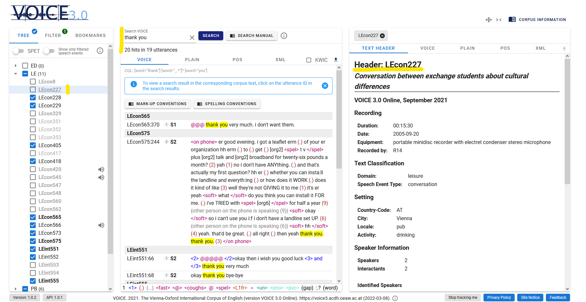
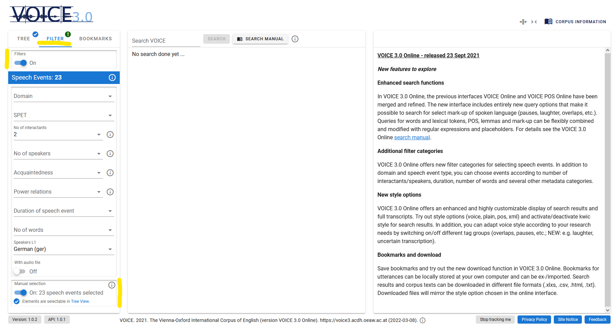
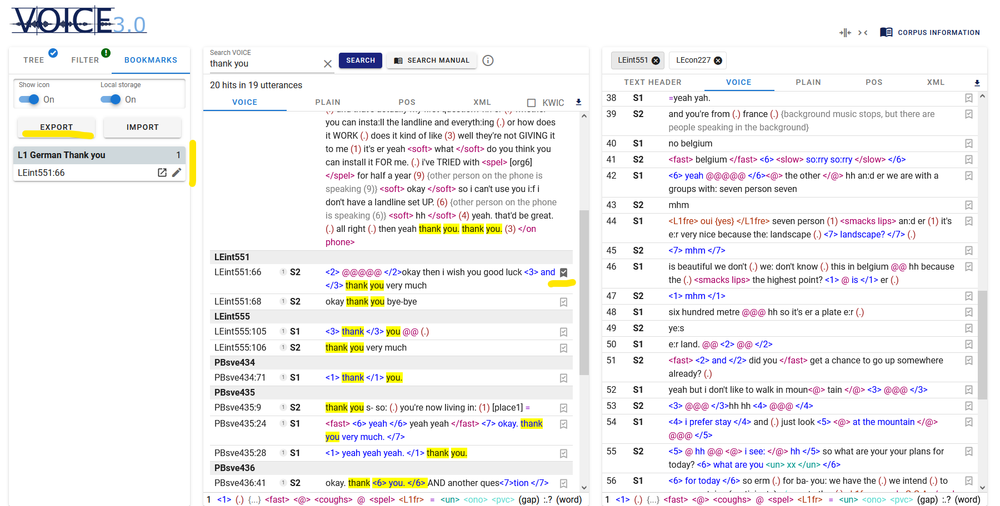

## What is VOICE 3.0 Online?

**VOICE** (**V**ienna-**O**xford **I**nternational **C**orpus of **E**nglish) is a computerized open-access corpus capturing more than one million words of naturally-occurring, spoken English as a lingua franca (ELF) interactions. It is based on 151 audio-recordings involving 753 identified individuals from 49 different first language backgrounds using English as a common means of communication. 

The VOICE corpus was created between 2005 and 2011 to provide a source for linguistic research that does not concentrate on English as spoken and written by its native speakers, but instead focuses on the use of ELF, the most-wide spread contemporary use of English throughout the world. It is stored in TEI-based XML format and rendered accessible online through a new open-access user interface, [VOICE 3.0](https://voice3.acdh.oeaw.ac.at). This interface, released in autumn 2021, offers improved search facilities, expanded filters and style options, improved bookmarks and new download functions that will be explained in this chapter. 

More detailed information on the compilation and history of the corpus can be found on the [VOICE homepage](https://voice.acdh.oeaw.ac.at/) or in the VOICE Header in [VOICE 3.0](https://voice3.acdh.oeaw.ac.at/#/tool).

## Accessing VOICE 3.0

To access VOICE 3.0., go to https://voice3.acdh.oeaw.ac.at. If this is your first visit with a particular PC or particular internet browser, you will first be asked to accept – or decline – the use of tracking and cookies. In VOICE 3.0, cookies are used in an anonymous fashion only, without collecting data that can be tracked back to an individual. You can also opt out and use VOICE without cookies. Both settings can also be changed later on in the frontend as well. 

Once you have selected your preferences for cookies, the content in the blue area of the **landing page** **changes**. It now gives you the option to explore VOICE, either by **typing in a search query** or by simply clicking "**Browse**" - this takes you to the actual VOICE 3.0 online interface.

The standard design of the VOICE 3.0 web interface is made up of three main areas:

- The area on the **left-hand side** contains the **corpus tree**. The first order of organization is domain. By activating SPET above the corpus tree, the second layer of organization, speech event types, is made available. By clicking on the small arrow next to the domain, a list with the speech events opens and every speech event has a unique ID. An audio symbol next to an ID indicates that a sound file is available. When you click on a particular speech event, it will be opened on the right-hand side.
- The **middle area** contains the **search field** and will display the **search results** once a query has been run.
- On the **right-hand side**, users are initially greeted by a **welcome text**. Once you start using the corpus, the **entire transcripts** or corpus information of the speech events you have selected, as well as **metadata** from the headers will be displayed here. Once a particular speech event has been opened, you can switch between different styles and use the **audio player at the bottom**, if a sound file is available. Several speech events can be opened next to each other and will be displayed in tabs.

Especially useful are the **buttons above the right-hand area**: the big button “**corpus information**” gives you access to more extensive PDF manuals and to the VOICE project website. The **two symbols** next to it allow you to **adjust the display settings**: with the left icon, you can **merge colons**, the right icon allows to adjust the display to a **narrow screen** (e.g. for a mobile phone). Clicking on the same icon again brings you back to the default view.

The new VOICE 3.0 online interface provides many integrated tool tips, pop-ups and links to more extensive PDF corpus documentation. The goal has been to design an interface that is easy and intuitive to navigate and immediately provides short explanations to the user, while also offering links to more extensive guidelines where useful or necessary.

\[Insert Video 1: Introduction to the VOICE interface by Marie-Luise Pitzl. The following clip offers an introductory tour of the VOICE 3.0 online interface and explains its main areas and buttons.]

## Searches in VOICE 3.0

Searches can be easily carried out with the help of the **search field** at the left top corner of the middle area. Once a search has been run, all search results will be displayed in this area. You can then adjust the display of your results by switching between the five different styles offered in the five tabs (i.e. VOICE, Plain, POS, XML and KWIC). When you choose VOICE, POS or KWIC, further modifications are possible by using the options offered at the bottom.

### Simple Searches

#### Token search (word form)

In order to search for a word or word form (i.e. token queries), enter the word using lower-case characters, e.g. speak. Please not that all queries are case-sensitive and tokens are searched for with lower case characters, e.g. _i speak french_. You can, of course, search for phrases (i.e. token token) as well. 

If you want to search for contracted forms, like wanna, gonna, don’t, etc., you need to insert a space before the contracted part, i.e.: _wan na, gon na, do n’t, it ‘s_). 

#### Lemma search

A lemma is the basic form of a word, which represents all declensions and inflected forms of a word, e.g. walk is the lemma of walk, walks, walking. To search for all tokens of a lemma, use the form “l:lemma”, e.g. “l: walk”.

#### POS search

POS, or Part-of Speech annotations, allow searching for the morphosyntactic categories of tokens. Each token in VOICE has been annotated with an individual POS tag for morphological form, and, in parentheses, for syntactic function. Often, these are identical, as in _professional_JJ(JJ)_. 

If a POS tag is search for without further specification in VOICE 3.0, both positions are searched. If you want to search them separately, use _p:POS_ for form position or _f:POS_ for function position.

For POS searches, enter the POS tag in capital letters. For further details, please go to the [POS tagging manual](https://voice.acdh.oeaw.ac.at/wp-content/uploads/2021/04/POS-tagging-and-lemmatization-manual.pdf) and the [VOICE Tagset](https://voice.acdh.oeaw.ac.at/wp-content/uploads/2021/04/Short-POS-tagset.pdf). 

#### Mark-Up Search

Conversational mark-up can be search for and retrieved in different ways in VOICE 3.0. Users can:

- search for **tokenized mark-up**, such as pauses (e.g.: __1, \_2, etc.) and laughter (e.g.: \_@, _@@_). The numbers 1, 2, etc. or number of symbols indicate the length of pauses and laughters.
- or search for **POS tags** indicating mark-up, such as PVC, ONO.
- In addition, VOICE 3.0 offers the possibility to search for words, POS and lemmas that occur within and between stretches of conversational mark-up in the corpus, such as stretches of speaking mode, non-English speech, or overlapping speech, by **using pointed brackets**.

Detailed examples for mark-up searches are provided in section 6 of the VOICE 3.0 [search manual](https://voice.acdh.oeaw.ac.at/wp-content/uploads/2021/09/Search-manual-VOICE-3.0-Online.pdf).

### Fine-tuning your searches:

#### Placeholders

In order to adjust the search results to the needs of your research question, the following **placeholders** might be useful:

- **. Full stop:** matches any single character. You can perceive this as a kind of universal joker. Example: _hi._ results in: him, his, hit, etc.
- **\[…]** **Character class:** matches any character contained in the brackets, e.g. _h\[ai]t_ – hat, hit
- **[^…] Inverted character class:** matches any character not contained in the bracket, e.g. _h[^ai]_ – hot, hut
- **? Question mark:** the preceding element can appear 0 or 1 times, i.e. is optional. Example: _houses?_ – house, houses
- **+ Plus:** the preceding element must appear 1 or more times, i.e. it is not optional and might be repeated. Example: house.+ results in houses, household, housewives, i.e. all words that start with house plus at least one more character.
- **\* Asterisk:** the preceding element can appear 0 or more times, i.e. it is optional and might be repeated.
- **(…) Brackets:** these can be used to group characters (and even regular expressions) to form new elements. In addition, we can combine them with the quantifiers ?, +, and * and let them operate on specified groups. Example: _(wo)?man_ -> man, woman

<SideNote type="tip" title="Tip">
You might be familiar with the usage of wildcards, i.e. plain ?, +, or * from other tools. In wildcard syntax, the asterisk, for example denotes “zero or more characters”. VOICE 3.0, however, uses regex. Here, the symbols works as quantifiers which operate on the preceding element. Therefore, the wildcard _house__ in regex quantifies the final “e” and will only match hous, house, housee, houseeee, etc.

If you want to use the **symbols as wildcards**, you have to place the **placeholder character** “.” (full stop) in front of them. Thus, searching for “_house.__” will result in house, houses, household, housewives, etc., or ._ize in organize, apologize, harmonize, etc.
</SideNote>

To gain even more precise control over the number of allowed and necessary character repetitions, you can use curly brackets with min,max. Leaving the max empty means there is no upper limit (see section 3.2 of the [search manual](https://voice.acdh.oeaw.ac.at/wp-content/uploads/2021/09/Search-manual-VOICE-3.0-Online.pdf)).

#### Boolean Operators in VOICE 3.0

- **AND** is represented by a **comma**. Note that there is no space between the conditions. Thus, entering condition1,condition2 will yield results which matches both conditions. Any sequence of items before and after the comma is possible, e.g.: _walk,NN_ - finds token walk as noun, as in "a five minute walk".
- **OR** is represented by a **vertical line**. It finds any options to the left or the right of the vertical line. It can be used for any sequence of tokens, lemmas or POS tags before and after the line, and more than two options can be specified. For example: _mean | say_ that - finds: mean that; say that.

More details on searches with wildcards and placeholders can be found in the [search manual](https://voice.acdh.oeaw.ac.at/wp-content/uploads/2021/09/Search-manual-VOICE-3.0-Online.pdf).

\[In the following video clip, VOICE project member Ruth Osimk-Teasdale demonstrates the combinations of tokens, lemma, and POS tags in a number of searches, and shows how to display your search results in the different style options (VOICE, plain, POS, XML, and KWIC) available in VOICE 3.0.]

\[Insert Video 2: VOICE 3.0 - Searches"]

### Bookmarks and Filters: Creating your own subcorpus in VOICE 3.0

In VOICE 3.0 users have the possibility to create their own sub-corpora by applying filters, and bookmark their search results, which they can subsequently export and import.

\[In the following short clip, you will learn how to apply filters and bookmarks.]

\[Insert Video 3: Bookmarks and Filters]

In order to create your own corpus, first of all navigate to the tab "Filter" in the left-hand area and turn on the filter options. You can then narrow down the corpus by applying criteria such as number of speakers or interactants, power relations, duration of speech events, or L1 language. After you have set your desired filters, navigate back to the corpus tree. It will now highlight in **bold** those speech events to which your filters apply. If you like, you can hide all other speech events by using the respective toggle above the tree.

Once you have set your filters, you can use the search field in the middle area and search your subcorpus. All speech events from your corpus which yield results for your search will then be highlighted in **bold** in the corpus tree. In addition, events which would also yield results for your query but are not part of your subcorpus will be marked in **grey and bold**, as can be seen in the following illustration: 

If you want to check whether a particular speech event should be part of your subcorpus, you can open its transcript on the right-hand side by clicking on the respective event in the list in the corpus tree. To actually add it to your corpus, tick the box next to the speech event. Please note that in order to do so, the function "manual selection", which can be found in the "Filter" tab has to be turned on.

<SideNote type="tip" title="Tip: Manual Selection">
The function "manual selection" in the filter gives you the option to add speech events manually to your corpus. In order to do so, you must turn on the function and you can then go to the corpus tree and add speech events by ticking the respective box. This function can be used before you run a search or after you have run a search.

</SideNote>

#### Setting bookmarks

Bookmarks can be easily set with the help of the third tab in the left-hand area. First of all, activate icons and local storage. Once you have done so, small icons appear next to the search results in the middle area. You have now the possibility to select a search result, create a bookmark with a short description for it, and save it. Saved bookmarks will appear on the left.

Afterwards, with the help of the "Export" button on the left, you can export your bookmarks, or use the "Import" button to upload a list with bookmarks you have saved from an earlier visit.

### Exercise: 

#### Let's try out VOICE 3.0 - It's your turn!

Go to the [VOICE 3.0](https://voice3.acdh.oeaw.ac.at/#/) interface and answer the following four questions with its help!

<Quiz>
  <Quiz.Card>
    <Quiz.MultipleChoice>
      <Quiz.Question>
        For a research paper, you are looking for interactions between non-native speakers of English in the context of universities. Which of the five domains available in VOICE 3.0 could contain such speech events? Tick the correct answer!
      </Quiz.Question>

      <Quiz.MultipleChoice.Option>
        PB
      </Quiz.MultipleChoice.Option>

      <Quiz.MultipleChoice.Option>
        PR and LE
      </Quiz.MultipleChoice.Option>

      <Quiz.MultipleChoice.Option isCorrect>
        PR and ED
      </Quiz.MultipleChoice.Option>

      <Quiz.MultipleChoice.Option>
        ED and LE
      </Quiz.MultipleChoice.Option>

      <Quiz.Message type="correct">
        Correct! In order to find appropriate events, look into the two domains PR (professional and research/science) and ED (educational). Tip: Hovering over the domain abbreviations with your mouse reveals a short definition.
      </Quiz.Message>

      <Quiz.Message type="incorrect">
        Sorry! Have a look at the domain descriptions again, either by hovering over them with your mouse in the corpus tree on the left or by going to Corpus Information and VOICE Header.
      </Quiz.Message>
    </Quiz.MultipleChoice>
  </Quiz.Card>

  <Quiz.Card>
    <Quiz.MultipleChoice>
      <Quiz.Question>
        You have set the two filters PR and ED for your research. Now, you want to find interactions including speakers whose native language is Spanish. How many records can you find and for how many of them is an audio file available? Tick the correct numbers!
      </Quiz.Question>

      <Quiz.MultipleChoice.Option>
        23 events and 7 audio files
      </Quiz.MultipleChoice.Option>

      <Quiz.MultipleChoice.Option isCorrect>
        19 events and 5 audio files
      </Quiz.MultipleChoice.Option>

      <Quiz.MultipleChoice.Option>
        12 events but no audio files
      </Quiz.MultipleChoice.Option>

      <Quiz.MultipleChoice.Option>
        There are no events that meet these search criteria.
      </Quiz.MultipleChoice.Option>

      <Quiz.Message type="correct">
        Well done!
      </Quiz.Message>

      <Quiz.Message type="incorrect">
        Check your filters and try again!
      </Quiz.Message>
    </Quiz.MultipleChoice>
  </Quiz.Card>

  <Quiz.Card>
    <Quiz.MultipleChoice>
      <Quiz.Question>
        How many of the filtered speech events in your subcorpus of Spanish speakers in a university context contain the token "please"?
      </Quiz.Question>

      <Quiz.MultipleChoice.Option>
        All of them!
      </Quiz.MultipleChoice.Option>

      <Quiz.MultipleChoice.Option>
        35
      </Quiz.MultipleChoice.Option>

      <Quiz.MultipleChoice.Option>
        21
      </Quiz.MultipleChoice.Option>

      <Quiz.MultipleChoice.Option isCorrect>
        14
      </Quiz.MultipleChoice.Option>

      <Quiz.Message type="correct">
        Well done!
      </Quiz.Message>

      <Quiz.Message type="incorrect">
        Try again! The filters should be the same as for Question 2 (PR and ED; L1 language Spanish). Then type in the token "please" in the search field.
      </Quiz.Message>
    </Quiz.MultipleChoice>
  </Quiz.Card>

  <Quiz.Card>
    <Quiz.MultipleChoice>
      <Quiz.Question>
        You are really satisfied with your search results and you want to cite the VOICE corpus in your research paper. Where can you find the biographical information in the VOICE 3.0 interface? Tick ALL options that lead to the desired result.
      </Quiz.Question>

      <Quiz.MultipleChoice.Option isCorrect>
        I go to "Corpus information" and click on "How to cite VOICE".
      </Quiz.MultipleChoice.Option>

      <Quiz.MultipleChoice.Option isCorrect>
        I go to "Corpus information" and select "VOICE Header".
      </Quiz.MultipleChoice.Option>

      <Quiz.MultipleChoice.Option isCorrect>
        At the bottom of the website, in the middle, I can immediately find the short citation and the long version by hovering over the small "i" icon.
      </Quiz.MultipleChoice.Option>

      <Quiz.MultipleChoice.Option isCorrect>
        I use the link to the "VOICE homepage" included in the corpus information and will find the correct citation there.
      </Quiz.MultipleChoice.Option>

      <Quiz.Message type="correct">
        Well done! In fact, there are various options to find the information for your bibliography.
      </Quiz.Message>

      <Quiz.Message type="incorrect">
        Your option was definitely correct, but what about the other options stated?
      </Quiz.Message>
    </Quiz.MultipleChoice>
  </Quiz.Card>
</Quiz>

### Links:

- Osimk-Teasdale, Ruth; Pirker, Hannes; Pitzl, Marie-Luise. 2021. [Search manual for VOICE 3.0 Online](<- https://voice.acdh.oeaw.ac.at/wp-content/uploads/2021/09/Search-manual-VOICE-3.0-Online.pdf>). https://voice.acdh.oeaw.ac.at/wp-content/uploads/2021/09/Search-manual-VOICE-3.0-Online.pdf (14 March 2022).
- Pitzl, Marie-Luise. [VOICE: Vienna-Oxford-International Corpus of English](https://voice.acdh.oeaw.ac.at/). Homepage. https://voice.acdh.oeaw.ac.at/ (14 March 2022).
- [VOICE](https://voice3.acdh.oeaw.ac.at/). 2021. The Vienna-Oxford International Corpus of English (version VOICE 3.0 Online). Founding director: Barbara Seidlhofer; Principal investigators VOICE 3.0: Marie-Luise Pitzl, Daniel Schopper; Researchers: Angelika Breiteneder, Hans-Christian Breuer, Nora Dorn, Theresa Klimpfinger, Stefan Majewski, Ruth Osimk-Teasdale, Hannes Pirker, Marie-Luise Pitzl, Michael Radeka, Stefanie Riegler, Barbara Seidlhofer, Omar Siam, Daniel Stoxreiter. https://voice3.acdh.oeaw.ac.at (14 March 2022).