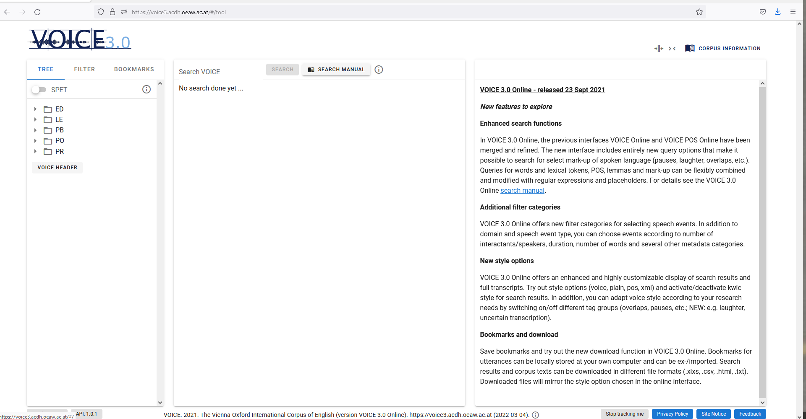

## Introduction: What is VOICE 3.0 Online?

**VOICE** (**V**ienna-**O**xford **I**nternational **C**orpus of **E**nglish) is a computerized open-access corpus capturing more than one million words of naturally-occurring, spoken English as a lingua franca (ELF) interactions. It is based on 151 audio-recordings involving 753 identified individuals from 49 different first language backgrounds using English as a common means of communication. 

The VOICE corpus was created between 2005 and 2011 to provide a source for linguistic research that does not concentrate on English as spoken and written by its native speakers, but instead focuses on the use of ELF, the most-wide spread contemporary use of English throughout the world. It is stored in TEI-based XML format and rendered accessible online through a new open-access user interface, [VOICE 3.0](https://voice3.acdh.oeaw.ac.at). This interface, released in autumn 2021, offers improved search facilities, expanded filters and style options, improved bookmarks and new download functions that will be explained in this chapter. 

More detailed information on the compilation and history of the corpus can be found on the [VOICE website](https://voice.acdh.oeaw.ac.at/) or in the VOICE Header in [VOICE 3.0](https://voice3.acdh.oeaw.ac.at/#/tool).

## Accessing VOICE 3.0

To access VOICE 3.0., go to https://voice3.acdh.oeaw.ac.at. If this is your first visit with a particular PC or particular internet browser, you will first be asked to accept – or decline – the use of tracking and cookies. In VOICE 3.0 online, cookies are used in an anonymous fashion only, without collecting data that can be tracked back to an individual. You can also opt out and use VOICE online without cookies. Both settings can also be changed later on in the frontend as well. Once you have selected your preferences for cookies, the content in the blue area of the landing page changes. It now gives you the option to explore VOICE, either by typing in a search query or by simply clicking "Browse" - this takes you to the actual VOICE 3.0 online interface (see picture 1).

The standard design of the VOICE 3.0 web interface is made up of three main areas:

- The area on the **left-hand side** contains the **corpus tree**. The first order of organization is domain. By activating SPET above the corpus tree, the second layer of organization, speech event types, is made available. By clicking on the small arrow next to the domain, a list with the speech events opens and every speech event has a unique ID. An audio symbol next to an ID indicates that a sound file is available. When you click on a particular speech event, it will be opened on the right-hand side.
- The **middle area** contains the **search field** and will display the **search results** once a query has been run.
- On the **right-hand side**, users are initially greeted by a **welcome text**. Once you start using the corpus, the **entire transcripts** or corpus information of the speech events you have selected, as well as **metadata** from the headers will be displayed here. Once a particular speech event has been opened, you can switch between different styles and use the **audio player at the bottom**, if a sound file is available. Several speech events can be opened next to each other and will be displayed in tabs.

Especially useful might also be the **buttons above the right-hand area**: the big button “**corpus information**” gives you access to more extensive PDF manuals and to the VOICE project website. The **two symbols** next to it allow you to **adjust the display settings**: with the left icon, you can **merge colons**, the right icon allows to adjust the display to a **narrow screen** (e.g. for a mobile phone). Clicking on the same icon again brings you back to the default view.

The new VOICE 3.0 online interface provides many integrated tool tips, pop-ups and links to more extensive PDF corpus documentation. The goal has been to design an interface that is easy and intuitive to navigate and immediately provides short explanations to the user, while also offering links to more extensive guidelines where useful or necessary.

## Searches in VOICE 3.0

Searches can be easily carried out with the help of the **search field** at the left top corner of the middle area. Once a search has been run, all search results will be displayed in this area. You can then adjust the display of your results by switching between the five different styles offered in the five tabs (i.e. VOICE, Plain, POS, XML and KWIC). When you choose VOICE, POS or KWIC, further modifications are possible by using the options offered at the bottom.

### Simple Searches

#### Token search (word form)

In order to search for a word or word form (i.e. token queries), enter the word using lower-case characters, e.g. speak. Please not that all queries are case-sensitive and tokens are searched for with lower case characters, e.g. _i speak french_. You can, of course, search for phrases (i.e. token token) as well. 

If you want to search for contracted forms, like wanna, gonna, don’t, etc., you need to insert a space before the contracted part, i.e.: _wan na, gon na, do n’t, it ‘s_). 

#### Lemma search

A lemma is the basic form of a word, which represents all declensions and inflected forms of a word, e.g. walk is the lemma of walk, walks, walking. To search for all tokens of a lemma, use the form “l:lemma”, e.g. “l: walk”.

#### POS search

POS, or Part-of Speech annotations, allow searching for the morphosyntactic categories of tokens. Each token in VOICE has been annotated with an individual POS tag for morphological form, and, in parentheses, for syntactic function. Often, these are identical, as in _professional_JJ(JJ)_. 

If a POS tag is search for without further specification in VOICE 3.0, both positions are searched. If you want to search them separately, use _p:POS_ for form position or _f:POS_ for function position.

For POS searches, enter the POS tag in capital letters. For further details, please go to the [POS tagging manual](https://voice.acdh.oeaw.ac.at/wp-content/uploads/2021/04/POS-tagging-and-lemmatization-manual.pdf) and the [VOICE Tagset](https://voice.acdh.oeaw.ac.at/wp-content/uploads/2021/04/Short-POS-tagset.pdf). 

#### Mark-Up Search

Conversational mark-up can be search for and retrieved in different ways in VOICE 3.0. Users can:

- search for **tokenized mark-up**, such as pauses (e.g.: _1, \_2, etc.) and laughter (e.g.: \_@,_ @@). The numbers 1, 2, etc. or number of symbols indicate the length of pauses and laughters.
- or search for **POS tags** indicating mark-up, such as PVC, ONO.
- In addition, VOICE 3.0 offers the possibility to search for words, POS and lemmas that occur within and between stretches of conversational mark-up in the corpus, such as stretches of speaking mode, non-English speech, or overlapping speech, by **using pointed brackets**.

Detailed examples for mark-up searches are provided in Section 6 of the [search manual](https://voice.acdh.oeaw.ac.at/wp-content/uploads/2021/09/Search-manual-VOICE-3.0-Online.pdf).

### Fine-tuning searches

In order to adjust the search results to the needs of your research question, the following **placeholders** might be useful:

- **. Full stop:** matches any single character. You can perceive this as a kind of universal joker. Example: _hi._ results in: him, his, hit, etc.
- **\[…]** **Character class:** matches any character contained in the brackets, e.g. _h\[ai]t_ – hat, hit
- **[^…] Inverted character class:** matches any character not contained in the bracket, e.g. _h[^ai]_ – hot, hut
- **? Question mark:** the preceding element can appear 0 or 1 times, i.e. is optional. Example: _houses?_ – house, houses
- **+ Plus:** the preceding element must appear 1 or more times, i.e. it is not optional and might be repeated. Example: house.+ results in houses, household, housewives, i.e. all words that start with house plus at least one more character.
- **\* Asterisk:** the preceding element can appear 0 or more times, i.e. it is optional and might be repeated.
- **(…) Brackets:** these can be used to group characters (and even regular expressions) to form new elements. In addition, we can combine them with the quantifiers ?, +, and * and let them operate on specified groups. Example: _(wo)?man_ -> man, woman

<SideNote type="tip" title="Tip">
You might be familiar with the usage of wildcards, i.e. plain ?, +, or * from other tools. In wildcard syntax, the asterisk, for example denotes “zero or more characters”. VOICE 3.0, however, uses regex. Here, the symbols works as quantifiers which operate on the preceding element. Therefore, the wildcard _house__ in regex quantifies the final “e” and will only match hous, house, housee, houseeee, etc.

If you want to use the **symbols as wildcards**, you have to place the **placeholder character** “.” (full stop) in front of them. Thus, searching for “_house.__” will result in house, houses, household, housewives, etc., or ._ize in organize, apologize, harmonize, etc.
</SideNote>